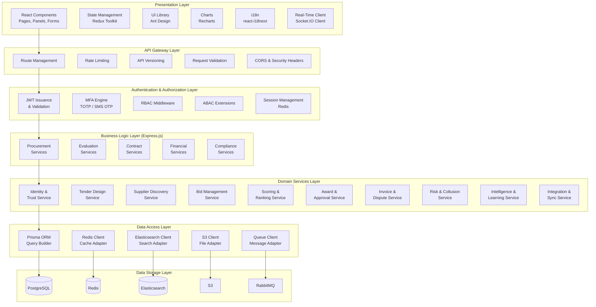
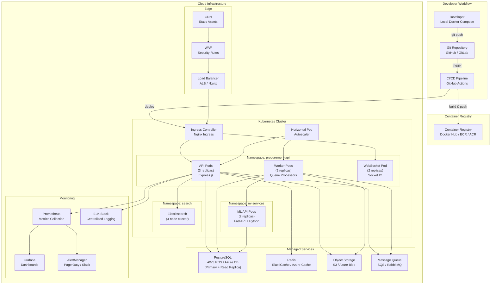
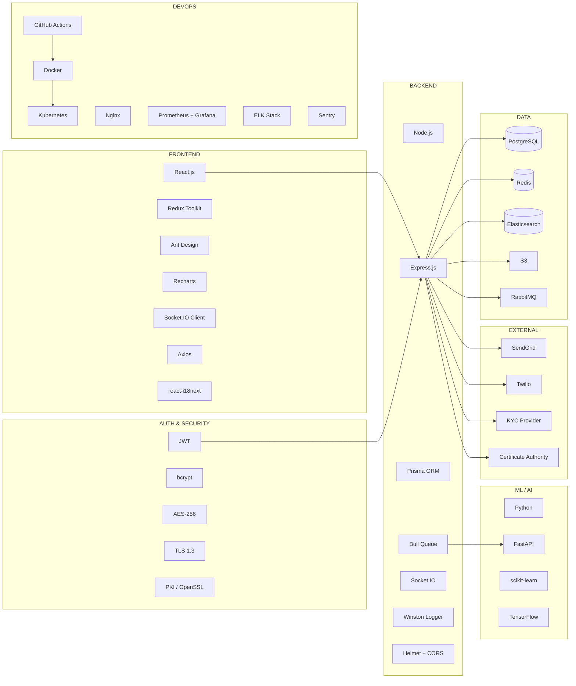

# ARCHITECTURE DESIGN
## Procurement Intelligence & Governance Platform

**Version:** 1.0  
**Date:** February 19, 2026

---

## 1. Complete Technology Stack

### User-Specified Technologies

| Layer | Technology | Role |
|---|---|---|
| Frontend | React.js, HTML5, CSS3, JavaScript | Single-page application, responsive UI |
| Backend | Node.js, Express.js | API server, business logic orchestration |
| Authentication | JWT (JSON Web Tokens) | Stateless authentication, session management |
| Database | PostgreSQL | Primary relational data store |
| APIs | RESTful JSON APIs | Client-server communication protocol |
| Version Control | Git | Source code management |
| Deployment | Cloud (AWS / Azure / GCP) | Production hosting and infrastructure |

### Supplemental Technologies (Added)

| Layer | Technology | Justification |
|---|---|---|
| **State Management** | Redux Toolkit | Complex procurement workflow state across React components |
| **UI Component Library** | Ant Design / Material UI | Enterprise-grade forms, tables, dashboards |
| **Charting** | Recharts / Chart.js | Evaluation dashboards, price benchmarking visuals, liquidity charts |
| **Real-Time** | Socket.IO | Live bid notifications, approval alerts, auction countdown timers |
| **API Gateway** | Kong / AWS API Gateway | Rate limiting, request routing, API versioning, throttling |
| **ORM** | Prisma / Sequelize | Type-safe PostgreSQL queries, migrations, schema management |
| **Caching** | Redis | Session cache, frequently queried supplier/tender data, rate limiting |
| **Message Queue** | RabbitMQ / AWS SQS | Async processing: bid encryption, notifications, ML training, report generation |
| **Job Scheduler** | Bull (Redis-based) | Scheduled tasks: deadline enforcement, trust recalculation, audit retention |
| **Search Engine** | Elasticsearch | Full-text tender search, supplier discovery, market intelligence queries |
| **File Storage** | AWS S3 / Azure Blob | Tender documents, bid envelopes, invoices, samples, contracts |
| **Digital Signature** | OpenSSL / PKI Libraries | SES/AES/QES signatures, certificate management (Logic 13) |
| **PDF Generation** | Puppeteer / PDFKit | Contract documents, opening reports, evaluation reports, audit exports |
| **Email Service** | Nodemailer + SendGrid / AWS SES | Tender notifications, approval alerts, award notices, OTP delivery |
| **SMS/Push** | Twilio / Firebase Cloud Messaging | Critical deadline alerts, MFA OTP, approval reminders |
| **ML/AI Engine** | Python (scikit-learn, TensorFlow) | Risk forecasting, collusion detection, recommendation engine (Logics 27, 23, 31) |
| **ML API Bridge** | Flask / FastAPI microservice | Python ML models exposed to Node.js backend via internal REST API |
| **Logging** | Winston + ELK Stack (Elasticsearch, Logstash, Kibana) | Structured logging, audit trail indexing, anomaly visualization |
| **Monitoring** | Prometheus + Grafana | Server health, API latency, queue depth, database performance |
| **Error Tracking** | Sentry | Frontend/backend error capture and alerting |
| **Containerization** | Docker | Consistent dev/staging/prod environments |
| **Orchestration** | Kubernetes (K8s) / AWS ECS | Auto-scaling, rolling deployments, service discovery |
| **CI/CD** | GitHub Actions / GitLab CI | Automated testing, build, deployment pipelines |
| **Reverse Proxy / LB** | Nginx / AWS ALB | Load balancing, SSL termination, static file serving |
| **CDN** | CloudFront / Cloudflare | Static asset delivery, global edge caching |
| **Security** | Helmet.js, CORS, bcrypt, crypto | HTTP security headers, password hashing, data encryption |
| **Encryption** | AES-256 (at rest), TLS 1.3 (in transit) | Bid envelope encryption, document protection |
| **WAF** | AWS WAF / Cloudflare WAF | SQL injection, XSS, DDoS protection |
| **Testing** | Jest, React Testing Library, Supertest, Cypress | Unit, integration, E2E, API tests |
| **API Documentation** | Swagger / OpenAPI 3.0 | Interactive API documentation and contract testing |
| **Feature Flags** | LaunchDarkly / Unleash | Gradual feature rollouts, module activation (Logic 40) |
| **Internationalization** | react-i18next | Multi-language support for cross-regional deployments |

---

## 2. High-Level Architecture

```mermaid
flowchart TB
    subgraph "Client Layer"
        WEB["🌐 React.js SPA"]
        MOBILE["📱 Mobile-Responsive PWA"]
    end

    subgraph "Edge Layer"
        CDN["☁️ CDN\nCloudFront"]
        WAF["🛡️ WAF\nDDoS Protection"]
        LB["⚖️ Load Balancer\nNginx / ALB"]
    end

    subgraph "API Layer"
        GATEWAY["🚪 API Gateway\nKong / AWS APIGW"]
        AUTH["🔐 Auth Service\nJWT + MFA"]
    end

    subgraph "Application Layer"
        API["📡 Express.js API Server"]
        WORKER["⚙️ Background Workers\nBull Queue Processors"]
        REALTIME["🔔 Socket.IO Server\nReal-Time Events"]
        MLBRIDGE["🧠 ML API Bridge\nFastAPI"]
    end

    subgraph "Data Layer"
        PG[("🐘 PostgreSQL\nPrimary Database")]
        REDIS[("⚡ Redis\nCache + Sessions")]
        ES[("🔍 Elasticsearch\nSearch + Audit Index")]
        S3["📦 Object Storage\nS3 / Azure Blob"]
        MQ["📨 Message Queue\nRabbitMQ / SQS"]
    end

    subgraph "Intelligence Layer"
        ML["🤖 ML Models\nPython + scikit-learn"]
    end

    subgraph "External Services"
        SMTP["📧 Email\nSendGrid"]
        SMS["📲 SMS\nTwilio"]
        IDPROV["🆔 KYC Provider"]
        CERTAUTH["🔐 PKI / CA"]
        ERPEXT["🖥️ ERP Systems"]
        MARKETDATA["📊 Market Feeds"]
    end

    subgraph "DevOps & Observability"
        CI["🔄 CI/CD\nGitHub Actions"]
        DOCKER["🐳 Docker\nContainers"]
        K8S["☸️ Kubernetes\nOrchestration"]
        MONITOR["📈 Prometheus\n+ Grafana"]
        LOG["📋 ELK Stack\nLogging"]
        SENTRY["🐛 Sentry\nError Tracking"]
    end

    WEB --> CDN --> WAF --> LB --> GATEWAY
    MOBILE --> CDN
    GATEWAY --> AUTH --> API
    GATEWAY --> REALTIME

    API --> PG
    API --> REDIS
    API --> ES
    API --> S3
    API --> MQ
    MQ --> WORKER
    WORKER --> PG
    WORKER --> MLBRIDGE
    MLBRIDGE --> ML
    ML --> PG

    API --> SMTP
    API --> SMS
    API --> IDPROV
    API --> CERTAUTH
    API --> ERPEXT
    WORKER --> MARKETDATA

    API --> MONITOR
    API --> LOG
    API --> SENTRY
    DOCKER --> K8S
    CI --> DOCKER
```



---

## 3. Layered Architecture Breakdown



---

## 4. Backend Module Architecture

> Maps each Express.js module to the 40 system logics.

```mermaid
flowchart TB
    subgraph "Express.js Application"
        subgraph "Middleware Stack"
            MW1["helmet() — Security Headers"]
            MW2["cors() — Cross-Origin"]
            MW3["express.json() — Body Parser"]
            MW4["rateLimiter() — Rate Limiting"]
            MW5["authMiddleware() — JWT Verify"]
            MW6["rbacMiddleware() — Permission Check"]
            MW7["auditMiddleware() — Action Logging"]
        end

        subgraph "Route Modules"
            R_AUTH["/api/auth\nLogin, Register, MFA, Refresh"]
            R_USERS["/api/users\nProfile, Verification, Trust"]
            R_ORGS["/api/organizations\nOrg CRUD, Members, Roles"]
            R_TENDERS["/api/tenders\nCreate, Publish, Amend, Close"]
            R_BIDS["/api/bids\nSubmit, Validate, Withdraw"]
            R_EVAL["/api/evaluations\nScore, Consensus, Rank"]
            R_AWARDS["/api/awards\nDecide, Approve, Notify"]
            R_CONTRACTS["/api/contracts\nGenerate, Sign, Amend, Complete"]
            R_INVOICES["/api/invoices\nSubmit, Match, Approve, Pay"]
            R_DISPUTES["/api/disputes\nRaise, Evidence, Resolve, Appeal"]
            R_SUPPLIERS["/api/suppliers\nProfile, Capability, Capacity, Trust"]
            R_BUDGET["/api/budgets\nAllocate, Commit, Spend, Forecast"]
            R_RISK["/api/risk\nForecast, Collusion, Enforce"]
            R_INTEL["/api/intelligence\nBenchmark, Liquidity, Recommend"]
            R_INTEGRATIONS["/api/integrations\nERP Config, Sync, Reconcile"]
            R_ADMIN["/api/admin\nGovernance, Modules, Config"]
            R_AUDIT["/api/audit\nTrails, Search, Reports"]
            R_NOTIFICATIONS["/api/notifications\nList, Read, Preferences"]
        end

        subgraph "Service Classes"
            S1["IdentityService — Logic 1, 37"]
            S2["AccessControlService — Logic 2"]
            S3["TenderService — Logic 3, 4, 24, 36"]
            S4["SupplierService — Logic 5, 22, 25"]
            S5["BidService — Logic 6, 17"]
            S6["EvaluationService — Logic 7, 8, 9, 18, 26"]
            S7["AwardService — Logic 10, 16"]
            S8["ApprovalService — Logic 11"]
            S9["BudgetService — Logic 12"]
            S10["SignatureService — Logic 13"]
            S11["AuditService — Logic 14"]
            S12["PerformanceService — Logic 15"]
            S13["InvoiceService — Logic 19"]
            S14["DisputeService — Logic 20"]
            S15["MarketplaceService — Logic 21"]
            S16["CollusionService — Logic 23"]
            S17["RiskService — Logic 27"]
            S18["IntelligenceService — Logic 28, 30, 31"]
            S19["GovernanceService — Logic 29"]
            S20["IntegrationService — Logic 35, 40"]
            S21["TransparencyService — Logic 38"]
            S22["LockInAnalyticsService — Logic 32, 33, 34, 39"]
        end
    end

    MW1 --> MW2 --> MW3 --> MW4 --> MW5 --> MW6 --> MW7
    MW7 --> R_AUTH & R_USERS & R_ORGS & R_TENDERS & R_BIDS
    R_AUTH --> S1 & S2
    R_TENDERS --> S3
    R_SUPPLIERS --> S4
    R_BIDS --> S5
    R_EVAL --> S6
    R_AWARDS --> S7 & S8
    R_CONTRACTS --> S7 & S10
    R_BUDGET --> S9
    R_INVOICES --> S13
    R_DISPUTES --> S14
    R_RISK --> S16 & S17
    R_INTEL --> S18 & S21
    R_INTEGRATIONS --> S20
    R_ADMIN --> S19
    R_AUDIT --> S11
```



---

## 5. Frontend Architecture

```mermaid
flowchart TB
    subgraph "React Application"
        subgraph "App Shell"
            ROUTER["React Router\nRoute Definitions"]
            LAYOUT["Layout Component\nSidebar, Header, Footer"]
            AUTH_GUARD["Auth Guard\nProtected Routes"]
            ROLE_GUARD["Role Guard\nPermission-Based Rendering"]
        end

        subgraph "Page Modules"
            P_DASH["📊 Dashboard\nKPIs, Alerts, Quick Actions"]
            P_TENDERS["📋 Tenders\nCreate, List, Detail, Amend"]
            P_BIDS["💼 Bids\nSubmit, Track, Withdraw"]
            P_EVAL["⚖️ Evaluations\nScore Panel, Consensus, Rankings"]
            P_CONTRACTS["📝 Contracts\nList, Detail, Milestones"]
            P_INVOICES["💰 Invoices\nSubmit, Match, Track"]
            P_SUPPLIERS["🏢 Suppliers\nProfile, Performance, Trust"]
            P_RISK["🔍 Risk & Compliance\nForecasts, Collusion, Governance"]
            P_INTEL["📈 Market Intelligence\nBenchmarks, Liquidity, Trends"]
            P_ADMIN["⚙️ Admin\nUsers, Roles, Modules, Config"]
            P_AUDIT["📋 Audit\nTrail Viewer, Reports"]
        end

        subgraph "Shared Components"
            C_TABLE["DataTable\nSortable, Filterable, Paginated"]
            C_FORM["FormBuilder\nDynamic Forms, Validation"]
            C_CHART["ChartPanel\nBar, Line, Pie, Heatmap"]
            C_UPLOAD["FileUploader\nDrag-Drop, Progress, Hash"]
            C_TIMELINE["TimelineView\nAudit Trail, Milestone Tracker"]
            C_APPROVAL["ApprovalWidget\nStep Indicator, Action Buttons"]
            C_NOTIFICATION["NotificationCenter\nReal-Time Bell, Toast"]
        end

        subgraph "State Management (Redux)"
            STORE["Redux Store"]
            SL_AUTH["authSlice\nToken, User, Permissions"]
            SL_TENDER["tenderSlice\nList, Detail, Filters"]
            SL_BID["bidSlice\nDraft, Submission, Status"]
            SL_EVAL["evaluationSlice\nScores, Rankings"]
            SL_NOTIFY["notificationSlice\nAlerts, Unread Count"]
        end

        subgraph "Service Layer"
            API_CLIENT["Axios API Client\nBase URL, Interceptors, Retry"]
            WS_CLIENT["Socket.IO Client\nEvent Listeners"]
            STORAGE["Local Storage\nToken Persistence"]
        end
    end

    ROUTER --> AUTH_GUARD --> ROLE_GUARD --> LAYOUT
    LAYOUT --> P_DASH & P_TENDERS & P_BIDS & P_EVAL & P_CONTRACTS
    P_DASH --> C_CHART & C_TABLE
    P_TENDERS --> C_FORM & C_UPLOAD & C_TIMELINE
    P_BIDS --> C_FORM & C_UPLOAD
    P_EVAL --> C_TABLE & C_CHART & C_APPROVAL
    P_CONTRACTS --> C_TIMELINE & C_APPROVAL
    P_DASH --> STORE
    STORE --> SL_AUTH & SL_TENDER & SL_BID & SL_EVAL & SL_NOTIFY
    SL_AUTH --> API_CLIENT
    SL_NOTIFY --> WS_CLIENT
```



---

## 6. Database Architecture

```mermaid
flowchart TB
    subgraph "PostgreSQL Database"
        subgraph "Schema: identity"
            T1["users"]
            T2["organizations"]
            T3["verification_documents"]
            T4["roles"]
            T5["permissions"]
            T6["role_permissions"]
            T7["user_roles"]
            T8["trust_tier_records"]
            T9["conflict_of_interests"]
        end

        subgraph "Schema: procurement"
            T10["tenders"]
            T11["tender_items"]
            T12["tender_documents"]
            T13["evaluation_criteria"]
            T14["tender_amendments"]
            T15["clarifications"]
            T16["tender_design_analyses"]
            T17["category_taxonomies"]
        end

        subgraph "Schema: supplier"
            T18["supplier_profiles"]
            T19["supplier_capabilities"]
            T20["supplier_capacity_profiles"]
            T21["performance_records"]
            T22["supplier_trust_profiles"]
            T23["trust_tier_histories"]
            T24["personnel_records"]
            T25["personnel_assignments"]
        end

        subgraph "Schema: bidding"
            T26["bids"]
            T27["bid_items"]
            T28["bid_documents"]
            T29["bid_validations"]
            T30["bid_opening_records"]
            T31["evaluation_scores"]
            T32["evaluation_consensuses"]
            T33["bid_rankings"]
            T34["price_benchmarks"]
            T35["sample_submissions"]
            T36["sample_evaluations"]
        end

        subgraph "Schema: contract"
            T37["award_decisions"]
            T38["contracts"]
            T39["contract_milestones"]
            T40["approval_workflows"]
            T41["approval_steps"]
            T42["delegation_records"]
            T43["budgets"]
            T44["budget_transactions"]
            T45["digital_signatures"]
            T46["delivery_feasibilities"]
        end

        subgraph "Schema: financial"
            T47["invoices"]
            T48["invoice_line_items"]
            T49["goods_receipts"]
            T50["disputes"]
            T51["dispute_evidence"]
            T52["dispute_appeals"]
        end

        subgraph "Schema: compliance"
            T53["audit_trails"]
            T54["risk_forecasts"]
            T55["collusion_analyses"]
            T56["compliance_reviews"]
            T57["violation_records"]
            T58["enforcement_actions"]
            T59["appeal_records"]
            T60["reinstatement_records"]
        end

        subgraph "Schema: intelligence"
            T61["market_intelligence"]
            T62["learning_models"]
            T63["recommendations"]
            T64["liquidity_indices"]
        end

        subgraph "Schema: integration"
            T65["erp_integrations"]
            T66["sync_records"]
            T67["module_registry"]
            T68["notifications"]
        end
    end

    subgraph "Supporting Data Stores"
        REDIS[("Redis\n• JWT blacklist\n• Session data\n• Rate limit counters\n• Cached supplier profiles\n• Tender deadline timers")]
        ES[("Elasticsearch\n• Tender full-text index\n• Supplier search index\n• Audit trail index\n• Market intelligence queries")]
        S3["S3 Object Storage\n• Tender documents\n• Bid envelopes (encrypted)\n• Contracts (signed)\n• Invoices & receipts\n• Sample photos\n• CV files"]
    end
```



---

## 7. Authentication & Security Architecture

```mermaid
flowchart TB
    subgraph "Client"
        BROWSER["Browser / PWA"]
    end

    subgraph "Security Perimeter"
        WAF["🛡️ WAF\nSQL injection, XSS,\nDDoS protection"]
        TLS["🔒 TLS 1.3\nEnd-to-End Encryption"]
        CORS["🌐 CORS Policy\nAllowed Origins Only"]
    end

    subgraph "Authentication Flow"
        LOGIN["POST /api/auth/login\nEmail + Password"]
        MFA["POST /api/auth/mfa/verify\nTOTP / SMS OTP"]
        JWT_ISSUE["JWT Issuer\nAccess Token (15min)\nRefresh Token (7d)"]
        REFRESH["POST /api/auth/refresh\nRotating Refresh Token"]
    end

    subgraph "Authorization Flow"
        JWT_VERIFY["JWT Verification\nMiddleware"]
        RBAC["RBAC Check\nRole → Permissions"]
        ABAC["ABAC Check\nOrg, Trust Tier, COI"]
        SOD["Separation of Duties\nEvaluator ≠ Approver"]
    end

    subgraph "Data Protection"
        HASH["bcrypt\nPassword Hashing\n(12 salt rounds)"]
        ENC_REST["AES-256-GCM\nEncryption at Rest\n(Bid envelopes, PII)"]
        ENC_TRANSIT["TLS 1.3\nEncryption in Transit"]
        PKI["PKI / Digital Signatures\nSES / AES / QES\n(Logic 13)"]
        AUDIT["Immutable Audit Log\n(Logic 14)"]
    end

    subgraph "Token Management"
        BLACKLIST["Redis Token Blacklist\nLogout / Revocation"]
        ROTATION["Refresh Token Rotation\nOne-Time Use"]
    end

    BROWSER -->|HTTPS| WAF --> TLS --> CORS --> LOGIN
    LOGIN -->|Valid Credentials| MFA
    MFA -->|Valid OTP| JWT_ISSUE
    JWT_ISSUE -->|Access + Refresh Token| BROWSER
    BROWSER -->|Authorization: Bearer token| JWT_VERIFY
    JWT_VERIFY --> RBAC --> ABAC --> SOD

    JWT_ISSUE --> BLACKLIST
    REFRESH --> ROTATION --> JWT_ISSUE

    RBAC --> ENC_REST
    SOD --> AUDIT
    PKI --> AUDIT
```



### Security Controls Summary

| Concern | Solution | Logic Coverage |
|---|---|---|
| Authentication | JWT + MFA (TOTP/SMS) | Logic 1 |
| Authorization | RBAC + ABAC + SoD middleware | Logic 2 |
| Password Security | bcrypt (12 rounds) | Logic 1 |
| Bid Confidentiality | AES-256-GCM encryption, hash-locked envelopes | Logic 6, 7 |
| Document Integrity | SHA-256 file hashing | Logic 6, 14 |
| Digital Signatures | PKI-based SES/AES/QES with timestamp authority | Logic 13 |
| Audit Trail | Append-only PostgreSQL + Elasticsearch indexing | Logic 14 |
| Anti-Collusion | Statistical pattern detection + human review | Logic 23 |
| Data in Transit | TLS 1.3 everywhere | All |
| Data at Rest | AES-256 for sensitive fields + S3 SSE | All |
| Rate Limiting | Redis-based per-IP and per-user limits | Logic 29 |
| Input Validation | Joi / Zod schema validation on all endpoints | All |
| Injection Protection | Prisma parameterized queries + Helmet.js | All |

---

## 8. Deployment Architecture



### Environment Strategy

| Environment | Purpose | Infrastructure |
|---|---|---|
| **Development** | Local coding & debugging | Docker Compose (all services local) |
| **Staging** | Integration testing, UAT | Single-node K8s, shared managed DB |
| **Production** | Live system | Multi-node K8s, HA database, CDN, WAF |

---

## 9. API Architecture

### RESTful API Design

| Endpoint Group | Base Path | Key Operations |
|---|---|---|
| Authentication | `/api/v1/auth` | login, register, mfa/verify, refresh, logout |
| Users | `/api/v1/users` | CRUD, verify, trust-tier |
| Organizations | `/api/v1/organizations` | CRUD, members, roles |
| Tenders | `/api/v1/tenders` | CRUD, publish, amend, clarifications |
| Bids | `/api/v1/bids` | submit, validate, withdraw, open |
| Evaluations | `/api/v1/evaluations` | score, lock, consensus, rank |
| Awards | `/api/v1/awards` | recommend, approve, notify |
| Contracts | `/api/v1/contracts` | generate, sign, amend, milestones |
| Budgets | `/api/v1/budgets` | allocate, commit, spend, forecast |
| Invoices | `/api/v1/invoices` | submit, match, approve, pay |
| Disputes | `/api/v1/disputes` | raise, evidence, resolve, appeal |
| Suppliers | `/api/v1/suppliers` | profile, capability, capacity, trust |
| Risk | `/api/v1/risk` | forecast, collusion, enforce |
| Intelligence | `/api/v1/intelligence` | benchmarks, liquidity, recommendations |
| Integrations | `/api/v1/integrations` | erp/config, sync, reconcile |
| Audit | `/api/v1/audit` | trails, search, reports |
| Admin | `/api/v1/admin` | governance, modules, config |
| Notifications | `/api/v1/notifications` | list, read, preferences |

### API Response Format

```json
{
  "success": true,
  "data": { },
  "meta": {
    "page": 1,
    "pageSize": 20,
    "totalRecords": 245,
    "totalPages": 13
  },
  "errors": null,
  "timestamp": "2026-02-19T10:00:00Z",
  "requestId": "uuid-v4"
}
```

### WebSocket Events

| Event | Direction | Purpose |
|---|---|---|
| `tender:published` | Server → Client | New tender notification |
| `bid:received` | Server → Client | Bid count update for buyers |
| `deadline:approaching` | Server → Client | 24h / 1h deadline alerts |
| `approval:requested` | Server → Client | New approval pending |
| `award:decided` | Server → Client | Award result notification |
| `dispute:update` | Server → Client | Dispute status change |
| `risk:alert` | Server → Client | High-risk forecast alert |

---

## 10. Project Directory Structure

```
procurement-platform/
├── client/                          # React Frontend
│   ├── public/
│   ├── src/
│   │   ├── assets/                  # Images, fonts, icons
│   │   ├── components/              # Shared UI components
│   │   │   ├── DataTable/
│   │   │   ├── FormBuilder/
│   │   │   ├── ChartPanel/
│   │   │   ├── FileUploader/
│   │   │   ├── ApprovalWidget/
│   │   │   └── NotificationCenter/
│   │   ├── pages/                   # Page-level components
│   │   │   ├── Dashboard/
│   │   │   ├── Tenders/
│   │   │   ├── Bids/
│   │   │   ├── Evaluations/
│   │   │   ├── Contracts/
│   │   │   ├── Invoices/
│   │   │   ├── Suppliers/
│   │   │   ├── Risk/
│   │   │   ├── Intelligence/
│   │   │   ├── Admin/
│   │   │   └── Audit/
│   │   ├── store/                   # Redux slices
│   │   │   ├── authSlice.js
│   │   │   ├── tenderSlice.js
│   │   │   ├── bidSlice.js
│   │   │   ├── evaluationSlice.js
│   │   │   └── notificationSlice.js
│   │   ├── services/                # API client layer
│   │   │   ├── apiClient.js
│   │   │   ├── authService.js
│   │   │   ├── tenderService.js
│   │   │   └── ...
│   │   ├── hooks/                   # Custom React hooks
│   │   ├── utils/                   # Formatters, validators
│   │   ├── i18n/                    # Internationalization
│   │   ├── App.jsx
│   │   └── index.jsx
│   └── package.json
│
├── server/                          # Node.js Backend
│   ├── src/
│   │   ├── config/                  # Environment, DB, Redis config
│   │   │   ├── database.js
│   │   │   ├── redis.js
│   │   │   ├── elasticsearch.js
│   │   │   ├── s3.js
│   │   │   └── queue.js
│   │   ├── middleware/              # Express middleware
│   │   │   ├── auth.js
│   │   │   ├── rbac.js
│   │   │   ├── audit.js
│   │   │   ├── rateLimiter.js
│   │   │   ├── validator.js
│   │   │   └── errorHandler.js
│   │   ├── routes/                  # Route definitions
│   │   │   ├── auth.routes.js
│   │   │   ├── tender.routes.js
│   │   │   ├── bid.routes.js
│   │   │   ├── evaluation.routes.js
│   │   │   ├── award.routes.js
│   │   │   ├── contract.routes.js
│   │   │   ├── invoice.routes.js
│   │   │   ├── dispute.routes.js
│   │   │   ├── supplier.routes.js
│   │   │   ├── budget.routes.js
│   │   │   ├── risk.routes.js
│   │   │   ├── intelligence.routes.js
│   │   │   ├── integration.routes.js
│   │   │   ├── admin.routes.js
│   │   │   ├── audit.routes.js
│   │   │   └── notification.routes.js
│   │   ├── services/                # Business logic
│   │   │   ├── identity.service.js
│   │   │   ├── accessControl.service.js
│   │   │   ├── tender.service.js
│   │   │   ├── supplier.service.js
│   │   │   ├── bid.service.js
│   │   │   ├── evaluation.service.js
│   │   │   ├── award.service.js
│   │   │   ├── approval.service.js
│   │   │   ├── budget.service.js
│   │   │   ├── signature.service.js
│   │   │   ├── audit.service.js
│   │   │   ├── performance.service.js
│   │   │   ├── invoice.service.js
│   │   │   ├── dispute.service.js
│   │   │   ├── marketplace.service.js
│   │   │   ├── collusion.service.js
│   │   │   ├── risk.service.js
│   │   │   ├── intelligence.service.js
│   │   │   ├── governance.service.js
│   │   │   ├── integration.service.js
│   │   │   └── transparency.service.js
│   │   ├── models/                  # Prisma schema / models
│   │   │   └── schema.prisma
│   │   ├── workers/                 # Background job processors
│   │   │   ├── notification.worker.js
│   │   │   ├── bidEncryption.worker.js
│   │   │   ├── reportGeneration.worker.js
│   │   │   ├── trustRecalculation.worker.js
│   │   │   └── marketSync.worker.js
│   │   ├── websocket/               # Socket.IO handlers
│   │   │   └── events.js
│   │   ├── utils/                   # Helpers
│   │   │   ├── encryption.js
│   │   │   ├── hashing.js
│   │   │   ├── pagination.js
│   │   │   └── validation.js
│   │   └── app.js                   # Express app entry
│   ├── prisma/
│   │   ├── schema.prisma
│   │   └── migrations/
│   ├── tests/
│   │   ├── unit/
│   │   ├── integration/
│   │   └── e2e/
│   └── package.json
│
├── ml-service/                      # Python ML Microservice
│   ├── app/
│   │   ├── main.py                  # FastAPI entry
│   │   ├── models/                  # ML model definitions
│   │   │   ├── risk_forecast.py
│   │   │   ├── collusion_detector.py
│   │   │   └── recommendation.py
│   │   ├── routes/
│   │   └── utils/
│   ├── requirements.txt
│   └── Dockerfile
│
├── docker/
│   ├── docker-compose.yml           # Local dev setup
│   ├── docker-compose.prod.yml
│   ├── Dockerfile.api
│   ├── Dockerfile.worker
│   └── Dockerfile.ml
│
├── k8s/                             # Kubernetes manifests
│   ├── api-deployment.yaml
│   ├── worker-deployment.yaml
│   ├── ml-deployment.yaml
│   ├── ingress.yaml
│   └── hpa.yaml
│
├── .github/
│   └── workflows/
│       ├── ci.yml                   # Test & lint on PR
│       └── deploy.yml               # Deploy on merge to main
│
├── docs/
│   ├── api/                         # OpenAPI specs
│   └── architecture/                # Architecture docs
│
├── .env.example
├── .gitignore
└── README.md
```

---

## 11. Technology Stack Summary Diagram


