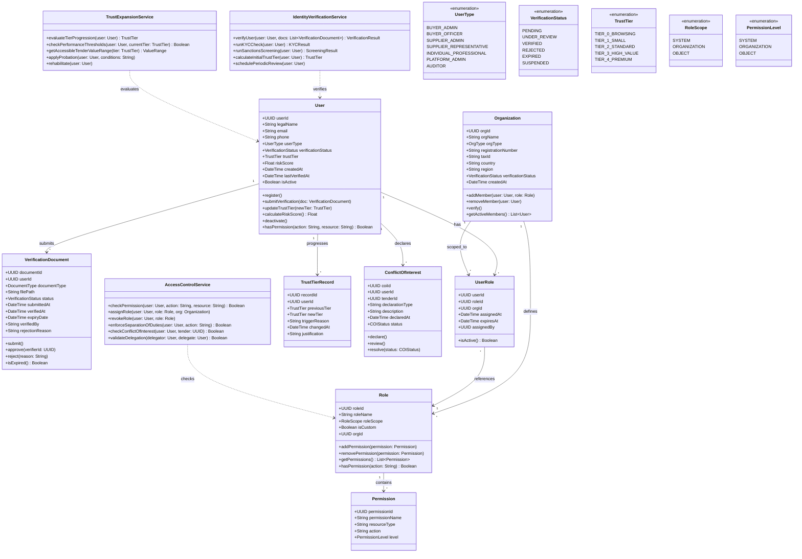
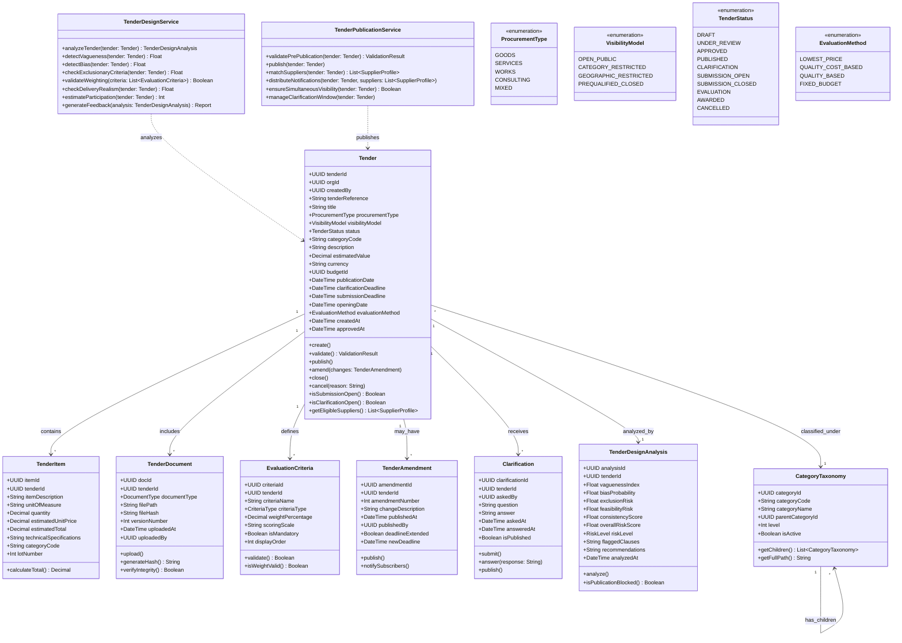
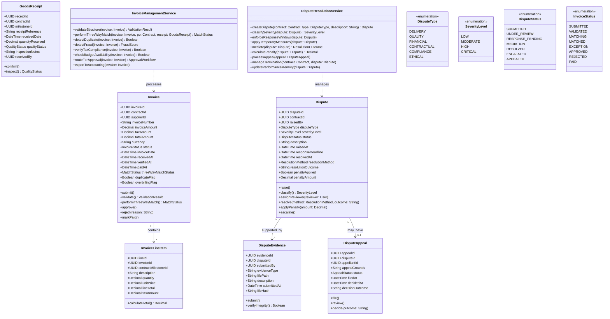
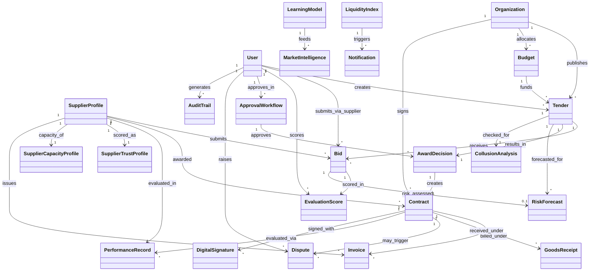

# CLASS DIAGRAMS
## Procurement Intelligence & Governance Platform

**Version:** 1.0
**Date:** February 19, 2026

---

## Overview

This document contains the complete UML class diagrams for the procurement system, organized by domain. Each diagram shows classes with attributes, methods, enums, inheritance hierarchies, and service classes that implement the 40 system logics.

---

## 1. Core Identity & Access Domain (Logics 1, 2, 37)

---

## 2. Procurement Design & Tender Domain (Logics 3, 4, 24, 36)

---

## 3. Supplier Profile & Discovery Domain (Logics 5, 15, 22, 25)

```mermaid
classDiagram
    class SupplierProfile {
        +UUID supplierId
        +UUID userId
        +UUID orgId
        +String businessType
        +String registrationCountry
        +List~String~ categoriesServed
        +List~String~ regionsServed
        +List~String~ certifications
        +Decimal declaredAnnualTurnover
        +Int declaredWorkforceSize
        +Decimal declaredMaxCapacity
        +Float trustScore
        +TrustTier trustTier
        +Float overallPerformanceScore
        +DateTime profileUpdatedAt
        +updateProfile()
        +calculateTrustScore() Float
        +getCapacityStatus() CapacityRiskLevel
        +getPerformanceHistory() List~PerformanceRecord~
        +isEligibleForTender(tender: Tender) Boolean
    }

    class SupplierCapability {
        +UUID capabilityId
        +UUID supplierId
        +String categoryCode
        +String capabilityDescription
        +ExperienceLevel experienceLevel
        +Int yearsOfExperience
        +String referenceContracts
        +calculateExperienceScore() Float
    }

    class SupplierCapacityProfile {
        +UUID capacityId
        +UUID supplierId
        +Decimal maxMonthlyCapacity
        +Decimal currentUtilizationPct
        +Int activeContractsCount
        +Decimal activeContractValue
        +CapacityRiskLevel riskLevel
        +Float overloadProbability
        +DateTime lastCalculatedAt
        +recalculate()
        +getAvailableCapacity() Decimal
        +simulateIfAwarded(contractValue: Decimal) Float
        +isOvercommitted() Boolean
    }

    class PerformanceRecord {
        +UUID recordId
        +UUID supplierId
        +UUID contractId
        +Float deliveryScore
        +Float qualityScore
        +Float complianceScore
        +Float financialAccuracyScore
        +Float overallScore
        +String evaluatorComments
        +DateTime evaluationDate
        +submit()
        +lock()
    }

    class SupplierTrustProfile {
        +UUID trustId
        +UUID supplierId
        +String categoryCode
        +Float deliveryPerformancePct
        +Float qualityCompliancePct
        +Float disputeOutcomeIndex
        +Float financialAccuracyPct
        +Float capacityReliabilityPct
        +Float ethicalCompliancePct
        +Float compositeTrustScore
        +TrustTier trustTier
        +DateTime calculatedAt
        +calculate() Float
        +applyTimeDecay()
        +getTierRecommendation() TrustTier
    }

    class TrustTierHistory {
        +UUID historyId
        +UUID supplierId
        +TrustTier previousTier
        +TrustTier newTier
        +Float previousScore
        +Float newScore
        +String changeReason
        +DateTime changedAt
    }

    class PersonnelRecord {
        +UUID personnelId
        +UUID supplierId
        +String fullName
        +String roleTitle
        +String qualifications
        +Int yearsExperience
        +String cvFilePath
        +Boolean isAvailable
        +checkAvailability(startDate: DateTime, endDate: DateTime) Boolean
    }

    class PersonnelAssignment {
        +UUID assignmentId
        +UUID personnelId
        +UUID contractId
        +Decimal hoursPerMonth
        +DateTime startDate
        +DateTime endDate
        +AssignmentStatus status
        +isOverlapping(otherAssignment: PersonnelAssignment) Boolean
    }

    class SupplierDiscoveryService {
        +searchSuppliers(criteria: SearchCriteria) List~SupplierProfile~
        +matchToTender(tender: Tender) List~SupplierMatch~
        +rankSuppliers(matches: List~SupplierMatch~) List~SupplierMatch~
        +applyBiasControl(rankings: List~SupplierMatch~) List~SupplierMatch~
        +handleColdStart(newSupplier: SupplierProfile) List~Tender~
        +getRecommendations(buyer: User) List~SupplierProfile~
    }

    class SupplierPerformanceService {
        +evaluateContract(contractId: UUID) PerformanceRecord
        +calculateRollingScore(supplier: SupplierProfile) Float
        +getRiskAdjustedIndex(supplier: SupplierProfile) Float
        +triggerEarlyWarning(supplier: SupplierProfile) Warning
        +applySanction(supplier: SupplierProfile, type: SanctionType)
        +trackCorrectiveAction(supplier: SupplierProfile, action: String)
    }

    class CapacityMonitoringService {
        +assessCapacity(supplier: SupplierProfile) SupplierCapacityProfile
        +detectOvercommitment(supplier: SupplierProfile) Boolean
        +simulateAwardImpact(supplier: SupplierProfile, contract: Decimal) Float
        +checkPersonnelAvailability(personnel: PersonnelRecord, dates: DateRange) Boolean
        +getCrossOrganizationLoad(supplier: SupplierProfile) Decimal
        +updateRealTimeCapacity(supplier: SupplierProfile)
    }

    class TrustScoringService {
        +calculateTrustScore(supplier: SupplierProfile, category: String) Float
        +applyContextualWeighting(supplier: SupplierProfile, procType: ProcurementType) Float
        +applyTimeDecay(records: List~PerformanceRecord~) Float
        +determineTier(score: Float) TrustTier
        +checkProbationStatus(supplier: SupplierProfile) Boolean
        +generateTrustReport(supplier: SupplierProfile) TrustReport
    }

    class CapacityRiskLevel {
        <<enumeration>>
        LOW
        MODERATE
        HIGH
        OVERCOMMITTED
    }

    class ExperienceLevel {
        <<enumeration>>
        ENTRY
        INTERMEDIATE
        ADVANCED
        EXPERT
    }

    SupplierProfile "1" --> "*" SupplierCapability : declares
    SupplierProfile "1" --> "1" SupplierCapacityProfile : has
    SupplierProfile "1" --> "*" PerformanceRecord : receives
    SupplierProfile "1" --> "*" SupplierTrustProfile : evaluated_as
    SupplierProfile "1" --> "*" TrustTierHistory : tracks
    SupplierProfile "1" --> "*" PersonnelRecord : employs
    PersonnelRecord "1" --> "*" PersonnelAssignment : assigned_to
    SupplierDiscoveryService ..> SupplierProfile : discovers
    SupplierPerformanceService ..> PerformanceRecord : manages
    CapacityMonitoringService ..> SupplierCapacityProfile : monitors
    TrustScoringService ..> SupplierTrustProfile : calculates
```

---

## 4. Bidding & Evaluation Domain (Logics 6, 7, 8, 9, 17, 18, 26)

```mermaid
classDiagram
    class Bid {
        +UUID bidId
        +UUID tenderId
        +UUID supplierId
        +String bidReference
        +BidType bidType
        +BidStatus status
        +Decimal totalBidPrice
        +String currency
        +String technicalEnvelopeHash
        +String financialEnvelopeHash
        +Boolean isLocked
        +DateTime submittedAt
        +DateTime withdrawnAt
        +String withdrawalReason
        +String encryptionKeyId
        +submit()
        +validate() ValidationResult
        +lock()
        +withdraw(reason: String)
        +verifyHash() Boolean
        +decrypt(key: String) BidContent
    }

    class BidItem {
        +UUID bidItemId
        +UUID bidId
        +UUID tenderItemId
        +Decimal unitPrice
        +Decimal quantity
        +Decimal totalPrice
        +String technicalCompliance
        +String remarks
        +calculateTotal() Decimal
    }

    class BidDocument {
        +UUID docId
        +UUID bidId
        +DocumentType documentType
        +EnvelopeType envelopeType
        +String filePath
        +String fileHash
        +DateTime uploadedAt
        +generateHash() String
        +verifyIntegrity() Boolean
    }

    class BidValidation {
        +UUID validationId
        +UUID bidId
        +ValidationType validationType
        +ValidationResult result
        +String details
        +DateTime validatedAt
    }

    class BidOpeningRecord {
        +UUID openingId
        +UUID tenderId
        +EnvelopeType envelopeType
        +DateTime openedAt
        +String authorizedBy
        +Int bidsOpenedCount
        +String hashVerificationResults
        +String openingReportPath
        +open()
        +verifyAllHashes() List~HashVerification~
        +generateReport() Report
    }

    class EvaluationScore {
        +UUID scoreId
        +UUID bidId
        +UUID criteriaId
        +UUID evaluatorId
        +Decimal rawScore
        +Decimal weightedScore
        +String justification
        +Boolean isLocked
        +DateTime scoredAt
        +score(value: Decimal, justification: String)
        +lock()
        +calculateWeighted() Decimal
    }

    class EvaluationConsensus {
        +UUID consensusId
        +UUID tenderId
        +UUID bidId
        +UUID criteriaId
        +Decimal finalScore
        +String moderationNotes
        +DateTime finalizedAt
        +moderate(scores: List~EvaluationScore~) Decimal
        +finalize()
    }

    class BidRanking {
        +UUID rankingId
        +UUID tenderId
        +UUID bidId
        +Int rankPosition
        +Decimal totalWeightedScore
        +Decimal technicalScore
        +Decimal financialScore
        +Decimal riskAdjustedScore
        +QualificationStatus qualificationStatus
        +String disqualificationReason
        +disqualify(reason: String)
    }

    class PriceBenchmark {
        +UUID benchmarkId
        +UUID tenderId
        +UUID bidId
        +Decimal rawPrice
        +Decimal marketMedianPrice
        +Decimal historicalAverage
        +Decimal normalizedPrice
        +Float priceVariancePct
        +OutlierFlag outlierFlag
        +Float priceRiskScore
        +Decimal logisticsAdjustment
        +Decimal taxAdjustment
        +Decimal scarcityAdjustment
        +Decimal currencyRiskAdjustment
        +calculate()
        +normalize() Decimal
        +isOutlier() Boolean
    }

    class SampleSubmission {
        +UUID sampleId
        +UUID tenderId
        +UUID supplierId
        +SampleType sampleType
        +String sampleReference
        +SampleStatus status
        +DateTime submittedAt
        +DateTime receivedAt
        +String storageLocation
        +String conditionOnReceipt
        +String custodyChain
        +register()
        +verifySealing() Boolean
        +recordCustody(officer: UUID, action: String)
    }

    class SampleEvaluation {
        +UUID evalId
        +UUID sampleId
        +UUID evaluatorId
        +Decimal score
        +String evaluationNotes
        +Boolean blindEvaluation
        +DateTime evaluatedAt
        +evaluate(score: Decimal, notes: String)
        +linkToEvaluationScore()
    }

    class BidSubmissionService {
        +validateEligibility(supplier: SupplierProfile, tender: Tender) Boolean
        +validateBidStructure(bid: Bid) ValidationResult
        +enforceDeadline(bid: Bid, tender: Tender) Boolean
        +encryptBid(bid: Bid) EncryptedBid
        +lockBid(bid: Bid)
        +processWithdrawal(bid: Bid, reason: String)
        +verifyBidIntegrity(bid: Bid) Boolean
    }

    class BidOpeningService {
        +authorizeOpening(tender: Tender, authorizers: List~User~) Boolean
        +openEnvelope(tender: Tender, envelopeType: EnvelopeType) BidOpeningRecord
        +verifyHashes(tender: Tender) List~HashVerification~
        +enforceMultiPersonControl(authorizers: List~User~) Boolean
        +generateOpeningReport(tender: Tender) Report
    }

    class EvaluationService {
        +initializeEvaluation(tender: Tender) EvaluationSession
        +scoreIndividual(evaluator: User, bid: Bid, criteria: EvaluationCriteria, score: Decimal)
        +lockScores(tender: Tender)
        +moderateScores(tender: Tender) List~EvaluationConsensus~
        +calculateFinancialScores(tender: Tender)
        +aggregateWeightedScores(tender: Tender) List~BidRanking~
        +applyRiskAdjustment(rankings: List~BidRanking~)
        +disqualifyBid(bid: Bid, reason: String)
        +generateComparativeAnalysis(tender: Tender) Report
    }

    class PriceIntelligenceService {
        +benchmarkBid(bid: Bid, tender: Tender) PriceBenchmark
        +normalizePrice(rawPrice: Decimal, region: String, category: String) Decimal
        +detectOutliers(bids: List~Bid~) List~Bid~
        +calculateTCO(bid: Bid) Decimal
        +checkBudgetAlignment(bid: Bid, budget: Budget) Boolean
        +getHistoricalPriceData(category: String, region: String) PriceHistory
    }

    class SampleManagementService {
        +registerSample(submission: SampleSubmission) SampleSubmission
        +trackCustody(sample: SampleSubmission, action: String)
        +scheduleEvaluation(sample: SampleSubmission)
        +anonymizeForBlindEval(samples: List~SampleSubmission~) List~SampleSubmission~
        +verifySampleMatch(sample: SampleSubmission, delivery: GoodsReceipt) Boolean
        +manageSampleDisposition(sample: SampleSubmission, action: DispositionType)
    }

    class BidType {
        <<enumeration>>
        PRICE_ONLY
        TWO_ENVELOPE
        SERVICE_PROPOSAL
        MULTI_LOT
    }

    class BidStatus {
        <<enumeration>>
        DRAFT
        SUBMITTED
        VALIDATED
        REJECTED
        OPENED
        UNDER_EVALUATION
        RANKED
        AWARDED
        WITHDRAWN
    }

    class EnvelopeType {
        <<enumeration>>
        TECHNICAL
        FINANCIAL
        COMBINED
    }

    class QualificationStatus {
        <<enumeration>>
        QUALIFIED
        DISQUALIFIED
        CONDITIONALLY_QUALIFIED
    }

    class SampleType {
        <<enumeration>>
        PHYSICAL
        DIGITAL
    }

    Bid "1" --> "*" BidItem : contains
    Bid "1" --> "*" BidDocument : includes
    Bid "1" --> "*" BidValidation : validated_by
    Bid "1" --> "*" EvaluationScore : scored_in
    Bid "1" --> "*" EvaluationConsensus : finalized_in
    Bid "1" --> "1" BidRanking : ranked_as
    Bid "1" --> "0..1" PriceBenchmark : benchmarked_in
    SampleSubmission "1" --> "*" SampleEvaluation : evaluated_in
    BidSubmissionService ..> Bid : processes
    BidOpeningService ..> BidOpeningRecord : creates
    EvaluationService ..> EvaluationScore : manages
    PriceIntelligenceService ..> PriceBenchmark : calculates
    SampleManagementService ..> SampleSubmission : manages
```

---

## 5. Award, Contract & Budget Domain (Logics 10, 11, 12, 13, 16)

```mermaid
classDiagram
    class AwardDecision {
        +UUID awardId
        +UUID tenderId
        +UUID winningBidId
        +UUID supplierId
        +AwardStatus decisionStatus
        +String justification
        +DateTime decisionDate
        +DateTime standstillEndDate
        +DateTime notificationSentAt
        +Boolean isChallenged
        +approve()
        +notifyWinner()
        +notifyUnsuccessful()
        +startStandstillPeriod()
        +handleChallenge()
        +generateContract() Contract
    }

    class Contract {
        +UUID contractId
        +UUID awardId
        +UUID tenderId
        +UUID supplierId
        +UUID buyerOrgId
        +String contractReference
        +ContractStatus status
        +Decimal contractValue
        +String currency
        +DateTime startDate
        +DateTime endDate
        +DateTime signedAt
        +String contractDocumentPath
        +SecurityStatus performanceSecurityStatus
        +Decimal securityAmount
        +generate()
        +sign(signer: User) DigitalSignature
        +activate()
        +amend(amendment: ContractAmendment)
        +terminate(reason: String)
        +complete()
        +isActive() Boolean
    }

    class ContractMilestone {
        +UUID milestoneId
        +UUID contractId
        +String milestoneName
        +DateTime dueDate
        +DateTime completedDate
        +MilestoneStatus status
        +Decimal deliverableValue
        +String description
        +markComplete()
        +approve()
        +reject(reason: String)
        +isOverdue() Boolean
    }

    class ApprovalWorkflow {
        +UUID workflowId
        +UUID referenceId
        +String referenceType
        +WorkflowType workflowType
        +WorkflowStatus status
        +DateTime initiatedAt
        +DateTime completedAt
        +initiate()
        +getNextStep() ApprovalStep
        +isComplete() Boolean
        +escalate()
    }

    class ApprovalStep {
        +UUID stepId
        +UUID workflowId
        +Int stepOrder
        +UUID approverId
        +UUID delegateId
        +StepType stepType
        +ApprovalStatus status
        +String comments
        +DateTime decidedAt
        +DateTime deadline
        +approve(comments: String)
        +reject(comments: String)
        +delegate(delegateTo: User)
        +isOverdue() Boolean
    }

    class DelegationRecord {
        +UUID delegationId
        +UUID delegatorId
        +UUID delegateId
        +String authorityType
        +Decimal maxValueLimit
        +DateTime validFrom
        +DateTime validUntil
        +DelegationStatus status
        +activate()
        +revoke()
        +isValid() Boolean
    }

    class Budget {
        +UUID budgetId
        +UUID orgId
        +String budgetCode
        +String budgetName
        +String fiscalYear
        +Decimal allocatedAmount
        +Decimal committedAmount
        +Decimal spentAmount
        +Decimal availableAmount
        +String currency
        +BudgetStatus status
        +checkAvailability(amount: Decimal) Boolean
        +commit(amount: Decimal, reference: UUID)
        +spend(amount: Decimal, reference: UUID)
        +release(amount: Decimal, reference: UUID)
        +reallocate(amount: Decimal, targetBudget: Budget)
        +getUtilizationPct() Float
    }

    class BudgetTransaction {
        +UUID transactionId
        +UUID budgetId
        +UUID referenceId
        +String referenceType
        +TransactionType transactionType
        +Decimal amount
        +Decimal balanceAfter
        +DateTime transactionDate
        +String description
    }

    class DigitalSignature {
        +UUID signatureId
        +UUID documentId
        +UUID signerId
        +SignatureType signatureType
        +String certificateId
        +String documentHash
        +String signatureValue
        +DateTime signedAt
        +String timestampAuthority
        +VerificationStatus verificationStatus
        +create(signer: User, document: Document) DigitalSignature
        +verify() Boolean
        +getTimestamp() DateTime
    }

    class DeliveryFeasibility {
        +UUID feasibilityId
        +UUID bidId
        +UUID tenderId
        +Float distanceScore
        +Float transportRiskScore
        +Float infrastructureScore
        +Float seasonalRiskScore
        +Float overallFeasibilityScore
        +FeasibilityRisk riskClassification
        +DateTime assessedAt
        +assess()
        +getOverallScore() Float
    }

    class AwardService {
        +validateAwardConsistency(tender: Tender, bid: Bid) Boolean
        +applyTieBreakerLogic(bids: List~BidRanking~) BidRanking
        +confirmDisqualifications(tender: Tender)
        +initiateApproval(award: AwardDecision) ApprovalWorkflow
        +sendNotifications(award: AwardDecision)
        +manageStandstillPeriod(award: AwardDecision)
        +generateContract(award: AwardDecision) Contract
        +handleAppeal(award: AwardDecision, appeal: DisputeAppeal)
    }

    class ApprovalService {
        +determineApprovalPath(referenceType: String, value: Decimal, risk: String) ApprovalWorkflow
        +routeToNextApprover(workflow: ApprovalWorkflow)
        +enforceSoD(workflow: ApprovalWorkflow) Boolean
        +handleDelegation(step: ApprovalStep, delegate: User)
        +escalateOverdue(step: ApprovalStep)
        +handleEmergencyMode(workflow: ApprovalWorkflow)
    }

    class BudgetService {
        +validatePreCommitment(budget: Budget, amount: Decimal) Boolean
        +reserveFunds(budget: Budget, tender: Tender)
        +lockAwardCommitment(budget: Budget, contract: Contract)
        +trackRealTimeSpend(budget: Budget)
        +assessAmendmentImpact(contract: Contract, amendment: Decimal) BudgetImpact
        +forecastMultiPeriod(budget: Budget) Forecast
    }

    class SignatureService {
        +createSignature(signer: User, document: Document, type: SignatureType) DigitalSignature
        +verifySignature(signature: DigitalSignature) Boolean
        +generateDocumentHash(document: Document) String
        +applyTimestamp(signature: DigitalSignature) DateTime
        +manageCertificates(user: User) CertificateStatus
    }

    class ContractStatus {
        <<enumeration>>
        DRAFT
        PENDING_SIGNATURE
        ACTIVE
        AMENDED
        SUSPENDED
        TERMINATED
        COMPLETED
    }

    class WorkflowType {
        <<enumeration>>
        SEQUENTIAL
        PARALLEL
        CONDITIONAL
    }

    class SignatureType {
        <<enumeration>>
        SES
        AES
        QES
    }

    AwardDecision "1" --> "1" Contract : creates
    Contract "1" --> "*" ContractMilestone : defines
    Contract "1" --> "*" DigitalSignature : signed_with
    ApprovalWorkflow "1" --> "*" ApprovalStep : contains
    Budget "1" --> "*" BudgetTransaction : records
    AwardService ..> AwardDecision : manages
    ApprovalService ..> ApprovalWorkflow : orchestrates
    BudgetService ..> Budget : controls
    SignatureService ..> DigitalSignature : creates
```

---

## 6. Post-Award & Financial Domain (Logics 19, 20)

---

## 7. Risk, Anti-Fraud & Governance Domain (Logics 14, 23, 27, 29)

```mermaid
classDiagram
    class RiskForecast {
        +UUID forecastId
        +UUID tenderId
        +UUID bidId
        +UUID supplierId
        +Float supplierTrustIndex
        +Float capacityStressIndex
        +Float logisticsRiskIndex
        +Float marketVolatilityIndex
        +Float disputeProbability
        +Float complexityMultiplier
        +Float totalRiskScore
        +RiskClassification riskClassification
        +String primaryRiskDrivers
        +String mitigationSuggestions
        +DateTime calculatedAt
        +calculate()
        +explainRisk() RiskExplanation
        +suggestMitigation() List~String~
    }

    class CollusionAnalysis {
        +UUID analysisId
        +UUID tenderId
        +Float priceCorrelationScore
        +Float rotationFrequencyScore
        +Float spreadConsistencyScore
        +Float timingSimilarityScore
        +Float documentSimilarityScore
        +Float compositeCollusionIndex
        +RiskLevel riskLevel
        +String flaggedSupplierPairs
        +DateTime analyzedAt
        +analyze()
        +detectBidRotation() Float
        +detectCoverBidding() Float
        +detectPriceFixing() Float
        +flagForReview() ComplianceReview
    }

    class ComplianceReview {
        +UUID reviewId
        +UUID collusionAnalysisId
        +UUID reviewerId
        +ReviewStatus reviewStatus
        +String findings
        +String actionTaken
        +DateTime reviewedAt
        +assign(reviewer: User)
        +review()
        +conclude(findings: String, action: String)
    }

    class ViolationRecord {
        +UUID violationId
        +UUID userId
        +UUID orgId
        +ViolationLevel violationLevel
        +String violationType
        +String description
        +String evidenceSummary
        +DateTime detectedAt
        +String detectionMethod
        +classify() ViolationLevel
    }

    class EnforcementAction {
        +UUID actionId
        +UUID violationId
        +EnforcementType actionType
        +String justification
        +DateTime effectiveFrom
        +DateTime effectiveUntil
        +EnforcementStatus status
        +UUID decidedBy
        +execute()
        +isActive() Boolean
    }

    class AppealRecord {
        +UUID appealId
        +UUID enforcementActionId
        +UUID appellantId
        +String appealGrounds
        +AppealStatus status
        +DateTime filedAt
        +DateTime decidedAt
        +String decision
        +file()
        +review()
        +decide(outcome: String)
    }

    class ReinstatementRecord {
        +UUID reinstatementId
        +UUID enforcementActionId
        +UUID userId
        +String conditions
        +DateTime reinstatedAt
        +ProbationStatus probationStatus
        +DateTime probationEndDate
        +reinstate()
        +checkProbationComplete() Boolean
    }

    class AuditTrail {
        +UUID auditId
        +UUID userId
        +String actionType
        +String resourceType
        +UUID resourceId
        +String previousState
        +String newState
        +String ipAddress
        +String sessionId
        +DateTime timestamp
        +String correlationId
        +log()
        +isImmutable() Boolean
    }

    class RiskForecastingService {
        +forecastProcurementRisk(tender: Tender, bid: Bid) RiskForecast
        +calculateSupplierRisk(supplier: SupplierProfile) Float
        +assessMarketVolatility(category: String, region: String) Float
        +assessContractComplexity(tender: Tender) Float
        +simulateScenario(tender: Tender, params: SimulationParams) RiskForecast
        +generateEarlyWarning(forecast: RiskForecast) Warning
    }

    class AntiCollusionService {
        +analyzeTenderBids(tender: Tender) CollusionAnalysis
        +computePriceCorrelation(supplierA: UUID, supplierB: UUID) Float
        +detectWinRotation(suppliers: List~UUID~, history: Int) Float
        +analyzeBidSpreadConsistency(bids: List~Bid~) Float
        +analyzeSubmissionTiming(bids: List~Bid~) Float
        +compareDocumentSimilarity(bids: List~Bid~) Float
        +applyFalsePositiveSafeguards(analysis: CollusionAnalysis) CollusionAnalysis
        +triggerInvestigation(analysis: CollusionAnalysis) ComplianceReview
    }

    class GovernanceService {
        +reportViolation(user: User, type: String, evidence: String) ViolationRecord
        +classifyViolation(violation: ViolationRecord) ViolationLevel
        +enforceAction(violation: ViolationRecord, action: EnforcementType) EnforcementAction
        +processAppeal(appeal: AppealRecord)
        +manageReinstatement(userId: UUID, conditions: String) ReinstatementRecord
        +ensureConsistency(violation: ViolationRecord) List~EnforcementAction~
    }

    class AuditService {
        +logAction(user: User, action: String, resource: String, state: String)
        +reconstructHistory(resourceId: UUID) List~AuditTrail~
        +searchAuditLogs(criteria: SearchCriteria) List~AuditTrail~
        +detectAnomalies(logs: List~AuditTrail~) List~Anomaly~
        +applyRetentionPolicy(logs: List~AuditTrail~)
        +generateForensicReport(resourceId: UUID) Report
    }

    class ViolationLevel {
        <<enumeration>>
        MINOR
        MODERATE
        SERIOUS
        CRITICAL
    }

    class EnforcementType {
        <<enumeration>>
        WARNING
        TEMPORARY_RESTRICTION
        TENDER_SUSPENSION
        CATEGORY_EXCLUSION
        PLATFORM_SUSPENSION
        PERMANENT_BAN
    }

    class RiskClassification {
        <<enumeration>>
        LOW_GREEN
        MODERATE_YELLOW
        HIGH_ORANGE
        CRITICAL_RED
    }

    ViolationRecord "1" --> "*" EnforcementAction : results_in
    EnforcementAction "1" --> "0..1" AppealRecord : may_have
    EnforcementAction "1" --> "0..1" ReinstatementRecord : may_lead_to
    CollusionAnalysis "1" --> "0..1" ComplianceReview : reviewed_in
    RiskForecastingService ..> RiskForecast : produces
    AntiCollusionService ..> CollusionAnalysis : performs
    GovernanceService ..> ViolationRecord : manages
    AuditService ..> AuditTrail : maintains
```

---

## 8. Market Intelligence & Platform Domain (Logics 21, 28, 30, 31, 35)

```mermaid
classDiagram
    class MarketIntelligence {
        +UUID intelligenceId
        +String categoryCode
        +String region
        +MetricType metricType
        +Decimal metricValue
        +String timePeriod
        +Int sampleSize
        +DateTime generatedAt
        +generate()
        +anonymize()
    }

    class LiquidityIndex {
        +UUID indexId
        +String categoryCode
        +String region
        +Int activeTenders
        +Int activeSuppliers
        +Float avgBidsPerTender
        +Float supplierEngagementIndex
        +Float buyerEngagementIndex
        +HealthStatus healthStatus
        +DateTime calculatedAt
        +calculate()
        +assessHealth() HealthStatus
        +suggestInterventions() List~String~
    }

    class LearningModel {
        +UUID modelId
        +String modelType
        +String modelVersion
        +String targetLogic
        +Float accuracyScore
        +DateTime trainedAt
        +DateTime lastValidatedAt
        +Int trainingSampleCount
        +train(data: DataSet)
        +predict(input: PredictionInput) PredictionOutput
        +validate() Float
        +updateVersion()
    }

    class Recommendation {
        +UUID recommendationId
        +UUID modelId
        +UUID targetUserId
        +RecommendationType recommendationType
        +String recommendationContent
        +Float confidenceScore
        +RecommendationStatus status
        +DateTime generatedAt
        +Boolean wasAccepted
        +generate()
        +present()
        +recordOutcome(accepted: Boolean)
    }

    class ERPIntegration {
        +UUID integrationId
        +UUID orgId
        +String erpSystemType
        +String apiEndpoint
        +String authMethod
        +SyncStatus syncStatus
        +DateTime lastSyncAt
        +Boolean isActive
        +configure()
        +testConnection() Boolean
        +sync()
        +getLastSyncStatus() SyncStatus
    }

    class SyncRecord {
        +UUID syncId
        +UUID integrationId
        +SyncDirection syncDirection
        +String entityType
        +UUID entityId
        +SyncStatus syncStatus
        +String errorDetails
        +DateTime syncedAt
    }

    class ModuleRegistry {
        +UUID moduleId
        +String moduleName
        +ModuleType moduleType
        +String version
        +ModuleStatus status
        +Boolean isCore
        +String apiEndpoints
        +DateTime installedAt
        +install()
        +activate()
        +deactivate()
        +checkCompatibility() Boolean
    }

    class Notification {
        +UUID notificationId
        +UUID userId
        +NotificationType notificationType
        +NotificationChannel channel
        +String subject
        +String message
        +NotificationStatus status
        +UUID referenceId
        +String referenceType
        +DateTime createdAt
        +DateTime readAt
        +send()
        +markRead()
    }

    class MarketIntelligenceService {
        +aggregatePriceBenchmarks(category: String, region: String) MarketIntelligence
        +analyzeSupplierBehavior(category: String) List~BehaviorPattern~
        +calculateMarketConcentration(category: String) Float
        +detectCapacityPressure(category: String) Float
        +forecastDemandTrend(category: String) TrendForecast
        +generateSharedWarnings() List~MarketIntelligence~
    }

    class LiquidityManagementService {
        +monitorBuyerLiquidity(category: String, region: String) LiquidityIndex
        +monitorSupplierLiquidity(category: String, region: String) LiquidityIndex
        +optimizeBidDensity(tender: Tender)
        +preventDominance(category: String)
        +detectLiquidityWarnings() List~Warning~
        +suggestIncentives(index: LiquidityIndex) List~String~
    }

    class LearningService {
        +trainModels(logicTarget: String, data: DataSet) LearningModel
        +generateRecommendation(userId: UUID, context: String) Recommendation
        +refinePredictions(model: LearningModel, feedback: FeedbackData)
        +compareOutcomes(predicted: Float, actual: Float) Float
        +ensureExplainability(model: LearningModel) Explanation
    }

    class IntegrationService {
        +configureERP(org: Organization, config: ERPConfig) ERPIntegration
        +syncBidData(integration: ERPIntegration, bid: Bid)
        +syncAwardData(integration: ERPIntegration, award: AwardDecision)
        +syncInvoiceData(integration: ERPIntegration, invoice: Invoice)
        +reconcileData(integration: ERPIntegration) ReconciliationReport
    }

    class HealthStatus {
        <<enumeration>>
        HEALTHY
        AT_RISK
        UNDERSERVED
        CRITICAL
    }

    class ModuleType {
        <<enumeration>>
        CORE_PROCUREMENT
        FINANCING
        INSURANCE
        CROSS_BORDER
        REGULATORY
        ANALYTICS
    }

    ERPIntegration "1" --> "*" SyncRecord : produces
    LearningModel "1" --> "*" Recommendation : generates
    MarketIntelligenceService ..> MarketIntelligence : generates
    LiquidityManagementService ..> LiquidityIndex : monitors
    LearningService ..> LearningModel : trains
    IntegrationService ..> ERPIntegration : manages
```

---

## 9. Master Class Relationship Overview

---

## 10. Service Layer Overview

```mermaid
classDiagram
    class IdentityVerificationService
    class AccessControlService
    class TrustExpansionService
    class TenderDesignService
    class TenderPublicationService
    class SupplierDiscoveryService
    class SupplierPerformanceService
    class CapacityMonitoringService
    class TrustScoringService
    class BidSubmissionService
    class BidOpeningService
    class EvaluationService
    class PriceIntelligenceService
    class SampleManagementService
    class AwardService
    class ApprovalService
    class BudgetService
    class SignatureService
    class InvoiceManagementService
    class DisputeResolutionService
    class RiskForecastingService
    class AntiCollusionService
    class GovernanceService
    class AuditService
    class MarketIntelligenceService
    class LiquidityManagementService
    class LearningService
    class IntegrationService

    IdentityVerificationService ..> AccessControlService : feeds_into
    TrustExpansionService ..> TrustScoringService : relies_on
    TenderDesignService ..> TenderPublicationService : validates_before
    SupplierDiscoveryService ..> TrustScoringService : uses_trust_from
    SupplierDiscoveryService ..> CapacityMonitoringService : checks_capacity_via
    BidSubmissionService ..> EvaluationService : feeds_bids_to
    EvaluationService ..> PriceIntelligenceService : uses_pricing_from
    EvaluationService ..> AwardService : outputs_rankings_to
    AwardService ..> ApprovalService : routes_for_approval
    AwardService ..> BudgetService : validates_budget_via
    AwardService ..> SignatureService : signs_contracts_via
    InvoiceManagementService ..> BudgetService : checks_budget
    InvoiceManagementService ..> ApprovalService : routes_approval
    DisputeResolutionService ..> SupplierPerformanceService : updates_performance
    RiskForecastingService ..> TrustScoringService : uses_trust
    RiskForecastingService ..> CapacityMonitoringService : uses_capacity
    AntiCollusionService ..> GovernanceService : triggers_enforcement
    LearningService ..> MarketIntelligenceService : improves_intelligence
    LiquidityManagementService ..> MarketIntelligenceService : monitors_health
    AuditService ..> GovernanceService : supports_investigations
```

---

## Class Count Summary

| Domain | Classes | Services | Enums |
|---|---|---|---|
| Identity & Access | 8 | 3 | 5 |
| Procurement Design | 8 | 2 | 4 |
| Supplier Profile | 8 | 4 | 2 |
| Bidding & Evaluation | 10 | 5 | 5 |
| Award & Contract | 9 | 4 | 3 |
| Post-Award Financial | 6 | 2 | 4 |
| Risk & Governance | 8 | 4 | 3 |
| Market Intelligence | 8 | 4 | 2 |
| **TOTAL** | **65** | **28** | **28** |

---

## Design Patterns Used

| Pattern | Application |
|---|---|
| **Service Layer** | All business logic encapsulated in dedicated service classes per domain |
| **Repository** | Entity classes represent persistent data, services handle operations |
| **Strategy** | Evaluation methods, scoring models, and risk algorithms are configurable |
| **Observer** | Notification system triggers on procurement events |
| **State Machine** | Tender, Bid, Contract, Invoice, and Dispute follow defined status flows |
| **Chain of Responsibility** | Approval workflows route through sequential/parallel approval steps |
| **Facade** | Integration service abstracts ERP communication complexity |
| **Template Method** | Standardized templates (Logic 36) with organizational overrides |
