# DATA FLOW DIAGRAMS
## Procurement Intelligence & Governance Platform

**Version:** 1.0  
**Date:** February 19, 2026

---

## Overview

This document contains multi-level Data Flow Diagrams (DFDs) for the procurement system across all 40 logics.

- **Level 0** — Context Diagram: the system boundary and all external actors
- **Level 1** — System-Level: major processes, data stores, and inter-process flows
- **Level 2** — Process-Level: detailed sub-process breakdowns for critical flows

### DFD Notation

| Symbol | Representation |
|--------|---------------|
| Rounded rectangle | Process |
| Open-ended rectangle / cylinder | Data Store |
| Rectangle | External Entity |
| Arrow | Data Flow |

---

## 1. Level 0 — Context Diagram

> Shows the entire procurement platform as a single process with all external actors and data exchanges.

```mermaid
flowchart TB
    subgraph External Entities
        BUYER([👤 Buyer Organization])
        SUPPLIER([🏢 Supplier Organization])
        PROFESSIONAL([👨‍💼 Individual Professional])
        ADMIN([🛡️ Platform Admin])
        AUDITOR([📋 External Auditor])
        ERP([🖥️ ERP / SAP System])
        IDPROVIDER([🆔 Identity Verification Provider])
        CERTAUTH([🔐 Certificate Authority])
        MARKETFEED([📊 External Market Data Feed])
        REGULATOR([🏛️ Regulatory Body])
    end

    PLATFORM[/🔷 Procurement Intelligence\n& Governance Platform/]

    BUYER -->|Procurement requests, tender specs,\napprovals, evaluations, invoices| PLATFORM
    PLATFORM -->|Tender notifications, bid results,\ncontracts, reports, alerts| BUYER

    SUPPLIER -->|Registration, bids, invoices,\nperformance evidence, samples| PLATFORM
    PLATFORM -->|Opportunity notifications, award decisions,\nscoring feedback, contracts| SUPPLIER

    PROFESSIONAL -->|Profile, portfolio, proposals| PLATFORM
    PLATFORM -->|Matched opportunities,\nassignments, evaluations| PROFESSIONAL

    ADMIN -->|Configuration, rules,\nenforcement actions| PLATFORM
    PLATFORM -->|Compliance reports, anomaly alerts,\naudit summaries| ADMIN

    AUDITOR -->|Audit queries, investigation requests| PLATFORM
    PLATFORM -->|Audit trails, forensic reports,\ncompliance evidence| AUDITOR

    ERP -->|Purchase orders, budget data,\nvendor master records| PLATFORM
    PLATFORM -->|Award data, invoice data,\nsupplier scores, sync records| ERP

    IDPROVIDER -->|Verification results,\nKYC responses| PLATFORM
    PLATFORM -->|Verification requests,\ndocument submissions| IDPROVIDER

    CERTAUTH -->|Digital certificates,\ntimestamp tokens| PLATFORM
    PLATFORM -->|Certificate requests,\nsignature validations| CERTAUTH

    MARKETFEED -->|Commodity prices,\ncurrency rates, indices| PLATFORM

    PLATFORM -->|Compliance reports,\nprocurement disclosures| REGULATOR
```



---

## 2. Level 1 — System-Level DFD

> Decomposes the platform into 10 major processes, showing data stores and inter-process data flows.

```mermaid
flowchart TB
    %% ══════════════════════════════════
    %% EXTERNAL ENTITIES
    %% ══════════════════════════════════
    BUYER([👤 Buyer])
    SUPPLIER([🏢 Supplier])
    ADMIN([🛡️ Admin])
    ERP([🖥️ ERP System])
    IDPROV([🆔 ID Provider])

    %% ══════════════════════════════════
    %% PROCESSES
    %% ══════════════════════════════════
    P1[P1: Identity &\nAccess Management]
    P2[P2: Procurement Design\n& Tender Creation]
    P3[P3: Marketplace\n& Supplier Discovery]
    P4[P4: Bid Submission\n& Validation]
    P5[P5: Evaluation\n& Scoring]
    P6[P6: Award &\nContract Formation]
    P7[P7: Post-Award\nOperations]
    P8[P8: Risk &\nCompliance Engine]
    P9[P9: Intelligence &\nLearning Engine]
    P10[P10: Integration\n& Sync Engine]

    %% ══════════════════════════════════
    %% DATA STORES
    %% ══════════════════════════════════
    DS1[(DS1: User &\nOrganization Store)]
    DS2[(DS2: Tender &\nCriteria Store)]
    DS3[(DS3: Supplier\nProfile Store)]
    DS4[(DS4: Bid &\nDocument Store)]
    DS5[(DS5: Evaluation\n& Score Store)]
    DS6[(DS6: Contract &\nBudget Store)]
    DS7[(DS7: Invoice &\nDispute Store)]
    DS8[(DS8: Audit &\nViolation Store)]
    DS9[(DS9: Intelligence &\nModel Store)]

    %% ══════════════════════════════════
    %% DATA FLOWS
    %% ══════════════════════════════════

    %% P1: Identity & Access
    BUYER -->|Registration data,\nverification docs| P1
    SUPPLIER -->|Registration data,\ncapabilities, certs| P1
    IDPROV -->|KYC results,\nverification status| P1
    P1 -->|Verified user profile,\nroles, trust tier| DS1
    P1 -->|Access tokens,\npermissions| P2
    P1 -->|Access tokens,\npermissions| P4

    %% P2: Procurement Design
    BUYER -->|Need description,\nspecs, budgets, criteria| P2
    P2 -->|Tender record,\nitems, criteria, docs| DS2
    P2 -->|Validated tender\nfor publication| P3
    P2 -->|Budget reservation\nrequest| DS6
    P2 -->|Design analysis\nresults| DS8

    %% P3: Marketplace & Discovery
    P3 -->|Supplier matches,\nnotifications| SUPPLIER
    P3 -->|Tender listing,\nmatched opportunities| SUPPLIER
    DS3 -->|Supplier capabilities,\ntrust scores| P3
    DS2 -->|Published tender\ndetails| P3
    P3 -->|Market visibility\nmetrics| DS9

    %% P4: Bid Submission
    SUPPLIER -->|Bid data, documents,\nsamples, pricing| P4
    DS2 -->|Tender requirements,\ndeadlines| P4
    P4 -->|Validated bids,\nhashes, envelopes| DS4
    P4 -->|Bid receipt\nconfirmation| SUPPLIER
    P4 -->|Bid count,\nsubmission audit| DS8

    %% P5: Evaluation & Scoring
    DS4 -->|Opened bids,\ndecrypted content| P5
    DS2 -->|Evaluation criteria,\nweights| P5
    BUYER -->|Manual scores,\njustification| P5
    P5 -->|Individual scores,\nconsensus scores| DS5
    P5 -->|Final rankings| P6
    P5 -->|Price benchmarks| DS9

    %% P6: Award & Contract
    DS5 -->|Final rankings,\nscores| P6
    P6 -->|Award decision,\ncontract| DS6
    P6 -->|Award notification| BUYER
    P6 -->|Award/rejection notice| SUPPLIER
    P6 -->|Approval request| BUYER
    DS6 -->|Budget availability| P6
    P6 -->|Signed contract,\ndigital signatures| DS6

    %% P7: Post-Award Operations
    SUPPLIER -->|Invoices, delivery notes,\nreceipts| P7
    DS6 -->|Contract terms,\nmilestones| P7
    P7 -->|Validated invoices,\nreceipts| DS7
    P7 -->|Performance scores| DS3
    P7 -->|Payment confirmation| SUPPLIER
    P7 -->|Dispute records| DS7
    BUYER -->|Goods receipt,\ninspection results| P7

    %% P8: Risk & Compliance
    DS4 -->|Bid patterns,\ntiming data| P8
    DS3 -->|Supplier history,\ntrust data| P8
    DS8 -->|Past violations,\naudit logs| P8
    P8 -->|Risk forecasts,\ncollusion alerts| DS8
    P8 -->|Enforcement actions| DS8
    P8 -->|Compliance reports| ADMIN
    P8 -->|Trust tier updates| DS1

    %% P9: Intelligence & Learning
    DS5 -->|Historical scores,\noutcomes| P9
    DS9 -->|Market data,\npast models| P9
    DS3 -->|Performance trends| P9
    P9 -->|Recommendations,\nbenchmarks| DS9
    P9 -->|Liquidity alerts| ADMIN
    P9 -->|Updated models| DS9

    %% P10: Integration
    ERP -->|PO data, budget data,\nvendor records| P10
    P10 -->|Award sync, invoice sync,\nsupplier scores| ERP
    DS6 -->|Contract & invoice data| P10
    P10 -->|Sync records| DS9
    ADMIN -->|Configuration,\nmodule mgmt| P10
```



---

## 3. Level 1 — Data Store Detail Map

> Summary of what each data store holds and which processes read/write.

| Data Store | Contents | Written By | Read By |
|---|---|---|---|
| DS1: User & Organization | Users, roles, permissions, trust tiers, COI declarations | P1, P8 | P1, P2, P3, P4, P5, P6, P8 |
| DS2: Tender & Criteria | Tenders, items, docs, criteria, amendments, clarifications, design analysis | P2 | P3, P4, P5, P6 |
| DS3: Supplier Profile | Profiles, capabilities, capacity, trust scores, performance history, personnel | P1, P7, P9 | P3, P5, P8, P9 |
| DS4: Bid & Document | Bids, bid items, documents, validations, hashes, samples | P4 | P5, P8 |
| DS5: Evaluation & Score | Individual scores, consensus, rankings, benchmarks | P5 | P6, P9 |
| DS6: Contract & Budget | Awards, contracts, milestones, budgets, transactions, signatures, feasibility | P2, P6, P7 | P6, P7, P10 |
| DS7: Invoice & Dispute | Invoices, line items, goods receipts, disputes, evidence, appeals | P7 | P7, P8 |
| DS8: Audit & Violation | Audit trails, violations, enforcement actions, collusion analyses, risk forecasts | P2, P4, P8 | P8, P9, Auditor |
| DS9: Intelligence & Model | Market intelligence, learning models, recommendations, liquidity indices, sync records | P3, P5, P9, P10 | P3, P5, P8, P9 |

---

## 4. Level 2 — Identity & Access Management (P1)

> Logics 1, 2, 37

```mermaid
flowchart TB
    USER([👤 New User])
    IDPROV([🆔 ID Provider])

    P1_1[P1.1: User\nRegistration]
    P1_2[P1.2: Document\nVerification]
    P1_3[P1.3: KYC &\nSanctions Check]
    P1_4[P1.4: Role\nAssignment]
    P1_5[P1.5: Trust Tier\nCalculation]
    P1_6[P1.6: Progressive\nTrust Evaluation]

    DS1[(DS1: User &\nOrg Store)]
    DS_DOCS[(DS: Verification\nDocuments)]
    DS_ROLES[(DS: Roles &\nPermissions)]

    USER -->|Personal info,\norg details| P1_1
    P1_1 -->|Pending user record| DS1
    P1_1 -->|Verification docs| P1_2

    P1_2 -->|Doc data for\nexternal check| P1_3
    P1_2 -->|Verified documents| DS_DOCS
    IDPROV -->|KYC result,\nscreening result| P1_3

    P1_3 -->|Verification status| P1_5
    P1_3 -->|Risk flags| DS1

    P1_4 -->|Role assignments| DS_ROLES
    DS1 -->|User type,\norg context| P1_4
    P1_4 -->|Access tokens| USER

    P1_5 -->|Initial trust tier\n(Tier 0 or 1)| DS1
    P1_5 -->|Tier record| DS1

    DS1 -->|Performance history,\ncompliance record| P1_6
    P1_6 -->|Updated trust tier,\nhigher access| DS1
    P1_6 -->|Tier upgrade\nnotification| USER
```

---

## 5. Level 2 — Procurement Design & Tender Creation (P2)

> Logics 3, 4, 24, 36

```mermaid
flowchart TB
    BUYER([👤 Buyer])

    P2_1[P2.1: Need\nDefinition]
    P2_2[P2.2: Specification\nStructuring]
    P2_3[P2.3: Criteria &\nWeighting Config]
    P2_4[P2.4: Budget\nLinking]
    P2_5[P2.5: Tender Design\nQuality Analysis]
    P2_6[P2.6: Internal\nApproval]
    P2_7[P2.7: Publication\n& Distribution]

    DS2[(DS2: Tender\nStore)]
    DS6[(DS6: Budget\nStore)]
    DS8[(DS8: Audit\nStore)]
    DS3[(DS3: Supplier\nStore)]

    BUYER -->|Informal need,\ncategory, urgency| P2_1
    P2_1 -->|Structured need\nrequest| P2_2

    P2_2 -->|Technical specs,\nBOQ, scope of work| DS2
    P2_2 -->|Spec data| P2_3

    P2_3 -->|Weighted criteria,\nscoring scales| DS2

    BUYER -->|Budget code,\nfiscal year| P2_4
    DS6 -->|Budget availability| P2_4
    P2_4 -->|Budget reservation| DS6
    P2_4 -->|Linked budget ref| DS2

    DS2 -->|Complete tender\ndraft| P2_5
    P2_5 -->|Vagueness, bias,\nexclusion scores| DS8
    P2_5 -->|Quality feedback,\nrecommendations| BUYER

    P2_5 -->|Approved tender| P2_6
    BUYER -->|Approval decision| P2_6
    P2_6 -->|Approval record| DS8

    P2_6 -->|Approved tender| P2_7
    DS3 -->|Matching supplier\nprofiles| P2_7
    P2_7 -->|Published tender,\nvisibility settings| DS2
    P2_7 -->|Tender\nnotifications| P3_OUT([→ P3: Marketplace])
```



---

## 6. Level 2 — Marketplace & Supplier Discovery (P3)

> Logics 5, 21, 38

```mermaid
flowchart TB
    SUPPLIER([🏢 Supplier])

    P3_1[P3.1: Opportunity\nIndexing]
    P3_2[P3.2: Supplier\nMatching Engine]
    P3_3[P3.3: Bias\nControl]
    P3_4[P3.4: Notification\n& Distribution]
    P3_5[P3.5: Search &\nDiscovery Portal]
    P3_6[P3.6: Market\nTransparency Dashboard]

    DS2[(DS2: Tender\nStore)]
    DS3[(DS3: Supplier\nStore)]
    DS9[(DS9: Intelligence\nStore)]

    DS2 -->|Published tenders,\ncategory, region| P3_1
    P3_1 -->|Indexed opportunity| DS9

    DS3 -->|Capabilities, trust,\ncapacity, region| P3_2
    DS9 -->|Historical match\nperformance| P3_2
    P3_1 -->|Tender requirements| P3_2
    P3_2 -->|Ranked supplier\nmatches| P3_3

    P3_3 -->|Bias-adjusted\nranking list| P3_4
    P3_3 -->|Exposure balancing\nrecord| DS9

    P3_4 -->|Targeted opportunity\nalerts| SUPPLIER

    SUPPLIER -->|Search queries,\nfilters| P3_5
    DS9 -->|Indexed opportunities| P3_5
    P3_5 -->|Search results,\ntender details| SUPPLIER

    DS9 -->|Aggregated pricing,\nperformance summaries| P3_6
    P3_6 -->|Market benchmarks,\ntrend data| SUPPLIER
```



---

## 7. Level 2 — Bid Submission & Validation (P4)

> Logics 6, 17

```mermaid
flowchart TB
    SUPPLIER([🏢 Supplier])

    P4_1[P4.1: Eligibility\nCheck]
    P4_2[P4.2: Bid Data\nEntry & Upload]
    P4_3[P4.3: Structural\nValidation]
    P4_4[P4.4: Compliance\nValidation]
    P4_5[P4.5: Encryption\n& Hash Generation]
    P4_6[P4.6: Bid Locking\n& Receipt]
    P4_7[P4.7: Sample\nRegistration]

    DS1[(DS1: User\nStore)]
    DS2[(DS2: Tender\nStore)]
    DS4[(DS4: Bid\nStore)]
    DS8[(DS8: Audit\nStore)]

    SUPPLIER -->|Intent to bid,\nsupplier ID| P4_1
    DS1 -->|Trust tier,\nverification status| P4_1
    DS2 -->|Eligibility criteria,\ntender category| P4_1
    P4_1 -->|Eligibility result| SUPPLIER

    SUPPLIER -->|Bid items, pricing,\ntechnical docs, financials| P4_2
    P4_2 -->|Raw bid data| P4_3

    DS2 -->|Required fields,\nformat rules| P4_3
    P4_3 -->|Validation errors\nor success| SUPPLIER
    P4_3 -->|Validated bid| P4_4

    DS2 -->|Compliance\nrequirements| P4_4
    P4_4 -->|Compliance result| P4_5

    P4_5 -->|Encrypted envelopes,\nhash values| DS4
    P4_5 -->|Encryption metadata| DS8

    DS2 -->|Submission deadline| P4_6
    P4_6 -->|Locked bid record| DS4
    P4_6 -->|Bid receipt\nconfirmation| SUPPLIER
    P4_6 -->|Submission\naudit log| DS8

    SUPPLIER -->|Physical/digital\nsample| P4_7
    P4_7 -->|Sample receipt,\ncustody chain| DS4
```



---

## 8. Level 2 — Evaluation & Scoring (P5)

> Logics 7, 8, 9, 18, 26

```mermaid
flowchart TB
    BUYER([👤 Evaluator])

    P5_1[P5.1: Bid Opening\n& Hash Verification]
    P5_2[P5.2: Technical\nEnvelope Evaluation]
    P5_3[P5.3: Sample\nEvaluation]
    P5_4[P5.4: Financial\nEnvelope Opening]
    P5_5[P5.5: Price\nBenchmarking]
    P5_6[P5.6: Cross-Regional\nNormalization]
    P5_7[P5.7: Weighted Score\nAggregation]
    P5_8[P5.8: Risk-Adjusted\nRanking]

    DS4[(DS4: Bid\nStore)]
    DS2[(DS2: Tender\nStore)]
    DS5[(DS5: Score\nStore)]
    DS9[(DS9: Intelligence\nStore)]
    DS8[(DS8: Audit\nStore)]

    DS4 -->|Encrypted bids,\nhashes| P5_1
    P5_1 -->|Hash verification\nresults| DS8
    P5_1 -->|Decrypted technical\nenvelopes| P5_2
    P5_1 -->|Opening report| DS8

    DS2 -->|Criteria, scoring\nscales, weights| P5_2
    BUYER -->|Manual scores,\njustifications| P5_2
    P5_2 -->|Individual scores| DS5
    P5_2 -->|Locked technical\nscores| P5_7

    DS4 -->|Registered samples| P5_3
    P5_3 -->|Blind evaluation\nscores| DS5
    P5_3 -->|Sample scores| P5_7

    P5_2 -->|Qualified bids list| P5_4
    DS4 -->|Encrypted financial\nenvelopes| P5_4
    P5_4 -->|Decrypted\nfinancial data| P5_5

    DS9 -->|Historical prices,\nmarket medians| P5_5
    P5_5 -->|Price benchmarks,\noutlier flags| DS5
    P5_5 -->|Financial data| P5_6

    P5_6 -->|Normalized prices\n(logistics, tax, FX)| DS5
    P5_6 -->|Adjusted prices| P5_7

    P5_7 -->|Weighted total\nscores per bid| DS5
    P5_7 -->|Score matrix| P5_8

    DS9 -->|Risk forecasts,\ntrust scores| P5_8
    P5_8 -->|Risk-adjusted\nfinal rankings| DS5
```

---

## 9. Level 2 — Award & Contract Formation (P6)

> Logics 10, 11, 12, 13, 16

```mermaid
flowchart TB
    BUYER([👤 Buyer])
    SUPPLIER([🏢 Supplier])
    CERTAUTH([🔐 Certificate\nAuthority])

    P6_1[P6.1: Award\nRecommendation]
    P6_2[P6.2: Tie-Breaker\nLogic]
    P6_3[P6.3: Delivery\nFeasibility Check]
    P6_4[P6.4: Approval\nWorkflow Routing]
    P6_5[P6.5: Budget\nCommitment]
    P6_6[P6.6: Standstill\nPeriod Management]
    P6_7[P6.7: Contract\nGeneration & Signing]

    DS5[(DS5: Score\nStore)]
    DS6[(DS6: Contract &\nBudget Store)]
    DS8[(DS8: Audit\nStore)]

    DS5 -->|Final rankings,\njustifications| P6_1
    P6_1 -->|Award recommendation| P6_2

    P6_2 -->|Resolved winner| P6_3
    DS6 -->|Supplier logistics\ndata| P6_3
    P6_3 -->|Feasibility assessment| P6_4

    P6_4 -->|Approval request\n(value, risk based)| BUYER
    BUYER -->|Approval decision| P6_4
    P6_4 -->|Approval record| DS8

    P6_4 -->|Approved award| P6_5
    DS6 -->|Budget availability| P6_5
    P6_5 -->|Budget commitment\ntransaction| DS6

    P6_5 -->|Confirmed award| P6_6
    P6_6 -->|Award notification| SUPPLIER
    P6_6 -->|Standstill notice| SUPPLIER
    P6_6 -->|Standstill record| DS8

    P6_6 -->|Unchallenged award| P6_7
    CERTAUTH -->|Digital certificate,\ntimestamp| P6_7
    P6_7 -->|Signed contract| DS6
    P6_7 -->|Contract copy| BUYER
    P6_7 -->|Contract copy| SUPPLIER
    P6_7 -->|Signature record| DS8
```

---

## 10. Level 2 — Post-Award Operations (P7)

> Logics 15, 19, 20, 22

```mermaid
flowchart TB
    BUYER([👤 Buyer])
    SUPPLIER([🏢 Supplier])

    P7_1[P7.1: Milestone\nTracking]
    P7_2[P7.2: Goods Receipt\n& Inspection]
    P7_3[P7.3: Invoice\nSubmission]
    P7_4[P7.4: Three-Way\nMatching]
    P7_5[P7.5: Fraud &\nDuplicate Detection]
    P7_6[P7.6: Payment\nApproval]
    P7_7[P7.7: Performance\nEvaluation]
    P7_8[P7.8: Dispute\nManagement]

    DS6[(DS6: Contract\nStore)]
    DS7[(DS7: Invoice &\nDispute Store)]
    DS3[(DS3: Supplier\nStore)]
    DS8[(DS8: Audit\nStore)]

    DS6 -->|Contract milestones,\ndelivery schedule| P7_1
    SUPPLIER -->|Delivery update,\ncompletion notice| P7_1
    P7_1 -->|Milestone status| DS6

    BUYER -->|Inspection results,\nquality check| P7_2
    P7_2 -->|Goods receipt\nrecord| DS7

    SUPPLIER -->|Invoice, line items,\ntax data| P7_3
    P7_3 -->|Submitted invoice| DS7

    DS7 -->|Invoice data| P7_4
    DS6 -->|Contract terms,\npricing| P7_4
    DS7 -->|Goods receipt data| P7_4
    P7_4 -->|Match status\n(matched/exception)| DS7

    DS7 -->|Invoice for\nscreening| P7_5
    P7_5 -->|Duplicate flag,\nfraud score| DS7
    P7_5 -->|Anomaly alert| DS8

    P7_4 -->|Matched invoice| P7_6
    BUYER -->|Payment approval| P7_6
    P7_6 -->|Payment record| DS7
    P7_6 -->|Payment confirmation| SUPPLIER

    DS6 -->|Contract performance\nmetrics| P7_7
    DS7 -->|Invoice accuracy,\ndelivery timeliness| P7_7
    P7_7 -->|Performance scores| DS3
    P7_7 -->|Capacity update| DS3

    BUYER -->|Dispute filing,\nevidence| P7_8
    SUPPLIER -->|Dispute response,\nevidence| P7_8
    P7_8 -->|Dispute record,\nresolution outcome| DS7
    P7_8 -->|Performance impact| DS3
    P7_8 -->|Penalty record| DS8
```

---

## 11. Level 2 — Risk & Compliance Engine (P8)

> Logics 14, 23, 27, 29

```mermaid
flowchart TB
    ADMIN([🛡️ Admin])
    AUDITOR([📋 Auditor])

    P8_1[P8.1: Procurement\nRisk Forecasting]
    P8_2[P8.2: Anti-Collusion\nAnalysis]
    P8_3[P8.3: Compliance\nReview]
    P8_4[P8.4: Violation\nClassification]
    P8_5[P8.5: Enforcement\nAction]
    P8_6[P8.6: Appeal &\nReinstatement]
    P8_7[P8.7: Audit Trail\nManagement]

    DS3[(DS3: Supplier\nStore)]
    DS4[(DS4: Bid\nStore)]
    DS8[(DS8: Audit &\nViolation Store)]
    DS1[(DS1: User\nStore)]

    DS3 -->|Trust scores,\ncapacity data| P8_1
    DS4 -->|Bid pricing,\nlogistics data| P8_1
    P8_1 -->|Risk forecast,\nmitigation suggestions| DS8
    P8_1 -->|Risk alert| ADMIN

    DS4 -->|Bid timing, pricing,\ndocument patterns| P8_2
    DS8 -->|Historical collusion\nrecords| P8_2
    P8_2 -->|Collusion index,\nflagged pairs| DS8

    P8_2 -->|Flagged analysis| P8_3
    ADMIN -->|Review assignment| P8_3
    P8_3 -->|Review findings| DS8
    P8_3 -->|Confirmed violation| P8_4

    P8_4 -->|Classified violation\n(minor → critical)| DS8
    P8_4 -->|Violation for action| P8_5

    P8_5 -->|Enforcement record\n(warn → ban)| DS8
    P8_5 -->|Trust tier change| DS1
    P8_5 -->|Enforcement notice| ADMIN

    P8_5 -->|Action subject\nto appeal| P8_6
    P8_6 -->|Appeal/reinstatement\nrecord| DS8
    P8_6 -->|Status update| DS1

    P8_7 -->|Immutable audit\nlogs| DS8
    AUDITOR -->|Audit query| P8_7
    P8_7 -->|Forensic report,\naudit trail| AUDITOR
```

---

## 12. Level 2 — Intelligence & Learning Engine (P9)

> Logics 28, 30, 31, 38

```mermaid
flowchart TB
    ADMIN([🛡️ Admin])
    MARKETFEED([📊 Market\nData Feed])

    P9_1[P9.1: Market Data\nAggregation]
    P9_2[P9.2: Cross-Org\nBenchmarking]
    P9_3[P9.3: Liquidity\nMonitoring]
    P9_4[P9.4: ML Model\nTraining]
    P9_5[P9.5: Recommendation\nGeneration]
    P9_6[P9.6: Behavioral\nCorrection Signals]

    DS5[(DS5: Score\nStore)]
    DS3[(DS3: Supplier\nStore)]
    DS9[(DS9: Intelligence\nStore)]

    MARKETFEED -->|Commodity prices,\ncurrency rates| P9_1
    DS5 -->|Historical evaluation\noutcomes| P9_1
    DS3 -->|Supplier performance\ntrends| P9_1
    P9_1 -->|Aggregated market\nintelligence| DS9

    DS9 -->|Cross-org pricing,\nperformance data| P9_2
    P9_2 -->|Anonymized\nbenchmarks| DS9
    P9_2 -->|Early warnings\nfor shared risks| ADMIN

    DS9 -->|Tender counts, supplier\nengagement, bid density| P9_3
    P9_3 -->|Liquidity index,\nhealth status| DS9
    P9_3 -->|Liquidity alerts| ADMIN

    DS9 -->|Historical data,\nfeature sets| P9_4
    P9_4 -->|Trained models,\naccuracy scores| DS9

    DS9 -->|Models, user context| P9_5
    P9_5 -->|Supplier recommendations,\nprice predictions,\nrisk insights| DS9

    DS9 -->|Aggregated metrics| P9_6
    P9_6 -->|Market dashboards,\npeer comparisons,\ntrend visualizations| DS9
```



---

## 13. Level 2 — Integration & Sync Engine (P10)

> Logics 35, 40

```mermaid
flowchart TB
    ERP([🖥️ ERP System])
    ADMIN([🛡️ Admin])

    P10_1[P10.1: ERP\nConfiguration]
    P10_2[P10.2: Inbound\nSync]
    P10_3[P10.3: Outbound\nSync]
    P10_4[P10.4: Data\nReconciliation]
    P10_5[P10.5: Module\nManagement]

    DS6[(DS6: Contract\nStore)]
    DS9[(DS9: Intelligence\nStore)]

    ADMIN -->|ERP type, API endpoint,\nauth config| P10_1
    P10_1 -->|Integration config| DS9

    ERP -->|Purchase orders,\nbudget data, vendor records| P10_2
    P10_2 -->|Mapped records| DS6
    P10_2 -->|Sync log| DS9

    DS6 -->|Awards, invoices,\nsupplier scores| P10_3
    P10_3 -->|Synced data| ERP
    P10_3 -->|Sync log| DS9

    DS9 -->|Platform vs ERP\nrecords| P10_4
    P10_4 -->|Reconciliation report,\ndiscrepancies| ADMIN
    P10_4 -->|Reconciliation record| DS9

    ADMIN -->|Module install,\nactivation| P10_5
    P10_5 -->|Module registry\nupdate| DS9
    P10_5 -->|API endpoints\navailable| ERP
```



---

## 14. Cross-Process Feedback Loops

> Shows the key data-driven feedback cycles that make the system self-improving.

```mermaid
flowchart LR
    subgraph "🔄 Performance Feedback Loop"
        A1[Contract Execution] -->|Delivery, quality data| A2[Performance Scoring\nP7.7]
        A2 -->|Updated trust score| A3[Trust Scoring\nP8]
        A3 -->|Adjusted trust tier| A4[Supplier Discovery\nP3]
        A4 -->|Better matches| A1
    end

    subgraph "🔄 Price Intelligence Loop"
        B1[Bid Submissions] -->|Pricing data| B2[Price Benchmarking\nP5.5]
        B2 -->|Updated market data| B3[Market Intelligence\nP9.1]
        B3 -->|Improved benchmarks| B4[Future Evaluations\nP5]
        B4 -->|Better price context| B1
    end

    subgraph "🔄 Risk Learning Loop"
        C1[Procurement Outcomes] -->|Success/failure data| C2[ML Model Training\nP9.4]
        C2 -->|Improved models| C3[Risk Forecasting\nP8.1]
        C3 -->|Better predictions| C4[Award Decisions\nP6]
        C4 -->|New outcomes| C1
    end

    subgraph "🔄 Behavioral Correction Loop"
        D1[Procurement Events] -->|Aggregate data| D2[Market Transparency\nP9.6]
        D2 -->|Peer benchmarks,\ntrend signals| D3[Supplier & Buyer\nBehavior Adjustment]
        D3 -->|Improved bids,\nbetter tenders| D1
    end
```



---

## Summary

| Level | Diagrams | Description |
|---|---|---|
| **Level 0** | 1 | Context diagram with 10 external entities |
| **Level 1** | 1 + data store map | 10 major processes, 9 data stores |
| **Level 2** | 10 | Detailed sub-processes for each major domain |
| **Feedback** | 1 | 4 self-reinforcing data loops |
| **Total** | **14 diagrams** | |
