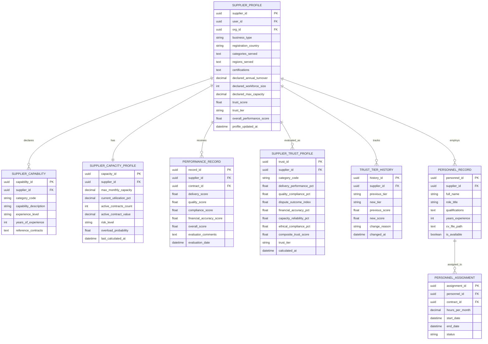

# ENTITY RELATIONSHIP DIAGRAM
## Procurement Intelligence & Governance Platform

**Version:** 1.0
**Date:** February 18, 2026

---

## Overview

This document contains the complete ERD for the procurement system, organized into domain-level diagrams for readability, followed by a master relationship map.

---

## 1. Core Identity & Access Domain (Logics 1, 2, 37)


---

## 2. Procurement Design & Tender Domain (Logics 3, 4, 24, 36)


---

## 3. Supplier Profile & Discovery Domain (Logics 5, 15, 22, 25)



---

## 4. Bidding & Evaluation Domain (Logics 6, 7, 8, 9, 17, 26)


---

## 5. Award, Contract & Budget Domain (Logics 10, 11, 12, 13, 16)


---

## 6. Post-Award & Financial Domain (Logics 19, 20)


---

## 7. Risk, Anti-Collusion & Governance Domain (Logics 23, 27, 29)


---

## 8. Audit & Intelligence Domain (Logics 14, 28, 31)


---

## 9. Integration Domain (Logics 35, 40)


---

## 10. Master Relationship Map


---

## Entity Count Summary

| Domain | Entity Count | Key Entities |
|---|---|---|
| Identity & Access | 9 | User, Organization, Role, Permission, Trust Tier |
| Procurement Design | 8 | Tender, Tender Item, Evaluation Criteria, Design Analysis, Category |
| Supplier Profile | 7 | Supplier Profile, Capability, Capacity, Performance, Trust, Personnel |
| Bidding & Evaluation | 10 | Bid, Bid Item, Evaluation Score, Consensus, Ranking, Price Benchmark, Sample |
| Award & Contract | 7 | Award Decision, Contract, Milestone, Approval, Budget, Signature, Feasibility |
| Post-Award Financial | 6 | Invoice, Line Item, Goods Receipt, Dispute, Evidence, Appeal |
| Risk & Governance | 7 | Risk Forecast, Collusion Analysis, Violation, Enforcement, Appeal, Reinstatement |
| Audit & Intelligence | 5 | Audit Trail, Market Intelligence, Learning Model, Recommendation, Liquidity |
| Integration | 4 | ERP Integration, Sync Record, Module Registry, Notification |
| **TOTAL** | **63** | |

---

## 11. UNIFIED ERD — Complete System (All 63 Entities)

> This single diagram merges every entity and every cross-domain relationship into one unified view.

```mermaid
erDiagram
    %% ═══════════════════════════════════════════
    %% DOMAIN 1 — IDENTITY & ACCESS
    %% ═══════════════════════════════════════════

    USER {
        uuid user_id PK
        string legal_name
        string email
        string phone
        string user_type
        string verification_status
        string trust_tier
        float risk_score
        datetime created_at
        boolean is_active
    }

    ORGANIZATION {
        uuid org_id PK
        string org_name
        string org_type
        string registration_number
        string tax_id
        string country
        string verification_status
    }

    VERIFICATION_DOCUMENT {
        uuid document_id PK
        uuid user_id FK
        string document_type
        string file_path
        string status
        datetime expiry_date
    }

    ROLE {
        uuid role_id PK
        string role_name
        string role_scope
        uuid org_id FK
    }

    PERMISSION {
        uuid permission_id PK
        string permission_name
        string resource_type
        string action
    }

    ROLE_PERMISSION {
        uuid role_id FK
        uuid permission_id FK
    }

    USER_ROLE {
        uuid user_id FK
        uuid role_id FK
        uuid org_id FK
        datetime assigned_at
        datetime expires_at
    }

    TRUST_TIER_RECORD {
        uuid record_id PK
        uuid user_id FK
        string previous_tier
        string new_tier
        datetime changed_at
    }

    CONFLICT_OF_INTEREST {
        uuid coi_id PK
        uuid user_id FK
        uuid tender_id FK
        string declaration_type
        string status
    }

    %% ═══════════════════════════════════════════
    %% DOMAIN 2 — PROCUREMENT DESIGN & TENDER
    %% ═══════════════════════════════════════════

    CATEGORY_TAXONOMY {
        uuid category_id PK
        string category_code
        string category_name
        uuid parent_category_id FK
        int level
    }

    TENDER {
        uuid tender_id PK
        uuid org_id FK
        uuid created_by FK
        uuid budget_id FK
        string tender_reference
        string title
        string procurement_type
        string visibility_model
        string status
        string category_code
        decimal estimated_value
        string currency
        string evaluation_method
        datetime submission_deadline
    }

    TENDER_ITEM {
        uuid item_id PK
        uuid tender_id FK
        string item_description
        string unit_of_measure
        decimal quantity
        decimal estimated_unit_price
        int lot_number
    }

    TENDER_DOCUMENT {
        uuid doc_id PK
        uuid tender_id FK
        string document_type
        string file_path
        string file_hash
        int version_number
    }

    EVALUATION_CRITERIA {
        uuid criteria_id PK
        uuid tender_id FK
        string criteria_name
        string criteria_type
        decimal weight_percentage
        boolean is_mandatory
    }

    TENDER_AMENDMENT {
        uuid amendment_id PK
        uuid tender_id FK
        int amendment_number
        text change_description
        boolean deadline_extended
    }

    CLARIFICATION {
        uuid clarification_id PK
        uuid tender_id FK
        uuid asked_by FK
        text question
        text answer
        boolean is_published
    }

    TENDER_DESIGN_ANALYSIS {
        uuid analysis_id PK
        uuid tender_id FK
        float vagueness_index
        float bias_probability
        float exclusion_risk
        float overall_risk_score
        string risk_level
    }

    %% ═══════════════════════════════════════════
    %% DOMAIN 3 — SUPPLIER PROFILE & DISCOVERY
    %% ═══════════════════════════════════════════

    SUPPLIER_PROFILE {
        uuid supplier_id PK
        uuid user_id FK
        uuid org_id FK
        string business_type
        string registration_country
        float trust_score
        string trust_tier
        float overall_performance_score
    }

    SUPPLIER_CAPABILITY {
        uuid capability_id PK
        uuid supplier_id FK
        string category_code
        string experience_level
        int years_of_experience
    }

    SUPPLIER_CAPACITY_PROFILE {
        uuid capacity_id PK
        uuid supplier_id FK
        decimal max_monthly_capacity
        decimal current_utilization_pct
        int active_contracts_count
        string risk_level
    }

    PERFORMANCE_RECORD {
        uuid record_id PK
        uuid supplier_id FK
        uuid contract_id FK
        float delivery_score
        float quality_score
        float compliance_score
        float overall_score
    }

    SUPPLIER_TRUST_PROFILE {
        uuid trust_id PK
        uuid supplier_id FK
        string category_code
        float composite_trust_score
        string trust_tier
        datetime calculated_at
    }

    TRUST_TIER_HISTORY {
        uuid history_id PK
        uuid supplier_id FK
        string previous_tier
        string new_tier
        float new_score
        datetime changed_at
    }

    PERSONNEL_RECORD {
        uuid personnel_id PK
        uuid supplier_id FK
        string full_name
        string role_title
        int years_experience
        boolean is_available
    }

    PERSONNEL_ASSIGNMENT {
        uuid assignment_id PK
        uuid personnel_id FK
        uuid contract_id FK
        decimal hours_per_month
        datetime start_date
        datetime end_date
    }

    %% ═══════════════════════════════════════════
    %% DOMAIN 4 — BIDDING & EVALUATION
    %% ═══════════════════════════════════════════

    BID {
        uuid bid_id PK
        uuid tender_id FK
        uuid supplier_id FK
        string bid_reference
        string bid_type
        string status
        decimal total_bid_price
        string currency
        string technical_envelope_hash
        string financial_envelope_hash
        boolean is_locked
        datetime submitted_at
    }

    BID_ITEM {
        uuid bid_item_id PK
        uuid bid_id FK
        uuid tender_item_id FK
        decimal unit_price
        decimal quantity
        decimal total_price
    }

    BID_DOCUMENT {
        uuid doc_id PK
        uuid bid_id FK
        string document_type
        string envelope_type
        string file_hash
    }

    BID_VALIDATION {
        uuid validation_id PK
        uuid bid_id FK
        string validation_type
        string result
        text details
    }

    BID_OPENING_RECORD {
        uuid opening_id PK
        uuid tender_id FK
        string envelope_type
        datetime opened_at
        int bids_opened_count
        text hash_verification_results
    }

    EVALUATION_SCORE {
        uuid score_id PK
        uuid bid_id FK
        uuid criteria_id FK
        uuid evaluator_id FK
        decimal raw_score
        decimal weighted_score
        text justification
        boolean is_locked
    }

    EVALUATION_CONSENSUS {
        uuid consensus_id PK
        uuid tender_id FK
        uuid bid_id FK
        uuid criteria_id FK
        decimal final_score
        text moderation_notes
    }

    BID_RANKING {
        uuid ranking_id PK
        uuid tender_id FK
        uuid bid_id FK
        int rank_position
        decimal total_weighted_score
        decimal technical_score
        decimal financial_score
        string qualification_status
    }

    PRICE_BENCHMARK {
        uuid benchmark_id PK
        uuid tender_id FK
        uuid bid_id FK
        decimal raw_price
        decimal market_median_price
        decimal normalized_price
        float price_risk_score
        string outlier_flag
    }

    SAMPLE_SUBMISSION {
        uuid sample_id PK
        uuid tender_id FK
        uuid supplier_id FK
        string sample_type
        string status
        datetime submitted_at
    }

    SAMPLE_EVALUATION {
        uuid eval_id PK
        uuid sample_id FK
        uuid evaluator_id FK
        decimal score
        boolean blind_evaluation
    }

    %% ═══════════════════════════════════════════
    %% DOMAIN 5 — AWARD, CONTRACT & BUDGET
    %% ═══════════════════════════════════════════

    AWARD_DECISION {
        uuid award_id PK
        uuid tender_id FK
        uuid winning_bid_id FK
        uuid supplier_id FK
        string decision_status
        text justification
        datetime standstill_end_date
        boolean is_challenged
    }

    CONTRACT {
        uuid contract_id PK
        uuid award_id FK
        uuid tender_id FK
        uuid supplier_id FK
        uuid buyer_org_id FK
        string contract_reference
        string status
        decimal contract_value
        string currency
        datetime start_date
        datetime end_date
        datetime signed_at
    }

    CONTRACT_MILESTONE {
        uuid milestone_id PK
        uuid contract_id FK
        string milestone_name
        datetime due_date
        datetime completed_date
        string status
        decimal deliverable_value
    }

    APPROVAL_WORKFLOW {
        uuid workflow_id PK
        uuid reference_id FK
        string reference_type
        string workflow_type
        string status
    }

    APPROVAL_STEP {
        uuid step_id PK
        uuid workflow_id FK
        int step_order
        uuid approver_id FK
        string step_type
        string status
        text comments
        datetime decided_at
    }

    DELEGATION_RECORD {
        uuid delegation_id PK
        uuid delegator_id FK
        uuid delegate_id FK
        string authority_type
        decimal max_value_limit
        datetime valid_from
        datetime valid_until
    }

    BUDGET {
        uuid budget_id PK
        uuid org_id FK
        string budget_code
        string fiscal_year
        decimal allocated_amount
        decimal committed_amount
        decimal spent_amount
        decimal available_amount
        string currency
    }

    BUDGET_TRANSACTION {
        uuid transaction_id PK
        uuid budget_id FK
        uuid reference_id FK
        string transaction_type
        decimal amount
        decimal balance_after
        datetime transaction_date
    }

    DIGITAL_SIGNATURE {
        uuid signature_id PK
        uuid document_id FK
        uuid signer_id FK
        string signature_type
        string certificate_id
        string document_hash
        datetime signed_at
        string verification_status
    }

    DELIVERY_FEASIBILITY {
        uuid feasibility_id PK
        uuid bid_id FK
        uuid tender_id FK
        float overall_feasibility_score
        string risk_classification
    }

    %% ═══════════════════════════════════════════
    %% DOMAIN 6 — POST-AWARD & FINANCIAL
    %% ═══════════════════════════════════════════

    INVOICE {
        uuid invoice_id PK
        uuid contract_id FK
        uuid supplier_id FK
        string invoice_number
        decimal total_amount
        string currency
        string status
        string three_way_match_status
        boolean duplicate_flag
        boolean overbilling_flag
    }

    INVOICE_LINE_ITEM {
        uuid line_id PK
        uuid invoice_id FK
        uuid contract_milestone_id FK
        string description
        decimal quantity
        decimal unit_price
        decimal line_total
    }

    GOODS_RECEIPT {
        uuid receipt_id PK
        uuid contract_id FK
        uuid milestone_id FK
        string receipt_reference
        datetime received_date
        decimal quantity_received
        string quality_status
    }

    DISPUTE {
        uuid dispute_id PK
        uuid contract_id FK
        uuid raised_by FK
        string dispute_type
        string severity_level
        string status
        string resolution_method
        boolean penalty_applied
    }

    DISPUTE_EVIDENCE {
        uuid evidence_id PK
        uuid dispute_id FK
        uuid submitted_by FK
        string evidence_type
        string file_path
    }

    DISPUTE_APPEAL {
        uuid appeal_id PK
        uuid dispute_id FK
        uuid appellant_id FK
        text appeal_grounds
        string status
        text decision_outcome
    }

    %% ═══════════════════════════════════════════
    %% DOMAIN 7 — RISK, ANTI-COLLUSION & GOVERNANCE
    %% ═══════════════════════════════════════════

    RISK_FORECAST {
        uuid forecast_id PK
        uuid tender_id FK
        uuid bid_id FK
        uuid supplier_id FK
        float total_risk_score
        string risk_classification
        text primary_risk_drivers
        text mitigation_suggestions
    }

    COLLUSION_ANALYSIS {
        uuid analysis_id PK
        uuid tender_id FK
        float composite_collusion_index
        string risk_level
        text flagged_supplier_pairs
    }

    COMPLIANCE_REVIEW {
        uuid review_id PK
        uuid collusion_analysis_id FK
        uuid reviewer_id FK
        string review_status
        text findings
    }

    VIOLATION_RECORD {
        uuid violation_id PK
        uuid user_id FK
        uuid org_id FK
        string violation_level
        string violation_type
        text description
        string detection_method
    }

    ENFORCEMENT_ACTION {
        uuid action_id PK
        uuid violation_id FK
        string action_type
        text justification
        datetime effective_from
        datetime effective_until
        string status
    }

    APPEAL_RECORD {
        uuid appeal_id PK
        uuid enforcement_action_id FK
        uuid appellant_id FK
        text appeal_grounds
        string status
    }

    REINSTATEMENT_RECORD {
        uuid reinstatement_id PK
        uuid enforcement_action_id FK
        uuid user_id FK
        text conditions
        string probation_status
    }

    %% ═══════════════════════════════════════════
    %% DOMAIN 8 — AUDIT & INTELLIGENCE
    %% ═══════════════════════════════════════════

    AUDIT_TRAIL {
        uuid audit_id PK
        uuid user_id FK
        string action_type
        string resource_type
        uuid resource_id
        text previous_state
        text new_state
        datetime timestamp
        string correlation_id
    }

    MARKET_INTELLIGENCE {
        uuid intelligence_id PK
        string category_code
        string region
        string metric_type
        decimal metric_value
        string time_period
    }

    LEARNING_MODEL {
        uuid model_id PK
        string model_type
        string model_version
        string target_logic
        float accuracy_score
    }

    RECOMMENDATION {
        uuid recommendation_id PK
        uuid model_id FK
        uuid target_user_id FK
        string recommendation_type
        text recommendation_content
        float confidence_score
        boolean was_accepted
    }

    LIQUIDITY_INDEX {
        uuid index_id PK
        string category_code
        string region
        int active_tenders
        int active_suppliers
        float avg_bids_per_tender
        string health_status
    }

    %% ═══════════════════════════════════════════
    %% DOMAIN 9 — INTEGRATION
    %% ═══════════════════════════════════════════

    ERP_INTEGRATION {
        uuid integration_id PK
        uuid org_id FK
        string erp_system_type
        string api_endpoint
        string sync_status
        boolean is_active
    }

    SYNC_RECORD {
        uuid sync_id PK
        uuid integration_id FK
        string sync_direction
        string entity_type
        uuid entity_id
        string sync_status
    }

    MODULE_REGISTRY {
        uuid module_id PK
        string module_name
        string module_type
        string version
        string status
        boolean is_core
    }

    NOTIFICATION {
        uuid notification_id PK
        uuid user_id FK
        string notification_type
        string channel
        string subject
        text message
        string status
    }

    %% ═══════════════════════════════════════════════════════
    %% ALL RELATIONSHIPS (Cross-Domain)
    %% ═══════════════════════════════════════════════════════

    %% --- Identity & Access ---
    USER ||--o{ VERIFICATION_DOCUMENT : "submits"
    USER ||--o{ USER_ROLE : "has"
    USER ||--o{ TRUST_TIER_RECORD : "progresses"
    USER ||--o{ CONFLICT_OF_INTEREST : "declares"
    USER ||--o{ AUDIT_TRAIL : "generates"
    USER ||--o{ NOTIFICATION : "receives"
    USER ||--o{ RECOMMENDATION : "targeted_by"
    ROLE ||--o{ USER_ROLE : "assigned_via"
    ROLE ||--o{ ROLE_PERMISSION : "grants"
    PERMISSION ||--o{ ROLE_PERMISSION : "included_in"
    ORGANIZATION ||--o{ USER_ROLE : "scopes"
    ORGANIZATION ||--o{ ROLE : "defines"

    %% --- Procurement Design ---
    USER ||--o{ TENDER : "creates"
    ORGANIZATION ||--o{ TENDER : "publishes"
    TENDER }o--|| CATEGORY_TAXONOMY : "classified_under"
    CATEGORY_TAXONOMY ||--o{ CATEGORY_TAXONOMY : "has_children"
    TENDER ||--o{ TENDER_ITEM : "contains"
    TENDER ||--o{ TENDER_DOCUMENT : "includes"
    TENDER ||--o{ EVALUATION_CRITERIA : "defines"
    TENDER ||--o{ TENDER_AMENDMENT : "amends"
    TENDER ||--o{ CLARIFICATION : "receives"
    TENDER ||--|| TENDER_DESIGN_ANALYSIS : "analyzed_by"

    %% --- Supplier ---
    USER ||--|| SUPPLIER_PROFILE : "has_profile"
    SUPPLIER_PROFILE ||--o{ SUPPLIER_CAPABILITY : "declares"
    SUPPLIER_PROFILE ||--|| SUPPLIER_CAPACITY_PROFILE : "capacity_tracked"
    SUPPLIER_PROFILE ||--o{ SUPPLIER_TRUST_PROFILE : "trust_scored"
    SUPPLIER_PROFILE ||--o{ TRUST_TIER_HISTORY : "tier_tracked"
    SUPPLIER_PROFILE ||--o{ PERSONNEL_RECORD : "employs"
    SUPPLIER_PROFILE ||--o{ PERFORMANCE_RECORD : "evaluated_in"

    %% --- Bidding & Evaluation ---
    TENDER ||--o{ BID : "receives_bids"
    SUPPLIER_PROFILE ||--o{ BID : "submits_bid"
    BID ||--o{ BID_ITEM : "contains_items"
    BID ||--o{ BID_DOCUMENT : "has_documents"
    BID ||--o{ BID_VALIDATION : "validated_by"
    TENDER ||--|| BID_OPENING_RECORD : "opened_via"
    BID ||--o{ EVALUATION_SCORE : "scored_in"
    BID ||--o{ EVALUATION_CONSENSUS : "consensus_for"
    BID ||--|| BID_RANKING : "ranked_as"
    BID ||--o| PRICE_BENCHMARK : "benchmarked"
    BID ||--o| DELIVERY_FEASIBILITY : "feasibility_checked"
    TENDER ||--o{ SAMPLE_SUBMISSION : "requires_samples"
    SUPPLIER_PROFILE ||--o{ SAMPLE_SUBMISSION : "submits_samples"
    SAMPLE_SUBMISSION ||--o{ SAMPLE_EVALUATION : "evaluated_via"

    %% --- Award & Contract ---
    TENDER ||--|| AWARD_DECISION : "results_in_award"
    AWARD_DECISION ||--|| CONTRACT : "creates_contract"
    ORGANIZATION ||--o{ CONTRACT : "buyer_of"
    SUPPLIER_PROFILE ||--o{ CONTRACT : "awarded_to"
    CONTRACT ||--o{ CONTRACT_MILESTONE : "tracked_by"
    CONTRACT ||--o{ DIGITAL_SIGNATURE : "signed_with"
    PERSONNEL_RECORD ||--o{ PERSONNEL_ASSIGNMENT : "assigned_to"

    %% --- Approval & Budget ---
    ORGANIZATION ||--o{ BUDGET : "allocates"
    BUDGET ||--o{ BUDGET_TRANSACTION : "records"
    BUDGET ||--o{ TENDER : "funds"
    APPROVAL_WORKFLOW ||--o{ APPROVAL_STEP : "routes_through"
    USER ||--o{ APPROVAL_STEP : "approves"
    USER ||--o{ DELEGATION_RECORD : "delegates"

    %% --- Post-Award ---
    CONTRACT ||--o{ INVOICE : "billed_under"
    SUPPLIER_PROFILE ||--o{ INVOICE : "issues"
    INVOICE ||--o{ INVOICE_LINE_ITEM : "contains_lines"
    CONTRACT ||--o{ GOODS_RECEIPT : "received_under"
    CONTRACT ||--o{ DISPUTE : "triggers"
    CONTRACT ||--o{ PERFORMANCE_RECORD : "evaluated_via"
    DISPUTE ||--o{ DISPUTE_EVIDENCE : "supported_by"
    DISPUTE ||--o| DISPUTE_APPEAL : "appealed_via"
    USER ||--o{ DISPUTE : "raises"

    %% --- Risk & Governance ---
    TENDER ||--o{ RISK_FORECAST : "risk_forecasted"
    BID ||--o| RISK_FORECAST : "risk_assessed"
    TENDER ||--o{ COLLUSION_ANALYSIS : "collusion_checked"
    COLLUSION_ANALYSIS ||--o| COMPLIANCE_REVIEW : "reviewed_in"
    USER ||--o{ VIOLATION_RECORD : "violates"
    VIOLATION_RECORD ||--o{ ENFORCEMENT_ACTION : "enforced_via"
    ENFORCEMENT_ACTION ||--o| APPEAL_RECORD : "appealed_via"
    ENFORCEMENT_ACTION ||--o| REINSTATEMENT_RECORD : "reinstated_via"

    %% --- Intelligence & Learning ---
    LEARNING_MODEL ||--o{ RECOMMENDATION : "generates"

    %% --- Integration ---
    ORGANIZATION ||--o{ ERP_INTEGRATION : "configures"
    ERP_INTEGRATION ||--o{ SYNC_RECORD : "produces"
```

---

**END OF DOCUMENT**
