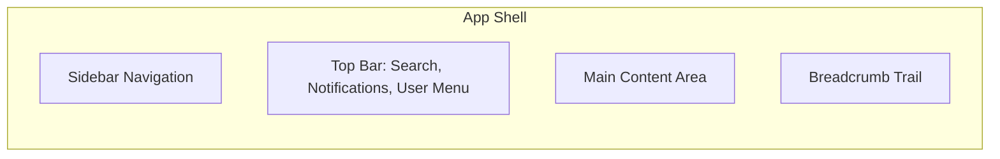
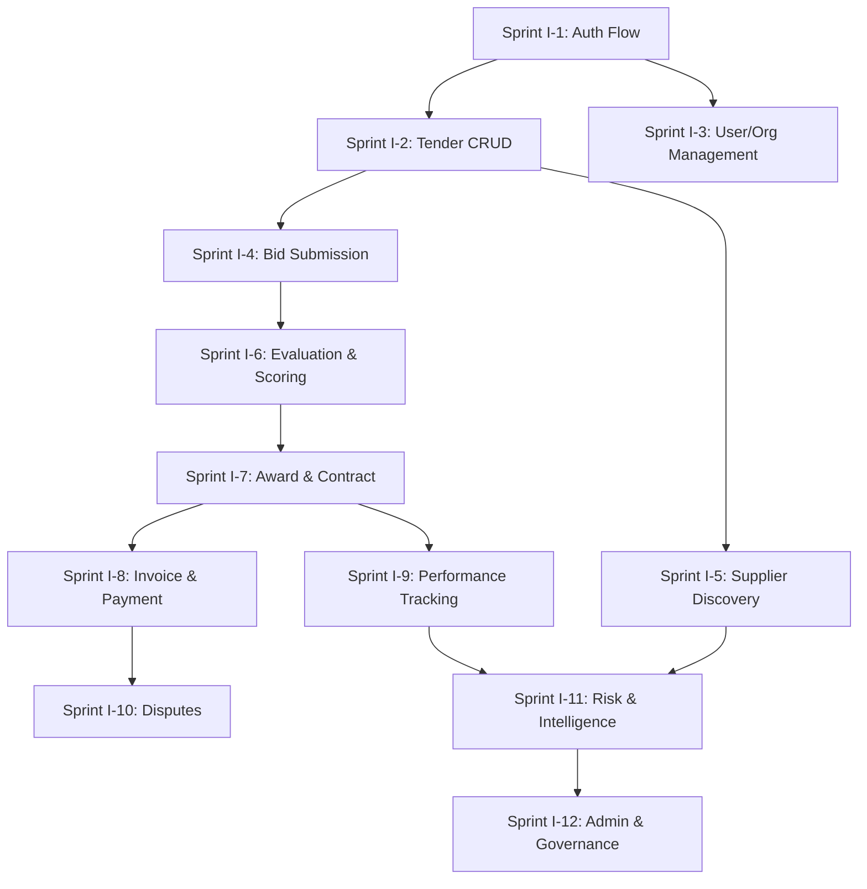
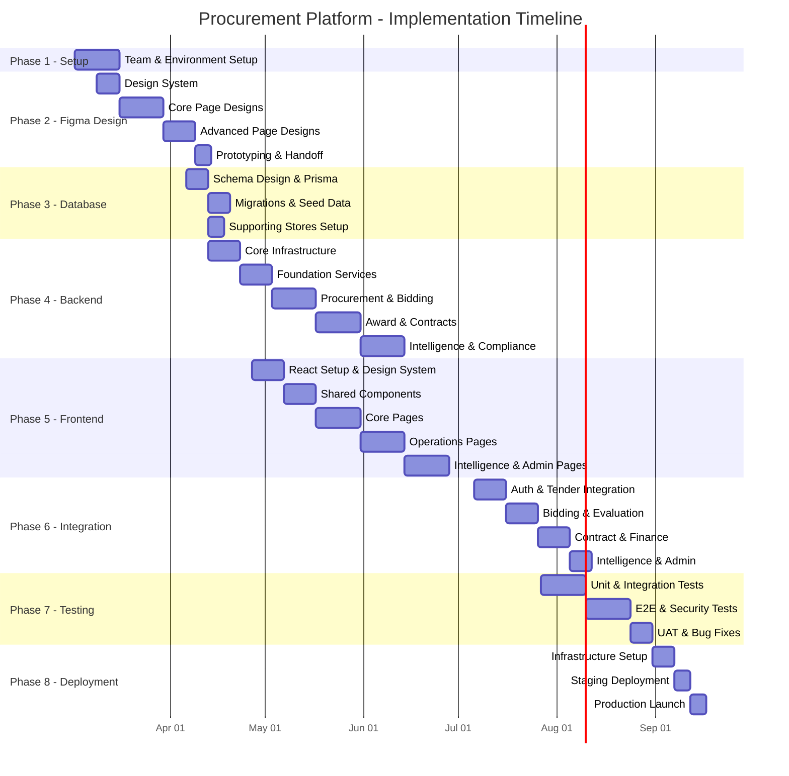

# FULL SYSTEM IMPLEMENTATION PROCESS FLOW
## Procurement Intelligence & Governance Platform

**Version:** 1.0  
**Date:** February 25, 2026

---

# TABLE OF CONTENTS

| # | Phase | Duration Est. |
|---|---|---|
| 1 | Project Setup & Planning | Week 1–2 |
| 2 | Figma UI/UX Design | Week 2–6 |
| 3 | Database Design & Setup | Week 5–7 |
| 4 | Backend Development | Week 6–16 |
| 5 | Frontend Development | Week 8–18 |
| 6 | Integration & API Wiring | Week 16–20 |
| 7 | Testing & QA | Week 18–22 |
| 8 | Deployment & Launch | Week 22–24 |

> [!NOTE]
> Phases overlap intentionally. Backend and Frontend teams work in parallel after database schema stabilizes. Total estimated timeline: **~24 weeks (6 months)** for MVP.

---

# PHASE 1: PROJECT SETUP & PLANNING (Week 1–2)

## Step 1.1 — Team Assembly & Role Assignment

| Role | Responsibility | Count |
|---|---|---|
| Project Manager | Sprint planning, timeline, stakeholder sync | 1 |
| UI/UX Designer | Figma design, prototyping, design system | 1–2 |
| Backend Engineer | Node.js/Express APIs, business logic | 2–3 |
| Frontend Engineer | React.js SPA, Redux state, UI components | 2–3 |
| Database Engineer | PostgreSQL schema, Prisma ORM, migrations | 1 |
| ML/AI Engineer | Python ML models, FastAPI microservice | 1 |
| DevOps Engineer | Docker, K8s, CI/CD, monitoring | 1 |
| QA Engineer | Test automation, E2E testing, UAT | 1 |

## Step 1.2 — Environment Setup

```
1. Initialize Git repository (monorepo or multi-repo)
2. Set up project structure:
   procurement-platform/
   ├── client/          → React frontend
   ├── server/          → Node.js backend
   ├── ml-service/      → Python ML microservice
   ├── prisma/          → Database schema & migrations
   ├── docker/          → Dockerfiles & docker-compose
   ├── docs/            → Architecture & design docs
   └── .github/         → CI/CD workflows
3. Configure Docker Compose for local development:
   - PostgreSQL 15+
   - Redis 7+
   - Elasticsearch 8+
   - RabbitMQ 3+
4. Set up CI/CD pipeline (GitHub Actions)
5. Configure environment variables (.env files per environment)
```

## Step 1.3 — Tool & Service Setup

| Tool | Purpose | Setup Action |
|---|---|---|
| Figma | UI/UX design | Create project, shared team library |
| GitHub/GitLab | Version control | Repo, branch strategy (GitFlow) |
| Jira / Linear | Project management | Backlog, sprints, epics per module |
| Slack | Communication | Channels: #dev, #design, #devops, #qa |
| Notion / Confluence | Documentation | Architecture docs, API specs, runbooks |
| Figma → Storybook | Design-to-code handoff | Component documentation |

## Step 1.4 — Sprint Planning & Backlog Creation

Break the 40 system logics into **Epics**, then decompose into **User Stories**:

```
Epic Structure (aligned with system layers):
├── Epic 1: Identity, Trust & Access (Logics 1, 2, 37)
├── Epic 2: Procurement Design (Logics 3, 24, 36)
├── Epic 3: Marketplace & Matching (Logics 4, 5, 21, 38)
├── Epic 4: Bidding & Evaluation (Logics 6, 7, 8, 9, 17, 18, 26)
├── Epic 5: Award & Contract (Logics 10, 11, 12, 13, 16)
├── Epic 6: Post-Award & Performance (Logics 15, 19, 20, 22, 27)
├── Epic 7: Trust & Lock-In (Logics 25, 32, 33, 34, 39)
├── Epic 8: Market Intelligence & Learning (Logics 28, 30, 31, 35)
├── Epic 9: Compliance & Governance (Logics 14, 23, 29)
└── Epic 10: Ecosystem Expansion (Logic 40)
```

---

# PHASE 2: FIGMA UI/UX DESIGN (Week 2–6)

## Step 2.1 — Design System Foundation

Create a **Figma Design System Library** with:

```
Design System Components:
├── 🎨 Color Palette
│   ├── Primary (brand colors)
│   ├── Secondary (accent)
│   ├── Neutral (grays)
│   ├── Semantic (success, warning, error, info)
│   └── Dark Mode variants
├── 📝 Typography Scale
│   ├── Headings (H1–H6)
│   ├── Body (Regular, Small, Caption)
│   ├── Labels & Badges
│   └── Font: Inter / Roboto
├── 📐 Spacing & Grid System
│   ├── 8px base grid
│   ├── 12-column layout grid
│   └── Breakpoints (mobile, tablet, desktop)
├── 🧩 Base Components
│   ├── Buttons (primary, secondary, ghost, danger)
│   ├── Input fields (text, number, date, select, textarea)
│   ├── Checkboxes, Radio buttons, Toggles
│   ├── Cards, Modals, Drawers
│   ├── Tables (sortable, filterable, paginated)
│   ├── Tabs, Accordions, Stepper
│   ├── Tags, Badges, Status indicators
│   ├── Breadcrumbs, Pagination
│   ├── Avatar, User chips
│   └── Loading states, Skeletons, Empty states
└── 📊 Data Visualization
    ├── Charts (bar, line, pie, heatmap, radar)
    ├── KPI cards
    ├── Progress indicators
    └── Timeline components
```

## Step 2.2 — Information Architecture & Navigation

Design the **App Shell** and navigation hierarchy:



**Sidebar Navigation Structure** (role-based visibility):

| Section | Pages | Primary Role |
|---|---|---|
| Dashboard | Buyer / Supplier / Admin / AI Insights | All |
| Procurement | Create, My Tenders, Drafts, Templates | Buyer |
| Bid Management | Submit Bid, My Bids, Bid History | Supplier |
| Evaluations | Score Panel, Rankings, Consensus | Evaluator |
| Contracts | Active, Draft, Archive, Milestones | All |
| Invoices & Payments | Submit, Match, Track, Pay | Both |
| Suppliers | Directory, Performance, Trust Scores | Buyer |
| Risk & Compliance | Forecasts, Collusion, Governance | Admin |
| Market Intelligence | Benchmarks, Trends, Liquidity | All |
| Settings | Profile, Org, Security, Roles, Billing | All |
| Admin Panel | Users, Config, Modules, Health | Super Admin |

## Step 2.3 — Page-by-Page Design (180+ Pages)

Design pages in **priority order** (MVP-critical → Nice-to-have):

### Batch 1 — Core Flows (Week 2–3)
```
Priority 1 (MVP-Critical):
├── Landing Page + Login/Register
├── Buyer Dashboard
├── Supplier Dashboard
├── Create Procurement (multi-step wizard)
├── Tender List + Detail View
├── Submit Bid (form flow)
├── Bid Evaluation Panel
├── Award Decision Page
├── Contract View
├── Invoice Submission + Verification
└── User Profile & Settings
```

### Batch 2 — Operational Pages (Week 3–4)
```
Priority 2 (Core Operations):
├── Supplier Search & Profile View
├── Approval Workflow Interface
├── Budget Allocation Page
├── Contract Milestones & Performance
├── Dispute Raise & Resolution
├── Audit Trail Viewer
├── Notification Center
├── Organization Settings
├── Role & Permission Management
└── Digital Signature Flow
```

### Batch 3 — Intelligence & Advanced (Week 4–5)
```
Priority 3 (Differentiation):
├── Market Intelligence Dashboards
├── Risk Forecasting View
├── Collusion Detection Report
├── Supplier Trust Score Breakdown
├── AI Insights Dashboard
├── Price Benchmark Analysis
├── Supplier Capacity Overview
├── Network Liquidity Dashboard
├── ERP Integration Setup
└── API Token Management
```

### Batch 4 — Admin & Future (Week 5–6)
```
Priority 4 (Platform Management):
├── Admin Dashboard & System Health
├── Tenant Management
├── Feature Flag Management
├── Platform Configuration
├── Governance Rules Setup
├── Public Pages (About, Pricing, Help)
└── Onboarding Wizard Flows
```

## Step 2.4 — Interactive Prototyping

```
For each critical flow, create clickable prototypes in Figma:

1. Buyer Journey:
   Login → Dashboard → Create Tender → Publish → 
   Review Bids → Evaluate → Award → Contract → Invoice → Pay

2. Supplier Journey:
   Register → Verify → Browse Tenders → Submit Bid → 
   Track Status → Receive Award → Deliver → Invoice → Get Paid

3. Admin Journey:
   Login → Dashboard → Manage Users → Configure Rules → 
   Review Risk Alerts → Handle Disputes → View Audit Trail

4. Evaluator Journey:
   Login → Dashboard → Open Evaluation → Score Bids → 
   Consensus Review → Submit Rankings → Approve Award
```

## Step 2.5 — Design Review & Handoff

```
1. Internal design review with the team
2. Stakeholder presentation for feedback
3. Iterate on feedback (1–2 rounds)
4. Mark designs as "Ready for Dev" in Figma
5. Generate Figma Dev Mode specs:
   - CSS values, spacing, colors
   - Component properties
   - Asset exports (SVG icons, illustrations)
6. Create a component mapping document:
   Figma Component → React Component → Props
```

---

# PHASE 3: DATABASE DESIGN & SETUP (Week 5–7)

## Step 3.1 — Schema Design (from your ERD)

Implement schemas based on your existing [Unified ERD Diagram](file:///c:/Users/ADMIN/Downloads/proc%20system/Unified%20ERD%20Diagram.md):

```
PostgreSQL Schemas:
├── identity     → users, organizations, roles, permissions, trust_tiers
├── procurement  → tenders, items, documents, criteria, amendments
├── supplier     → profiles, capabilities, capacity, performance, trust
├── bidding      → bids, items, documents, validations, scores, rankings
├── contract     → awards, contracts, milestones, approvals, budgets, signatures
├── financial    → invoices, line_items, receipts, disputes, evidence
├── compliance   → audit_trails, risk_forecasts, collusion, violations
├── intelligence → market_data, learning_models, recommendations, liquidity
└── integration  → erp_configs, sync_records, modules, notifications
```

## Step 3.2 — Prisma Schema & Migrations

```
Process Flow:
1. Define Prisma schema (prisma/schema.prisma)
   - Map all 68+ tables from ERD
   - Define relationships (1:1, 1:N, M:N)
   - Add indexes for performance
   - Add enums for status fields
   
2. Generate initial migration:
   npx prisma migrate dev --name init
   
3. Seed database with reference data:
   - Category taxonomy codes
   - Default roles & permissions
   - Trust tier definitions
   - Violation level definitions
   - Country/currency reference data
   
4. Create migration scripts for:
   - Schema changes during development
   - Data transformations
   - Index optimizations
```

## Step 3.3 — Supporting Data Stores Setup

```
Redis Configuration:
├── Session store (JWT blacklist, active sessions)
├── Rate limiting counters
├── Cached supplier profiles (TTL: 5 min)
├── Tender deadline timers
└── Real-time event pub/sub

Elasticsearch Index Setup:
├── tenders-index (full-text search on title, description, specs)
├── suppliers-index (search by name, capability, region)
├── audit-index (action logs, searchable by user/action/date)
└── market-index (price benchmarks, trends)

S3 / Object Storage:
├── /tender-documents/
├── /bid-envelopes/ (encrypted)
├── /contracts/ (signed PDFs)
├── /invoices/
├── /verification-documents/
├── /sample-photos/
└── /cv-files/
```

## Step 3.4 — Database Security & Performance

```
Security:
├── Enable row-level security (RLS) for multi-tenancy
├── Encrypt sensitive columns (PII, financial data)
├── Set up database user roles (app_user, admin, readonly)
├── Enable SSL connections
└── Configure automated backups (daily, 30-day retention)

Performance:
├── Add composite indexes for common queries
├── Set up read replicas for reporting queries
├── Configure connection pooling (PgBouncer)
├── Partition audit_trails by date
└── Set up query performance monitoring
```

---

# PHASE 4: BACKEND DEVELOPMENT (Week 6–16)

## Step 4.1 — Project Initialization

```bash
cd server/
npm init -y
npm install express cors helmet morgan compression
npm install jsonwebtoken bcryptjs
npm install @prisma/client
npm install ioredis bull
npm install socket.io
npm install multer aws-sdk
npm install joi zod
npm install nodemailer
npm install winston
npm install dotenv
```

## Step 4.2 — Core Infrastructure (Week 6–7)

Build the foundational middleware stack:

```
server/src/
├── config/
│   ├── database.js       → Prisma client singleton
│   ├── redis.js           → Redis connection
│   ├── elasticsearch.js   → ES client
│   ├── s3.js              → AWS S3 client
│   └── queue.js           → Bull queue setup
├── middleware/
│   ├── auth.js            → JWT verification
│   ├── rbac.js            → Role-permission check
│   ├── audit.js           → Action logging
│   ├── rateLimiter.js     → Redis-based limiting
│   ├── validator.js       → Joi/Zod schema validation
│   └── errorHandler.js    → Global error handler
├── utils/
│   ├── logger.js          → Winston logger
│   ├── encryption.js      → AES-256 helpers
│   ├── hashing.js         → SHA-256, bcrypt helpers
│   ├── pagination.js      → Paginated response helper
│   └── apiResponse.js     → Standardized response format
└── app.js                 → Express app configuration
```

## Step 4.3 — Service-by-Service Implementation (Week 7–15)

Build services in **dependency order**:

### Sprint 1 (Week 7–8): Foundation Services
```
Build Order:
1. IdentityService (Logic 1)
   └── POST /api/v1/auth/register
   └── POST /api/v1/auth/login
   └── POST /api/v1/auth/mfa/verify
   └── POST /api/v1/auth/refresh
   └── POST /api/v1/auth/logout
   └── GET  /api/v1/users/me
   └── PUT  /api/v1/users/verify

2. AccessControlService (Logic 2)
   └── Role CRUD
   └── Permission assignment
   └── SoD enforcement
   └── Conflict of interest declaration

3. OrganizationService
   └── Organization CRUD
   └── Member management
   └── Role assignment per org
```

### Sprint 2 (Week 8–10): Procurement Core
```
Build Order:
4. TenderService (Logic 3, 4)
   └── Procurement need creation (wizard-style)
   └── Specification builder
   └── Evaluation criteria setup
   └── Publish with visibility controls
   └── Amendment & clarification

5. TenderDesignService (Logic 24)
   └── Bias detection analysis
   └── Vagueness detection
   └── Design risk scoring

6. SupplierService (Logic 5)
   └── Supplier profile CRUD
   └── Capability registration
   └── Discovery & matching engine
   └── Supplier search (Elasticsearch)
```

### Sprint 3 (Week 10–12): Bidding & Evaluation
```
Build Order:
7. BidService (Logic 6, 7)
   └── Bid submission with validation
   └── Bid encryption & hash generation
   └── Time-locked bid opening
   └── Staged disclosure (two-envelope)
   └── Withdrawal & resubmission

8. EvaluationService (Logic 8, 9)
   └── Individual scoring
   └── Score locking
   └── Consensus moderation
   └── Weighted aggregation & ranking
   └── Price benchmarking

9. SampleService (Logic 17)
   └── Sample submission tracking
   └── Blind evaluation forms

10. ServiceProcurementService (Logic 18)
    └── Personnel evaluation
    └── CV review & assignment lock
```

### Sprint 4 (Week 12–14): Award, Contract & Finance
```
Build Order:
11. ApprovalService (Logic 11)
    └── Sequential/parallel approval flows
    └── Delegation management
    └── Escalation rules

12. BudgetService (Logic 12)
    └── Budget allocation & tracking
    └── Spend validation
    └── Budget amendment workflow

13. AwardService (Logic 10)
    └── Award decision enforcement
    └── Tie-breaker logic
    └── Standstill period
    └── Award notification

14. ContractService + SignatureService (Logic 13)
    └── Contract auto-generation from award
    └── Digital signature (SES/AES/QES)
    └── Contract milestone management

15. InvoiceService (Logic 19)
    └── Invoice submission & validation
    └── 3-way matching (PO ↔ Receipt ↔ Invoice)
    └── Fraud detection patterns
    └── Payment tracking

16. DisputeService (Logic 20)
    └── Dispute submission with evidence
    └── Resolution workflow
    └── Appeal mechanism
```

### Sprint 5 (Week 14–16): Intelligence & Compliance
```
Build Order:
17. PerformanceService (Logic 15, 25)
    └── Performance data collection
    └── Trust score calculation
    └── Tier classification

18. RiskService (Logic 27)
    └── Multi-dimensional risk scoring
    └── Risk explanation & mitigation
    └── Scenario simulation

19. CollusionService (Logic 23)
    └── Bid pattern analysis
    └── Collusion risk index
    └── Investigation workflow

20. AuditService (Logic 14)
    └── Immutable audit trail
    └── Forensic reconstruction
    └── Anomaly detection

21. IntelligenceService (Logic 28, 30, 31)
    └── Market data aggregation
    └── Liquidity monitoring
    └── Recommendation engine

22. GovernanceService (Logic 29)
    └── Violation classification
    └── Enforcement process
    └── Appeal & reinstatement

23. IntegrationService (Logic 35, 40)
    └── ERP sync configuration
    └── Webhook management
    └── Module registry
```

## Step 4.4 — Background Workers & Queues

```
Bull Queue Workers:
├── notification.worker.js   → Email, SMS, push notifications
├── evaluation.worker.js     → Async score computation
├── risk.worker.js           → Risk model recalculation
├── audit.worker.js          → Audit trail ES indexing
├── report.worker.js         → PDF report generation
├── deadline.worker.js       → Tender deadline enforcement
├── trust.worker.js          → Trust score recalculation
└── sync.worker.js           → ERP data synchronization
```

## Step 4.5 — ML/AI Microservice (Python)

```python
# ml-service/ (FastAPI)
ml-service/
├── app/
│   ├── main.py              → FastAPI application
│   ├── models/
│   │   ├── risk_model.py    → Risk forecasting (Logic 27)
│   │   ├── collusion.py     → Collusion detection (Logic 23)
│   │   ├── matching.py      → Supplier matching (Logic 5)
│   │   ├── pricing.py       → Price normalization (Logic 26)
│   │   └── recommender.py   → Recommendation engine (Logic 31)
│   ├── routes/
│   │   ├── predict.py       → POST /predict/risk
│   │   ├── detect.py        → POST /detect/collusion
│   │   └── recommend.py     → POST /recommend/suppliers
│   └── utils/
│       ├── preprocessing.py
│       └── model_loader.py
├── notebooks/               → Jupyter notebooks for model training
├── requirements.txt
└── Dockerfile
```

## Step 4.6 — WebSocket Events (Socket.IO)

```javascript
// Real-time event channels:
const events = {
  'tender:published':       'Notify matched suppliers',
  'bid:received':           'Update bid count for buyers',
  'deadline:approaching':   'Countdown alerts (24h, 1h)',
  'approval:requested':     'New approval pending',
  'approval:completed':     'Approval outcome notification',
  'award:decided':          'Award result to all bidders',
  'dispute:update':         'Dispute status change',
  'risk:alert':             'High-risk forecast notification',
  'invoice:status':         'Payment progress update',
  'system:announcement':    'Platform-wide messages'
};
```

---

# PHASE 5: FRONTEND DEVELOPMENT (Week 8–18)

## Step 5.1 — React Project Setup (Week 8)

```bash
cd client/
npx -y create-react-app ./  # or Vite for faster builds
npm install react-router-dom@6
npm install @reduxjs/toolkit react-redux
npm install antd @ant-design/icons    # or Material UI
npm install axios
npm install socket.io-client
npm install recharts
npm install react-i18next i18next
npm install dayjs
npm install react-hook-form zod @hookform/resolvers
```

## Step 5.2 — Design System Implementation (Week 8–9)

Translate Figma design tokens into code:

```
client/src/
├── styles/
│   ├── variables.css        → CSS custom properties (colors, spacing, fonts)
│   ├── global.css           → Reset, base styles, dark mode
│   ├── typography.css       → Font scales, heading styles
│   └── animations.css       → Keyframes, transitions
├── theme/
│   ├── themeConfig.js       → Ant Design / MUI theme overrides
│   └── darkTheme.js         → Dark mode configuration
```

## Step 5.3 — Shared Component Library (Week 9–10)

Build reusable components matching Figma designs:

```
client/src/components/
├── Layout/
│   ├── AppShell.jsx         → Sidebar + Header + Content wrapper
│   ├── Sidebar.jsx          → Role-based navigation
│   ├── Header.jsx           → Search, notifications, user menu
│   └── Breadcrumb.jsx       → Dynamic breadcrumbs
├── DataTable/
│   ├── DataTable.jsx        → Sortable, filterable, paginated table
│   └── TableActions.jsx     → Row action buttons
├── FormBuilder/
│   ├── FormField.jsx        → Dynamic field renderer
│   ├── MultiStepForm.jsx    → Wizard-style form
│   └── FileUploader.jsx     → Drag-drop with progress
├── Charts/
│   ├── BarChart.jsx
│   ├── LineChart.jsx
│   ├── PieChart.jsx
│   └── KPICard.jsx
├── Feedback/
│   ├── StatusBadge.jsx      → Status tags (Draft, Active, Closed)
│   ├── ApprovalWidget.jsx   → Step indicator + action buttons
│   ├── Timeline.jsx         → Audit trail / milestone tracker
│   └── EmptyState.jsx       → No-data placeholders
└── Modals/
    ├── ConfirmModal.jsx
    ├── DetailDrawer.jsx
    └── NotificationPanel.jsx
```

## Step 5.4 — State Management Setup (Week 9)

```
client/src/store/
├── store.js                  → Redux store configuration
├── authSlice.js              → User token, profile, permissions
├── tenderSlice.js            → Tender list, filters, detail
├── bidSlice.js               → Bid draft, submission status
├── evaluationSlice.js        → Scores, rankings, consensus
├── contractSlice.js          → Contract list, milestones
├── invoiceSlice.js           → Invoice list, matching status
├── supplierSlice.js          → Supplier profiles, search results
├── notificationSlice.js      → Real-time alerts, unread count
├── uiSlice.js                → Theme, sidebar state, modals
└── apiMiddleware.js          → Axios interceptors, token refresh
```

## Step 5.5 — API Service Layer (Week 9)

```
client/src/services/
├── apiClient.js              → Axios instance with interceptors
├── authService.js            → Login, register, MFA, refresh
├── tenderService.js          → CRUD, publish, amend
├── bidService.js             → Submit, validate, withdraw
├── evaluationService.js      → Score, lock, consensus
├── contractService.js        → Generate, sign, milestones
├── invoiceService.js         → Submit, match, approve
├── supplierService.js        → Search, profile, performance
├── riskService.js            → Forecast, collusion alerts
├── intelligenceService.js    → Benchmarks, trends, liquidity
├── adminService.js           → Users, config, governance
├── auditService.js           → Trail search, reports
├── budgetService.js          → Allocation, spend tracking
├── disputeService.js         → Raise, evidence, resolve
├── notificationService.js    → Preferences, read status
└── websocketService.js       → Socket.IO event handling
```

## Step 5.6 — Page Implementation (Week 10–17)

Build pages in the **same priority order as Figma**:

### Sprint 1 (Week 10–12): Core User Flows
```
Pages:
├── Auth/
│   ├── LoginPage.jsx
│   ├── RegisterPage.jsx (Buyer/Supplier/Professional)
│   ├── MFAPage.jsx
│   ├── ForgotPasswordPage.jsx
│   └── EmailVerificationPage.jsx
├── Dashboard/
│   ├── BuyerDashboard.jsx
│   ├── SupplierDashboard.jsx
│   └── AdminDashboard.jsx
├── Tenders/
│   ├── CreateTender/ (multi-step wizard)
│   │   ├── Step1_BasicInfo.jsx
│   │   ├── Step2_Specifications.jsx
│   │   ├── Step3_EvalCriteria.jsx
│   │   ├── Step4_Budget.jsx
│   │   ├── Step5_Timeline.jsx
│   │   └── Step6_Review.jsx
│   ├── TenderList.jsx
│   ├── TenderDetail.jsx
│   └── TenderEdit.jsx
├── Bids/
│   ├── SubmitBid.jsx
│   ├── BidList.jsx
│   ├── BidDetail.jsx
│   └── BidHistory.jsx
└── Profile/
    ├── UserProfile.jsx
    └── OrganizationSettings.jsx
```

### Sprint 2 (Week 12–14): Operations
```
Pages:
├── Evaluations/
│   ├── BidOpeningPanel.jsx
│   ├── ScoringInterface.jsx
│   ├── ConsensusReview.jsx
│   ├── RankingView.jsx
│   └── EvaluationSummary.jsx
├── Awards/
│   ├── AwardDecision.jsx
│   └── AwardNotification.jsx
├── Contracts/
│   ├── ContractList.jsx
│   ├── ContractDetail.jsx
│   ├── MilestoneTracker.jsx
│   └── DigitalSignature.jsx
├── Invoices/
│   ├── InvoiceSubmission.jsx
│   ├── InvoiceVerification.jsx
│   └── PaymentStatus.jsx
├── Approvals/
│   ├── ApprovalWorkflow.jsx
│   └── BudgetValidation.jsx
└── Disputes/
    ├── RaiseDispute.jsx
    ├── DisputeThread.jsx
    └── ResolutionSummary.jsx
```

### Sprint 3 (Week 14–16): Intelligence & Risk
```
Pages:
├── Suppliers/
│   ├── SupplierSearch.jsx
│   ├── SupplierProfile.jsx
│   ├── SupplierComparison.jsx
│   ├── TrustScoreBreakdown.jsx
│   └── CapacityOverview.jsx
├── Risk/
│   ├── RiskForecast.jsx
│   ├── CollusionReport.jsx
│   └── GovernanceRules.jsx
├── Intelligence/
│   ├── MarketTrends.jsx
│   ├── PriceBenchmarks.jsx
│   ├── LiquidityDashboard.jsx
│   └── AIInsights.jsx
└── Audit/
    ├── AuditTrailViewer.jsx
    └── AuditReports.jsx
```

### Sprint 4 (Week 16–17): Admin & Public
```
Pages:
├── Admin/
│   ├── TenantManagement.jsx
│   ├── PlatformConfig.jsx
│   ├── FeatureFlags.jsx
│   ├── SystemHealth.jsx
│   └── UserManagement.jsx
├── Settings/
│   ├── SecuritySettings.jsx
│   ├── NotificationPrefs.jsx
│   ├── TeamManagement.jsx
│   ├── BillingPage.jsx
│   └── IntegrationSetup.jsx
└── Public/
    ├── LandingPage.jsx
    ├── FeaturesPage.jsx
    ├── PricingPage.jsx
    ├── HelpCenter.jsx
    └── ContactPage.jsx
```

## Step 5.7 — Routing & Guards

```jsx
// React Router v6 setup with auth & role guards
<Routes>
  {/* Public Routes */}
  <Route path="/" element={<LandingPage />} />
  <Route path="/login" element={<LoginPage />} />
  <Route path="/register/:type" element={<RegisterPage />} />
  
  {/* Protected Routes */}
  <Route element={<AuthGuard />}>
    <Route element={<AppShell />}>
      
      {/* Buyer Routes */}
      <Route element={<RoleGuard roles={['buyer', 'admin']} />}>
        <Route path="/dashboard" element={<BuyerDashboard />} />
        <Route path="/tenders/create" element={<CreateTender />} />
        <Route path="/evaluations/:id" element={<ScoringInterface />} />
      </Route>
      
      {/* Supplier Routes */}
      <Route element={<RoleGuard roles={['supplier']} />}>
        <Route path="/dashboard" element={<SupplierDashboard />} />
        <Route path="/bids/submit/:tenderId" element={<SubmitBid />} />
      </Route>
      
      {/* Common Routes */}
      <Route path="/tenders" element={<TenderList />} />
      <Route path="/tenders/:id" element={<TenderDetail />} />
      <Route path="/contracts" element={<ContractList />} />
      <Route path="/profile" element={<UserProfile />} />
      
      {/* Admin Routes */}
      <Route element={<RoleGuard roles={['admin']} />}>
        <Route path="/admin/*" element={<AdminRoutes />} />
      </Route>
      
    </Route>
  </Route>
</Routes>
```

---

# PHASE 6: INTEGRATION & API WIRING (Week 16–20)

## Step 6.1 — Frontend ↔ Backend Integration

```
Integration Checklist (per module):

For EACH page/feature:
┌─────────────────────────────────────────────────┐
│ 1. Verify API endpoint exists & returns          │
│    expected response format                      │
│ 2. Connect Redux slice → API service call        │
│ 3. Wire React component → Redux dispatch         │
│ 4. Handle loading, error, empty states           │
│ 5. Test end-to-end data flow                     │
│ 6. Add real-time Socket.IO events                │
│ 7. Test with realistic mock data                 │
│ 8. Cross-browser verification                    │
└─────────────────────────────────────────────────┘
```

## Step 6.2 — Integration Order & Dependencies



### Sprint I-1: Authentication Integration
```
Tasks:
├── Login flow (email + password → JWT → dashboard redirect)
├── MFA verification (TOTP code → access token)
├── Token refresh (automatic via Axios interceptor)
├── Logout (token blacklist + localStorage clear)
├── Registration (multi-step → email verification)
├── Protected route enforcement (redirect to login if unauthenticated)
└── Role-based sidebar rendering
```

### Sprint I-2: Tender Integration
```
Tasks:
├── Create tender wizard → POST /api/v1/tenders
├── Tender list with filters → GET /api/v1/tenders?status=&category=
├── Tender detail view → GET /api/v1/tenders/:id
├── Publish tender → PUT /api/v1/tenders/:id/publish
├── Amendment flow → POST /api/v1/tenders/:id/amendments
├── Clarification Q&A → GET/POST /api/v1/tenders/:id/clarifications
├── File upload → POST /api/v1/tenders/:id/documents (S3)
└── Real-time: tender:published event
```

### Sprint I-3 through I-12: (Follow same pattern per module)

## Step 6.3 — Real-Time Integration (Socket.IO)

```
WebSocket Integration Steps:
1. Client connects on login → socket.connect()
2. Server authenticates socket with JWT
3. Join role-based rooms (buyer:orgId, supplier:userId)
4. Subscribe to events per page context
5. Update Redux state on incoming events
6. Display toast notifications
7. Update notification bell count
8. Handle reconnection & missed events
```

## Step 6.4 — File Upload Integration

```
File Upload Flow:
1. Frontend: User selects file → FileUploader component
2. Frontend: Generate file hash (SHA-256) for integrity
3. Frontend: Request pre-signed S3 URL → GET /api/v1/uploads/presign
4. Frontend: Direct upload to S3 with progress tracking
5. Frontend: Send file metadata to backend → POST /api/v1/documents
6. Backend: Store file reference in PostgreSQL
7. Backend: Associate with tender/bid/contract/invoice
8. Backend: Validate file type, size, virus scan
```

## Step 6.5 — Search Integration (Elasticsearch)

```
Search Integration:
1. Backend indexes data on create/update → ES
2. Frontend search bar → GET /api/v1/search?q=&type=tender|supplier
3. ES returns relevant results with highlights
4. Frontend renders search results with type icons
5. Advanced filters (category, date range, status, region)
```

---

# PHASE 7: TESTING & QA (Week 18–22)

## Step 7.1 — Testing Strategy

```
Testing Pyramid:
                    ┌─────────┐
                    │  E2E    │ ← Cypress (critical user flows)
                   ┌┴─────────┴┐
                   │Integration │ ← Supertest (API endpoint tests)
                  ┌┴───────────┴┐
                  │  Unit Tests  │ ← Jest (services, utils, components)
                 ┌┴─────────────┴┐
                 │  Static Analysis│ ← ESLint, TypeScript, Prettier
                └─────────────────┘
```

## Step 7.2 — Backend Testing

```
Test Coverage Targets:
├── Unit Tests (Jest) — 80%+ coverage
│   ├── Service functions (business logic)
│   ├── Middleware (auth, rbac, validation)
│   ├── Utility functions
│   └── Model validators
│
├── Integration Tests (Supertest) — All API endpoints
│   ├── Auth flow (register → verify → login → refresh → logout)
│   ├── CRUD operations per resource
│   ├── Permission enforcement (correct 403s)
│   ├── Validation rejection (correct 400s)
│   ├── Pagination, filtering, sorting
│   └── File upload/download
│
└── Database Tests
    ├── Migration up/down
    ├── Seed data integrity
    ├── Constraint enforcement (FK, unique, check)
    └── Query performance (explain analyze)
```

## Step 7.3 — Frontend Testing

```
Test Coverage:
├── Component Tests (React Testing Library) — All components
│   ├── Render with various props
│   ├── User interaction (click, type, select)
│   ├── Form validation feedback
│   ├── Loading/error/empty states
│   └── Accessibility (a11y) checks
│
├── Redux Tests — All slices
│   ├── Reducer state transitions
│   ├── Async thunk actions
│   ├── Selector outputs
│   └── Error state handling
│
└── E2E Tests (Cypress) — Critical flows
    ├── Buyer complete journey (login → tender → award)
    ├── Supplier bid journey (register → bid → invoice)
    ├── Admin governance (login → config → review)
    ├── Evaluation workflow (open → score → rank → approve)
    └── Dispute lifecycle (raise → evidence → resolution)
```

## Step 7.4 — Security Testing

```
Security Checklist:
├── OWASP Top 10 vulnerability scan
├── SQL injection attempts on all inputs
├── XSS injection in text fields
├── CSRF token validation
├── JWT token tampering / expiry bypass
├── RBAC bypass attempts (direct URL access)
├── Rate limiting verification (brute force protection)
├── File upload security (malicious file types)
├── Sensitive data exposure in API responses
├── CORS misconfiguration testing
└── Dependency vulnerability audit (npm audit)
```

## Step 7.5 — Performance Testing

```
Performance Benchmarks:
├── API response time: < 200ms (p95) for CRUD
├── Search response time: < 500ms (p95)
├── Dashboard load time: < 2s
├── File upload: up to 50MB without timeout
├── Concurrent users: 500+ simultaneous
├── Database query time: < 100ms for indexed queries
└── WebSocket latency: < 100ms event delivery
```

## Step 7.6 — User Acceptance Testing (UAT)

```
UAT Process:
1. Deploy to staging environment
2. Create test accounts (Buyer, Supplier, Evaluator, Admin)
3. Execute test scripts per user journey
4. Stakeholder walkthrough sessions
5. Collect feedback & create bug tickets
6. Fix critical/high bugs → re-test
7. Sign-off from product owner
```

---

# PHASE 8: DEPLOYMENT & LAUNCH (Week 22–24)

## Step 8.1 — Infrastructure Provisioning

```
Cloud Infrastructure (AWS/Azure/GCP):
├── Kubernetes Cluster
│   ├── Namespace: procurement-api (3 API pods)
│   ├── Namespace: procurement-workers (2 worker pods)
│   ├── Namespace: procurement-ws (2 WebSocket pods)
│   └── Namespace: ml-services (2 ML API pods)
├── Managed PostgreSQL (Primary + Read Replica)
├── Managed Redis (ElastiCache)
├── Elasticsearch Service (3-node cluster)
├── S3 Buckets (documents, backups)
├── SQS / RabbitMQ (message queue)
├── CDN (CloudFront for static assets)
├── WAF (DDoS, SQL injection protection)
├── Load Balancer (ALB)
└── SSL Certificate (ACM)
```

## Step 8.2 — CI/CD Pipeline

```yaml
# GitHub Actions Pipeline:
name: Deploy
on:
  push:
    branches: [main, staging]

jobs:
  test:
    - Run unit tests
    - Run integration tests
    - Run linting
    - Security audit (npm audit)
    
  build:
    - Build React production bundle
    - Build Docker images (API, Worker, ML)
    - Push to container registry
    
  deploy-staging:
    - Deploy to staging K8s namespace
    - Run smoke tests
    - Run E2E tests against staging
    
  deploy-production:
    - Manual approval gate
    - Rolling deployment to production
    - Health check verification
    - Rollback on failure
```

## Step 8.3 — Monitoring & Observability

```
Monitoring Stack:
├── Prometheus → Collect metrics (API latency, CPU, memory, queue depth)
├── Grafana → Dashboards (system health, business KPIs)
├── ELK Stack → Centralized logging (structured JSON logs)
├── Sentry → Error tracking with stack traces
├── Uptime Monitor → Endpoint health checks (5-min intervals)
└── AlertManager → PagerDuty/Slack alerts for critical issues
```

## Step 8.4 — Launch Checklist

```
Pre-Launch:
├── [ ] All critical bugs resolved
├── [ ] Security penetration test passed
├── [ ] Performance benchmarks met
├── [ ] Database backups verified (restore tested)
├── [ ] SSL certificates installed & valid
├── [ ] CORS, CSP, HSTS headers configured
├── [ ] Rate limiting active
├── [ ] Error pages (404, 500) designed
├── [ ] API documentation published (Swagger)
├── [ ] Admin accounts created
├── [ ] Seed data loaded (categories, roles, permissions)
├── [ ] Email/SMS service connected & tested
├── [ ] Feature flags configured (MVP features ON)
├── [ ] GDPR/privacy compliance verified
├── [ ] Cookie consent banner active
├── [ ] Analytics tracking configured (if applicable)
└── [ ] Disaster recovery plan documented

Post-Launch:
├── [ ] Monitor error rates for first 48 hours
├── [ ] Monitor API response times
├── [ ] Monitor database performance
├── [ ] Monitor queue processing times
├── [ ] Collect user feedback
├── [ ] Hot-fix process ready
└── [ ] Plan Sprint 1 post-launch improvements
```

---

# PHASE OVERVIEW: VISUAL TIMELINE



---

# KEY DELIVERABLES PER PHASE

| Phase | Key Deliverables |
|---|---|
| **1. Setup** | Git repo, Docker Compose, CI/CD pipeline, project board, sprint plan |
| **2. Figma** | Design system library, 180+ page designs, interactive prototypes, dev handoff specs |
| **3. Database** | Prisma schema (68+ tables), migrations, seed data, Redis/ES/S3 configs |
| **4. Backend** | 18+ route modules, 22+ service classes, 8+ queue workers, ML microservice, WebSocket server |
| **5. Frontend** | Design system CSS, 30+ shared components, 60+ pages, Redux store, API service layer |
| **6. Integration** | All API endpoints wired, real-time events, file uploads, search, cross-module data flow |
| **7. Testing** | Unit tests (80%+), API tests (all endpoints), E2E tests (critical flows), security audit, performance benchmark |
| **8. Deployment** | K8s cluster, CI/CD pipeline, monitoring dashboards, production instance, launch sign-off |

---

# RISK MITIGATION

| Risk | Impact | Mitigation |
|---|---|---|
| Scope creep from 180+ pages | High | MVP scope with Priority 1 pages only; remaining pages in v1.1+ |
| ML model accuracy at launch | Medium | Start with rule-based logic; switch to ML when data accumulates |
| Database performance with 68+ tables | Medium | Index optimization, read replicas, query caching via Redis |
| Integration complexity (40 logics) | High | Build and integrate one module at a time; contract testing |
| Team capacity for 24-week timeline | High | Prioritize MVP features; defer Priority 3-4 pages |
| Third-party service failures (email, SMS) | Medium | Implement fallback providers; queue-based retry |

---

**END OF DOCUMENT**
