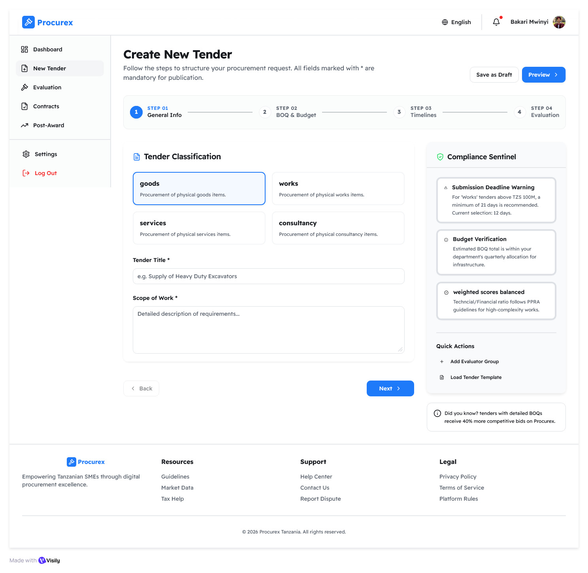
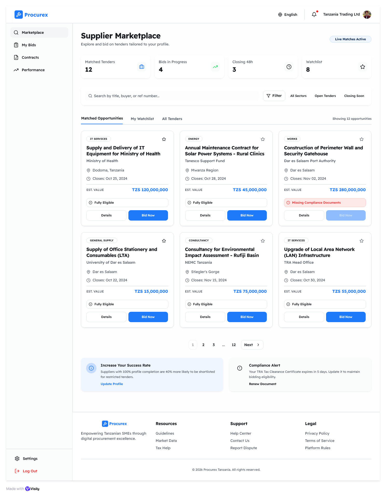
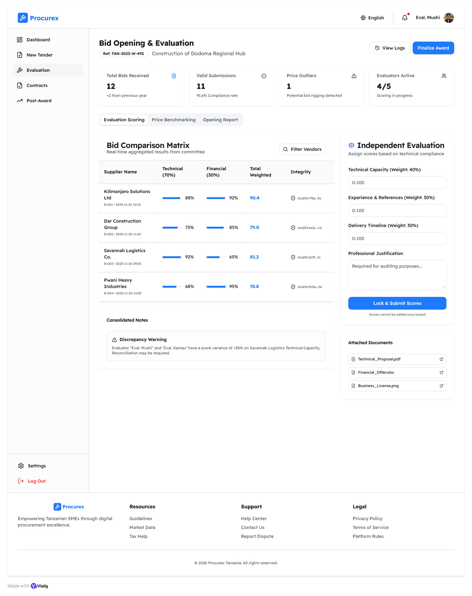
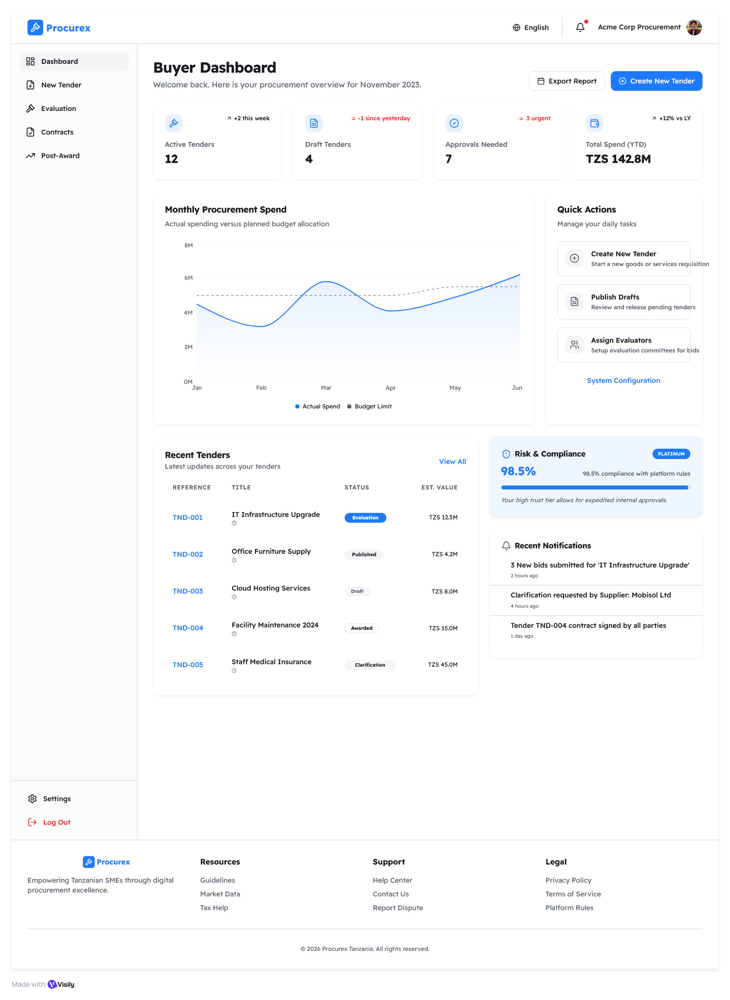
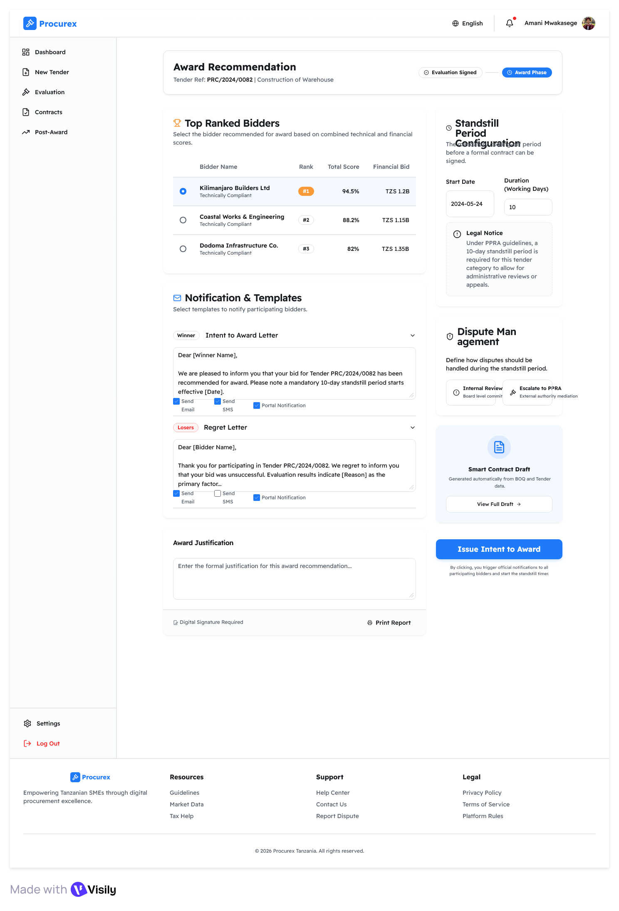
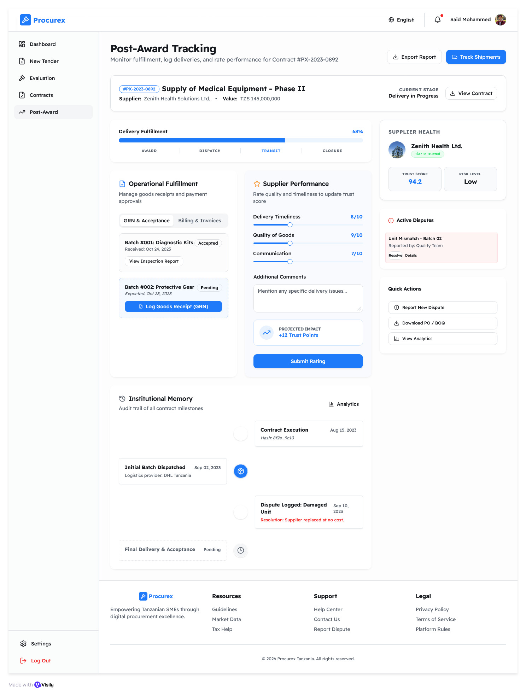

<div align="center">

# ProcureX

### A procurement intelligence platform for Tanzanian buyers, suppliers, evaluators, and administrators.

ProcureX is a static front-end prototype for a modern e-procurement platform. It brings together supplier onboarding, tender creation, marketplace publishing, bid preparation, evaluation, award recommendation, contract negotiation, and post-award tracking in one connected workspace.


</div>

---

## Why ProcureX

Many procurement workflows are fragmented across informal communication, paper documents, isolated supplier records, and manual evaluations. ProcureX is designed as a structured procurement operating system that helps buyers define tenders clearly, suppliers understand opportunities, and evaluators work from transparent criteria.

The current implementation is a browser-based UI prototype that demonstrates the end-to-end experience and the product logic behind the platform.

## Product Highlights

| Area | What ProcureX Provides |
| --- | --- |
| Buyer workspace | Tender planning, procurement type selection, requirements drafting, evaluation setup, review, and marketplace publishing |
| Supplier workspace | Marketplace discovery, tender detail view, bid preparation, and submission workflow |
| Tender creation | Support for Goods, Works, Services, and Consultancy procurement |
| Consultancy TOR | Structured Tanzania-focused TOR workspace with objectives, scope, deliverables, experts, ethics, arrangements, and attachments |
| Evaluation criteria | Buyer-controlled criteria builder with suggested libraries, subcriteria selection, custom criteria, and 100% weight validation |
| System review | Basic tender understanding and grammar/readability evaluation before publishing |
| Marketplace | Public and invited tender visibility with local draft publishing through browser storage |
| Post-award flow | Award recommendation, contract negotiation, records, and post-award tracking screens |

## Visual Preview

| Tender Creation | Marketplace | Evaluation |
| --- | --- | --- |
|  |  |  |

| Buyer Dashboard | Award Recommendation | Post-Award Tracking |
| --- | --- | --- |
|  |  |  |

## Core Workflow

```text
Onboard user
  -> open workspace
  -> create tender
  -> define requirements
  -> configure evaluation criteria
  -> review tender
  -> submit for evaluation
  -> approved tenders publish automatically
  -> receive bids
  -> evaluate
  -> award and manage contract
```

## Create Tender Wizard

The tender wizard is the most developed flow in the current UI.

| Step | Purpose |
| --- | --- |
| 1. Basic Information | Tender title, buyer contact, location, and submission dates |
| 2. Tender Planning | Procurement type, category, method, and invited suppliers |
| 3. Tender Requirements | Type-specific requirements and regulatory licenses |
| 4. Evaluation Criteria & Weights | Suggested criteria library, selected subcriteria, custom criteria, and 100% balancing |
| 5. Review Tender | Complete buyer review of entered data |
| 6. Evaluation | Submit to an evaluator for grammar, formality, and information review; approved tenders publish automatically |

## Consultancy Procurement Support

ProcureX includes a structured consultancy TOR model tailored for Tanzania procurement practice:

- Introduction and background
- Objectives of the consultancy
- Scope of consultancy services
- Duties and responsibilities of parties
- Deliverables and timeline
- Qualifications and experience
- Institutional arrangements
- Attachments and reference documents
- Regulatory license requirements
- Ethics, knowledge transfer, IP, and consultancy contract setup continue in the contract management flow

This makes consultancy tender design more structured than a plain form, while still keeping the buyer fully in control.

## Tech Stack

| Layer | Technology |
| --- | --- |
| UI | HTML, CSS, vanilla JavaScript |
| App model | Single-page application pattern |
| State | Browser `localStorage` and mock data |
| Charts | Chart.js CDN |
| Build step | None |
| Backend | Not included in this prototype |

## Repository Structure

```text
.
|-- procurex-ui/
|   |-- index.html
|   |-- js/
|   |   |-- app.js
|   |   |-- charts.js
|   |   `-- data.js
|   |-- pages/
|   |   |-- create-tender.js
|   |   |-- supplier-marketplace.js
|   |   |-- bid-evaluation.js
|   |   `-- ...
|   `-- styles/
|       |-- main.css
|       |-- components.css
|       |-- pages.css
|       `-- design-system.css
|-- visily/
|   |-- Architecture Design.md
|   |-- Functional Requirements.md
|   |-- ERD Diagram.md
|   |-- User Experience Flowcharts.md
|   |-- visily-create-tender.jpg
|   `-- ...
|-- DESIGN.md
`-- README.md
```

## Run Locally

Because the project is a static front-end prototype, it can run without installing dependencies.

### Option 1: Open the HTML file

Open:

```text
procurex-ui/index.html
```

### Option 2: Use a local server

From the `procurex-ui` folder:

```powershell
python -m http.server 8000
```

Then open:

```text
http://localhost:8000
```

To jump directly into tender creation:

```text
http://localhost:8000/?page=create-tender
```

## Documentation

The repository includes detailed planning and architecture artifacts:

| Document | Purpose |
| --- | --- |
| `visily/Functional Requirements.md` | Product capability requirements |
| `visily/Non-Functional Requirements.md` | Quality, performance, security, and usability requirements |
| `visily/Architecture Design.md` | Proposed system architecture and deployment model |
| `visily/ERD Diagram.md` | Data model and entity relationships |
| `visily/Class Diagrams.md` | Domain class model |
| `visily/Sequence Diagrams.md` | Interaction flows |
| `visily/System Flowcharts.md` | End-to-end process flow |
| `visily/User Experience Flowcharts.md` | UX journey mapping |

## Current Prototype Status

This repository currently demonstrates the front-end experience and product behavior using mock data. Published tenders, draft entries, selected licenses, evaluation criteria, and related workflow state are stored locally in the browser.

The prototype is suitable for:

- Product demonstrations
- UI and workflow validation
- Requirements review
- Procurement process walkthroughs
- Future backend/API planning

## Roadmap

- Backend API and persistent database integration
- Authentication and role-based access control
- Supplier verification and document validation services
- Real bid submission storage
- Evaluation committee workflows
- Audit logs and immutable tender records
- Reporting and procurement analytics
- Production deployment pipeline

## Project Vision

ProcureX is built around one principle:

> Procurement should be structured enough to be trusted, flexible enough to match real buying decisions, and intelligent enough to improve market visibility.

The platform is designed to help organizations move from informal procurement activity to transparent, auditable, and evaluation-ready procurement operations.
