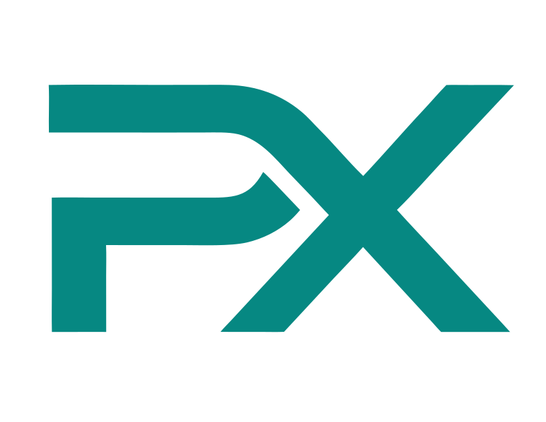

<div align="center">
  

  # ProcureX

  **A modern procurement intelligence and governance prototype for buyers, suppliers, evaluators, and administrators.**

  ProcureX connects identity verification, tender creation, supplier discovery, bid preparation, evaluation, award recommendation, contract negotiation, and post-award tracking in one static front-end experience.

  
  
  
  
</div>

---

## Preview

| Welcome | Workspace Dashboard | Create Tender |
| --- | --- | --- |
|  |  |  |

| Supplier Marketplace | Bid Evaluation | Award Recommendation |
| --- | --- | --- |
|  |  |  |

## Why ProcureX

Procurement work often moves across scattered emails, informal supplier records, manual eligibility checks, paper tender documents, and disconnected approval decisions. ProcureX models a more structured operating system for procurement teams: one place to verify participants, design tenders, publish opportunities, compare bids, award contracts, and preserve an auditable record.

This repository is currently a browser-based prototype. It demonstrates the user experience, product logic, and workflow coverage using static HTML, CSS, JavaScript, mock data, local browser storage, and CDN-powered helper libraries.

## Product Capabilities

| Area | What the prototype demonstrates |
| --- | --- |
| Identity and trust | Registration, sign-in, IAM profile workspace, eKYC state, account type handling, and verification status screens. |
| Buyer workspace | Tender planning, procurement type selection, regulatory requirements, evaluation setup, review, and publication flows. |
| Supplier workspace | Marketplace browsing, tender detail review, eligibility visibility, bid drafting, and submission workspace. |
| Evaluation | Bid opening, scoring views, review states, award recommendation, and committee-oriented screens. |
| Contracting | Contract negotiation, award handoff, post-award tracking, records, and history views. |
| Governance logic | Architecture and requirement documents for trust tiers, auditability, anti-collusion, market transparency, risk, and ecosystem expansion. |

## Core Workflow

```text
Register or sign in
  -> complete IAM and eKYC steps
  -> open the role-aware workspace
  -> create or discover a tender
  -> prepare requirements and evaluation criteria
  -> publish, bid, evaluate, award, and track the contract
  -> preserve records for audit and future intelligence
```

## Tech Stack

| Layer | Current implementation |
| --- | --- |
| Frontend | HTML, CSS, vanilla JavaScript |
| App model | Static single-page application |
| State | Mock data plus browser `localStorage` |
| Charts | Chart.js from CDN |
| PDF export | html2pdf.js from CDN |
| Animation | dotLottie web component from CDN |
| Build step | None |
| Backend | Not included in this prototype |

## Run Locally

Open the static app directly:

```text
procurex-ui/index.html
```

For the most reliable browser behavior, serve the UI folder locally:

```powershell
cd procurex-ui
python -m http.server 8000
```

Then open:

```text
http://localhost:8000
```

Useful routes:

| Page | URL |
| --- | --- |
| Welcome | `http://localhost:8000/?page=welcome` |
| Workspace dashboard | `http://localhost:8000/?page=workspace-dashboard` |
| Create tender | `http://localhost:8000/?page=create-tender` |
| Marketplace | `http://localhost:8000/?page=marketplace` |
| Admin compliance dashboard | `http://localhost:8000/?page=admin-dashboard` |
| Bid evaluation | `http://localhost:8000/?page=bid-evaluation` |
| Award recommendation | `http://localhost:8000/?page=award-recommendation` |

## Repository Structure

```text
.
|-- procurex-ui/
|   |-- index.html
|   |-- assets/
|   |   |-- logo.svg
|   |   |-- ProcureX.json
|   |   `-- readme/
|   |-- js/
|   |   |-- app.js
|   |   |-- charts.js
|   |   `-- data.js
|   |-- pages/
|   |   |-- workspace-dashboard.js
|   |   |-- create-tender.js
|   |   |-- supplier-marketplace.js
|   |   |-- bid-evaluation.js
|   |   `-- ...
|   |-- styles/
|   |   `-- design-system.css
|   `-- README.md
|-- FACTS/
|   |-- Functional Requirements.md
|   |-- Non-Functional Requirements.md
|   |-- Architecture Design.md
|   |-- ERD Diagram.md
|   |-- logics/
|   |   `-- unified
|   `-- ...
|-- DESIGN.md
`-- README.md
```

## Documentation Map

| Document | Purpose |
| --- | --- |
| [`procurex-ui/README.md`](procurex-ui/README.md) | Static UI setup, route list, and maintenance notes. |
| [`DESIGN.md`](DESIGN.md) | Visual system and design direction. |
| [`FACTS/Functional Requirements.md`](FACTS/Functional%20Requirements.md) | Platform capability requirements. |
| [`FACTS/Non-Functional Requirements.md`](FACTS/Non-Functional%20Requirements.md) | Performance, security, availability, compliance, and maintainability requirements. |
| [`FACTS/Architecture Design.md`](FACTS/Architecture%20Design.md) | Proposed production architecture and technology stack. |
| [`FACTS/ERD Diagram.md`](FACTS/ERD%20Diagram.md) | Entity relationship model. |
| [`FACTS/User Experience Flowcharts.md`](FACTS/User%20Experience%20Flowcharts.md) | User journey and UX flow documentation. |
| [`FACTS/logics/unified`](FACTS/logics/unified) | Unified procurement intelligence and governance logic blueprint. |

## Prototype Status

ProcureX is an active static prototype. It is suitable for product demonstrations, workflow validation, requirements review, UI iteration, and backend planning. It does not yet include production authentication, persistent database storage, server APIs, real document upload storage, payment systems, or production-grade compliance enforcement.

## Roadmap

- Backend API and persistent database integration.
- Real authentication, MFA, roles, and permission enforcement.
- Supplier verification, document validation, and trust tier services.
- Secure bid submission storage and sealed bid opening.
- Evaluation committee workflows, audit logs, and reporting.
- ERP, registry, tax, digital signature, and notification integrations.
- Production deployment, observability, and CI/CD.

## License

No license file is currently included in this repository. Until a license is added, all rights are reserved by the project owner.
