# SEQUENCE DIAGRAMS
## Procurement Intelligence & Governance Platform

**Version:** 1.0
**Date:** February 18, 2026

---

# TABLE OF CONTENTS

1. User Registration & Verification
2. Tender Creation & Design Quality Check
3. Tender Publication & Supplier Matching
4. Bid Submission & Validation
5. Bid Opening & Controlled Disclosure
6. Bid Evaluation & Scoring
7. Price Intelligence & Benchmarking
8. Award Decision & Contract Formation
9. Approval Workflow
10. Budget Commitment & Spend Control
11. Invoice Validation & 3-Way Matching
12. Supplier Performance Evaluation
13. Dispute Resolution
14. Anti-Collusion Detection
15. Risk Forecasting
16. ERP Data Synchronization
17. Progressive Trust Tier Upgrade
18. Complete Procurement Cycle (End-to-End)

---

## 1. User Registration & Verification (Logics 1, 37)

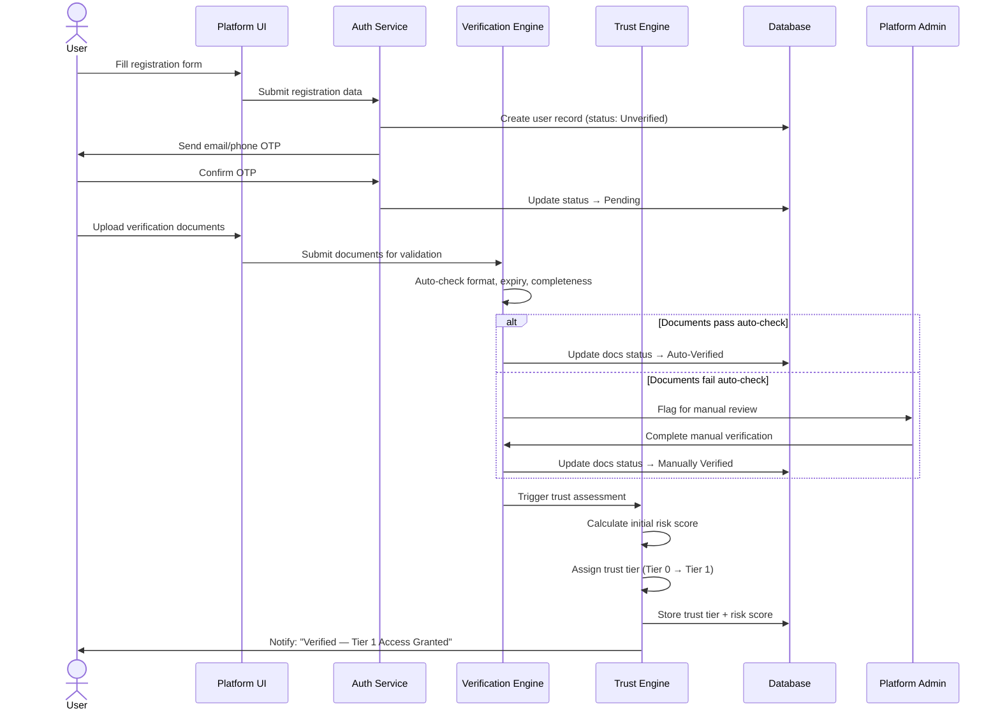
```mermaid
sequenceDiagram
    actor User
    participant UI as Platform UI
    participant Auth as Auth Service
    participant Verify as Verification Engine
    participant Trust as Trust Engine
    participant DB as Database
    participant Admin as Platform Admin

    User->>UI: Fill registration form
    UI->>Auth: Submit registration data
    Auth->>DB: Create user record (status: Unverified)
    Auth->>User: Send email/phone OTP
    User->>Auth: Confirm OTP
    Auth->>DB: Update status → Pending

    User->>UI: Upload verification documents
    UI->>Verify: Submit documents for validation
    Verify->>Verify: Auto-check format, expiry, completeness
    
    alt Documents pass auto-check
        Verify->>DB: Update docs status → Auto-Verified
    else Documents fail auto-check
        Verify->>Admin: Flag for manual review
        Admin->>Verify: Complete manual verification
        Verify->>DB: Update docs status → Manually Verified
    end

    Verify->>Trust: Trigger trust assessment
    Trust->>Trust: Calculate initial risk score
    Trust->>Trust: Assign trust tier (Tier 0 → Tier 1)
    Trust->>DB: Store trust tier + risk score
    Trust->>User: Notify: "Verified — Tier 1 Access Granted"
```

---

## 2. Tender Creation & Design Quality Check (Logics 3, 24)

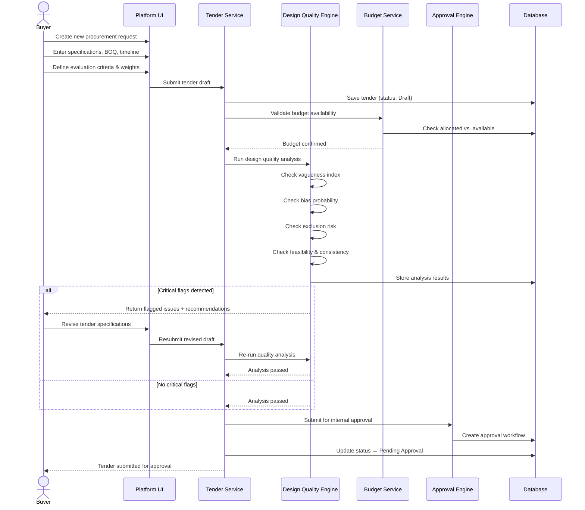
```mermaid
sequenceDiagram
    actor Buyer
    participant UI as Platform UI
    participant Tender as Tender Service
    participant Quality as Design Quality Engine
    participant Budget as Budget Service
    participant Approval as Approval Engine
    participant DB as Database

    Buyer->>UI: Create new procurement request
    Buyer->>UI: Enter specifications, BOQ, timeline
    Buyer->>UI: Define evaluation criteria & weights
    UI->>Tender: Submit tender draft
    Tender->>DB: Save tender (status: Draft)

    Tender->>Budget: Validate budget availability
    Budget->>DB: Check allocated vs. available
    Budget-->>Tender: Budget confirmed

    Tender->>Quality: Run design quality analysis
    Quality->>Quality: Check vagueness index
    Quality->>Quality: Check bias probability
    Quality->>Quality: Check exclusion risk
    Quality->>Quality: Check feasibility & consistency
    Quality->>DB: Store analysis results

    alt Critical flags detected
        Quality-->>Buyer: Return flagged issues + recommendations
        Buyer->>UI: Revise tender specifications
        UI->>Tender: Resubmit revised draft
        Tender->>Quality: Re-run quality analysis
        Quality-->>Tender: Analysis passed
    else No critical flags
        Quality-->>Tender: Analysis passed
    end

    Tender->>Approval: Submit for internal approval
    Approval->>DB: Create approval workflow
    Tender->>DB: Update status → Pending Approval
    Tender-->>Buyer: Tender submitted for approval
```

---

## 3. Tender Publication & Supplier Matching (Logics 4, 5, 21)

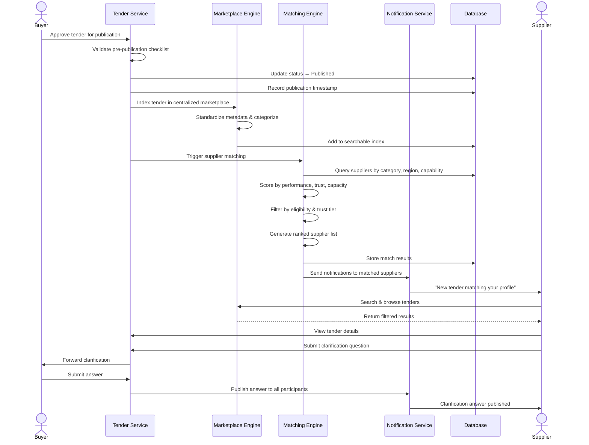
```mermaid
sequenceDiagram
    actor Buyer
    participant Tender as Tender Service
    participant Market as Marketplace Engine
    participant Match as Matching Engine
    participant Notify as Notification Service
    participant DB as Database
    actor Supplier

    Buyer->>Tender: Approve tender for publication
    Tender->>Tender: Validate pre-publication checklist
    Tender->>DB: Update status → Published
    Tender->>DB: Record publication timestamp

    Tender->>Market: Index tender in centralized marketplace
    Market->>Market: Standardize metadata & categorize
    Market->>DB: Add to searchable index

    Tender->>Match: Trigger supplier matching
    Match->>DB: Query suppliers by category, region, capability
    Match->>Match: Score by performance, trust, capacity
    Match->>Match: Filter by eligibility & trust tier
    Match->>Match: Generate ranked supplier list
    Match->>DB: Store match results

    Match->>Notify: Send notifications to matched suppliers
    Notify->>Supplier: "New tender matching your profile"
    
    Supplier->>Market: Search & browse tenders
    Market-->>Supplier: Return filtered results
    Supplier->>Tender: View tender details
    Supplier->>Tender: Submit clarification question
    Tender->>Buyer: Forward clarification
    Buyer->>Tender: Submit answer
    Tender->>Notify: Publish answer to all participants
    Notify->>Supplier: Clarification answer published
```

---

## 4. Bid Submission & Validation (Logic 6)

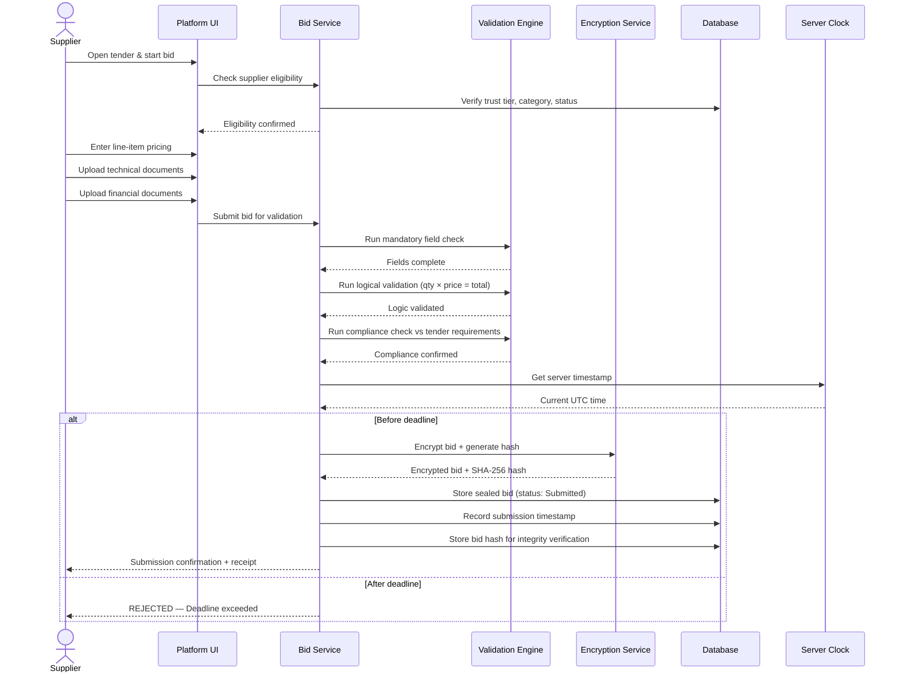
```mermaid
sequenceDiagram
    actor Supplier
    participant UI as Platform UI
    participant Bid as Bid Service
    participant Valid as Validation Engine
    participant Crypto as Encryption Service
    participant DB as Database
    participant Clock as Server Clock

    Supplier->>UI: Open tender & start bid
    UI->>Bid: Check supplier eligibility
    Bid->>DB: Verify trust tier, category, status
    Bid-->>UI: Eligibility confirmed

    Supplier->>UI: Enter line-item pricing
    Supplier->>UI: Upload technical documents
    Supplier->>UI: Upload financial documents
    UI->>Bid: Submit bid for validation

    Bid->>Valid: Run mandatory field check
    Valid-->>Bid: Fields complete
    Bid->>Valid: Run logical validation (qty × price = total)
    Valid-->>Bid: Logic validated
    Bid->>Valid: Run compliance check vs tender requirements
    Valid-->>Bid: Compliance confirmed

    Bid->>Clock: Get server timestamp
    Clock-->>Bid: Current UTC time

    alt Before deadline
        Bid->>Crypto: Encrypt bid + generate hash
        Crypto-->>Bid: Encrypted bid + SHA-256 hash
        Bid->>DB: Store sealed bid (status: Submitted)
        Bid->>DB: Record submission timestamp
        Bid->>DB: Store bid hash for integrity verification
        Bid-->>Supplier: Submission confirmation + receipt
    else After deadline
        Bid-->>Supplier: REJECTED — Deadline exceeded
    end
```

---

## 5. Bid Opening & Controlled Disclosure (Logic 7)

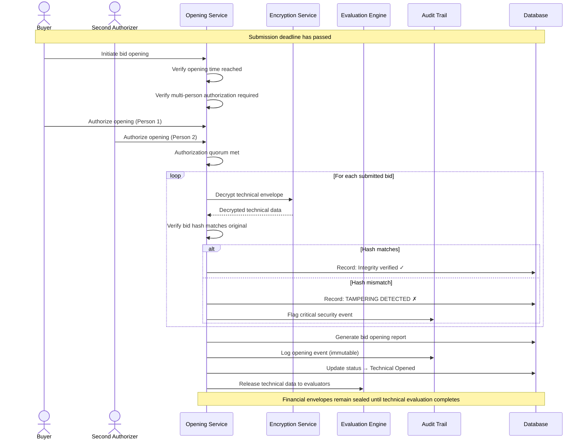
```mermaid
sequenceDiagram
    actor Buyer
    actor Authorizer2 as Second Authorizer
    participant Open as Opening Service
    participant Crypto as Encryption Service
    participant Eval as Evaluation Engine
    participant Audit as Audit Trail
    participant DB as Database

    Note over Buyer, DB: Submission deadline has passed

    Buyer->>Open: Initiate bid opening
    Open->>Open: Verify opening time reached
    Open->>Open: Verify multi-person authorization required

    Buyer->>Open: Authorize opening (Person 1)
    Authorizer2->>Open: Authorize opening (Person 2)
    Open->>Open: Authorization quorum met

    loop For each submitted bid
        Open->>Crypto: Decrypt technical envelope
        Crypto-->>Open: Decrypted technical data
        Open->>Open: Verify bid hash matches original
        
        alt Hash matches
            Open->>DB: Record: Integrity verified ✓
        else Hash mismatch
            Open->>DB: Record: TAMPERING DETECTED ✗
            Open->>Audit: Flag critical security event
        end
    end

    Open->>DB: Generate bid opening report
    Open->>Audit: Log opening event (immutable)
    Open->>DB: Update status → Technical Opened

    Open->>Eval: Release technical data to evaluators
    
    Note over Open, DB: Financial envelopes remain sealed until technical evaluation completes
```

---

## 6. Bid Evaluation & Scoring (Logic 8)

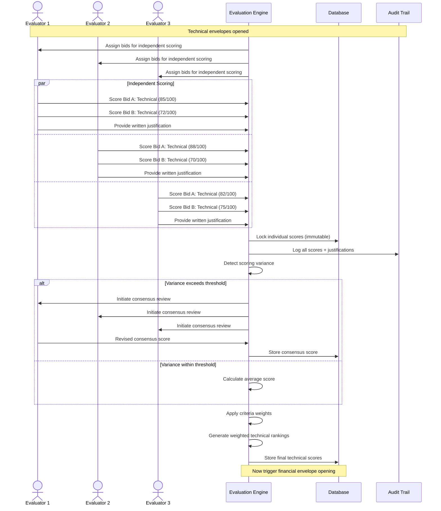
```mermaid
sequenceDiagram
    actor Eval1 as Evaluator 1
    actor Eval2 as Evaluator 2
    actor Eval3 as Evaluator 3
    participant Eval as Evaluation Engine
    participant DB as Database
    participant Audit as Audit Trail

    Note over Eval1, Audit: Technical envelopes opened

    Eval->>Eval1: Assign bids for independent scoring
    Eval->>Eval2: Assign bids for independent scoring
    Eval->>Eval3: Assign bids for independent scoring

    par Independent Scoring
        Eval1->>Eval: Score Bid A: Technical (85/100)
        Eval1->>Eval: Score Bid B: Technical (72/100)
        Eval1->>Eval: Provide written justification
    and
        Eval2->>Eval: Score Bid A: Technical (88/100)
        Eval2->>Eval: Score Bid B: Technical (70/100)
        Eval2->>Eval: Provide written justification
    and
        Eval3->>Eval: Score Bid A: Technical (82/100)
        Eval3->>Eval: Score Bid B: Technical (75/100)
        Eval3->>Eval: Provide written justification
    end

    Eval->>DB: Lock individual scores (immutable)
    Eval->>Audit: Log all scores + justifications

    Eval->>Eval: Detect scoring variance
    
    alt Variance exceeds threshold
        Eval->>Eval1: Initiate consensus review
        Eval->>Eval2: Initiate consensus review
        Eval->>Eval3: Initiate consensus review
        Eval1->>Eval: Revised consensus score
        Eval->>DB: Store consensus score
    else Variance within threshold
        Eval->>Eval: Calculate average score
    end

    Eval->>Eval: Apply criteria weights
    Eval->>Eval: Generate weighted technical rankings
    Eval->>DB: Store final technical scores
    
    Note over Eval, DB: Now trigger financial envelope opening
```

---

## 7. Price Intelligence & Benchmarking (Logics 9, 26)

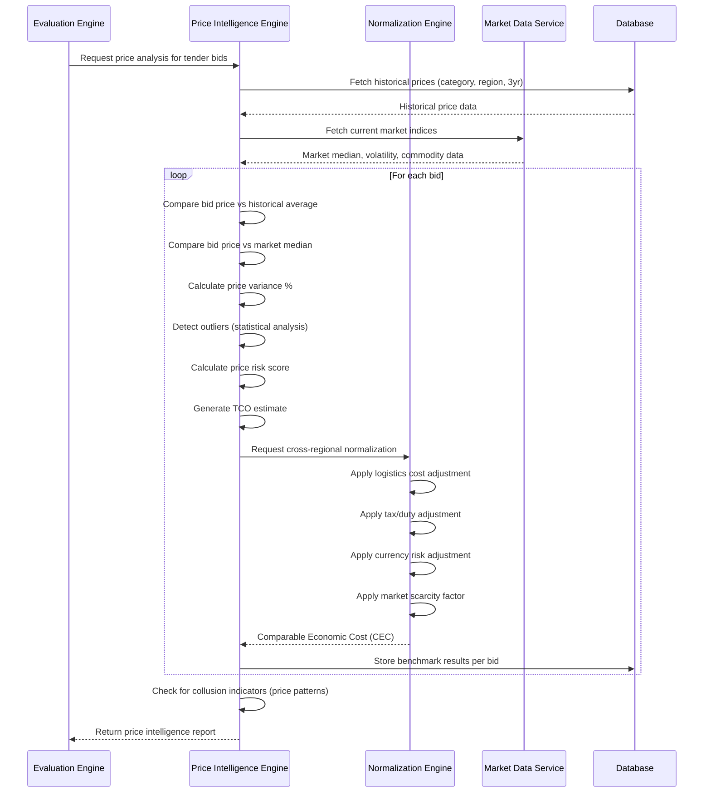
```mermaid
sequenceDiagram
    participant Eval as Evaluation Engine
    participant Price as Price Intelligence Engine
    participant Norm as Normalization Engine
    participant Market as Market Data Service
    participant DB as Database

    Eval->>Price: Request price analysis for tender bids

    Price->>DB: Fetch historical prices (category, region, 3yr)
    DB-->>Price: Historical price data
    Price->>Market: Fetch current market indices
    Market-->>Price: Market median, volatility, commodity data

    loop For each bid
        Price->>Price: Compare bid price vs historical average
        Price->>Price: Compare bid price vs market median
        Price->>Price: Calculate price variance %
        Price->>Price: Detect outliers (statistical analysis)
        Price->>Price: Calculate price risk score
        Price->>Price: Generate TCO estimate

        Price->>Norm: Request cross-regional normalization
        Norm->>Norm: Apply logistics cost adjustment
        Norm->>Norm: Apply tax/duty adjustment
        Norm->>Norm: Apply currency risk adjustment
        Norm->>Norm: Apply market scarcity factor
        Norm-->>Price: Comparable Economic Cost (CEC)

        Price->>DB: Store benchmark results per bid
    end

    Price->>Price: Check for collusion indicators (price patterns)
    Price-->>Eval: Return price intelligence report
```

---

## 8. Award Decision & Contract Formation (Logics 10, 13)

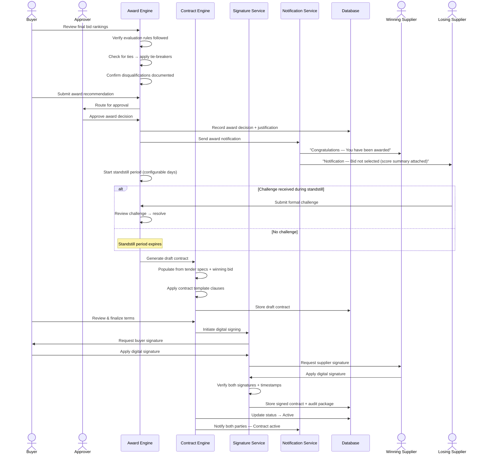
```mermaid
sequenceDiagram
    actor Buyer
    actor Approver
    participant Award as Award Engine
    participant Contract as Contract Engine
    participant Sign as Signature Service
    participant Notify as Notification Service
    participant DB as Database
    actor Winner as Winning Supplier
    actor Loser as Losing Supplier

    Buyer->>Award: Review final bid rankings
    Award->>Award: Verify evaluation rules followed
    Award->>Award: Check for ties → apply tie-breakers
    Award->>Award: Confirm disqualifications documented
    Buyer->>Award: Submit award recommendation

    Award->>Approver: Route for approval
    Approver->>Award: Approve award decision
    Award->>DB: Record award decision + justification

    Award->>Notify: Send award notification
    Notify->>Winner: "Congratulations — You have been awarded"
    Notify->>Loser: "Notification — Bid not selected (score summary attached)"

    Award->>Award: Start standstill period (configurable days)

    alt Challenge received during standstill
        Loser->>Award: Submit formal challenge
        Award->>Award: Review challenge → resolve
    else No challenge
        Note over Award: Standstill period expires
    end

    Award->>Contract: Generate draft contract
    Contract->>Contract: Populate from tender specs + winning bid
    Contract->>Contract: Apply contract template clauses
    Contract->>DB: Store draft contract

    Buyer->>Contract: Review & finalize terms
    Contract->>Sign: Initiate digital signing
    Sign->>Buyer: Request buyer signature
    Buyer->>Sign: Apply digital signature
    Sign->>Winner: Request supplier signature
    Winner->>Sign: Apply digital signature

    Sign->>Sign: Verify both signatures + timestamps
    Sign->>DB: Store signed contract + audit package
    Contract->>DB: Update status → Active
    Contract->>Notify: Notify both parties — Contract active
```

---

## 9. Approval Workflow (Logic 11)

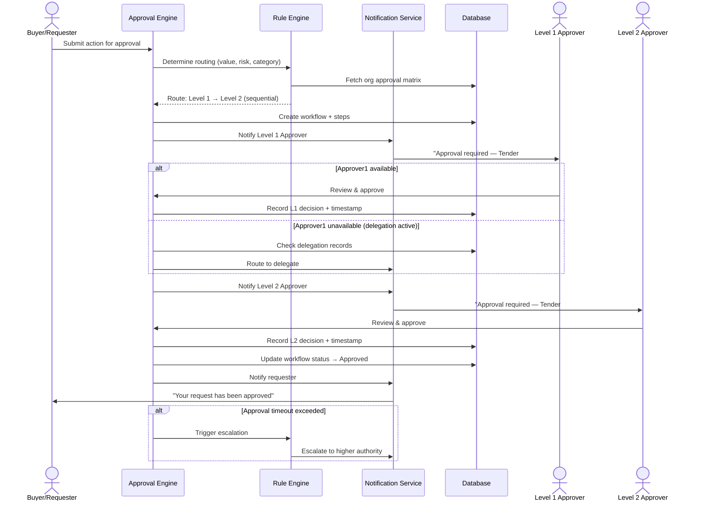
```mermaid
sequenceDiagram
    actor Requester as Buyer/Requester
    participant Workflow as Approval Engine
    participant Rules as Rule Engine
    participant Notify as Notification Service
    participant DB as Database
    actor Approver1 as Level 1 Approver
    actor Approver2 as Level 2 Approver

    Requester->>Workflow: Submit action for approval
    Workflow->>Rules: Determine routing (value, risk, category)
    Rules->>DB: Fetch org approval matrix
    Rules-->>Workflow: Route: Level 1 → Level 2 (sequential)

    Workflow->>DB: Create workflow + steps
    Workflow->>Notify: Notify Level 1 Approver
    Notify->>Approver1: "Approval required — Tender #1234"

    alt Approver1 available
        Approver1->>Workflow: Review & approve
        Workflow->>DB: Record L1 decision + timestamp
    else Approver1 unavailable (delegation active)
        Workflow->>DB: Check delegation records
        Workflow->>Notify: Route to delegate
    end

    Workflow->>Notify: Notify Level 2 Approver
    Notify->>Approver2: "Approval required — Tender #1234"
    Approver2->>Workflow: Review & approve

    Workflow->>DB: Record L2 decision + timestamp
    Workflow->>DB: Update workflow status → Approved
    Workflow->>Notify: Notify requester
    Notify->>Requester: "Your request has been approved"

    alt Approval timeout exceeded
        Workflow->>Rules: Trigger escalation
        Rules->>Notify: Escalate to higher authority
    end
```

---

## 10. Budget Commitment & Spend Control (Logic 12)

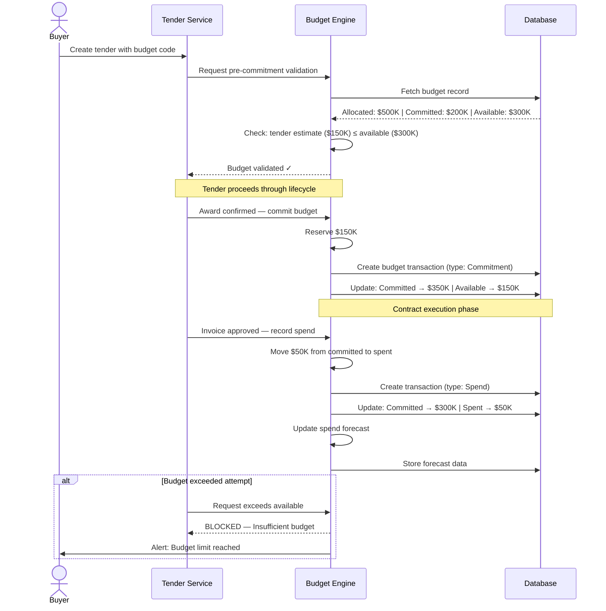
```mermaid
sequenceDiagram
    actor Buyer
    participant Tender as Tender Service
    participant Budget as Budget Engine
    participant DB as Database

    Buyer->>Tender: Create tender with budget code
    Tender->>Budget: Request pre-commitment validation
    Budget->>DB: Fetch budget record
    DB-->>Budget: Allocated: $500K | Committed: $200K | Available: $300K
    Budget->>Budget: Check: tender estimate ($150K) ≤ available ($300K)
    Budget-->>Tender: Budget validated ✓

    Note over Tender, Budget: Tender proceeds through lifecycle

    Tender->>Budget: Award confirmed — commit budget
    Budget->>Budget: Reserve $150K
    Budget->>DB: Create budget transaction (type: Commitment)
    Budget->>DB: Update: Committed → $350K | Available → $150K

    Note over Budget, DB: Contract execution phase

    Tender->>Budget: Invoice approved — record spend
    Budget->>Budget: Move $50K from committed to spent
    Budget->>DB: Create transaction (type: Spend)
    Budget->>DB: Update: Committed → $300K | Spent → $50K

    Budget->>Budget: Update spend forecast
    Budget->>DB: Store forecast data

    alt Budget exceeded attempt
        Tender->>Budget: Request exceeds available
        Budget-->>Tender: BLOCKED — Insufficient budget
        Budget->>Buyer: Alert: Budget limit reached
    end
```

---

## 11. Invoice Validation & 3-Way Matching (Logic 19)

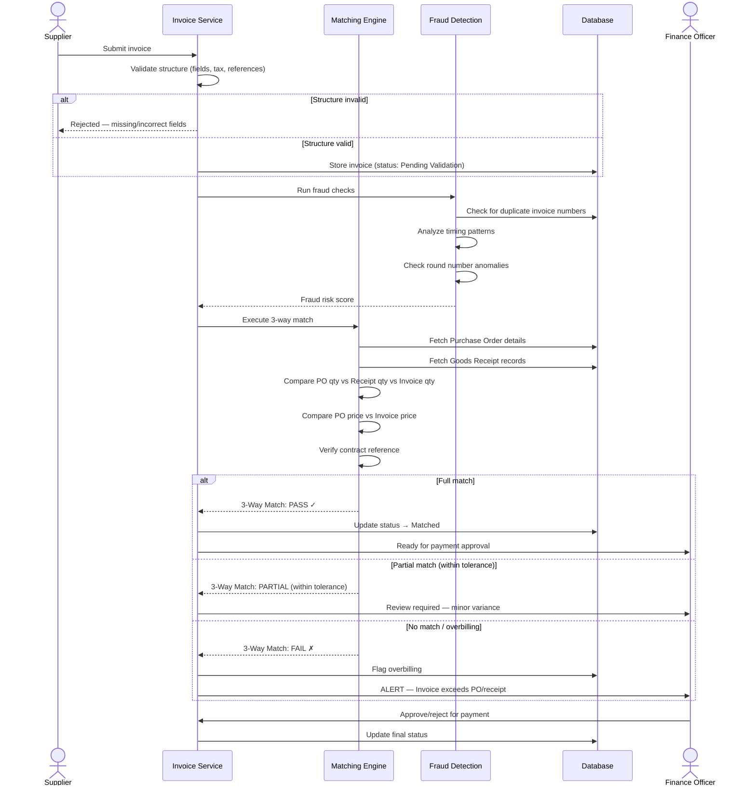
```mermaid
sequenceDiagram
    actor Supplier
    participant Invoice as Invoice Service
    participant Match as Matching Engine
    participant Fraud as Fraud Detection
    participant DB as Database
    actor Finance as Finance Officer

    Supplier->>Invoice: Submit invoice
    Invoice->>Invoice: Validate structure (fields, tax, references)
    
    alt Structure invalid
        Invoice-->>Supplier: Rejected — missing/incorrect fields
    else Structure valid
        Invoice->>DB: Store invoice (status: Pending Validation)
    end

    Invoice->>Fraud: Run fraud checks
    Fraud->>DB: Check for duplicate invoice numbers
    Fraud->>Fraud: Analyze timing patterns
    Fraud->>Fraud: Check round number anomalies
    Fraud-->>Invoice: Fraud risk score

    Invoice->>Match: Execute 3-way match
    Match->>DB: Fetch Purchase Order details
    Match->>DB: Fetch Goods Receipt records
    Match->>Match: Compare PO qty vs Receipt qty vs Invoice qty
    Match->>Match: Compare PO price vs Invoice price
    Match->>Match: Verify contract reference

    alt Full match
        Match-->>Invoice: 3-Way Match: PASS ✓
        Invoice->>DB: Update status → Matched
        Invoice->>Finance: Ready for payment approval
    else Partial match (within tolerance)
        Match-->>Invoice: 3-Way Match: PARTIAL (within tolerance)
        Invoice->>Finance: Review required — minor variance
    else No match / overbilling
        Match-->>Invoice: 3-Way Match: FAIL ✗
        Invoice->>DB: Flag overbilling
        Invoice->>Finance: ALERT — Invoice exceeds PO/receipt
    end

    Finance->>Invoice: Approve/reject for payment
    Invoice->>DB: Update final status
```

---

## 12. Supplier Performance Evaluation (Logic 15)

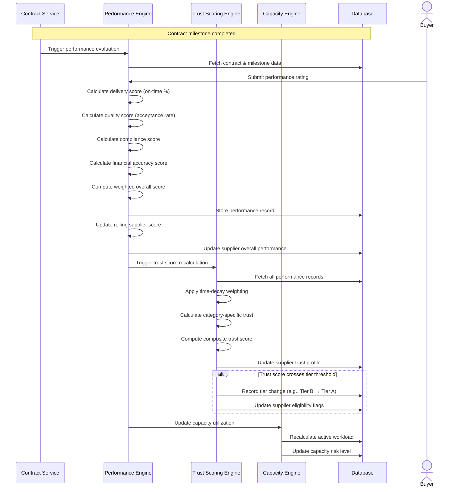
```mermaid
sequenceDiagram
    participant Contract as Contract Service
    participant Perf as Performance Engine
    participant Trust as Trust Scoring Engine
    participant Capacity as Capacity Engine
    participant DB as Database
    actor Buyer

    Note over Contract, DB: Contract milestone completed

    Contract->>Perf: Trigger performance evaluation
    Perf->>DB: Fetch contract & milestone data

    Buyer->>Perf: Submit performance rating
    Perf->>Perf: Calculate delivery score (on-time %)
    Perf->>Perf: Calculate quality score (acceptance rate)
    Perf->>Perf: Calculate compliance score
    Perf->>Perf: Calculate financial accuracy score
    Perf->>Perf: Compute weighted overall score
    Perf->>DB: Store performance record

    Perf->>Perf: Update rolling supplier score
    Perf->>DB: Update supplier overall performance

    Perf->>Trust: Trigger trust score recalculation
    Trust->>DB: Fetch all performance records
    Trust->>Trust: Apply time-decay weighting
    Trust->>Trust: Calculate category-specific trust
    Trust->>Trust: Compute composite trust score
    Trust->>DB: Update supplier trust profile

    alt Trust score crosses tier threshold
        Trust->>DB: Record tier change (e.g., Tier B → Tier A)
        Trust->>DB: Update supplier eligibility flags
    end

    Perf->>Capacity: Update capacity utilization
    Capacity->>DB: Recalculate active workload
    Capacity->>DB: Update capacity risk level
```

---

## 13. Dispute Resolution (Logic 20)

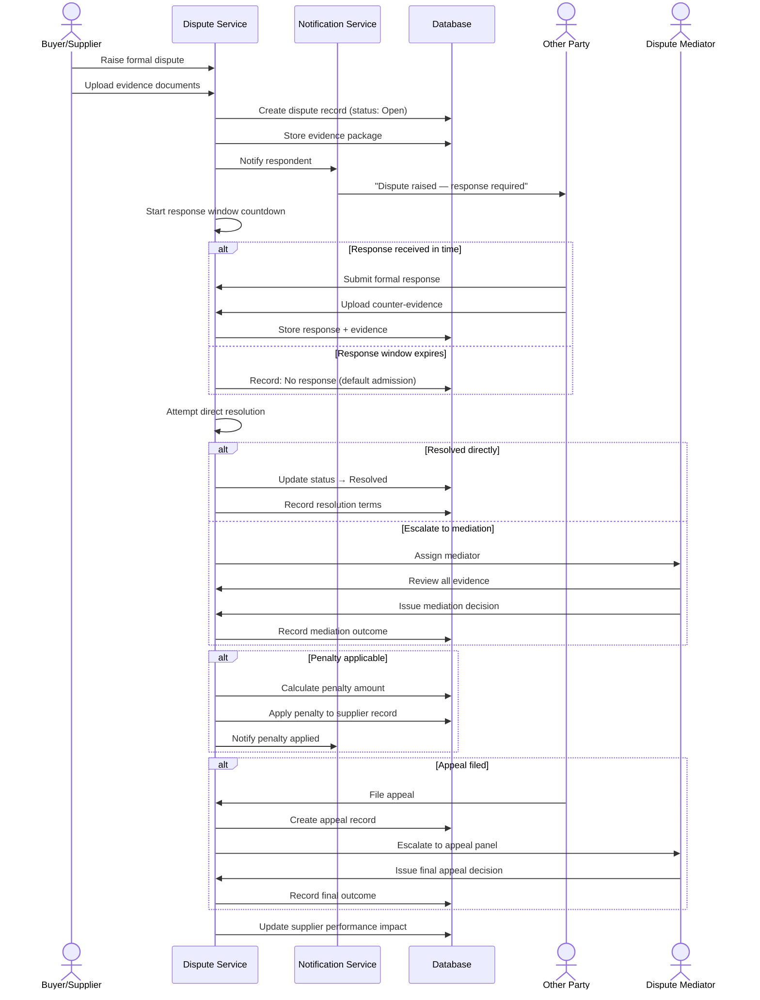
```mermaid
sequenceDiagram
    actor Complainant as Buyer/Supplier
    participant Dispute as Dispute Service
    participant Notify as Notification Service
    participant DB as Database
    actor Respondent as Other Party
    actor Mediator as Dispute Mediator

    Complainant->>Dispute: Raise formal dispute
    Complainant->>Dispute: Upload evidence documents
    Dispute->>DB: Create dispute record (status: Open)
    Dispute->>DB: Store evidence package
    Dispute->>Notify: Notify respondent
    Notify->>Respondent: "Dispute raised — response required"

    Dispute->>Dispute: Start response window countdown

    alt Response received in time
        Respondent->>Dispute: Submit formal response
        Respondent->>Dispute: Upload counter-evidence
        Dispute->>DB: Store response + evidence
    else Response window expires
        Dispute->>DB: Record: No response (default admission)
    end

    Dispute->>Dispute: Attempt direct resolution

    alt Resolved directly
        Dispute->>DB: Update status → Resolved
        Dispute->>DB: Record resolution terms
    else Escalate to mediation
        Dispute->>Mediator: Assign mediator
        Mediator->>Dispute: Review all evidence
        Mediator->>Dispute: Issue mediation decision
        Dispute->>DB: Record mediation outcome
    end

    alt Penalty applicable
        Dispute->>DB: Calculate penalty amount
        Dispute->>DB: Apply penalty to supplier record
        Dispute->>Notify: Notify penalty applied
    end

    alt Appeal filed
        Respondent->>Dispute: File appeal
        Dispute->>DB: Create appeal record
        Dispute->>Mediator: Escalate to appeal panel
        Mediator->>Dispute: Issue final appeal decision
        Dispute->>DB: Record final outcome
    end

    Dispute->>DB: Update supplier performance impact
```

---

## 14. Anti-Collusion Detection (Logic 23)

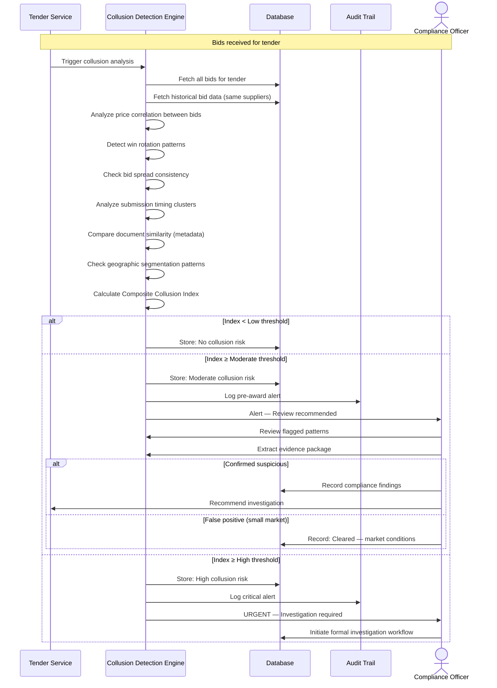
```mermaid
sequenceDiagram
    participant Tender as Tender Service
    participant Collusion as Collusion Detection Engine
    participant DB as Database
    participant Audit as Audit Trail
    actor Compliance as Compliance Officer

    Note over Tender, Compliance: Bids received for tender

    Tender->>Collusion: Trigger collusion analysis
    Collusion->>DB: Fetch all bids for tender
    Collusion->>DB: Fetch historical bid data (same suppliers)

    Collusion->>Collusion: Analyze price correlation between bids
    Collusion->>Collusion: Detect win rotation patterns
    Collusion->>Collusion: Check bid spread consistency
    Collusion->>Collusion: Analyze submission timing clusters
    Collusion->>Collusion: Compare document similarity (metadata)
    Collusion->>Collusion: Check geographic segmentation patterns

    Collusion->>Collusion: Calculate Composite Collusion Index

    alt Index < Low threshold
        Collusion->>DB: Store: No collusion risk
    else Index ≥ Moderate threshold
        Collusion->>DB: Store: Moderate collusion risk
        Collusion->>Audit: Log pre-award alert
        Collusion->>Compliance: Alert — Review recommended
        
        Compliance->>Collusion: Review flagged patterns
        Compliance->>Collusion: Extract evidence package
        
        alt Confirmed suspicious
            Compliance->>DB: Record compliance findings
            Compliance->>Tender: Recommend investigation
        else False positive (small market)
            Compliance->>DB: Record: Cleared — market conditions
        end
    else Index ≥ High threshold
        Collusion->>DB: Store: High collusion risk
        Collusion->>Audit: Log critical alert
        Collusion->>Compliance: URGENT — Investigation required
        Compliance->>DB: Initiate formal investigation workflow
    end
```

---

## 15. Risk Forecasting (Logic 27)

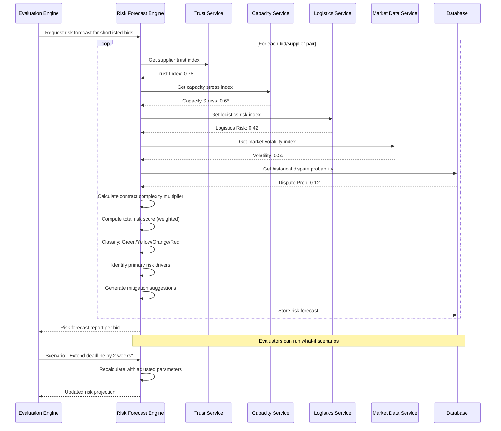
```mermaid
sequenceDiagram
    participant Eval as Evaluation Engine
    participant Risk as Risk Forecast Engine
    participant Trust as Trust Service
    participant Capacity as Capacity Service
    participant Logistics as Logistics Service
    participant Market as Market Data Service
    participant DB as Database

    Eval->>Risk: Request risk forecast for shortlisted bids

    loop For each bid/supplier pair
        Risk->>Trust: Get supplier trust index
        Trust-->>Risk: Trust Index: 0.78
        
        Risk->>Capacity: Get capacity stress index
        Capacity-->>Risk: Capacity Stress: 0.65
        
        Risk->>Logistics: Get logistics risk index
        Logistics-->>Risk: Logistics Risk: 0.42
        
        Risk->>Market: Get market volatility index
        Market-->>Risk: Volatility: 0.55
        
        Risk->>DB: Get historical dispute probability
        DB-->>Risk: Dispute Prob: 0.12
        
        Risk->>Risk: Calculate contract complexity multiplier
        Risk->>Risk: Compute total risk score (weighted)
        Risk->>Risk: Classify: Green/Yellow/Orange/Red
        Risk->>Risk: Identify primary risk drivers
        Risk->>Risk: Generate mitigation suggestions

        Risk->>DB: Store risk forecast
    end

    Risk-->>Eval: Risk forecast report per bid

    Note over Risk, DB: Evaluators can run what-if scenarios
    Eval->>Risk: Scenario: "Extend deadline by 2 weeks"
    Risk->>Risk: Recalculate with adjusted parameters
    Risk-->>Eval: Updated risk projection
```

---

## 16. ERP Data Synchronization (Logic 35)

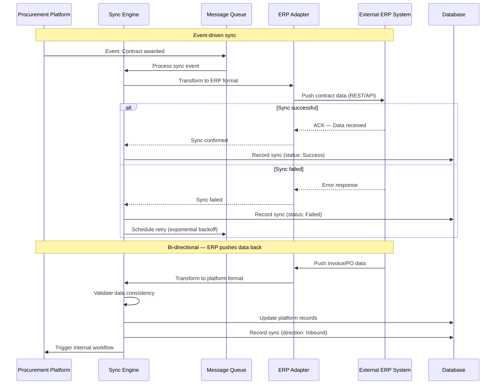
```mermaid
sequenceDiagram
    participant Platform as Procurement Platform
    participant Sync as Sync Engine
    participant Queue as Message Queue
    participant Adapter as ERP Adapter
    participant ERP as External ERP System
    participant DB as Database

    Note over Platform, ERP: Event-driven sync

    Platform->>Queue: Event: Contract awarded
    Queue->>Sync: Process sync event
    Sync->>Adapter: Transform to ERP format
    Adapter->>ERP: Push contract data (REST/API)
    
    alt Sync successful
        ERP-->>Adapter: ACK — Data received
        Adapter-->>Sync: Sync confirmed
        Sync->>DB: Record sync (status: Success)
    else Sync failed
        ERP-->>Adapter: Error response
        Adapter-->>Sync: Sync failed
        Sync->>DB: Record sync (status: Failed)
        Sync->>Queue: Schedule retry (exponential backoff)
    end

    Note over Platform, ERP: Bi-directional — ERP pushes data back

    ERP->>Adapter: Push invoice/PO data
    Adapter->>Sync: Transform to platform format
    Sync->>Sync: Validate data consistency
    Sync->>DB: Update platform records
    Sync->>DB: Record sync (direction: Inbound)
    Sync->>Platform: Trigger internal workflow
```

---

## 17. Progressive Trust Tier Upgrade (Logic 37)

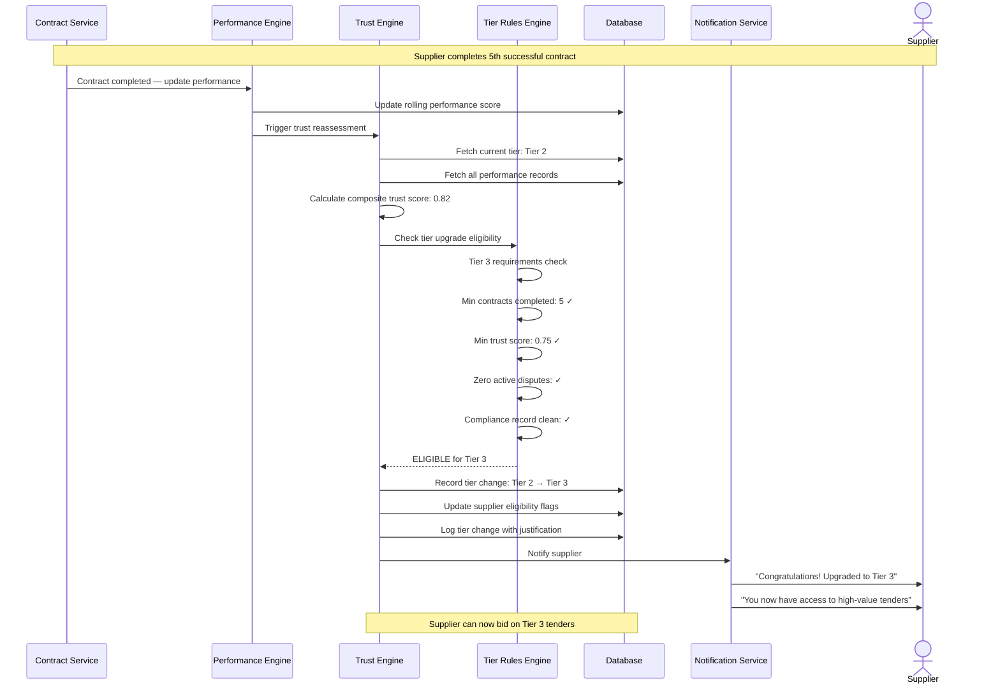
```mermaid
sequenceDiagram
    participant Contract as Contract Service
    participant Perf as Performance Engine
    participant Trust as Trust Engine
    participant Rules as Tier Rules Engine
    participant DB as Database
    participant Notify as Notification Service
    actor Supplier

    Note over Contract, Supplier: Supplier completes 5th successful contract

    Contract->>Perf: Contract completed — update performance
    Perf->>DB: Update rolling performance score
    Perf->>Trust: Trigger trust reassessment

    Trust->>DB: Fetch current tier: Tier 2
    Trust->>DB: Fetch all performance records
    Trust->>Trust: Calculate composite trust score: 0.82

    Trust->>Rules: Check tier upgrade eligibility
    Rules->>Rules: Tier 3 requirements check
    Rules->>Rules: Min contracts completed: 5 ✓
    Rules->>Rules: Min trust score: 0.75 ✓
    Rules->>Rules: Zero active disputes: ✓
    Rules->>Rules: Compliance record clean: ✓
    Rules-->>Trust: ELIGIBLE for Tier 3

    Trust->>DB: Record tier change: Tier 2 → Tier 3
    Trust->>DB: Update supplier eligibility flags
    Trust->>DB: Log tier change with justification

    Trust->>Notify: Notify supplier
    Notify->>Supplier: "Congratulations! Upgraded to Tier 3"
    Notify->>Supplier: "You now have access to high-value tenders"

    Note over Trust, DB: Supplier can now bid on Tier 3 tenders
```

---

## 18. Complete Procurement Cycle — End-to-End (All Logics)

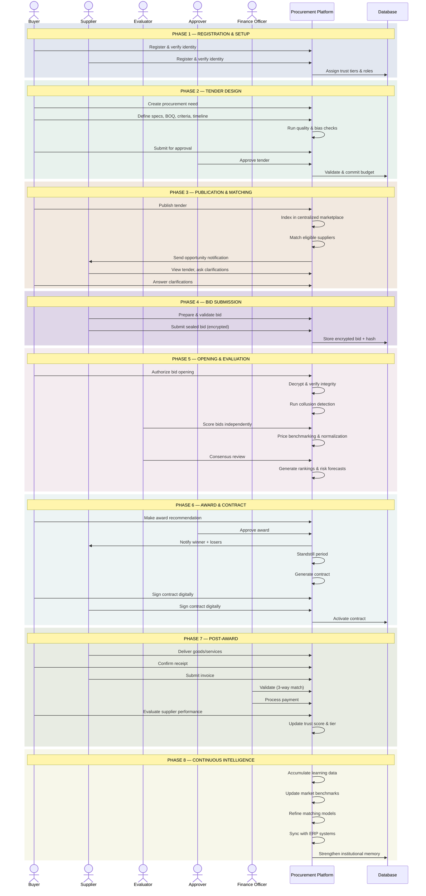
```mermaid
sequenceDiagram
    actor Buyer
    actor Supplier
    actor Evaluator
    actor Approver
    actor Finance as Finance Officer
    participant Platform as Procurement Platform
    participant DB as Database

    rect rgb(226, 231, 240)
        Note over Buyer, DB: PHASE 1 — REGISTRATION & SETUP
        Buyer->>Platform: Register & verify identity
        Supplier->>Platform: Register & verify identity
        Platform->>DB: Assign trust tiers & roles
    end

    rect rgb(232, 242, 237)
        Note over Buyer, DB: PHASE 2 — TENDER DESIGN
        Buyer->>Platform: Create procurement need
        Buyer->>Platform: Define specs, BOQ, criteria, timeline
        Platform->>Platform: Run quality & bias checks
        Buyer->>Platform: Submit for approval
        Approver->>Platform: Approve tender
        Platform->>DB: Validate & commit budget
    end

    rect rgb(242, 233, 224)
        Note over Buyer, DB: PHASE 3 — PUBLICATION & MATCHING
        Buyer->>Platform: Publish tender
        Platform->>Platform: Index in centralized marketplace
        Platform->>Platform: Match eligible suppliers
        Platform->>Supplier: Send opportunity notification
        Supplier->>Platform: View tender, ask clarifications
        Buyer->>Platform: Answer clarifications
    end

    rect rgb(223, 214, 232)
        Note over Buyer, DB: PHASE 4 — BID SUBMISSION
        Supplier->>Platform: Prepare & validate bid
        Supplier->>Platform: Submit sealed bid (encrypted)
        Platform->>DB: Store encrypted bid + hash
    end

    rect rgb(244, 236, 240)
        Note over Buyer, DB: PHASE 5 — OPENING & EVALUATION
        Buyer->>Platform: Authorize bid opening
        Platform->>Platform: Decrypt & verify integrity
        Platform->>Platform: Run collusion detection
        Evaluator->>Platform: Score bids independently
        Platform->>Platform: Price benchmarking & normalization
        Evaluator->>Platform: Consensus review
        Platform->>Platform: Generate rankings & risk forecasts
    end

    rect rgb(237, 244, 244)
        Note over Buyer, DB: PHASE 6 — AWARD & CONTRACT
        Buyer->>Platform: Make award recommendation
        Approver->>Platform: Approve award
        Platform->>Supplier: Notify winner + losers
        Platform->>Platform: Standstill period
        Platform->>Platform: Generate contract
        Buyer->>Platform: Sign contract digitally
        Supplier->>Platform: Sign contract digitally
        Platform->>DB: Activate contract
    end

    rect rgb(232, 236, 227)
        Note over Buyer, DB: PHASE 7 — POST-AWARD
        Supplier->>Platform: Deliver goods/services
        Buyer->>Platform: Confirm receipt
        Supplier->>Platform: Submit invoice
        Finance->>Platform: Validate (3-way match)
        Finance->>Platform: Process payment
        Buyer->>Platform: Evaluate supplier performance
        Platform->>Platform: Update trust score & tier
    end

    rect rgb(247, 247, 234)
        Note over Buyer, DB: PHASE 8 — CONTINUOUS INTELLIGENCE
        Platform->>Platform: Accumulate learning data
        Platform->>Platform: Update market benchmarks
        Platform->>Platform: Refine matching models
        Platform->>Platform: Sync with ERP systems
        Platform->>DB: Strengthen institutional memory
    end
```

---

## Sequence Diagram Summary

| # | Diagram | Participants | Source Logics |
|---|---|---|---|
| 1 | Registration & Verification | User, Auth, Verification, Trust | 1, 37 |
| 2 | Tender Creation & Quality Check | Buyer, Tender, Quality, Budget, Approval | 3, 24 |
| 3 | Publication & Supplier Matching | Buyer, Market, Matching, Notification, Supplier | 4, 5, 21 |
| 4 | Bid Submission & Validation | Supplier, Bid, Validation, Encryption | 6 |
| 5 | Bid Opening & Disclosure | Buyer, Opening, Crypto, Evaluation, Audit | 7 |
| 6 | Bid Evaluation & Scoring | Evaluators, Evaluation Engine, Audit | 8 |
| 7 | Price Intelligence & Benchmarking | Evaluation, Price, Normalization, Market | 9, 26 |
| 8 | Award & Contract Formation | Buyer, Award, Contract, Signature, Supplier | 10, 13 |
| 9 | Approval Workflow | Requester, Workflow, Rules, Approvers | 11 |
| 10 | Budget Commitment & Spend | Buyer, Tender, Budget | 12 |
| 11 | Invoice & 3-Way Matching | Supplier, Invoice, Matching, Fraud, Finance | 19 |
| 12 | Performance Evaluation | Contract, Performance, Trust, Capacity | 15 |
| 13 | Dispute Resolution | Parties, Dispute, Mediator | 20 |
| 14 | Anti-Collusion Detection | Tender, Collusion, Audit, Compliance | 23 |
| 15 | Risk Forecasting | Evaluation, Risk, Trust, Capacity, Logistics | 27 |
| 16 | ERP Synchronization | Platform, Sync, Adapter, ERP | 35 |
| 17 | Trust Tier Upgrade | Contract, Performance, Trust, Rules | 37 |
| 18 | **Complete Cycle (E2E)** | All actors | **All 40** |

---

**END OF DOCUMENT**
