# SMALL COMPANY PROCUREMENT FLOWCHARTS
## Adapted System for Owner-Managed & Small Firms

**Version:** 1.0 | **Date:** February 18, 2026

---

## SMALL COMPANY ADAPTATION OVERVIEW

> In many small firms, the **owner or a senior manager handles procurement directly**. They act as buyer, approver, evaluator, and finance controller — often as a single person. This document shows how the procurement system adapts to serve small companies with **simplified workflows, consolidated roles, and reduced overhead**, while still maintaining governance, transparency, and audit compliance.

### Role Consolidation Matrix

| Full System Role | Small Company Adaptation | Who Handles It |
|---|---|---|
| Buyer (Procurement Officer) | **Owner/Manager** | Owner or designated manager |
| Approving Authority | **Owner/Manager** (self-approve below threshold) | Owner — auto-approved for low value |
| Evaluation Committee | **Owner/Manager** + optional 1 advisor | Owner scores directly |
| Finance Officer | **Owner/Manager** or Bookkeeper | Owner or part-time bookkeeper |
| Compliance Officer | **System Automated** | AI-driven checks, no dedicated staff |
| Platform Administrator | **System Managed** | Platform provides defaults |
| Mediator | **Platform-Provided** | Platform assigns if dispute |
| Supplier | **Same as full system** | No change — suppliers are external |

### Key Simplifications

| Feature | Full System | Small Company Mode |
|---|---|---|
| Approval Chain | Multi-level, value-based | Single-approver or auto-approve |
| Evaluation Committee | 3-5 independent evaluators | Owner + 1 optional advisor |
| Budget Management | Multi-code, multi-year | Simple budget pool / per-tender |
| Bid Opening | Multi-person authorization | Single-person + system verification |
| Quality Checks | 5-dimension analysis | Essential checks only |
| Reporting | Full compliance suite | Simplified dashboard |
| ERP Integration | Full bi-directional sync | CSV export / basic accounting link |

---

## TABLE OF CONTENTS

1. Owner/Manager — Complete Small Company Journey
2. Small Supplier Interaction with Small Buyer
3. Simplified Tender Creation (Quick Mode)
4. Simplified Evaluation & Award
5. Simplified Financial Management
6. Simplified Contract & Delivery
7. System-Automated Compliance for Small Firms
8. Small Company vs Full System — Decision Guide

---

## 1. OWNER/MANAGER — Complete Small Company Journey

> The Owner/Manager is the primary (often sole) procurement actor. They handle everything from need identification through payment, with the system automating compliance and governance checks in the background.

### 1.1 Owner Onboarding — Simplified Registration

```mermaid
flowchart TD
    A([🟢 Owner Starts]) --> B[Visit Platform — Select: Small Business]
    B --> C[Enter: Business Name & Type]
    C --> D{Business Type?}
    D -->|Sole Proprietor| E[Enter: Owner ID & Tax Number]
    D -->|Small LLC/Ltd| F[Enter: Company Reg # & Tax ID]
    D -->|Partnership| G[Enter: Partnership Details]
    
    E --> H[Enter: Email + Phone]
    F --> H
    G --> H
    
    H --> I[Set Password + Optional MFA]
    I --> J[Verify Email via OTP]
    J --> K{Verified?}
    K -->|No| L[Resend — Max 3]
    L --> K
    K -->|Yes| M[Account Created]
    
    M --> N[Upload: Business License]
    N --> O[Upload: Tax Certificate]
    O --> P{Auto-Verify?}
    P -->|Pass ✓| Q[Verified — Trust Tier 1]
    P -->|Fail| R[Platform Admin Reviews]
    R --> S{Decision?}
    S -->|Approved| Q
    S -->|Rejected| T[Resubmit Documents]
    T --> N
    
    Q --> U[Quick Profile Setup]
    U --> V[Select: Business Categories]
    V --> W[Set: Location / Delivery Area]
    W --> X[Set: Typical Budget Range]
    X --> Y[Choose: Acting as Buyer, Supplier, or Both]
    
    Y --> Z{Role?}
    Z -->|Buyer Only| AA[Enable: Buyer Dashboard]
    Z -->|Supplier Only| AB[Enable: Supplier Dashboard]
    Z -->|Both| AC[Enable: Dual Dashboard]
    
    AA --> AD[System Sets: Small Business Mode]
    AB --> AD
    AC --> AD
    
    AD --> AE[Defaults Applied:]
    AE --> AF[• Single-Person Approval]
    AF --> AG[• Simplified Evaluation]
    AG --> AH[• Basic Budget Tracking]
    AH --> AI[• Auto Compliance Checks]
    AI --> AJ([✓ Owner Ready to Procure])
```

### 1.2 Owner Creates Quick Procurement

```mermaid
flowchart TD
    A([Owner: Need Something]) --> B{Procurement Size?}
    B -->|Micro — Under $1K| C[Quick Purchase Mode]
    B -->|Small — $1K-$10K| D[Simple Tender Mode]
    B -->|Medium — $10K-$50K| E[Standard Tender Mode]
    B -->|Large — Over $50K| F[Full Tender Mode — Like Enterprise]
    
    C --> G[Direct Purchase Flow]
    G --> H[Select: Category + Description]
    H --> I[Set: Max Budget Amount]
    I --> J[Search: Supplier Marketplace]
    J --> K[Compare: 2-3 Quick Quotes]
    K --> L[Select Best Quote]
    L --> M[Auto-Generate: Simple Purchase Order]
    M --> N[Digital Confirm — No Approval Needed]
    N --> O([✓ Micro Purchase Complete])
    
    D --> P[Simple Tender Flow]
    P --> Q[Describe: What You Need]
    Q --> R[Upload: Specs or Reference Image]
    R --> S[Set: Budget Ceiling]
    S --> T[Set: Submission Deadline — Min 3 Days]
    T --> U[Select: Invite Specific Suppliers OR Open]
    U --> V[System: Auto Quality Check — Essential Only]
    V --> W{Issues?}
    W -->|Yes| X[Review Flags + Fix or Override]
    X --> Q
    W -->|No ✓| Y[Publish Tender — No Approval Needed]
    Y --> Z([✓ Simple Tender Published])
    
    E --> AA[Standard Tender Flow]
    AA --> AB[Fill: Detailed Specifications]
    AB --> AC[Set: Evaluation Criteria + Weights]
    AC --> AD[Set: Timeline with Clarification Window]
    AD --> AE[Link: Budget Code]
    AE --> AF[System: Quality + Bias Check]
    AF --> AG{Owner Approves Own Tender?}
    AG -->|Self-Approve ✓| AH[Record: Self-Approval + Justification]
    AG -->|Invite Advisor Review| AI[Send to Advisor for Comment]
    AI --> AJ{Advisor Feedback?}
    AJ -->|Changes Suggested| AB
    AJ -->|Looks Good| AH
    AH --> AK[Publish Tender]
    AK --> AL([✓ Standard Tender Published])
    
    F --> AM[Redirect to Full Enterprise Flow]
    AM --> AN[System Recommends: Consider External Evaluator]
    AN --> AO([→ Uses Full System Workflow])
```

### 1.3 Owner Manages Bids & Clarifications

```mermaid
flowchart TD
    A([Owner: Tender is Live]) --> B[Dashboard: Monitor Active Tenders]
    B --> C[View: Interest Count + Downloads]
    
    C --> D{Supplier Questions?}
    D -->|Yes| E[Read Question]
    E --> F[Type Quick Answer]
    F --> G[Publish to All Bidders — Fairness Maintained]
    G --> D
    D -->|No / Window Closed| H[Wait for Deadline]
    
    H --> I{Bids Received?}
    I -->|Zero| J{What to Do?}
    J -->|Extend Deadline| K[Add 3-7 More Days]
    K --> B
    J -->|Invite More Suppliers| L[System Suggests Matching Suppliers]
    L --> M[Send Additional Invites]
    M --> B
    J -->|Cancel| N[Cancel Tender — Try Again Later]
    
    I -->|1-2 Bids| O[⚠ Low Competition Warning]
    O --> P{Proceed or Extend?}
    P -->|Proceed| Q[Accept Available Bids]
    P -->|Extend| K
    
    I -->|3+ Bids| Q
    
    Q --> R[Deadline Passes — Bids Auto-Locked]
    R --> S[Owner Authorizes Opening — Single Person OK]
    S --> T[System: Decrypt + Verify Hash Integrity]
    T --> U[View: All Bid Summaries — Side by Side]
    U --> V([✓ Bids Opened — Ready for Owner Review])
```

### 1.4 Owner Evaluates & Awards — Simplified

```mermaid
flowchart TD
    A([Owner: Review Bids]) --> B{Evaluation Mode?}
    B -->|Quick Compare — Micro/Small| C[View: Price Comparison Table]
    B -->|Scored Evaluation — Medium| D[Score Against Criteria]
    B -->|With Advisor — Large| E[Invite 1 Advisor to Co-Evaluate]
    
    C --> F[System: Price per Line Item Comparison]
    F --> G[System: Auto-Highlight Lowest & Outliers]
    G --> H[Owner Reviews + Selects]
    
    D --> I[Owner Scores Each Criterion per Bid]
    I --> J[Enter Brief Justification per Score]
    J --> K[System: Calculates Weighted Total]
    K --> L[System: Flags Price Outliers]
    L --> M[System: Shows Rankings]
    
    E --> N[Advisor Receives Bid Access]
    N --> O[Advisor Scores Independently]
    O --> P[Owner Scores Independently]
    P --> Q{Scores Differ Significantly?}
    Q -->|Yes| R[Owner + Advisor Discuss — Phone/Chat]
    R --> S[Agree on Final Scores]
    Q -->|No| T[Average Scores Used]
    S --> M
    T --> M
    
    H --> U[System: Quick Intelligence Check]
    M --> U
    
    U --> V{Price Alert?}
    V -->|Way Too Low — Suspicious| W[⚠ Warning: Investigate Before Awarding]
    V -->|Way Too High| X[⚠ Consider Negotiating or Re-tendering]
    V -->|Reasonable Range| Y[Price Check Passed ✓]
    
    W --> Z{Owner Decision?}
    X --> Z
    Y --> Z
    
    Z --> AA{Award Decision}
    AA -->|Award to Winner| AB[System: Record Decision + Reason]
    AA -->|Negotiate First| AC[Contact Winner — Negotiate Terms]
    AC --> AD{Agreement Reached?}
    AD -->|Yes| AB
    AD -->|No| AE[Award to #2 Ranked]
    AE --> AB
    AA -->|Cancel — No Good Bids| AF[Cancel Tender + Record Reason]
    
    AB --> AG{Self-Approval Allowed?}
    AG -->|Under Threshold — Auto| AH[Self-Approved ✓]
    AG -->|Over Threshold| AI[System Requires: Partner/Board Sign-off]
    AI --> AJ{External Approval?}
    AJ -->|Approved| AH
    AJ -->|Rejected| AK[Revise Decision]
    AK --> AA
    
    AH --> AL[Notify: Winner — Award Letter]
    AL --> AM[Notify: Others — Thank You + Scores]
    AM --> AN[Short Standstill Period — 3 Days for Small]
    AN --> AO{Challenge?}
    AO -->|No| AP[Generate: Simple Contract / PO]
    AO -->|Yes| AQ[Review Challenge — Quick Resolution]
    AQ --> AP
    AP --> AR([✓ Award Complete — Contract Ready])
```

---

## 2. SMALL SUPPLIER INTERACTING WITH SMALL BUYER

> When both buyer and supplier are small companies, the system streamlines interactions while maintaining fairness records.

### 2.1 Small Supplier — Lightweight Bid Experience

```mermaid
flowchart TD
    A([Small Supplier: Sees Opportunity]) --> B[View Tender on Marketplace]
    B --> C[Read: Simple Specs & Requirements]
    C --> D[See: Budget Range — Transparent Pricing Signal]
    D --> E[Check: Am I Eligible? — Quick Status Check]
    
    E --> F{Eligible?}
    F -->|No| G[See: What's Missing + How to Qualify]
    F -->|Yes ✓| H{Quick or Detailed Bid?}
    
    H -->|Quick Quote — Micro/Small| I[Enter: Unit Prices per Item]
    I --> J[Upload: 1-2 Supporting Docs — Optional]
    J --> K[Click: Submit Quote]
    
    H -->|Standard Bid| L[Fill: Technical Response — Guided Form]
    L --> M[Fill: Pricing Sheet — Auto-Calculated Totals]
    M --> N[Upload: Certificates & References]
    N --> O[Review: Bid Summary Page]
    O --> P{Looks Good?}
    P -->|No| Q[Edit Before Deadline]
    Q --> L
    P -->|Yes| K
    
    K --> R[System: Validates Completeness]
    R --> S{Complete?}
    S -->|Missing Items| T[⚠ Fix Highlighted Fields]
    T --> L
    S -->|Complete ✓| U[Bid Encrypted + Sealed]
    U --> V[Confirmation Email with Receipt #]
    V --> W[Wait for Result on Dashboard]
    
    W --> X{Outcome?}
    X -->|Won 🏆| Y[Review Simple Contract]
    Y --> Z[Sign Digitally — Click to Accept]
    Z --> AA[Deliver Goods/Services]
    AA --> AB[Submit Invoice via Platform]
    AB --> AC[Get Paid ✓]
    
    X -->|Lost| AD[View: Score Feedback]
    AD --> AE[Learn: Where to Improve]
    AE --> AF([Try Next Opportunity])
    
    AC --> AG([✓ Transaction Complete])
```

---

## 3. SIMPLIFIED FINANCIAL MANAGEMENT FOR SMALL FIRMS

> Small companies don't need multi-code budget structures. The system provides a simple "spending pool" approach.

### 3.1 Owner — Simple Budget & Payment Flow

```mermaid
flowchart TD
    A([Owner: Financial Management]) --> B[View: Simple Spending Dashboard]
    
    B --> C[See: Total Budget This Period]
    C --> D[See: Amount Committed to Active Tenders]
    D --> E[See: Amount Spent — Paid Invoices]
    E --> F[See: Available Balance]
    
    F --> G{Action?}
    G -->|Set Budget| H[Enter: Total Budget for Period]
    H --> I[System: Creates Simple Budget Pool]
    
    G -->|Review Invoice| J[View: Incoming Invoice]
    J --> K[System: Auto-Matches PO + Delivery]
    K --> L{Match Result?}
    L -->|Matched ✓| M[One-Click: Approve Payment]
    L -->|Mismatch| N[View: What Doesn't Match]
    N --> O{Accept Anyway?}
    O -->|Yes — Minor Diff| M
    O -->|No| P[Return to Supplier — Ask for Correction]
    
    M --> Q[Payment Queued]
    Q --> R{Payment Method?}
    R -->|Bank Transfer| S[Export: Payment Details for Bank]
    R -->|Integrated Payment| T[Auto-Process via Linked Account]
    R -->|Manual| U[Mark: Will Pay Offline]
    
    S --> V[Record: Payment Made]
    T --> V
    U --> V
    V --> W[Update: Budget Spent ↑ / Available ↓]
    
    G -->|View Reports| X[Select Report Type]
    X --> Y[Spending by Category — Pie Chart]
    Y --> Z[Spending by Supplier — Bar Chart]
    Z --> AA[Monthly Trend — Line Chart]
    AA --> AB[Export: CSV for Accountant]
    
    W --> AC([✓ Financial Action Complete])
    AB --> AC
```

---

## 4. SIMPLIFIED CONTRACT & DELIVERY MONITORING

### 4.1 Owner — Lightweight Contract Management

```mermaid
flowchart TD
    A([Owner: Contract Active]) --> B[Dashboard: My Active Contracts]
    B --> C[See: Traffic Light Status per Contract]
    C --> D[🟢 On Track / 🟡 At Risk / 🔴 Overdue]
    
    D --> E{Select Contract}
    E --> F[View: Milestones Timeline]
    F --> G{Delivery Expected?}
    G -->|Yes — Today/Soon| H[Await Delivery]
    G -->|Not Yet| I[No Action — Monitor]
    
    H --> J[Goods/Service Received?]
    J --> K{Satisfied?}
    K -->|Yes ✓| L[Click: Accept Delivery]
    K -->|Partially| M[Click: Partial Accept — Note Missing Items]
    K -->|No — Defective| N[Click: Reject + Describe Issue]
    
    L --> O[Auto-Prompt: Upload Quick Photo/Proof — Optional]
    O --> P[System: Ready for Invoice]
    
    M --> Q[Supplier Notified: Please Complete Remaining]
    N --> R{Try to Resolve Directly?}
    R -->|Yes| S[Contact Supplier — Platform Chat/Phone]
    S --> T{Resolved?}
    T -->|Yes| U[Record: Resolution Notes]
    U --> L
    T -->|No| V[Click: Open Dispute — Platform Helps]
    R -->|No — Escalate| V
    
    P --> W{Invoice Arrives?}
    W -->|Yes| X[System: Auto-Checks Amount vs Contract]
    X --> Y{Amount Correct?}
    Y -->|Yes ✓| Z[One-Click: Approve]
    Y -->|Too High| AA[⚠ Flag: Over-Charged]
    AA --> AB[Contact Supplier to Correct]
    Y -->|Correct but Different Format| AC[Accept with Note]
    
    Z --> AD[Process Payment]
    AC --> AD
    
    AD --> AE{All Milestones Done?}
    AE -->|No| G
    AE -->|Yes| AF[Quick Rate: 1-5 Stars + Optional Comment]
    AF --> AG[System Updates Supplier Score]
    AG --> AH[Contract Closed ✓]
    AH --> AI([✓ Done — Supplier Rated])
```

---

## 5. SYSTEM-AUTOMATED COMPLIANCE FOR SMALL FIRMS

> Small companies don't have compliance staff. The system handles governance automatically in the background.

### 5.1 Automated Compliance Engine — Background Process

```mermaid
flowchart TD
    A([System: Background Compliance]) --> B{Event Detected?}
    B -->|Tender Created| C[Auto-Check: Basic Quality]
    B -->|Bid Received| D[Auto-Check: Eligibility + Validity]
    B -->|Award Made| E[Auto-Check: Fairness + Documentation]
    B -->|Invoice Submitted| F[Auto-Check: Duplicate + Fraud Signals]
    B -->|Performance Recorded| G[Auto-Update: Trust Scores]
    
    C --> H{Quality Issue?}
    H -->|Vague Specs| I[⚠ Nudge: Suggest Clearer Language]
    H -->|OK ✓| J[Proceed Silently]
    
    D --> K{Bid Issue?}
    K -->|Incomplete| L[Auto-Reject + Tell Supplier What's Missing]
    K -->|Late| M[Auto-Reject — Deadline Enforced]
    K -->|OK ✓| J
    
    E --> N{Award Issue?}
    N -->|Didn't Pick Highest Scorer| O[⚠ Prompt: Enter Justification]
    N -->|Only 1 Bid — No Competition| P[⚠ Warning: Limited Competition]
    N -->|OK ✓| J
    
    F --> Q{Invoice Issue?}
    Q -->|Duplicate Number| R[🚨 Block + Alert Owner]
    Q -->|Amount > Contract Value| S[🚨 Block + Alert Owner]
    Q -->|Suspicious— Timing| T[⚠ Flag for Owner Review]
    Q -->|OK ✓| J
    
    G --> U[Recalculate Supplier Trust Score]
    U --> V{Score Changed Significantly?}
    V -->|Dropped| W[⚠ Notify Owner: Supplier Risk Increasing]
    V -->|Improved| X[ℹ Optional: Supplier Upgraded]
    V -->|Stable| J
    
    I --> Y[Log: All Checks in Audit Trail — Automatic]
    L --> Y
    M --> Y
    O --> Y
    P --> Y
    R --> Y
    S --> Y
    T --> Y
    W --> Y
    X --> Y
    J --> Y
    Y --> Z([✓ Compliance Maintained — No Staff Needed])
```

---

## 6. OWNER AS BOTH BUYER AND SUPPLIER (Dual Role)

> Many small company owners both buy materials AND sell products/services. The system supports dual-mode operation.

### 6.1 Dual-Role Owner Journey

```mermaid
flowchart TD
    A([Owner: Dual Role]) --> B[Login to Unified Dashboard]
    
    B --> C[LEFT PANEL: Buyer Activities]
    B --> D[RIGHT PANEL: Supplier Activities]
    
    C --> E[View: My Active Tenders — Buying]
    E --> F[View: Pending Invoices to Pay]
    F --> G[View: Contracts I'm Managing]
    
    D --> H[View: Matching Opportunities]
    H --> I[View: My Active Bids — Selling]
    I --> J[View: Invoices I've Submitted]
    J --> K[View: My Performance Score]
    
    G --> L{Action as Buyer?}
    L -->|Create New Tender| M[→ Quick Tender Flow]
    L -->|Review Bids| N[→ Evaluation Flow]
    L -->|Accept Delivery| O[→ Delivery Flow]
    L -->|Approve Invoice| P[→ Payment Flow]
    
    K --> Q{Action as Supplier?}
    Q -->|Browse Opportunities| R[→ Discovery Flow]
    Q -->|Submit Bid| S[→ Bid Submission Flow]
    Q -->|Submit Invoice| T[→ Invoice Flow]
    Q -->|Check Performance| U[→ View Scores & Tips]
    
    V{System Safeguard} --> W[Cannot Bid on Own Tenders]
    V --> X[Cannot Self-Evaluate Own Bids]
    V --> Y[Separate Audit Trails per Role]
    
    M --> Z([✓ Task Complete])
    N --> Z
    O --> Z
    P --> Z
    R --> Z
    S --> Z
    T --> Z
    U --> Z
```

---

## 7. SMALL COMPANY GROWTH PATH

> The system helps small companies grow into the full system as they scale.

### 7.1 Growth & Graduation Flow

```mermaid
flowchart TD
    A([Small Company Starts]) --> B[STAGE 1: Solo Owner Mode]
    B --> C[Single Person Does Everything]
    C --> D[System: Auto-Compliance + Simple Flows]
    
    D --> E{Business Growing?}
    E -->|Hiring First Staff| F[STAGE 2: Add Team Members]
    F --> G[Invite: Bookkeeper — Finance View Only]
    G --> H[Invite: Assistant — Draft Tenders]
    H --> I[Owner: Still Approves Everything]
    
    I --> J{More Complexity?}
    J -->|Higher Value Contracts| K[STAGE 3: Add Oversight]
    K --> L[System Suggests: Enable Approval Chain]
    L --> M[Add: External Advisor for Big Tenders]
    M --> N[Enable: Two-Person Bid Opening for >$50K]
    
    N --> O{Becoming Mid-Size?}
    O -->|5+ Staff in Procurement| P[STAGE 4: Transition to Full System]
    P --> Q[Enable: Full RBAC Module]
    Q --> R[Enable: Multi-Level Approval]
    R --> S[Enable: Evaluation Committees]
    S --> T[Enable: Full Budget Management]
    T --> U[Enable: Compliance Dashboard]
    
    U --> V[System: Migrates All History + Data]
    V --> W[No Data Loss — Seamless Transition]
    W --> X([✓ Now Running Full Enterprise Mode])
    
    E -->|Staying Small| Y[Continue: Simplified Mode Indefinitely]
    Y --> Z[All Features Available — Just Simplified]
    Z --> AA([✓ Small Mode — Fully Functional])
```

---

## 8. SMALL COMPANY vs FULL SYSTEM — COMPARISON

### 8.1 Feature Comparison by Company Size

| Feature | Micro (1-2 people) | Small (3-10 people) | Medium (11-50) | Enterprise (50+) |
|---|---|---|---|---|
| **Registration** | Quick — 5 min | Quick — 5 min | Standard — 10 min | Full — 15 min + docs |
| **Tender Creation** | Quick Quote or 1-Page | Simple Form — guided | Full Specs + BOQ | Full + Quality Analysis |
| **Approval** | Auto/Self-approve | Self-approve + Optional advisor | 2-level chain | Multi-level + Committee |
| **Evaluation** | Owner compares prices | Owner scores + optional advisor | 2-3 evaluators | Full committee + consensus |
| **Bid Opening** | Single person + system verify | Single person + system verify | Two-person required | Multi-person + quorum |
| **Budget** | Simple pool tracking | Per-tender tracking | Multi-code budgets | Full budget management |
| **Invoice Matching** | Auto-match + 1-click approve | Auto-match + review | 3-way match + finance review | Full 3-way + fraud detection |
| **Compliance** | 100% automated — background | 100% automated + alerts | Automated + officer reviews flags | Dedicated compliance team |
| **Reporting** | Simple dashboard + CSV | Dashboard + charts + CSV | Full reports + trends | Full analytics + intelligence |
| **Disputes** | Platform-assisted | Platform-mediated | Formal mediation | Full dispute panel |
| **Performance** | 1-5 star rating | Star rating + comments | Multi-dimension scoring | Full performance framework |
| **ERP Integration** | CSV export for accountant | Basic accounting link | Standard ERP sync | Full bi-directional sync |
| **Trust System** | Standard tiers | Standard tiers | Standard tiers | Standard tiers |

### 8.2 Workflow Step Comparison

| Workflow | Enterprise Steps | Small Company Steps | Reduction |
|---|---|---|---|
| Create Tender | 40 steps | 12 steps | **70%** |
| Approval | 30 steps | 3-5 steps | **85%** |
| Bid Opening | 28 steps | 8 steps | **71%** |
| Evaluation | 36 steps | 10 steps | **72%** |
| Award | 40 steps | 12 steps | **70%** |
| Invoice Processing | 30 steps | 6 steps | **80%** |
| **Average Reduction** | | | **~75%** |

---

## 9. END-TO-END SMALL COMPANY PROCUREMENT — COMPLETE CYCLE

```mermaid
flowchart TD
    A([🟢 START: Owner Needs Something]) --> B{Size of Purchase?}
    
    B -->|Under $1K| C["MICRO: Quick Purchase
    Search marketplace
    Compare 2-3 quotes
    Select + Confirm
    ⏱ 15 minutes"]
    
    B -->|$1K - $10K| D["SMALL: Simple Tender
    Describe need + budget
    Publish — 3-7 day deadline
    Receive 2-5 bids
    Compare + Select winner
    ⏱ 1-2 weeks"]
    
    B -->|$10K - $50K| E["MEDIUM: Standard Tender
    Detailed specs + criteria
    Optional advisor review
    Scored evaluation
    Self-approve + Award
    ⏱ 2-4 weeks"]
    
    B -->|Over $50K| F["LARGE: Full Process
    Complete specs + BOQ
    Two-person bid opening
    Advisor co-evaluation
    External approval may be needed
    ⏱ 4-8 weeks"]
    
    C --> G["DELIVERY
    Receive goods/services
    Quick accept/reject
    Rate: 1-5 stars"]
    
    D --> G
    E --> G
    F --> G
    
    G --> H["PAYMENT
    Auto-matched invoice
    One-click approve
    Pay via preferred method"]
    
    H --> I["BACKGROUND — System Handles:
    ✓ Audit trail recorded
    ✓ Supplier scores updated
    ✓ Budget tracking updated
    ✓ Compliance checks passed
    ✓ Data feeds AI learning"]
    
    I --> J([🔵 DONE — Ready for Next Purchase])
    J -.->|Next Need| A
```

---

## 10. CONFIGURATION: HOW TO ENABLE SMALL COMPANY MODE

```mermaid
flowchart TD
    A([Admin/Owner: Configure Mode]) --> B{Company Size?}
    
    B -->|1-2 Employees| C[Auto-Set: Micro Business Mode]
    C --> D[✓ Quick Purchase Enabled]
    D --> E[✓ Self-Approve All Values]
    E --> F[✓ Single-Person Operations]
    F --> G[✓ Background Compliance Only]
    
    B -->|3-10 Employees| H[Auto-Set: Small Business Mode]
    H --> I[✓ Simple + Standard Tenders]
    I --> J[✓ Self-Approve Under Threshold]
    J --> K[✓ Optional Advisor for Big Tenders]
    K --> L[✓ Background Compliance + Alerts]
    
    B -->|11-50 Employees| M[Auto-Set: Medium Business Mode]
    M --> N[✓ Standard + Full Tenders]
    N --> O[✓ 2-Level Approval Chain]
    O --> P[✓ 2-3 Person Evaluation]
    P --> Q[✓ Compliance Officer Role Available]
    
    B -->|50+ Employees| R[Auto-Set: Enterprise Mode]
    R --> S[✓ All Modules Enabled]
    S --> T[✓ Full RBAC + SoD]
    T --> U[✓ Multi-Level Approvals]
    U --> V[✓ Full Compliance Suite]
    
    G --> W[Owner Can Manually Upgrade Anytime]
    L --> W
    Q --> W
    V --> W
    W --> X([✓ Mode Configured])
```

---

**END OF DOCUMENT**
