# SYSTEM FLOWCHARTS
## Procurement Intelligence & Governance Platform

**Version:** 1.0 | **Date:** February 18, 2026

---

## TABLE OF CONTENTS

1. User Registration & Identity Verification
2. Role-Based Access Control (RBAC)
3. Procurement Need Definition & Tender Creation
4. Tender Publication & Market Distribution
5. Supplier Discovery & Matching
6. Bid Submission & Validation
7. Bid Opening & Controlled Disclosure
8. Bid Evaluation & Scoring
9. Price Intelligence & Benchmarking
10. Award Decision & Contract Formation
11. Approval Workflow & Authority Hierarchy
12. Budget Commitment & Spend Control
13. Digital Signature & Legal Enforceability
14. Audit Trail & Traceability
15. Supplier Performance Tracking
16. Logistics Feasibility & Delivery Risk
17. Sample-Based Procurement
18. Service & Professional Procurement
19. Invoice Validation & 3-Way Matching
20. Dispute Resolution & Exception Handling
21. Market Centralization
22. Supplier Capacity Management
23. Anti-Collusion Detection
24. Tender Design Quality Assurance
25. Progressive Trust & Reputation
26. Cross-Regional Price Normalization
27. Risk Forecasting
28. Market Intelligence & Analytics
29. Governance & Enforcement
30. Network Liquidity Monitoring
31. Platform Learning & AI
32. ERP Integration & Sync
33. Platform Modularity & Extensibility
34. Complete Procurement Lifecycle (End-to-End)

---

## 1. User Registration & Identity Verification (Logics 1, 37)


---

## 2. Role-Based Access Control — RBAC (Logic 2)


---

## 3. Procurement Need Definition & Tender Creation (Logics 3, 24)

```mermaid
flowchart TD
    A([Start: Procurement Need]) --> B[Select Procurement Type]
    B --> C{Type?}
    C -->|Goods| D[Enter Product Specifications]
    C -->|Services| E[Enter Scope of Work]
    C -->|Works| F[Enter Construction Specs]
    C -->|Consulting| G[Enter ToR]
    
    D --> H[Create Bill of Quantities]
    E --> I[Define Deliverables & SLAs]
    F --> H
    G --> I
    
    H --> J[Set Category Code / Taxonomy]
    I --> J
    
    J --> K[Define Technical Specifications]
    K --> L{Spec Quality Check}
    L -->|Vague terms found| M[Highlight: Refine Specifications]
    M --> K
    L -->|Clear & measurable| N[Define Evaluation Criteria]
    
    N --> O[Set Criteria Weights]
    O --> P{Weights = 100%?}
    P -->|No| Q[Adjust Weights]
    Q --> O
    P -->|Yes| R[Configure Timeline]
    
    R --> S[Set Publication Date]
    S --> T[Set Clarification Deadline]
    T --> U[Set Submission Deadline]
    U --> V[Set Expected Delivery Date]
    
    V --> W[Attach Budget Reference]
    W --> X{Budget Available?}
    X -->|No| Y[Request Budget Allocation]
    Y --> W
    X -->|Yes| Z[Select Visibility Model]
    
    Z --> AA{Model?}
    AA -->|Public| AB[Open to All Qualified Suppliers]
    AA -->|Restricted| AC[Define Eligible Category/Region]
    AA -->|Closed/Invited| AD[Select Invited Suppliers]
    
    AB --> AE[Run Design Quality Analysis]
    AC --> AE
    AD --> AE
    
    AE --> AF{Quality Score}
    AF -->|Vagueness Index > 0.6| AG[⚠ Flag: Ambiguous Specs]
    AF -->|Bias Probability > 0.5| AH[⚠ Flag: Potential Bias]
    AF -->|Exclusion Risk > 0.5| AI[⚠ Flag: Exclusionary Terms]
    AF -->|All Clear| AJ[Quality Approved ✓]
    
    AG --> AK{Override or Fix?}
    AH --> AK
    AI --> AK
    AK -->|Fix| K
    AK -->|Override with Justification| AL[Record Override Reason]
    AL --> AJ
    
    AJ --> AM[Submit for Internal Approval]
    AM --> AN([End: Tender → Approval Queue])
```



---

## 4. Tender Publication & Market Distribution (Logics 4, 21)


---

## 5. Supplier Discovery & Matching Engine (Logics 5, 22, 25)

```mermaid
flowchart TD
    A([Start: Match Request]) --> B{Trigger Source?}
    B -->|New Tender Published| C[Extract Tender Requirements]
    B -->|Buyer Manual Search| D[Extract Search Filters]
    
    C --> E[Load Matching Parameters]
    D --> E
    
    E --> F[Query Supplier Database]
    F --> G[Filter: Category Alignment]
    G --> H[Filter: Geographic Feasibility]
    H --> I[Filter: Trust Tier Minimum Met]
    I --> J[Filter: Active & Verified Status]
    
    J --> K{Remaining Suppliers > 0?}
    K -->|No| L[Widen Search Criteria]
    L --> G
    K -->|Yes| M[Score: Historical Performance]
    
    M --> N[Score: Capability Fit]
    N --> O[Score: Capacity Availability]
    O --> P[Score: Trust & Risk Profile]
    P --> Q[Score: Price Competitiveness History]
    
    Q --> R[Apply Weighted Composite Ranking]
    R --> S[Generate Ranked Supplier List]
    
    S --> T{Cold Start Supplier?}
    T -->|Yes| U[Apply Cold Start Bonus Factor]
    U --> V[Adjust Ranking Position]
    T -->|No| V
    
    V --> W{Capacity Overload Risk?}
    W -->|Overloaded > 85%| X[⚠ Flag: Capacity Risk]
    W -->|Available| Y[✓ Clear for Participation]
    
    X --> Z[Include with Warning]
    Y --> Z
    
    Z --> AA[Return Results to Requester]
    AA --> AB([End: Matched Suppliers Delivered])
```



---

## 6. Bid Submission & Validation (Logic 6)

```mermaid
flowchart TD
    A([Start: Supplier Opens Tender]) --> B[Check Eligibility]
    B --> C{Eligible?}
    C -->|Trust Tier Too Low| D[Block: Insufficient Trust Level]
    C -->|Category Mismatch| E[Block: Not in Approved Category]
    C -->|Blacklisted/Suspended| F[Block: Account Restricted]
    C -->|Eligible ✓| G[Start Bid Preparation]
    
    D --> Z([End: Cannot Bid])
    E --> Z
    F --> Z
    
    G --> H{Bid Type?}
    H -->|Price Only| I[Enter Line-Item Prices]
    H -->|Two-Envelope| J[Prepare Technical + Financial]
    H -->|Service/Consulting| K[Enter Qualifications + Portfolio]
    H -->|Multi-Lot| L[Select Lots & Enter Per-Lot Data]
    
    I --> M[Upload Supporting Documents]
    J --> M
    K --> M
    L --> M
    
    M --> N[Run Validation Engine]
    N --> O{Mandatory Fields?}
    O -->|Missing| P[Highlight Missing Fields]
    P --> G
    O -->|Complete| Q{Logical Validation?}
    
    Q -->|Qty × Price ≠ Total| R[Flag Calculation Error]
    R --> G
    Q -->|Pass ✓| S{Compliance Check}
    
    S -->|Missing Required Certs| T[Flag Missing Documents]
    T --> G
    S -->|Pass ✓| U[Check Submission Deadline]
    
    U --> V{Before Deadline?}
    V -->|No| W[REJECT: Deadline Passed]
    W --> Z
    V -->|Yes| X[Encrypt Bid Content]
    
    X --> Y[Generate SHA-256 Hash]
    Y --> AA[Lock Bid — Immutable]
    AA --> AB[Store Encrypted Bid in DB]
    AB --> AC[Record Submission Timestamp]
    AC --> AD[Generate Submission Receipt]
    AD --> AE[Send Confirmation to Supplier]
    AE --> AF{Withdrawal Before Deadline?}
    AF -->|Yes| AG[Record Withdrawal + Reason]
    AG --> AH[Allow Resubmission]
    AH --> G
    AF -->|No| AI([End: Bid Sealed ✓])
```



---

## 7. Bid Opening & Controlled Disclosure (Logic 7)


---

## 8. Bid Evaluation & Scoring (Logics 8, 17, 18)


---

## 9. Price Intelligence & Benchmarking (Logics 9, 26)

```mermaid
flowchart TD
    A([Start: Bids Under Review]) --> B[Extract Price Data from All Bids]
    B --> C[Load Historical Price Database]
    C --> D[Load Market Intelligence Data]
    
    D --> E{For Each Bid Item}
    E --> F[Calculate Historical Average Price]
    F --> G[Calculate Market Median Price]
    G --> H[Calculate Price Variance %]
    
    H --> I{Outlier Detection}
    I -->|> 2σ Above Median| J[Flag: Potentially Overpriced]
    I -->|> 2σ Below Median| K[Flag: Abnormally Low]
    I -->|Within Range| L[Normal Pricing ✓]
    
    J --> M[Cross-Regional Normalization]
    K --> M
    L --> M
    
    M --> N[Apply Logistics Cost Adjustment]
    N --> O[Apply Tax & Duty Adjustment]
    O --> P[Apply Currency Risk Premium]
    P --> Q[Apply Scarcity/Demand Factor]
    Q --> R[Calculate Comparable Economic Cost]
    
    R --> S[Calculate Total Cost of Ownership]
    S --> T[Calculate Cost-Quality Ratio]
    T --> U[Generate Price Risk Score]
    
    U --> V{More Items?}
    V -->|Yes| E
    V -->|No| W[Aggregate Bid-Level Benchmark]
    
    W --> X[Collusion Pattern Check]
    X --> Y{Suspicious Patterns?}
    Y -->|Price Clustering| Z[Flag for Collusion Review]
    Y -->|Identical Digits| Z
    Y -->|Round Number Bias| Z
    Y -->|No Patterns| AA[Clear ✓]
    
    Z --> AB[Generate Intelligence Report]
    AA --> AB
    AB --> AC([End: Benchmark Report Ready])
```



---

## 10. Award Decision & Contract Formation (Logics 10, 13)


---

## 11. Approval Workflow & Authority Hierarchy (Logic 11)


---

## 12. Budget Commitment & Spend Control (Logic 12)

```mermaid
flowchart TD
    A([Start: Budget Action]) --> B{Action Type?}
    B -->|Allocate New Budget| C[Define: Code, Amount, Fiscal Year]
    B -->|Commit to Tender| D[Link Budget to Tender]
    B -->|Record Spend| E[Link to Invoice Payment]
    B -->|Amend Budget| F[Request Budget Modification]
    
    C --> G[Validate: No Duplicate Code]
    G --> H[Create Budget Record in DB]
    H --> I[Set Status: Active]
    I --> J([End: Budget Created])
    
    D --> K[Fetch Budget Record]
    K --> L{Available ≥ Tender Estimate?}
    L -->|No| M[BLOCK: Insufficient Budget]
    M --> N[Alert: Request Re-allocation]
    N --> O([End: Blocked])
    L -->|Yes| P[Reserve Commitment Amount]
    P --> Q[Create Transaction: Pre-Commitment]
    Q --> R[Update: Committed ↑ / Available ↓]
    R --> S([End: Budget Committed])
    
    E --> T[Fetch Commitment Record]
    T --> U{Spend ≤ Committed?}
    U -->|No| V[BLOCK: Exceeds Commitment]
    V --> O
    U -->|Yes| W[Move from Committed to Spent]
    W --> X[Create Transaction: Spend]
    X --> Y[Update Balances]
    Y --> Z[Update Spend Forecast]
    Z --> AA([End: Spend Recorded])
    
    F --> AB[Submit Amendment Request]
    AB --> AC{Amendment Type?}
    AC -->|Increase| AD[Route for Approval]
    AC -->|Decrease| AE[Auto-Approve if No Active Commitments]
    AC -->|Reallocation| AF[Validate Source Has Surplus]
    AD --> AG{Approved?}
    AG -->|Yes| AH[Apply Amendment]
    AG -->|No| AI[Reject Amendment]
    AE --> AH
    AF --> AH
    AH --> AJ([End: Budget Amended])
    AI --> AJ
```



---

## 13. Digital Signature & Legal Enforceability (Logic 13)


---

## 14. Audit Trail & Traceability (Logic 14)


---

## 15. Supplier Performance Tracking (Logic 15)


---

## 16. Logistics Feasibility & Delivery Risk (Logic 16)

```mermaid
flowchart TD
    A([Start: Assess Delivery Risk]) --> B[Extract Supplier Location]
    B --> C[Extract Delivery Destination]
    C --> D[Calculate Geographic Distance]
    
    D --> E[Assess Transport Infrastructure]
    E --> F{Transport Mode Available?}
    F -->|Road Only| G[Score: Road Accessibility]
    F -->|Sea/Air/Rail| H[Score: Multi-Modal Logistics]
    F -->|Remote/Difficult| I[Score: Limited Access ⚠]
    
    G --> J[Check Seasonal Risk Factors]
    H --> J
    I --> J
    
    J --> K{Seasonal Risks?}
    K -->|Monsoon/Flood Zone| L[Apply Seasonal Penalty]
    K -->|Winter/Snow| M[Apply Weather Penalty]
    K -->|None| N[No Seasonal Adjustment]
    
    L --> O[Fetch Supplier Delivery History]
    M --> O
    N --> O
    
    O --> P[Calculate Historical On-Time Rate]
    P --> Q[Calculate Distance Score]
    Q --> R[Calculate Infrastructure Score]
    R --> S[Calculate Overall Feasibility Score]
    
    S --> T{Risk Classification}
    T -->|Score > 0.8| U[GREEN: Low Risk ✓]
    T -->|0.5 - 0.8| V[YELLOW: Moderate Risk ⚠]
    T -->|< 0.5| W[RED: High Risk 🚨]
    
    U --> X[Include in Evaluation — No Adjustment]
    V --> Y[Include with Risk Premium]
    W --> Z[Flag for Committee Review]
    
    X --> AA[Store Feasibility Assessment]
    Y --> AA
    Z --> AA
    AA --> AB([End: Feasibility Assessed])
```



---

## 17. Sample-Based Procurement (Logic 17)


---

## 18. Service & Professional Procurement (Logic 18)


---

## 19. Invoice Validation & 3-Way Matching (Logic 19)

```mermaid
flowchart TD
    A([Start: Invoice Received]) --> B[Parse Invoice Data]
    B --> C{Structure Valid?}
    C -->|Missing Fields| D[Reject: Incomplete Invoice]
    D --> E[Notify Supplier to Resubmit]
    E --> F([End: Rejected])
    C -->|Valid| G[Store Invoice in System]
    
    G --> H[Fraud Detection Checks]
    H --> I{Duplicate Invoice #?}
    I -->|Yes| J[Flag: DUPLICATE 🚨]
    I -->|No| K{Round Number Anomaly?}
    K -->|Yes| L[Flag: Suspicious Pattern]
    K -->|No| M{Timing Pattern Anomaly?}
    M -->|Yes| L
    M -->|No| N[Fraud Check Clear ✓]
    
    J --> O[Block Invoice + Alert Finance]
    L --> P[Add to Review Queue]
    N --> Q[Proceed to 3-Way Match]
    
    Q --> R[Fetch Purchase Order]
    R --> S[Fetch Goods Receipt Records]
    S --> T[Compare: PO Qty vs Invoice Qty]
    T --> U[Compare: PO Price vs Invoice Price]
    U --> V[Compare: Receipt Qty vs Invoice Qty]
    V --> W[Verify: Contract Reference Valid]
    
    W --> X{Match Result?}
    X -->|Full Match ✓| Y[Status: Auto-Approved]
    X -->|Within Tolerance 5%| Z[Status: Partial Match — Review]
    X -->|Over-billing Detected| AA[Status: BLOCKED 🚨]
    X -->|Under-delivery| AB[Status: Partial Receipt — Hold]
    
    Y --> AC[Route for Payment Processing]
    Z --> AD[Route to Finance for Review]
    AA --> AE[Alert: Overbilling Investigation]
    AB --> AF[Hold Until Delivery Complete]
    
    AC --> AG([End: Invoice Processed])
    AD --> AG
    AE --> AG
    AF --> AG
```



---

## 20. Dispute Resolution & Exception Handling (Logic 20)


---

## 21. Market Centralization (Logic 21)

```mermaid
flowchart TD
    A([Start: Market Index Update]) --> B[Collect All Active Tenders]
    B --> C[Standardize Metadata Format]
    C --> D[Normalize Category Codes]
    D --> E[Index by Category + Region + Value]
    E --> F[Update Full-Text Search Index]
    F --> G[Calculate Market Statistics]
    
    G --> H[Active Tenders by Category]
    H --> I[Average Tender Value by Region]
    I --> J[Supplier Participation Rates]
    J --> K[Competition Density per Category]
    
    K --> L[Publish Marketplace Dashboard]
    L --> M[Enable Filtered Search/Browse]
    M --> N[Enable Saved Searches + Alerts]
    N --> O([End: Market Index Updated])
```

---

## 22. Supplier Capacity Management (Logic 22)

```mermaid
flowchart TD
    A([Start: Capacity Check]) --> B[Fetch Supplier Active Contracts]
    B --> C[Sum Active Contract Values]
    C --> D[Count Active Contract Count]
    D --> E[Fetch Declared Max Capacity]
    
    E --> F[Calculate Utilization %]
    F --> G[Calculate Overload Probability]
    
    G --> H{Utilization Level?}
    H -->|< 50%| I[Status: Available ✓]
    H -->|50% - 75%| J[Status: Moderate Load]
    H -->|75% - 90%| K[Status: High Load ⚠]
    H -->|> 90%| L[Status: Overloaded 🚨]
    
    I --> M[Eligible for All Tenders]
    J --> M
    K --> N[Eligible with Capacity Warning]
    L --> O[Block from New High-Value Tenders]
    
    M --> P[Update Capacity Profile in DB]
    N --> P
    O --> P
    P --> Q([End: Capacity Updated])
```

---

## 23. Anti-Collusion Detection (Logic 23)

```mermaid
flowchart TD
    A([Start: Collusion Check]) --> B[Fetch All Bids for Tender]
    B --> C[Fetch Historical Bid Data — Same Suppliers]
    
    C --> D[Analysis 1: Price Correlation]
    D --> E[Calculate Price Similarity Between Pairs]
    E --> F[Analysis 2: Win Rotation]
    F --> G[Check Win Patterns Across Past Tenders]
    G --> H[Analysis 3: Bid Spread Consistency]
    H --> I[Compare Spread Patterns Over Time]
    I --> J[Analysis 4: Timing Similarity]
    J --> K[Compare Submission Timestamps]
    K --> L[Analysis 5: Document Metadata]
    L --> M[Check for Shared Templates/Authors]
    M --> N[Analysis 6: Geographic Segmentation]
    N --> O[Check for Market Division Patterns]
    
    O --> P[Calculate Composite Collusion Index]
    P --> Q{Risk Level?}
    Q -->|< 0.3 Low| R[No Action — Log Result]
    Q -->|0.3-0.6 Moderate| S[Alert Compliance + Flag Pairs]
    Q -->|> 0.6 High| T[🚨 Urgent: Investigation Required]
    
    S --> U[Compliance Reviews Patterns]
    U --> V{Confirmed Suspicious?}
    V -->|Yes| W[Open Formal Investigation]
    V -->|No — Small Market| X[Clear with Justification]
    
    T --> W
    W --> Y[Extract Evidence Package]
    Y --> Z[Refer to Governance Enforcement]
    
    R --> AA[Store Analysis Results]
    X --> AA
    Z --> AA
    AA --> AB([End: Collusion Check Complete])
```

---

## 24. Tender Design Quality Assurance (Logic 24)

```mermaid
flowchart TD
    A([Start: Quality Check Triggered]) --> B[Load Tender Draft]
    B --> C[Parse All Specification Fields]
    
    C --> D[Check 1: Vagueness Index]
    D --> E[Scan for Ambiguous Terms]
    E --> F[Score: 0.0 = Clear — 1.0 = Very Vague]
    
    F --> G[Check 2: Bias Probability]
    G --> H[Detect Brand-Specific Language]
    H --> I[Detect Exclusionary Criteria]
    I --> J[Score: 0.0 = Neutral — 1.0 = Biased]
    
    J --> K[Check 3: Exclusion Risk]
    K --> L[Check Minimum Requirements Reasonableness]
    L --> M[Check Geographic Restrictions]
    M --> N[Score: 0.0 = Inclusive — 1.0 = Exclusive]
    
    N --> O[Check 4: Feasibility Risk]
    O --> P[Validate Timeline vs Scope]
    P --> Q[Validate Budget vs Market Rates]
    Q --> R[Score: 0.0 = Feasible — 1.0 = Unrealistic]
    
    R --> S[Check 5: Consistency]
    S --> T[Cross-Check Specs vs Criteria vs BOQ]
    T --> U[Detect Contradictions]
    U --> V[Score: 0.0 = Consistent — 1.0 = Contradictory]
    
    V --> W[Calculate Overall Risk Score]
    W --> X{Overall Risk?}
    X -->|< 0.3 Low| Y[✓ Quality Approved — Proceed]
    X -->|0.3-0.6 Moderate| Z[⚠ Warnings — Review Recommended]
    X -->|> 0.6 High| AA[🚨 Critical Issues — Must Fix]
    
    Z --> AB[Generate Recommendations Report]
    AA --> AB
    Y --> AC[Store Analysis Results]
    AB --> AC
    AC --> AD([End: Quality Check Complete])
```

---

## 25. Progressive Trust & Reputation (Logic 25, 37)

```mermaid
flowchart TD
    A([Start: Trust Reassessment]) --> B[Fetch Current Trust Profile]
    B --> C[Load Performance History]
    C --> D[Load Dispute History]
    D --> E[Load Compliance Record]
    
    E --> F[Calculate Delivery Performance %]
    F --> G[Calculate Quality Compliance %]
    G --> H[Calculate Dispute Outcome Index]
    H --> I[Calculate Financial Accuracy %]
    I --> J[Calculate Capacity Reliability %]
    J --> K[Calculate Ethical Compliance %]
    
    K --> L[Apply Category-Specific Weights]
    L --> M[Compute Composite Trust Score]
    
    M --> N{Score vs Tier Thresholds}
    N -->|Score ≥ 0.85| O[Tier A: Preferred]
    N -->|0.70 - 0.84| P[Tier B: Trusted]
    N -->|0.50 - 0.69| Q[Tier C: Standard]
    N -->|0.30 - 0.49| R[Tier D: Monitored]
    N -->|< 0.30| S[Tier F: Restricted]
    
    O --> T{Tier Changed?}
    P --> T
    Q --> T
    R --> T
    S --> T
    
    T -->|Upgraded| U[Grant Enhanced Access]
    U --> V[Enable High-Value Tender Access]
    V --> W[Reduce Oversight Requirements]
    T -->|Downgraded| X[Restrict Access]
    X --> Y[Require Additional Security]
    Y --> Z[Increase Monitoring Level]
    T -->|Same| AA[No Access Changes]
    
    W --> AB[Record Tier Change + Justification]
    Z --> AB
    AA --> AB
    AB --> AC[Notify Supplier]
    AC --> AD([End: Trust Updated])
```

---

## 26. Cross-Regional Price Normalization (Logic 26)

```mermaid
flowchart TD
    A([Start: Normalize Prices]) --> B[Fetch All Bid Prices]
    B --> C[Identify Supplier Regions]
    C --> D[Fetch Regional Cost Indices]
    
    D --> E{For Each Bid}
    E --> F[Extract Raw Unit Prices]
    
    F --> G[Step 1: Logistics Adjustment]
    G --> H[Calculate: Distance-Based Transport Cost]
    H --> I[Add: Last-Mile Delivery Premium]
    
    I --> J[Step 2: Tax & Duty Adjustment]
    J --> K[Apply: Import Duties if Cross-Border]
    K --> L[Apply: Local Tax Rates]
    
    L --> M[Step 3: Currency Risk]
    M --> N[Apply: Exchange Rate Volatility Premium]
    N --> O[Apply: Currency Hedge Cost]
    
    O --> P[Step 4: Market Scarcity]
    P --> Q[Check: Local Supply vs Demand Ratio]
    Q --> R[Apply: Scarcity Premium or Surplus Discount]
    
    R --> S[Calculate: Comparable Economic Cost]
    S --> T[Generate Normalized Price]
    
    T --> U{More Bids?}
    U -->|Yes| E
    U -->|No| V[Rank by Normalized Prices]
    V --> W[Generate Cross-Regional Comparison Report]
    W --> X([End: Prices Normalized])
```

---

## 27. Risk Forecasting (Logic 27)

```mermaid
flowchart TD
    A([Start: Risk Forecast]) --> B[Identify Tender + Shortlisted Bids]
    
    B --> C{For Each Bid/Supplier}
    C --> D[Fetch Supplier Trust Index]
    D --> E[Fetch Capacity Stress Index]
    E --> F[Fetch Logistics Risk Index]
    F --> G[Fetch Market Volatility Index]
    G --> H[Fetch Historical Dispute Probability]
    H --> I[Calculate Contract Complexity Multiplier]
    
    I --> J[Apply Weighted Risk Formula]
    J --> K[Compute Total Risk Score]
    
    K --> L{Risk Classification}
    L -->|< 0.25| M[GREEN: Low Risk ✓]
    L -->|0.25-0.50| N[YELLOW: Moderate ⚠]
    L -->|0.50-0.75| O[ORANGE: High Risk ⚠]
    L -->|> 0.75| P[RED: Critical 🚨]
    
    M --> Q[Identify Primary Risk Drivers]
    N --> Q
    O --> Q
    P --> Q
    
    Q --> R[Generate Mitigation Suggestions]
    R --> S[Store Forecast in DB]
    S --> T{More Bids?}
    T -->|Yes| C
    T -->|No| U[Compile Tender-Level Risk Summary]
    
    U --> V[Enable What-If Scenario Analysis]
    V --> W([End: Risk Forecast Complete])
```

---

## 28. Market Intelligence & Analytics (Logic 28)

```mermaid
flowchart TD
    A([Start: Intelligence Update]) --> B[Collect Completed Tender Data]
    B --> C[Aggregate by Category + Region]
    
    C --> D[Calculate: Average Award Prices]
    D --> E[Calculate: Price Trend Direction]
    E --> F[Calculate: Bid-to-Award Ratio]
    F --> G[Calculate: Supplier Win Rates]
    G --> H[Calculate: Average Evaluation Duration]
    H --> I[Calculate: Competition Density]
    
    I --> J[Detect: Price Trend Anomalies]
    J --> K[Detect: Market Concentration Shifts]
    K --> L[Detect: New Category Entrants]
    
    L --> M[Generate Benchmark Reports]
    M --> N[Update Market Intelligence DB]
    N --> O[Publish Transparency Dashboards]
    O --> P[Generate Strategic Recommendations]
    P --> Q([End: Intelligence Updated])
```

---

## 29. Governance & Enforcement (Logic 29)

```mermaid
flowchart TD
    A([Start: Violation Detected]) --> B{Detection Method?}
    B -->|Automated Alert| C[System-Detected Anomaly]
    B -->|Manual Report| D[Compliance Officer Report]
    B -->|Whistleblower| E[Anonymous Tip]
    
    C --> F[Classify Violation Level]
    D --> F
    E --> F
    
    F --> G{Violation Level?}
    G -->|Minor| H[Issue Warning]
    G -->|Moderate| I[Restrict Bidding + Investigation]
    G -->|Severe| J[Suspension + Formal Hearing]
    G -->|Critical| K[Immediate Blacklist + Legal Referral]
    
    H --> L[Record Violation in System]
    I --> L
    J --> L
    K --> L
    
    L --> M[Notify Violator of Action]
    M --> N{Appeal Window}
    N -->|Appeal Filed| O[Review by Appeal Panel]
    O --> P{Appeal Decision?}
    P -->|Upheld| Q[Maintain Enforcement Action]
    P -->|Overturned| R[Remove/Reduce Enforcement]
    P -->|Modified| S[Adjust Enforcement Level]
    N -->|No Appeal| Q
    
    Q --> T{Reinstatement Path?}
    R --> U[Restore Access Immediately]
    S --> T
    T -->|Probation Eligible| V[Set Probation Conditions]
    V --> W[Monitor During Probation]
    W --> X{Conditions Met?}
    X -->|Yes| Y[Full Reinstatement]
    X -->|No| Z[Extend/Escalate Enforcement]
    T -->|Permanent Ban| AA[No Reinstatement Path]
    
    U --> AB[Update User Status in DB]
    Y --> AB
    Z --> AB
    AA --> AB
    AB --> AC([End: Enforcement Complete])
```

---

## 30. Network Liquidity Monitoring (Logic 30)

```mermaid
flowchart TD
    A([Start: Liquidity Check]) --> B[Fetch Active Tenders per Category]
    B --> C[Fetch Active Suppliers per Category]
    C --> D[Calculate: Avg Bids per Tender]
    D --> E[Calculate: Supplier Engagement Index]
    E --> F[Calculate: Buyer Engagement Index]
    
    F --> G{Health Assessment}
    G -->|High Activity + Competition| H[HEALTHY ✓]
    G -->|Low Competition| I[AT RISK ⚠]
    G -->|No Activity| J[CRITICAL 🚨]
    
    H --> K[No Intervention Needed]
    I --> L[Trigger: Supplier Recruitment Campaign]
    L --> M[Trigger: Buyer Incentive Programs]
    J --> N[Trigger: Direct Market Development]
    
    K --> O[Update Liquidity Dashboard]
    M --> O
    N --> O
    O --> P[Generate Early Warning Alerts]
    P --> Q([End: Liquidity Assessed])
```

---

## 31. Platform Learning & AI (Logic 31)

```mermaid
flowchart TD
    A([Start: Learning Cycle]) --> B[Collect Historical Decision Data]
    B --> C[Collect Outcome Data]
    
    C --> D{Model Type?}
    D -->|Supplier Matching| E[Train: Match Success Predictor]
    D -->|Price Forecasting| F[Train: Price Prediction Model]
    D -->|Risk Assessment| G[Train: Risk Score Model]
    D -->|Anomaly Detection| H[Train: Collusion Detector]
    
    E --> I[Validate Against Test Dataset]
    F --> I
    G --> I
    H --> I
    
    I --> J{Accuracy ≥ Threshold?}
    J -->|Yes| K[Deploy Model to Production]
    J -->|No| L[Retrain with More Data]
    L --> I
    
    K --> M[Generate AI Recommendations]
    M --> N[Present to Users with Confidence Score]
    N --> O[Track: Was Recommendation Accepted?]
    O --> P[Feed Acceptance Data Back to Model]
    P --> Q[Continuously Improve Accuracy]
    Q --> R([End: Learning Cycle Complete])
```

---

## 32. ERP Integration & Data Sync (Logic 35)

```mermaid
flowchart TD
    A([Start: Sync Event]) --> B{Sync Direction?}
    B -->|Outbound| C[Platform → ERP]
    B -->|Inbound| D[ERP → Platform]
    
    C --> E{Event Type?}
    E -->|Contract Awarded| F[Map Contract Fields to ERP Format]
    E -->|Invoice Approved| G[Map Invoice Fields to ERP Format]
    E -->|Payment Processed| H[Map Payment Fields to ERP Format]
    
    F --> I[Call ERP API]
    G --> I
    H --> I
    
    I --> J{API Response?}
    J -->|Success 200| K[Record: Sync Success]
    J -->|Auth Error 401| L[Refresh Token + Retry]
    J -->|Server Error 500| M[Schedule Retry — Exponential Backoff]
    J -->|Timeout| M
    
    L --> I
    M --> N{Max Retries Reached?}
    N -->|No| O[Wait + Retry]
    O --> I
    N -->|Yes| P[Record: Sync Failed 🚨]
    P --> Q[Alert Admin]
    
    D --> R[Receive ERP Webhook/Payload]
    R --> S[Validate Data Schema]
    S --> T{Valid?}
    T -->|Yes| U[Transform to Platform Format]
    U --> V[Update Platform Records]
    V --> W[Record: Inbound Sync Success]
    T -->|No| X[Reject + Log Error]
    
    K --> Y[Update Sync Dashboard]
    W --> Y
    Q --> Y
    X --> Y
    Y --> Z([End: Sync Complete])
```

---

## 33. Platform Modularity & Extensibility (Logic 40)

```mermaid
flowchart TD
    A([Start: Module Action]) --> B{Action Type?}
    B -->|Install New Module| C[Download Module Package]
    B -->|Update Module| D[Download Update Package]
    B -->|Disable Module| E[Deactivate Module]
    B -->|Configure Module| F[Open Config Panel]
    
    C --> G[Validate Module Compatibility]
    G --> H{Compatible?}
    H -->|Yes| I[Register Module in Registry]
    H -->|No| J[Reject: Incompatible Version]
    
    I --> K[Install Module Dependencies]
    K --> L[Register API Endpoints]
    L --> M[Enable Module Features]
    M --> N[Run Module Health Check]
    
    D --> O[Verify Update Signature]
    O --> P[Apply Update + Run Migrations]
    P --> N
    
    E --> Q[Disable Module Features]
    Q --> R[Deregister API Endpoints]
    R --> S[Update Module Status: Inactive]
    
    F --> T[Load Current Configuration]
    T --> U[Admin Modifies Settings]
    U --> V[Validate Configuration]
    V --> W{Valid?}
    W -->|Yes| X[Save + Apply Configuration]
    W -->|No| Y[Show Validation Errors]
    Y --> U
    
    N --> Z{Health Check Pass?}
    Z -->|Yes| AA[Module Status: Active ✓]
    Z -->|No| AB[Rollback + Alert Admin]
    
    AA --> AC([End: Module Ready])
    S --> AC
    X --> AC
    J --> AC
    AB --> AC
```

---

## 34. Complete Procurement Lifecycle — End-to-End

```mermaid
flowchart TD
    A([🟢 START]) --> B["PHASE 1: IDENTITY
    Register Users
    Verify Documents
    Assign Trust Tiers
    Configure RBAC"]
    
    B --> C["PHASE 2: DESIGN
    Define Procurement Need
    Create Specifications & BOQ
    Set Evaluation Criteria
    Run Quality & Bias Checks"]
    
    C --> D["PHASE 3: APPROVAL
    Route Through Authority Hierarchy
    Value-Based Escalation
    Delegation Handling
    Budget Pre-Commitment"]
    
    D --> E["PHASE 4: PUBLICATION
    Publish to Centralized Index
    Match Eligible Suppliers
    Send Notifications
    Handle Clarifications"]
    
    E --> F["PHASE 5: BIDDING
    Eligibility Verification
    Bid Preparation & Validation
    Encryption & Sealing
    Deadline Enforcement"]
    
    F --> G["PHASE 6: OPENING
    Multi-Person Authorization
    Decryption & Hash Verification
    Envelope-Based Disclosure
    Immutable Opening Records"]
    
    G --> H["PHASE 7: EVALUATION
    Compliance Screening
    Independent Scoring
    Consensus Review
    Price Benchmarking
    Sample/Interview (if applicable)
    Risk-Adjusted Rankings"]
    
    H --> I["PHASE 8: INTELLIGENCE
    Price Intelligence & Normalization
    Collusion Detection
    Risk Forecasting
    Delivery Feasibility"]
    
    I --> J["PHASE 9: AWARD
    Award Recommendation
    Approval Routing
    Winner/Loser Notification
    Standstill Period
    Challenge Handling"]
    
    J --> K["PHASE 10: CONTRACT
    Auto-Generate Contract
    Digital Signing (Both Parties)
    Budget Commitment
    Performance Security"]
    
    K --> L["PHASE 11: EXECUTION
    Milestone Tracking
    Goods Receipt
    Invoice Submission
    3-Way Matching
    Payment Processing"]
    
    L --> M["PHASE 12: PERFORMANCE
    Supplier Scoring
    Trust Recalculation
    Tier Progression
    Capacity Updates"]
    
    M --> N["PHASE 13: DISPUTES (if any)
    Formal Filing
    Evidence Exchange
    Mediation/Resolution
    Penalty Enforcement
    Appeals"]
    
    N --> O["PHASE 14: GOVERNANCE
    Audit Trail Maintenance
    Violation Detection
    Enforcement Actions
    Compliance Reporting"]
    
    O --> P["PHASE 15: LEARNING
    Data Accumulation
    Model Training
    AI Recommendations
    Market Intelligence
    ERP Synchronization"]
    
    P --> Q([🔵 END — Cycle Complete])
    Q -.->|Next Procurement| C
```

---

## Flowchart Summary

| # | Flowchart | Decision Points | Steps | Source Logics |
|---|---|---|---|---|
| 1 | Registration & Verification | 6 | 34 | 1, 37 |
| 2 | RBAC Access Control | 6 | 26 | 2 |
| 3 | Tender Creation & Design | 8 | 40 | 3, 24 |
| 4 | Publication & Distribution | 5 | 28 | 4, 21 |
| 5 | Supplier Discovery & Matching | 4 | 28 | 5, 22, 25 |
| 6 | Bid Submission & Validation | 7 | 35 | 6 |
| 7 | Bid Opening & Disclosure | 4 | 28 | 7 |
| 8 | Evaluation & Scoring | 6 | 36 | 8, 17, 18 |
| 9 | Price Intelligence | 3 | 28 | 9, 26 |
| 10 | Award & Contract | 5 | 40 | 10, 13 |
| 11 | Approval Workflow | 6 | 30 | 11 |
| 12 | Budget & Spend Control | 5 | 30 | 12 |
| 13 | Digital Signature | 3 | 24 | 13 |
| 14 | Audit Trail | 4 | 22 | 14 |
| 15 | Performance Tracking | 4 | 28 | 15 |
| 16 | Logistics Feasibility | 3 | 22 | 16 |
| 17 | Sample Procurement | 3 | 24 | 17 |
| 18 | Service Procurement | 3 | 22 | 18 |
| 19 | Invoice 3-Way Matching | 5 | 30 | 19 |
| 20 | Dispute Resolution | 6 | 32 | 20 |
| 21 | Market Centralization | 0 | 15 | 21 |
| 22 | Capacity Management | 1 | 16 | 22 |
| 23 | Anti-Collusion Detection | 3 | 28 | 23 |
| 24 | Design Quality Assurance | 2 | 24 | 24 |
| 25 | Trust & Reputation | 3 | 26 | 25, 37 |
| 26 | Price Normalization | 1 | 22 | 26 |
| 27 | Risk Forecasting | 2 | 20 | 27 |
| 28 | Market Intelligence | 0 | 16 | 28 |
| 29 | Governance & Enforcement | 5 | 30 | 29 |
| 30 | Network Liquidity | 1 | 16 | 30 |
| 31 | Platform Learning | 2 | 16 | 31 |
| 32 | ERP Integration | 3 | 24 | 35 |
| 33 | Platform Modularity | 3 | 22 | 40 |
| 34 | **Complete E2E Lifecycle** | 0 | 15 phases | **All 40** |
| **TOTAL** | **34 flowcharts** | **~120** | **~850+** | |

---

**END OF DOCUMENT**
