# USE CASE DIAGRAMS
## Procurement Intelligence & Governance Platform

**Version:** 1.0
**Date:** February 18, 2026

---

## System Actors

| Actor | Description | Source Logics |
|---|---|---|
| **Buyer** | Procurement officer who creates tenders, evaluates bids, manages contracts | 1, 3, 4, 8, 10 |
| **Supplier** | Organization or individual who discovers opportunities, submits bids, delivers goods/services | 1, 5, 6, 15, 34 |
| **Evaluator** | Committee member who scores and ranks bids | 8, 17, 18 |
| **Approver** | Authority who approves procurement actions based on value/risk thresholds | 11, 12 |
| **Finance Officer** | Manages budgets, validates invoices, processes payments | 12, 19 |
| **Compliance Officer** | Monitors governance, investigates violations, enforces rules | 14, 23, 29 |
| **Platform Admin** | Manages platform configuration, user verification, system governance | 1, 2, 29, 40 |
| **External System (ERP)** | Integrated enterprise system for data synchronization | 35 |

---

## 1. User Registration & Identity Management (Logics 1, 2, 37)

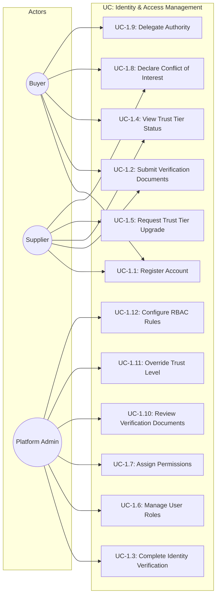

---

## 2. Procurement Design & Tender Creation (Logics 3, 24, 36)

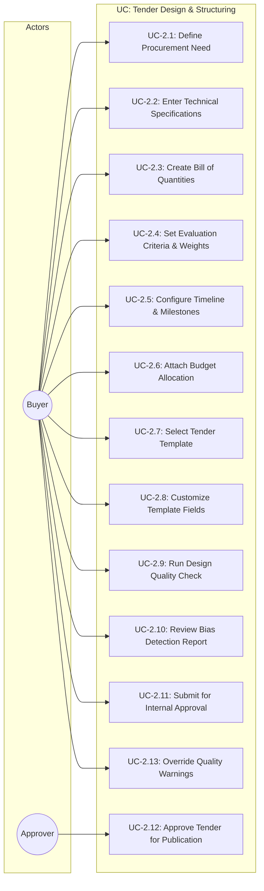

---

## 3. Tender Publication & Market Visibility (Logics 4, 21, 38)

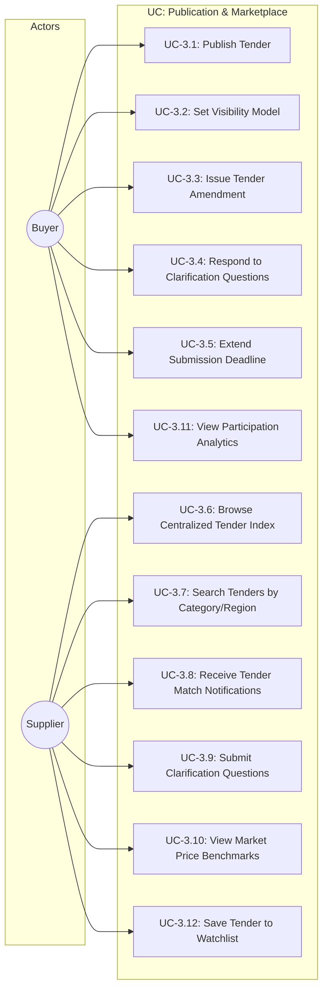

---

## 4. Supplier Discovery & Matching (Logics 5, 22, 25)

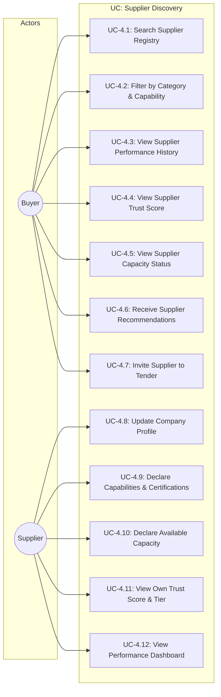

---

## 5. Bid Submission & Validation (Logic 6)

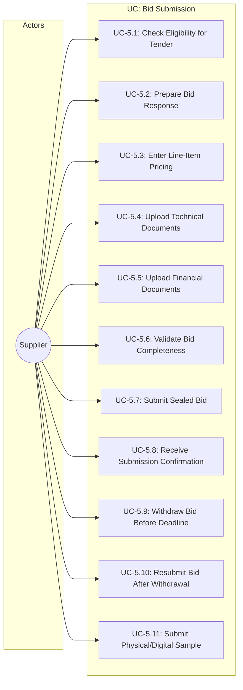

---

## 6. Bid Opening & Evaluation (Logics 7, 8, 9, 17, 18, 26)

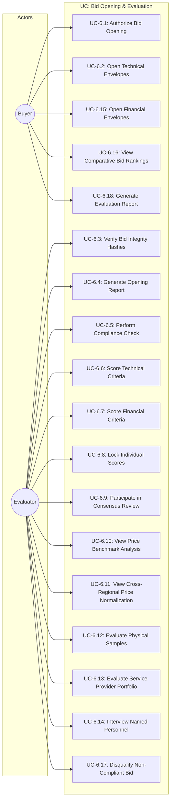

---

## 7. Award Decision & Contract Formation (Logics 10, 13, 16)

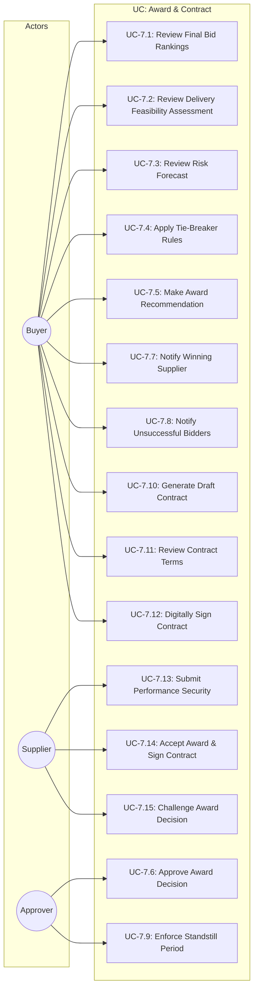

---

## 8. Approval Workflow & Budget Management (Logics 11, 12)

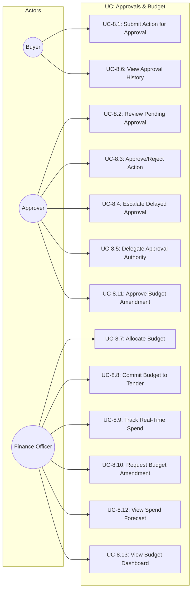

---

## 9. Post-Award & Contract Management (Logics 15, 19, 20)

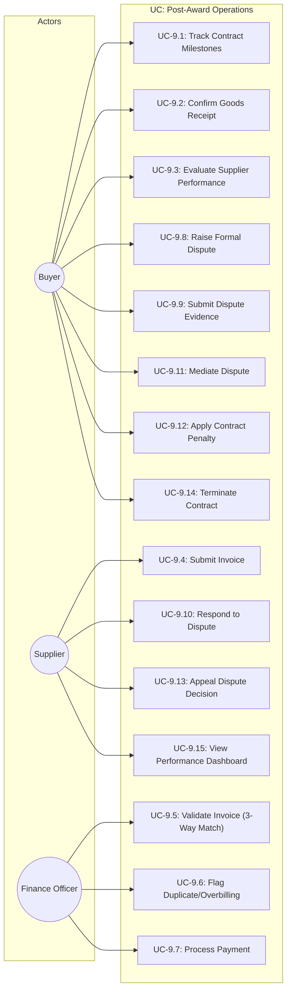

---

## 10. Risk, Anti-Collusion & Compliance (Logics 14, 23, 27, 29)

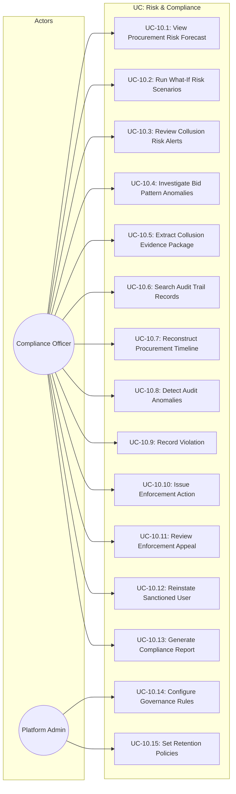

---

## 11. Market Intelligence & Platform Learning (Logics 28, 30, 31, 38)

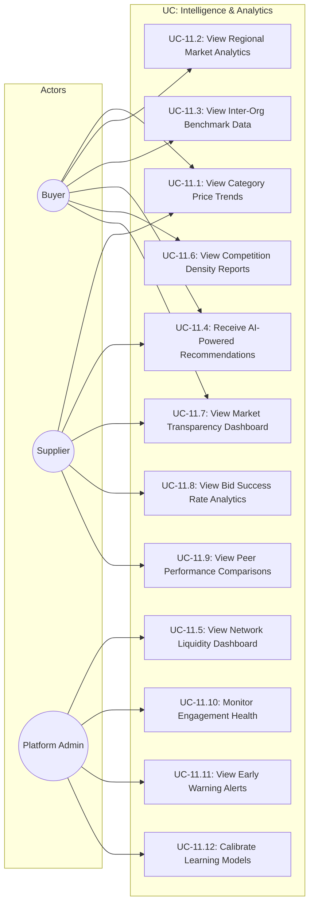

---

## 12. System Integration & Platform Administration (Logics 35, 40)

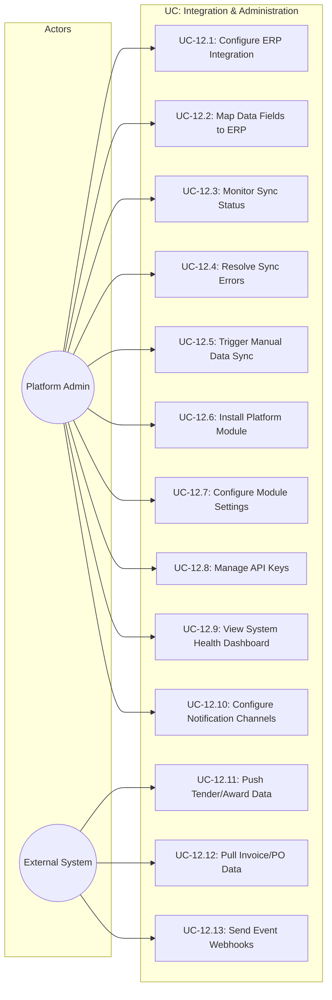

---

## 13. Unified Use Case Diagram — All Actors & Key Use Cases

```mermaid
graph TB
    subgraph "ACTORS"
        B((Buyer))
        S((Supplier))
        EV((Evaluator))
        AP((Approver))
        FO((Finance Officer))
        CO((Compliance Officer))
        PA((Platform Admin))
        ERP((ERP System))
    end

    subgraph "IDENTITY & ACCESS"
        A1["Register & Verify Identity"]
        A2["Manage Roles & Permissions"]
        A3["Progress Trust Tiers"]
    end

    subgraph "TENDER DESIGN"
        B1["Define Procurement Need"]
        B2["Set Evaluation Criteria"]
        B3["Run Quality & Bias Check"]
    end

    subgraph "MARKETPLACE"
        C1["Publish Tender"]
        C2["Browse & Search Tenders"]
        C3["Receive Matching Notifications"]
        C4["Ask/Answer Clarifications"]
    end

    subgraph "SUPPLIER MANAGEMENT"
        D1["Manage Supplier Profile"]
        D2["View Trust/Performance Score"]
        D3["Check Supplier Capacity"]
    end

    subgraph "BIDDING"
        E1["Submit Sealed Bid"]
        E2["Validate Bid Completeness"]
        E3["Withdraw/Resubmit Bid"]
    end

    subgraph "EVALUATION"
        F1["Open & Verify Bids"]
        F2["Score Bids (Tech + Financial)"]
        F3["View Price Benchmarks"]
        F4["Rank & Disqualify Bids"]
    end

    subgraph "AWARD & CONTRACT"
        G1["Make Award Decision"]
        G2["Approve Award"]
        G3["Generate & Sign Contract"]
        G4["Enforce Standstill Period"]
    end

    subgraph "BUDGET & APPROVALS"
        H1["Allocate & Track Budget"]
        H2["Submit/Process Approvals"]
        H3["Delegate Authority"]
    end

    subgraph "POST-AWARD"
        I1["Track Milestones & Receipts"]
        I2["Submit & Validate Invoices"]
        I3["Evaluate Performance"]
        I4["Resolve Disputes"]
    end

    subgraph "RISK & COMPLIANCE"
        J1["Forecast Procurement Risk"]
        J2["Detect Collusion Patterns"]
        J3["Search Audit Trails"]
        J4["Enforce Governance Rules"]
    end

    subgraph "INTELLIGENCE"
        K1["View Market Analytics"]
        K2["Receive AI Recommendations"]
        K3["Monitor Network Liquidity"]
    end

    subgraph "INTEGRATION"
        L1["Configure ERP Integration"]
        L2["Sync Data Bi-Directionally"]
        L3["Manage Platform Modules"]
    end

    %% Buyer connections
    B --> A1
    B --> B1
    B --> B2
    B --> B3
    B --> C1
    B --> C4
    B --> D3
    B --> F1
    B --> G1
    B --> G3
    B --> I1
    B --> I3
    B --> I4
    B --> K1

    %% Supplier connections
    S --> A1
    S --> A3
    S --> C2
    S --> C3
    S --> C4
    S --> D1
    S --> D2
    S --> E1
    S --> E2
    S --> E3
    S --> I2
    S --> I4
    S --> K1
    S --> K2

    %% Evaluator connections
    EV --> F1
    EV --> F2
    EV --> F3
    EV --> F4

    %% Approver connections
    AP --> G2
    AP --> G4
    AP --> H2
    AP --> H3

    %% Finance Officer connections
    FO --> H1
    FO --> I2

    %% Compliance Officer connections
    CO --> J1
    CO --> J2
    CO --> J3
    CO --> J4

    %% Platform Admin connections
    PA --> A2
    PA --> K3
    PA --> L1
    PA --> L3

    %% ERP connections
    ERP --> L2
```

---

## Use Case Summary

| Diagram | Use Cases | Primary Actors |
|---|---|---|
| 1. Identity & Access | 12 | Buyer, Supplier, Platform Admin |
| 2. Tender Design | 13 | Buyer, Approver |
| 3. Publication & Marketplace | 12 | Buyer, Supplier |
| 4. Supplier Discovery | 12 | Buyer, Supplier |
| 5. Bid Submission | 11 | Supplier |
| 6. Bid Opening & Evaluation | 18 | Buyer, Evaluator |
| 7. Award & Contract | 15 | Buyer, Supplier, Approver |
| 8. Approvals & Budget | 13 | Buyer, Approver, Finance Officer |
| 9. Post-Award Operations | 15 | Buyer, Supplier, Finance Officer |
| 10. Risk & Compliance | 15 | Compliance Officer, Platform Admin |
| 11. Intelligence & Analytics | 12 | Buyer, Supplier, Platform Admin |
| 12. Integration & Admin | 13 | Platform Admin, ERP System |
| 13. Unified Overview | 36 (key) | All 8 Actors |
| **TOTAL** | **~160 unique** | **8 actors** |

---

## Actor–Use Case Traceability

| Actor | Total Use Cases | Key Areas |
|---|---|---|
| **Buyer** | ~55 | Tender design, publication, evaluation oversight, award, contract, post-award, analytics |
| **Supplier** | ~40 | Registration, discovery, bidding, samples, invoicing, disputes, performance, analytics |
| **Evaluator** | ~18 | Bid opening, technical/financial scoring, samples, consensus, rankings |
| **Approver** | ~15 | Tender approval, award approval, budget amendments, delegation |
| **Finance Officer** | ~12 | Budget allocation, spend tracking, invoice validation, payments |
| **Compliance Officer** | ~15 | Risk forecasting, collusion detection, audit trails, governance enforcement |
| **Platform Admin** | ~18 | Verification, RBAC, governance rules, integrations, modules, monitoring |
| **ERP System** | ~5 | Data sync, webhooks, PO/invoice exchange |

---

**END OF DOCUMENT**
