# USER EXPERIENCE FLOWCHARTS
## Complete User Journeys — Procurement Intelligence & Governance Platform

**Version:** 1.0 | **Date:** February 18, 2026

---

## TABLE OF CONTENTS

1. Buyer (Procurement Officer) — Full Journey
2. Supplier (Vendor) — Full Journey
3. Evaluation Committee Member — Full Journey
4. Finance Officer — Full Journey
5. Compliance / Audit Officer — Full Journey
6. Platform Administrator — Full Journey
7. Approving Authority (Manager/Director/Executive) — Full Journey
8. Mediator / Dispute Panel — Full Journey
9. Cross-User Interaction Map — All Actors Combined

---

## 1. BUYER (Procurement Officer) — Full System Experience

> The Buyer is the primary demand-side actor who initiates, manages, and oversees the entire procurement lifecycle from need identification through contract completion and supplier performance review.

### 1.1 Buyer Onboarding & Setup

```mermaid
flowchart TD
    A([🟢 Buyer Starts]) --> B[Visit Platform Registration Page]
    B --> C[Select Role: Buyer / Procurement Officer]
    C --> D[Enter Organization Name & Details]
    D --> E[Enter Personal Info: Name, Email, Phone]
    E --> F[Set Password + Enable MFA]
    F --> G[Receive Email/SMS OTP]
    G --> H{OTP Verified?}
    H -->|No| I[Resend OTP — Max 3 Attempts]
    I --> H
    H -->|Yes| J[Account Created — Status: Pending Verification]
    
    J --> K[Upload Organizational Documents]
    K --> L[Upload: Business License]
    L --> M[Upload: Tax Registration Certificate]
    M --> N[Upload: Authorization Letter]
    N --> O[Upload: Proof of Address]
    
    O --> P{Auto-Verification?}
    P -->|Pass| Q[Status: Verified ✓]
    P -->|Fail| R[Await Manual Admin Review]
    R --> S{Admin Decision?}
    S -->|Approved| Q
    S -->|Rejected| T[Resubmit: Fix Flagged Documents]
    T --> K
    S -->|More Info Needed| U[Upload Additional Documents]
    U --> R
    
    Q --> V[Receive Welcome Email + Guides]
    V --> W[First Login — Dashboard Tour]
    W --> X[Configure Profile Preferences]
    X --> Y[Set Notification Preferences]
    Y --> Z[Set Default Budget Codes]
    Z --> AA[Invite Team Members to Organization]
    AA --> AB([✓ Buyer Onboarding Complete])
```

### 1.2 Buyer Creates a Procurement Need

```mermaid
flowchart TD
    A([Buyer: New Procurement Need]) --> B[Click: Create New Tender]
    B --> C[Step 1: Select Procurement Category]
    C --> D{Category Type?}
    D -->|Goods| E[Fill Product Specification Form]
    D -->|Services| F[Fill Scope of Work / ToR]
    D -->|Works| G[Fill Construction Specification]
    D -->|Consulting| H[Fill Terms of Reference]
    
    E --> I[Step 2: Enter Bill of Quantities]
    F --> J[Step 2: Define Deliverables & Milestones]
    G --> I
    H --> J
    
    I --> K[Step 3: Define Technical Requirements]
    J --> K
    
    K --> L[Enter: Mandatory Requirements]
    L --> M[Enter: Desirable Requirements]
    M --> N[Enter: Technical Specifications Detail]
    N --> O[Attach: Reference Documents / Drawings]
    
    O --> P[Step 4: Set Evaluation Criteria]
    P --> Q[Add Criterion: Technical Score — Weight %]
    Q --> R[Add Criterion: Financial Score — Weight %]
    R --> S[Add Criterion: Experience — Weight %]
    S --> T[Add Criterion: Delivery Timeline — Weight %]
    T --> U{Total Weights = 100%?}
    U -->|No| V[⚠ Adjust Weights]
    V --> Q
    U -->|Yes| W[Step 5: Configure Timeline]
    
    W --> X[Set: Clarification Window Start/End]
    X --> Y[Set: Bid Submission Deadline]
    Y --> Z[Set: Expected Evaluation Duration]
    Z --> AA[Set: Expected Delivery Date]
    
    AA --> AB[Step 6: Budget & Financial Setup]
    AB --> AC[Select Budget Code from Allocation]
    AC --> AD{Budget Available?}
    AD -->|No| AE[Request Budget Amendment]
    AE --> AF[Wait for Finance Approval]
    AF --> AC
    AD -->|Yes| AG[Link Budget to This Tender]
    
    AG --> AH[Step 7: Select Visibility Model]
    AH --> AI{Model?}
    AI -->|Open/Public| AJ[Visible to All Suppliers]
    AI -->|Restricted| AK[Set Category/Region Filters]
    AI -->|Closed/Invited| AL[Search & Select Suppliers to Invite]
    
    AJ --> AM[Step 8: Review & Quality Check]
    AK --> AM
    AL --> AM
    
    AM --> AN[System Runs Quality Analysis]
    AN --> AO{Quality Flags?}
    AO -->|Vagueness Detected| AP[⚠ Review: Ambiguous Specs Highlighted]
    AO -->|Bias Detected| AQ[⚠ Review: Brand-Specific Language Found]
    AO -->|Exclusion Risk| AR[⚠ Review: Restrictive Criteria Found]
    AO -->|All Clear ✓| AS[Quality Check Passed]
    
    AP --> AT{Fix or Override?}
    AQ --> AT
    AR --> AT
    AT -->|Fix| K
    AT -->|Override + Justify| AU[Enter Justification for Override]
    AU --> AS
    
    AS --> AV[Step 9: Submit Tender for Approval]
    AV --> AW[Status: Pending Approval]
    AW --> AX([✓ Tender Created — Awaiting Approval])
```

### 1.3 Buyer Manages Active Tender

```mermaid
flowchart TD
    A([Buyer: Tender Published]) --> B[Monitor Dashboard: Active Tenders]
    B --> C[View: Supplier Interest / Downloads Count]
    
    C --> D{Clarification Questions Received?}
    D -->|Yes| E[Review Supplier Question]
    E --> F[Draft Answer]
    F --> G[Submit Answer — Published to ALL Bidders]
    G --> D
    D -->|No / Window Closed| H{Amendment Needed?}
    
    H -->|Yes| I[Create Tender Amendment]
    I --> J[Modify: Specs / Criteria / Dates]
    J --> K{Deadline Extension Needed?}
    K -->|Yes| L[Extend Submission Deadline]
    K -->|No| M[Publish Amendment]
    L --> M
    M --> N[All Bidders Notified of Changes]
    N --> B
    
    H -->|No| O[Wait for Submission Deadline]
    O --> P{Bids Received?}
    P -->|Zero Bids| Q[Option: Extend Deadline / Cancel / Re-tender]
    Q --> R{Decision?}
    R -->|Extend| L
    R -->|Cancel| S[Cancel Tender — Record Reason]
    R -->|Re-tender| T[Create New Tender from Template]
    P -->|Bids Received| U[Deadline Passes — Bids Locked]
    
    U --> V[Authorize Bid Opening]
    V --> W[Co-Authorize with Second Officer]
    W --> X[System Decrypts & Verifies Bids]
    X --> Y[View Opening Report]
    Y --> Z([✓ Bids Opened — Ready for Evaluation])
```

### 1.4 Buyer Manages Evaluation & Award

```mermaid
flowchart TD
    A([Buyer: Evaluation Phase]) --> B[Assign Evaluation Committee]
    B --> C[Select Evaluators from Approved Panel]
    C --> D[System Checks Conflicts of Interest]
    D --> E{Conflicts Found?}
    E -->|Yes| F[Remove Conflicted Evaluator + Add Replacement]
    F --> D
    E -->|No| G[Distribute Bids to Committee]
    
    G --> H[Monitor Evaluation Progress]
    H --> I[View: Individual Evaluator Status]
    I --> J{All Evaluators Scored?}
    J -->|No| K[Send Reminder to Pending Evaluators]
    K --> H
    J -->|Yes| L[Review Variance Report]
    
    L --> M{High Score Variance?}
    M -->|Yes| N[Schedule Consensus Meeting]
    N --> O[Chair Moderation Session]
    O --> P[Record Consensus Scores]
    M -->|No| Q[Accept Averaged Scores]
    
    P --> R[Review Price Intelligence Report]
    Q --> R
    
    R --> S[View: Price vs Market Benchmark]
    S --> T[View: Outlier Flags]
    T --> U[View: Collusion Risk Indicators]
    U --> V[View: Risk Forecast per Supplier]
    
    V --> W[Review Final Rankings]
    W --> X[Select Recommended Winner]
    X --> Y[Write Award Justification]
    Y --> Z[Submit Award Recommendation]
    Z --> AA[Route to Approval Authority]
    
    AA --> AB{Approval Decision?}
    AB -->|Approved| AC[System Notifies Winner + All Losers]
    AB -->|Rejected| AD[Revise Recommendation]
    AD --> W
    AB -->|Changes Requested| AE[Modify Recommendation]
    AE --> Z
    
    AC --> AF[Standstill Period Begins]
    AF --> AG{Challenge Received?}
    AG -->|Yes| AH[Review Challenge]
    AH --> AI{Valid Challenge?}
    AI -->|Yes| AJ[Re-evaluate or Cancel Award]
    AI -->|No| AK[Dismiss + Document Reason]
    AG -->|No Challenge| AK
    
    AK --> AL[Generate Draft Contract]
    AL --> AM[Review & Customize Contract Terms]
    AM --> AN[Send Contract to Supplier for Review]
    AN --> AO{Supplier Accepts?}
    AO -->|Counter-Proposal| AP[Negotiate Terms]
    AP --> AM
    AO -->|Accepts| AQ[Both Parties Sign Digitally]
    AQ --> AR[Contract Activated]
    AR --> AS([✓ Contract Live — Monitoring Begins])
```

### 1.5 Buyer: Post-Award Contract Monitoring

```mermaid
flowchart TD
    A([Buyer: Contract Active]) --> B[Monitor Milestones Dashboard]
    B --> C{Milestone Due?}
    C -->|Yes| D[Review Deliverable Submission]
    D --> E{Quality Acceptable?}
    E -->|Yes| F[Accept Delivery — Record in GRN]
    E -->|Partial| G[Accept Partial — Request Remainder]
    E -->|No| H[Reject — Raise Dispute]
    C -->|Not Yet| B
    
    F --> I{Invoice Received?}
    G --> I
    I -->|Yes| J[System Runs 3-Way Match]
    J --> K{Match Result?}
    K -->|Full Match ✓| L[Approve Invoice for Payment]
    K -->|Partial Match| M[Review Discrepancies]
    M --> N{Accept or Reject?}
    N -->|Accept with Adjustment| L
    N -->|Reject| O[Return Invoice to Supplier]
    K -->|Over-billing| P[Flag for Finance Investigation]
    
    L --> Q[Payment Processed via Finance]
    
    Q --> R{Contract Complete?}
    R -->|No| B
    R -->|Yes| S[Rate Supplier Performance]
    S --> T[Score: Delivery Timeliness]
    T --> U[Score: Quality of Goods/Services]
    U --> V[Score: Communication & Responsiveness]
    V --> W[Score: Compliance with Terms]
    W --> X[Score: Financial Accuracy]
    X --> Y[Submit Performance Review]
    Y --> Z[System Updates Supplier Trust Score]
    Z --> AA[Close Contract]
    AA --> AB([✓ Procurement Cycle Complete])
    
    H --> AC[Open Dispute Case]
    AC --> AD[Upload Evidence: Photos, Reports]
    AD --> AE[Supplier Notified — Response Window Opens]
    AE --> AF{Resolution?}
    AF -->|Direct Resolution| AG[Agree Terms + Close]
    AF -->|No Resolution| AH[Escalate to Mediation]
    AH --> AI[Platform Assigns Mediator]
    AI --> AJ[Mediation Decision Issued]
    AJ --> AK{Accept Decision?}
    AK -->|Yes| AG
    AK -->|No| AL[File Appeal]
    AL --> AM[Appeal Panel Reviews]
    AM --> AN[Final Decision — Binding]
    AN --> AG
```

---

## 2. SUPPLIER (Vendor) — Full System Experience

> The Supplier is the supply-side actor who discovers opportunities, submits bids, wins contracts, delivers goods/services, and builds reputation over time.

### 2.1 Supplier Onboarding & Profile Setup

```mermaid
flowchart TD
    A([🟢 Supplier Starts]) --> B[Visit Platform Registration]
    B --> C[Select Role: Supplier / Vendor]
    C --> D[Enter Business Name & Legal Form]
    D --> E[Enter: Registration Number, Tax ID]
    E --> F[Enter: Primary Contact Details]
    F --> G[Set Password + Enable MFA]
    G --> H[Verify Email + Phone via OTP]
    H --> I{OTP Valid?}
    I -->|No| J[Resend — Max 3 Attempts]
    J --> I
    I -->|Yes| K[Account Created — Pending Verification]
    
    K --> L[Upload Business Documents]
    L --> M[Upload: Business Registration Certificate]
    M --> N[Upload: Tax Compliance Certificate]
    N --> O[Upload: Financial Statements]
    O --> P[Upload: Industry Certifications]
    P --> Q[Upload: Past Performance References]
    
    Q --> R{Auto-Verification?}
    R -->|Pass| S[Status: Verified ✓ — Trust Tier 1]
    R -->|Fail| T[Await Manual Admin Review]
    T --> U{Approved?}
    U -->|Yes| S
    U -->|No| V[Resubmit Corrected Documents]
    V --> L
    
    S --> W[Complete Supplier Profile]
    W --> X[Add: Business Categories & Product Lines]
    X --> Y[Add: Geographic Coverage / Delivery Zones]
    Y --> Z[Add: Company Capacity & Resources]
    Z --> AA[Add: Key Personnel / Team Details]
    AA --> AB[Add: Portfolio / Past Projects Gallery]
    AB --> AC[Add: Bank Account Details for Payment]
    AC --> AD[Set: Notification Preferences]
    AD --> AE[Set: Saved Search Alerts for Tenders]
    AE --> AF([✓ Supplier Profile Active])
```

### 2.2 Supplier Discovers & Explores Opportunities

```mermaid
flowchart TD
    A([Supplier: Explore Market]) --> B[Login to Dashboard]
    B --> C[View: Recommended Tenders — AI Matched]
    C --> D[View: New Tenders in My Categories]
    D --> E[View: Saved Search Alert Results]
    
    E --> F{Browse or Search?}
    F -->|Browse| G[Filter: By Category]
    G --> H[Filter: By Region]
    H --> I[Filter: By Value Range]
    I --> J[Filter: By Deadline]
    F -->|Search| K[Enter: Keyword Search]
    K --> L[View: Full-Text Search Results]
    
    J --> M[View: Tender Listing with Match Score]
    L --> M
    
    M --> N[Click: View Tender Details]
    N --> O[Read: Full Specifications & BOQ]
    O --> P[Read: Evaluation Criteria & Weights]
    P --> Q[Read: Timeline & Deadlines]
    Q --> R[Download: Tender Documents Package]
    
    R --> S{Clarification Needed?}
    S -->|Yes| T[Submit Clarification Question]
    T --> U[Wait for Buyer Response]
    U --> V[Read: Published Response — Visible to All]
    S -->|No| W{Decision to Bid?}
    V --> W
    
    W -->|Not Interested| X[Skip / Archive Tender]
    W -->|Interested| Y[Check: Am I Eligible?]
    Y --> Z{Eligibility Check}
    Z -->|Trust Tier Too Low| AA[⚠ Not Eligible — Build More History]
    Z -->|Category Mismatch| AB[⚠ Update Profile Categories]
    Z -->|Blacklisted| AC[🚨 Contact Support]
    Z -->|Eligible ✓| AD[Proceed to Bid Preparation]
    AD --> AE([✓ Ready to Bid])
```

### 2.3 Supplier Prepares & Submits Bid

```mermaid
flowchart TD
    A([Supplier: Prepare Bid]) --> B[Open Bid Preparation Workspace]
    B --> C{Bid Type Required?}
    C -->|Price Only| D[Enter Line-Item Unit Prices]
    C -->|Two-Envelope| E[Prepare Technical + Financial Separately]
    C -->|Service/Consulting| F[Prepare Qualifications + Methodology]
    C -->|Multi-Lot| G[Select Relevant Lots to Bid On]
    
    D --> H[Fill: Quantity × Unit Price per Item]
    E --> I[Fill: Technical Proposal Document]
    I --> J[Fill: Financial Proposal Document]
    F --> K[Fill: Firm Experience & Capability]
    K --> L[Fill: Proposed Team CVs]
    L --> M[Fill: Methodology & Work Plan]
    G --> H
    
    H --> N[Upload: Supporting Documents]
    J --> N
    M --> N
    N --> O[Upload: Compliance Certificates]
    O --> P[Upload: Past Performance References]
    P --> Q[Upload: Financial Capability Proof]
    
    Q --> R{Samples Required?}
    R -->|Yes — Physical| S[Ship Samples to Designated Address]
    S --> T[Enter: Shipping Tracking Details]
    R -->|Yes — Digital| U[Upload Digital Sample Files]
    R -->|No| V[Proceed to Validation]
    T --> V
    U --> V
    
    V --> W[Click: Validate Bid]
    W --> X{Validation Result?}
    X -->|Missing Mandatory Fields| Y[⚠ Fix: Highlighted Missing Fields]
    Y --> B
    X -->|Calculation Errors| Z[⚠ Fix: Qty × Price ≠ Total]
    Z --> B
    X -->|Missing Documents| AA[⚠ Fix: Upload Required Certs]
    AA --> B
    X -->|All Valid ✓| AB[Review: Complete Bid Summary]
    
    AB --> AC{Satisfied with Bid?}
    AC -->|No| AD[Edit: Make Changes]
    AD --> B
    AC -->|Yes| AE[Click: Submit Final Bid]
    
    AE --> AF{Before Deadline?}
    AF -->|No| AG[🚨 REJECTED: Deadline Passed]
    AF -->|Yes| AH[System Encrypts Bid — SHA-256 Hash]
    AH --> AI[Bid Locked — Immutable]
    AI --> AJ[Receive: Submission Confirmation + Receipt]
    AJ --> AK[Receive: Hash for Integrity Verification]
    
    AK --> AL{Change of Mind Before Deadline?}
    AL -->|Yes| AM[Withdraw Bid — Enter Reason]
    AM --> AN[Prepare & Submit Revised Bid]
    AN --> AE
    AL -->|No| AO([✓ Bid Sealed & Submitted])
```

### 2.4 Supplier: Post-Submission to Award

```mermaid
flowchart TD
    A([Supplier: Waiting for Result]) --> B[Monitor: Tender Status on Dashboard]
    B --> C[See: Status Updates — Opening, Evaluation, etc.]
    
    C --> D{Evaluation Activities?}
    D -->|Sample Evaluation| E[Receive: Sample Evaluation Notice]
    D -->|Interview Requested| F[Receive: Interview Scheduling]
    F --> G[Attend Interview / Presentation]
    G --> H[Demonstrate Capabilities]
    D -->|No Activities| I[Wait for Decision]
    E --> I
    H --> I
    
    I --> J[Receive: Award Notification]
    J --> K{Result?}
    K -->|🏆 Winner| L[Congratulations Email + Details]
    K -->|Not Selected| M[Receive: Score Breakdown Report]
    
    M --> N[Review: My Scores vs Requirements]
    N --> O{Disagree with Result?}
    O -->|Yes| P[File Formal Challenge During Standstill]
    P --> Q[Upload: Challenge Evidence & Arguments]
    Q --> R[Await: Challenge Review Decision]
    R --> S{Challenge Outcome?}
    S -->|Upheld — Re-evaluation| T[Await New Decision]
    S -->|Dismissed| U[Accept Result — Learn for Next Time]
    O -->|No| U
    U --> V([Continue Bidding on Other Tenders])
    
    L --> W[Review Draft Contract]
    W --> X{Terms Acceptable?}
    X -->|No| Y[Propose Counter-Terms]
    Y --> Z[Negotiate with Buyer]
    Z --> W
    X -->|Yes| AA[Digitally Sign Contract]
    AA --> AB[Upload: Performance Security/Bond]
    AB --> AC[Contract Status: Active ✓]
    AC --> AD([✓ Contract Execution Begins])
```

### 2.5 Supplier: Contract Execution & Delivery

```mermaid
flowchart TD
    A([Supplier: Executing Contract]) --> B[View: Contract Milestones & Schedule]
    B --> C{Milestone Due?}
    C -->|Yes| D[Prepare Deliverable / Goods]
    D --> E[Ship / Deliver to Buyer Location]
    E --> F[Upload: Delivery Note / Proof of Delivery]
    F --> G[Upload: Quality Test Results]
    G --> H[Await: Buyer Acceptance]
    
    H --> I{Buyer Response?}
    I -->|Accepted ✓| J[Milestone Status: Complete]
    I -->|Partial Acceptance| K[Deliver Remaining Items]
    K --> E
    I -->|Rejected| L[Review: Rejection Reasons]
    L --> M{Agree with Rejection?}
    M -->|Yes| N[Replace / Re-deliver]
    N --> E
    M -->|No| O[Raise Dispute]
    
    J --> P[Submit Invoice for Milestone]
    P --> Q[Enter: Invoice Details & Amount]
    Q --> R[Attach: Invoice Document + Supporting Docs]
    R --> S[Submit Invoice via Platform]
    
    S --> T[System: 3-Way Match Running]
    T --> U{Match Result?}
    U -->|Matched ✓| V[Invoice Approved — Payment Processing]
    U -->|Discrepancy| W[Receive: Discrepancy Notice]
    W --> X[Review & Correct Invoice]
    X --> S
    U -->|Rejected| Y[Receive: Rejection Reason]
    Y --> Z[Resubmit Corrected Invoice]
    Z --> S
    
    V --> AA[Receive Payment to Bank Account]
    AA --> AB{More Milestones?}
    AB -->|Yes| C
    AB -->|No| AC[Contract Complete]
    
    AC --> AD[Receive: Performance Rating from Buyer]
    AD --> AE[View: Updated Performance Score]
    AE --> AF[View: Updated Trust Tier]
    AF --> AG{Tier Change?}
    AG -->|Upgraded ⬆| AH[🎉 New Benefits Unlocked]
    AH --> AI[Access: Higher Value Tenders]
    AI --> AJ[Reduced: Oversight Requirements]
    AG -->|Same| AK[Maintain Current Access]
    AG -->|Downgraded ⬇| AL[⚠ Restricted Access + Monitoring]
    
    AK --> AM([✓ Ready for Next Opportunity])
    AJ --> AM
    AL --> AM
    
    O --> AN[File Dispute Case]
    AN --> AO[Upload: Evidence & Documentation]
    AO --> AP[Await: Buyer Response or Mediation]
    AP --> AQ[Resolution Reached]
    AQ --> AB
```

---

## 3. EVALUATION COMMITTEE MEMBER — Full Experience

> Evaluators are independent subject-matter experts who score bids objectively, participate in consensus sessions, and validate technical/service capabilities.

### 3.1 Evaluator Complete Journey

```mermaid
flowchart TD
    A([🟢 Evaluator Assigned]) --> B[Receive: Evaluation Assignment Notification]
    B --> C[Login to Evaluation Dashboard]
    
    C --> D[Step 1: Conflict of Interest Declaration]
    D --> E{Any Conflicts with Bidders?}
    E -->|Yes| F[Declare Conflict — Recused from Tender]
    F --> G([⬅ Replaced by Another Evaluator])
    E -->|No| H[Sign: Confidentiality & Impartiality Agreement]
    
    H --> I[Step 2: Review Assigned Bids]
    I --> J{For Each Bid Assigned}
    J --> K[Open Bid Package]
    K --> L[Review: Technical Proposal]
    L --> M[Review: Supporting Documents]
    M --> N[Review: Compliance Certificates]
    N --> O[Review: Past Performance References]
    
    O --> P{Sample Evaluation Required?}
    P -->|Yes| Q[Receive: Anonymized Physical/Digital Sample]
    Q --> R[Evaluate Sample Against Criteria]
    R --> S[Score: Sample Quality]
    P -->|No| T[Proceed to Scoring]
    S --> T
    
    T --> U{Service/Consulting Bid?}
    U -->|Yes| V[Review: Portfolio & Past Projects]
    V --> W[Review: Proposed Team CVs & Qualifications]
    W --> X[Attend: Supplier Interview/Presentation]
    X --> Y[Score: Interview Performance]
    U -->|No| Z[Score Technical Criteria]
    Y --> Z
    
    Z --> AA[Step 3: Score Each Criterion]
    AA --> AB[Enter Score: Criterion 1 + Written Justification]
    AB --> AC[Enter Score: Criterion 2 + Written Justification]
    AC --> AD[Enter Score: Criterion 3 + Written Justification]
    AD --> AE[Enter Score: Criterion N + Written Justification]
    
    AE --> AF[Review: My Complete Scores for This Bid]
    AF --> AG{Satisfied?}
    AG -->|No| AH[Revise Scores]
    AH --> AA
    AG -->|Yes| AI[Lock Scores — Immutable ✓]
    
    AI --> AJ{More Bids to Evaluate?}
    AJ -->|Yes| J
    AJ -->|No| AK[Step 4: All Individual Scoring Complete]
    
    AK --> AL{Variance Check by System}
    AL -->|High Variance Detected| AM[Attend: Consensus/Moderation Session]
    AM --> AN[Discuss Differences with Other Evaluators]
    AN --> AO[Reach Consensus Score]
    AO --> AP[Record: Consensus Decision + Notes]
    AL -->|No Variance Issues| AQ[Proceed to Aggregation]
    AP --> AQ
    
    AQ --> AR[View: Aggregated Evaluation Report]
    AR --> AS[Confirm: Final Rankings Correct]
    AS --> AT[Sign Off on Evaluation Report]
    AT --> AU([✓ Evaluation Complete — Results to Buyer])
```

---

## 4. FINANCE OFFICER — Full Experience

> The Finance Officer manages budgets, validates invoices, processes payments, and ensures financial controls are maintained throughout the procurement lifecycle.

### 4.1 Finance Officer Complete Journey

```mermaid
flowchart TD
    A([🟢 Finance Officer]) --> B[Login to Finance Dashboard]
    
    B --> C{Task Queue}
    C -->|Budget Request| D[Review: Budget Allocation Request]
    C -->|Budget Amendment| E[Review: Budget Modification Request]
    C -->|Invoice Validation| F[Review: Invoice for Payment]
    C -->|Spend Report| G[Generate: Spend Analysis Report]
    C -->|Forecast| H[Review: Budget Forecasting]
    
    D --> I[Verify: Fiscal Year & Coding Correct]
    I --> J[Verify: Amount vs Approved Limits]
    J --> K[Verify: No Duplicate Budget Codes]
    K --> L{Approve Budget?}
    L -->|Yes| M[Create Budget Record — Status: Active]
    L -->|No| N[Reject with Reason]
    
    E --> O[Review: Amendment Justification]
    O --> P{Amendment Type?}
    P -->|Increase| Q[Check: Surplus Availability]
    Q --> R{Funds Available?}
    R -->|Yes| S[Approve Budget Increase]
    R -->|No| T[Reject: Insufficient Funds]
    P -->|Reallocation| U[Verify Source Budget Has Surplus]
    U --> V[Process Cross-Budget Transfer]
    P -->|Decrease| W[Auto-Check: No Active Commitments Affected]
    W --> X[Approve Decrease]
    
    F --> Y[Review: Invoice Details & Amount]
    Y --> Z[View: 3-Way Match Report]
    Z --> AA{Match Status?}
    AA -->|Full Match ✓| AB[Approve for Payment]
    AA -->|Partial Match — Within Tolerance| AC[Review Discrepancy]
    AC --> AD{Accept?}
    AD -->|Yes| AB
    AD -->|No| AE[Return Invoice to Supplier]
    AA -->|Over-billing Detected| AF[🚨 Open Investigation]
    AF --> AG[Review: PO vs Invoice vs Receipt Details]
    AG --> AH{Explanation Satisfactory?}
    AH -->|Yes| AI[Approve with Adjustment]
    AH -->|No| AJ[Block Payment + Report to Compliance]
    AA -->|Duplicate Detected| AK[🚨 Block + Alert Supplier]
    
    AB --> AL[Process Payment via Banking System]
    AI --> AL
    AL --> AM[Record: Payment Transaction]
    AM --> AN[Update: Budget Spent Amount]
    AN --> AO[Update: Commitment Released]
    
    G --> AP[Generate: Spend by Category Report]
    AP --> AQ[Generate: Spend by Supplier Report]
    AQ --> AR[Generate: Budget Utilization Report]
    AR --> AS[Generate: Forecast vs Actual Report]
    AS --> AT[Export: Reports for Management Review]
    
    H --> AU[Review: Cash Flow Projections]
    AU --> AV[Review: Upcoming Commitments]
    AV --> AW[Flag: Budget Lines Near Exhaustion ⚠]
    AW --> AX[Recommend: Budget Adjustments]
    
    AO --> AY([✓ Finance Task Complete])
    AT --> AY
    AX --> AY
    N --> AY
    T --> AY
    AE --> AY
    AJ --> AY
    AK --> AY
```

---

## 5. COMPLIANCE / AUDIT OFFICER — Full Experience

> The Compliance Officer monitors system integrity, investigates violations, reviews audit trails, manages collusion alerts, and enforces governance policies.

### 5.1 Compliance Officer Complete Journey

```mermaid
flowchart TD
    A([🟢 Compliance Officer]) --> B[Login to Compliance Dashboard]
    
    B --> C[View: Alert Queue]
    C --> D{Alert Types}
    D -->|Collusion Alert| E[Review: Anti-Collusion Analysis Report]
    D -->|Anomaly Alert| F[Review: Audit Anomaly Detection]
    D -->|Violation Report| G[Review: Governance Violation]
    D -->|Whistleblower Tip| H[Review: Anonymous Report]
    
    E --> I[Examine: Price Correlation Data]
    I --> J[Examine: Win Rotation Patterns]
    J --> K[Examine: Document Metadata Similarity]
    K --> L[Examine: Timing Analysis]
    L --> M{Collusion Confirmed?}
    M -->|Yes| N[Open: Formal Investigation]
    N --> O[Extract: Evidence Package]
    O --> P[Refer: To Governance Enforcement]
    M -->|No — Small Market| Q[Record: Cleared with Justification]
    M -->|Inconclusive| R[Flag: Enhanced Monitoring]
    
    F --> S[Review: After-Hours Access Logs]
    S --> T[Review: Mass Data Access Patterns]
    T --> U[Review: Privilege Escalation Attempts]
    U --> V{Threat Level?}
    V -->|False Positive| W[Dismiss + Document]
    V -->|Genuine Concern| X[Escalate to Security Team]
    V -->|Critical Breach| Y[🚨 Immediate Lock Account + Investigate]
    
    G --> Z{Violation Severity?}
    Z -->|Minor| AA[Issue: Formal Warning]
    Z -->|Moderate| AB[Action: Restrict Bidding Access]
    Z -->|Severe| AC[Action: Suspend Account]
    Z -->|Critical| AD[Action: Blacklist + Legal Referral]
    
    AA --> AE[Record Violation in System]
    AB --> AE
    AC --> AE
    AD --> AE
    
    AE --> AF[Notify: User of Enforcement Action]
    AF --> AG{Appeal Filed?}
    AG -->|Yes| AH[Review: Appeal Evidence]
    AH --> AI{Appeal Decision?}
    AI -->|Upheld| AJ[Maintain Action]
    AI -->|Overturned| AK[Remove/Reduce Action]
    AI -->|Modified| AL[Adjust Action Level]
    AG -->|No| AJ
    
    H --> AM[Assess: Tip Credibility]
    AM --> AN{Actionable?}
    AN -->|Yes| AO[Open: Confidential Investigation]
    AO --> N
    AN -->|No| AP[Archive with Notes]
    
    AJ --> AQ[Generate: Compliance Report]
    AK --> AQ
    AL --> AQ
    Q --> AQ
    R --> AQ
    W --> AQ
    X --> AQ
    Y --> AQ
    AP --> AQ
    AQ --> AR[Update: Compliance Dashboard Metrics]
    AR --> AS([✓ Compliance Task Complete])
```

---

## 6. PLATFORM ADMINISTRATOR — Full Experience

> The Admin manages the platform itself — user verifications, system configuration, module management, ERP integrations, and overall system health.

### 6.1 Platform Admin Complete Journey

```mermaid
flowchart TD
    A([🟢 Platform Admin]) --> B[Login to Admin Console]
    
    B --> C{Admin Task Queue}
    C -->|User Verification| D[Review: Pending User Applications]
    C -->|System Config| E[Manage: Platform Settings]
    C -->|Module Mgmt| F[Manage: System Modules]
    C -->|ERP Sync| G[Monitor: ERP Integration Status]
    C -->|User Support| H[Handle: Support Tickets]
    C -->|Health Monitor| I[View: System Health Dashboard]
    
    D --> J[Open: User Application]
    J --> K[Review: Submitted Documents]
    K --> L[Cross-Reference: External Databases]
    L --> M{Verification Decision?}
    M -->|Approve| N[Set Status: Verified ✓]
    N --> O[Assign: Initial Trust Tier]
    O --> P[Assign: Default Role Permissions]
    M -->|Reject| Q[Set Status: Rejected + Notify]
    M -->|Request More| R[Request: Additional Documents]
    
    E --> S[Configure: Approval Thresholds]
    S --> T[Configure: Budget Rules & Limits]
    T --> U[Configure: Notification Templates]
    U --> V[Configure: Evaluation Parameters]
    V --> W[Configure: Trust Tier Thresholds]
    W --> X[Configure: SoD Rules]
    X --> Y[Save: Configuration Changes]
    
    F --> Z{Module Action?}
    Z -->|Install| AA[Upload/Download Module Package]
    AA --> AB[Validate: Compatibility Check]
    AB --> AC{Compatible?}
    AC -->|Yes| AD[Install + Register Module]
    AC -->|No| AE[Reject: Version Mismatch]
    Z -->|Update| AF[Download Update + Apply]
    AF --> AG[Run: Post-Update Health Check]
    Z -->|Disable| AH[Deactivate Module]
    Z -->|Configure| AI[Open Module Settings]
    
    G --> AJ[View: Sync Status Dashboard]
    AJ --> AK{Sync Issues?}
    AK -->|Failed Syncs| AL[Review: Error Logs]
    AL --> AM[Retry: Failed Transactions]
    AM --> AN{Fixed?}
    AN -->|Yes| AO[Clear Alert]
    AN -->|No| AP[Escalate to Dev Team]
    AK -->|All Healthy| AQ[No Action Needed]
    
    H --> AR[Open: Support Ticket]
    AR --> AS[Investigate: User Issue]
    AS --> AT{Resolution?}
    AT -->|Password Reset| AU[Reset + Notify User]
    AT -->|Access Issue| AV[Adjust Permissions]
    AT -->|Bug Report| AW[Forward to Dev Team]
    AT -->|Feature Request| AX[Log for Product Backlog]
    
    I --> AY[View: Server Performance Metrics]
    AY --> AZ[View: API Response Times]
    AZ --> BA[View: Database Performance]
    BA --> BB[View: Active User Count]
    BB --> BC[View: Market Liquidity Index]
    BC --> BD{Health Issues?}
    BD -->|Yes| BE[Trigger: Alerts + Remediation]
    BD -->|No| BF[System Healthy ✓]
    
    P --> BG([✓ Admin Task Complete])
    Q --> BG
    R --> BG
    Y --> BG
    AD --> BG
    AE --> BG
    AG --> BG
    AH --> BG
    AI --> BG
    AO --> BG
    AP --> BG
    AQ --> BG
    AU --> BG
    AV --> BG
    AW --> BG
    AX --> BG
    BE --> BG
    BF --> BG
```

---

## 7. APPROVING AUTHORITY (Manager / Director / Executive) — Full Experience

> The Approving Authority reviews and approves/rejects actions based on value thresholds, risk levels, and organizational policy.

### 7.1 Approving Authority Complete Journey

```mermaid
flowchart TD
    A([🟢 Approver Logs In]) --> B[View: Pending Approvals Dashboard]
    B --> C[See: Count by Type + Urgency]
    
    C --> D{Select Approval Item}
    D -->|Tender Publication| E[Review Tender Package]
    D -->|Award Decision| F[Review Award Recommendation]
    D -->|Budget Amendment| G[Review Budget Change]
    D -->|Contract Modification| H[Review Contract Change]
    D -->|User Access Change| I[Review Access Request]
    
    E --> J[Review: Specifications & Scope]
    J --> K[Review: Budget Allocation]
    K --> L[Review: Design Quality Report]
    L --> M[Review: Visibility Model]
    M --> N{Below My Authority Threshold?}
    
    F --> O[Review: Final Rankings & Scores]
    O --> P[Review: Price Intelligence Report]
    P --> Q[Review: Risk Forecast]
    Q --> R[Review: Award Justification]
    R --> N
    
    G --> S[Review: Amendment Justification]
    S --> T[Review: Impact on Budget]
    T --> N
    
    H --> U[Review: Contract Changes]
    U --> V[Review: Financial Impact]
    V --> N
    
    I --> W[Review: Access Justification]
    W --> X[Review: SoD Impact]
    X --> N
    
    N -->|No — Too High for My Level| Y[Auto-Escalated to Higher Authority]
    N -->|Yes — Within My Authority| Z{Decision?}
    
    Z -->|✓ Approve| AA[Record: Approval + Timestamp + Comments]
    Z -->|✗ Reject| AB[Record: Rejection + Detailed Reason]
    Z -->|↩ Request Changes| AC[Record: Change Request + Comments]
    
    AA --> AD{More Steps in Chain?}
    AD -->|Yes| AE[Route to Next Approver]
    AD -->|No| AF[Status: FULLY APPROVED ✓]
    AF --> AG[Notify: Requester of Approval]
    
    AB --> AH[Status: REJECTED ✗]
    AH --> AI[Notify: Requester of Rejection]
    
    AC --> AJ[Status: RETURNED]
    AJ --> AK[Notify: Requester — Changes Needed]
    
    AG --> AL{Delegation Active?}
    AL -->|I'm a Delegate| AM[Record: Acting on Behalf of Primary]
    AL -->|Primary Approver| AN[Standard Approval Recorded]
    
    AM --> AO([✓ Approval Task Complete])
    AN --> AO
    AI --> AO
    AK --> AO
    Y --> AO
```

---

## 8. MEDIATOR / DISPUTE PANEL — Full Experience

> Mediators are assigned to resolve disputes between Buyers and Suppliers when direct resolution fails.

### 8.1 Mediator Complete Journey

```mermaid
flowchart TD
    A([🟢 Mediator Assigned]) --> B[Receive: Dispute Assignment Notification]
    B --> C[Login to Dispute Resolution Panel]
    
    C --> D[Step 1: Review Case Details]
    D --> E[Read: Complainant Statement + Evidence]
    E --> F[Read: Respondent Statement + Evidence]
    F --> G[Read: Contract Terms & Obligations]
    G --> H[Read: Delivery/Performance Records]
    H --> I[Read: Communication History]
    
    I --> J[Step 2: Assess Case]
    J --> K{Dispute Type?}
    K -->|Delivery Issue| L[Check: Delivery Records vs Contract]
    K -->|Quality Issue| M[Review: Quality Test Results vs Specs]
    K -->|Financial Issue| N[Review: Invoice vs PO vs Receipt]
    K -->|Contractual| O[Compare: Actual vs Agreed Terms]
    K -->|Compliance| P[Review: Regulatory Requirements]
    
    L --> Q[Step 3: Request Additional Information?]
    M --> Q
    N --> Q
    O --> Q
    P --> Q
    
    Q --> R{Need More Info?}
    R -->|From Complainant| S[Request: Additional Evidence]
    R -->|From Respondent| T[Request: Counter-Evidence]
    R -->|From Both| U[Schedule: Joint Meeting/Hearing]
    R -->|Sufficient Info| V[Proceed to Decision]
    
    S --> V
    T --> V
    U --> W[Conduct: Hearing Session]
    W --> X[Record: Hearing Minutes]
    X --> V
    
    V --> Y[Step 4: Issue Mediation Decision]
    Y --> Z[Document: Findings of Fact]
    Z --> AA[Document: Analysis & Reasoning]
    AA --> AB[Document: Decision & Remedies]
    
    AB --> AC{Penalty Applicable?}
    AC -->|Yes| AD[Calculate: Financial Penalty]
    AD --> AE[Specify: Performance Impact]
    AC -->|No| AF[No Penalty — Advisory Resolution]
    
    AE --> AG[Issue: Formal Mediation Report]
    AF --> AG
    
    AG --> AH[Notify: Both Parties of Decision]
    AH --> AI{Appeal Filed?}
    AI -->|Yes| AJ[Case Escalated to Appeal Panel]
    AJ --> AK[I am No Longer the Decision Maker]
    AI -->|No| AL[Decision Accepted — Final]
    
    AL --> AM[Record: Impact on Supplier Performance]
    AM --> AN[Record: Impact on Trust Scores]
    AN --> AO[Close: Dispute Case]
    AO --> AP([✓ Mediation Complete])
    AK --> AP
```

---

## 9. CROSS-USER INTERACTION MAP — Complete System

> This diagram shows how all 8 user roles interact with each other and the system throughout the entire procurement lifecycle.

### 9.1 All Actors — Full Lifecycle Interaction

```mermaid
flowchart TD
    subgraph PHASE_1["PHASE 1: ONBOARDING"]
        A1[Buyer Registers] --> A2[Admin Verifies Buyer]
        A3[Supplier Registers] --> A4[Admin Verifies Supplier]
        A2 --> A5[Admin Assigns Trust Tier + RBAC]
        A4 --> A5
    end
    
    subgraph PHASE_2["PHASE 2: TENDER DESIGN"]
        B1[Buyer Creates Tender] --> B2[System: Design Quality Check]
        B2 --> B3[Buyer Reviews Quality Flags]
        B3 --> B4[Buyer Submits for Approval]
    end
    
    subgraph PHASE_3["PHASE 3: APPROVAL"]
        C1[Approver Reviews Tender] --> C2{Decision}
        C2 -->|Approve| C3[Tender Approved ✓]
        C2 -->|Reject| C4[Return to Buyer]
        C4 --> B1
    end
    
    subgraph PHASE_4["PHASE 4: PUBLICATION & BIDDING"]
        D1[System Publishes Tender] --> D2[System Matches Suppliers]
        D2 --> D3[Supplier Discovers Opportunity]
        D3 --> D4[Supplier Asks Clarification]
        D4 --> D5[Buyer Answers — Published to All]
        D5 --> D6[Supplier Prepares & Submits Bid]
        D6 --> D7[System: Encrypts + Seals Bid]
    end
    
    subgraph PHASE_5["PHASE 5: OPENING & EVALUATION"]
        E1[Buyer + Co-Auth: Open Bids] --> E2[System: Decrypt + Verify Hashes]
        E2 --> E3[Evaluator Scores Bids Independently]
        E3 --> E4[Evaluator Interviews Supplier — if Service]
        E4 --> E5[System: Variance Check]
        E5 --> E6[Evaluators: Consensus Session]
        E6 --> E7[System: Price Intelligence + Collusion Check]
        E7 --> E8[Compliance: Reviews Collusion Alerts]
    end
    
    subgraph PHASE_6["PHASE 6: AWARD & CONTRACT"]
        F1[Buyer: Recommends Winner] --> F2[Approver: Reviews & Approves Award]
        F2 --> F3[System: Notifies Winner + Losers]
        F3 --> F4[Supplier: Reviews Contract]
        F4 --> F5[Buyer + Supplier: Digital Signing]
        F5 --> F6[Finance: Commits Budget]
    end
    
    subgraph PHASE_7["PHASE 7: EXECUTION"]
        G1[Supplier: Delivers Goods/Services] --> G2[Buyer: Accepts/Rejects Delivery]
        G2 --> G3[Supplier: Submits Invoice]
        G3 --> G4[System: 3-Way Match]
        G4 --> G5[Finance: Validates & Pays]
    end
    
    subgraph PHASE_8["PHASE 8: PERFORMANCE & DISPUTES"]
        H1[Buyer: Rates Supplier] --> H2[System: Updates Trust Score]
        H2 --> H3[System: Adjusts Supplier Tier]
        H4[Buyer/Supplier: Files Dispute] --> H5[Mediator: Reviews & Decides]
        H5 --> H6[Compliance: Enforces Penalties if Any]
    end
    
    subgraph PHASE_9["PHASE 9: GOVERNANCE & LEARNING"]
        I1[Compliance: Monitors Audit Trails] --> I2[Compliance: Investigates Anomalies]
        I2 --> I3[Admin: Enforces Actions]
        I4[System: AI Learns from Outcomes] --> I5[System: Improves Matching + Risk]
        I6[Admin: ERP Sync Monitoring]
    end
    
    PHASE_1 --> PHASE_2
    PHASE_2 --> PHASE_3
    PHASE_3 --> PHASE_4
    PHASE_4 --> PHASE_5
    PHASE_5 --> PHASE_6
    PHASE_6 --> PHASE_7
    PHASE_7 --> PHASE_8
    PHASE_8 --> PHASE_9
    PHASE_9 -.->|Next Cycle| PHASE_2
```

### 9.2 Actor Responsibility Summary

| Actor | Total Touchpoints | Key Responsibilities |
|---|---|---|
| **Buyer** | 45+ | Creates tenders, manages clarifications, opens bids, assigns evaluators, recommends awards, reviews contracts, accepts deliveries, rates suppliers, raises disputes |
| **Supplier** | 35+ | Registers, builds profile, discovers opportunities, prepares bids, submits bids, attends interviews, signs contracts, delivers goods/services, submits invoices, manages disputes |
| **Evaluator** | 20+ | Declares conflicts, reviews bids independently, scores criteria with justification, evaluates samples/interviews, participates in consensus, signs off on rankings |
| **Finance Officer** | 25+ | Manages budgets, validates amendments, runs 3-way invoice matching, investigates overbilling, processes payments, generates spend reports, forecasts cash flow |
| **Compliance Officer** | 20+ | Monitors alerts, investigates collusion, reviews anomalies, processes whistleblower tips, issues enforcement actions, handles appeals, generates compliance reports |
| **Platform Admin** | 30+ | Verifies users, assigns trust tiers/roles, configures system, manages modules, monitors ERP sync, handles support tickets, monitors system health |
| **Approving Authority** | 15+ | Reviews tenders/awards/budgets/contracts, approves/rejects/requests changes, delegates authority, escalates high-value items |
| **Mediator** | 15+ | Reviews dispute evidence, assesses cases, conducts hearings, issues binding decisions, calculates penalties, records impact on supplier performance |

---

**END OF DOCUMENT**
