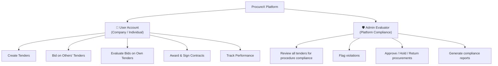
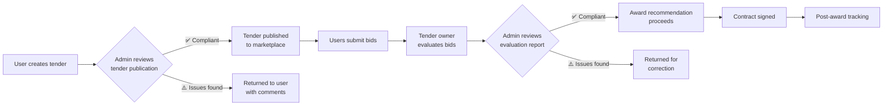

# ProcureX: System Architecture & App Improvement Blueprint

> [!IMPORTANT]
> **Confirmed system model:**
> - One company = one account = one user (no teams for now)
> - No roles — every user can create tenders AND bid on others' tenders
> - One **Admin Evaluator** on the platform side checks compliance with procurement procedures and principles

---

## Part 1: System Architecture

### 1.1 Two Types of Accounts

ProcureX has exactly **two account types** — nothing more:



#### User Account (Company / Individual)

| Attribute | Detail |
|-----------|--------|
| **Identity** | One company = one account = one user |
| **Capabilities** | Create tenders, bid on tenders, evaluate own bids, award contracts, track delivery |
| **Registration** | Sign up → eKYC (TRA/BRELA) → Profile completion |
| **Restriction** | Cannot bid on own tender, cannot evaluate own bid |
| **No roles** | There is NO buyer/supplier distinction — user does everything |

#### Admin Evaluator (Platform-Level)

| Attribute | Detail |
|-----------|--------|
| **Identity** | Platform staff — not a company user |
| **Purpose** | Ensures all procurement on the platform follows procedures and principles |
| **Capabilities** | Read-only access to all tenders, bids, evaluations, awards |
| **Actions** | Approve, Flag, Hold, Return, Comment on any procurement stage |
| **Cannot do** | Cannot create tenders, cannot bid, cannot award — only oversee |

### 1.2 How the Admin Evaluator Fits In

The Admin Evaluator acts as a **compliance gate** at key stages of the procurement lifecycle:



#### What the Admin Evaluator Checks

| Stage | What Admin Reviews | Pass Criteria |
|-------|-------------------|---------------|
| **Tender Publication** | Specifications complete, budget realistic, evaluation criteria defined, correct procurement method | Follows PPA rules |
| **Bid Opening** | All bids received before deadline, no tampering, proper documentation | Transparent process |
| **Evaluation** | Criteria applied consistently, scores justified with evidence, no conflicts of interest | Fair and objective |
| **Award** | Awarded to highest-scored bidder, price is reasonable, proper approvals obtained | Value for money |
| **Contract** | Terms match tender + bid, no unauthorized scope changes | Legal compliance |

### 1.3 What Changes in the Code

#### Remove All Role Logic

```diff
// app.js — Delete role tracking
- this.currentRole = null;       // line 23
- setRole(role) { ... }          // lines 87-93
- mockData.currentRole = role;   // line 90

// app.js — Remove role from URL
- const url = `?page=${page}${this.currentRole ? `&role=${this.currentRole}` : ''}`;
+ const url = `?page=${page}`;

// data.js — Remove role property
- currentRole: null,             // line 39

// workspace-dashboard.js — Always show everything
- if (mockData.currentRole === 'buyer' || mockData.currentRole === 'supplier') return mockData.currentRole;
+ return 'all';

// communication-center.js — Use user identity, not role
- if (mockData.currentRole === 'buyer' || mockData.currentRole === 'supplier' || mockData.currentRole === 'admin') {
-     return mockData.currentRole;
- }
+ return 'user';  // One mailbox per user account
```

#### Add Admin Login Path

```javascript
// sign-in.js — Add admin sign-in option
const accounts = [
    { email: 'user@company.tz', type: 'user', label: 'Company User' },
    { email: 'admin@procurex.tz', type: 'admin', label: 'Admin Evaluator' }
];

// After sign-in, route based on account type:
if (accountType === 'admin') {
    navigateTo('admin-dashboard');  // Admin compliance dashboard
} else {
    navigateTo('workspace-dashboard');  // Normal user dashboard
}
```

### 1.4 Self-Conflict Prevention

Since one user can both create tenders and bid, enforce these rules:

| Rule | How to Implement |
|------|-----------------|
| Cannot bid on own tender | Hide "Submit Bid" button, show "Your Tender" badge |
| Cannot evaluate own bid | If user bid on a tender they see, block evaluation access |
| Cannot award to yourself | Award page flags if winner = tender creator |
| Clear ownership | Show "Posted by you" badge on own tenders in marketplace |

The `tender.createdByCurrentUser` flag already exists in `supplier-marketplace.js:69` — use it consistently.

### 1.5 Dashboard — Show Everything

The user dashboard shows ALL activity — tenders they created AND bids they submitted:

```
┌──────────────────────────────────────────────────────────┐
│  Dashboard                                               │
├──────────────────────────────────────────────────────────┤
│                                                          │
│  📊 Summary Cards                                        │
│  ┌──────────┐ ┌──────────┐ ┌──────────┐ ┌──────────┐   │
│  │ 3 My     │ │ 2 My     │ │ TZS 4.8B │ │ 1 Award  │   │
│  │ Tenders  │ │ Bids     │ │ Total    │ │ Pending  │   │
│  └──────────┘ └──────────┘ └──────────┘ └──────────┘   │
│                                                          │
│  🔔 Action Items (sorted by urgency)                     │
│  ├─ ⚡ Evaluate bids for "Health Center" (your tender)    │
│  ├─ ⚡ Submit bid for "ICT Equipment" by May 25           │
│  ├─ 📩 2 clarifications need your response                │
│  └─ 📄 Sign contract for "Road Works" (you won)           │
│                                                          │
│  📋 My Activity                                           │
│  ┌─── My Tenders ────────┐ ┌─── My Bids ──────────────┐ │
│  │ Health Centers (Open)  │ │ ICT Equipment (Draft)    │ │
│  │ Road Maintenance (Eval)│ │ Lab Supplies (Submitted) │ │
│  └───────────────────────┘ └───────────────────────────┘ │
│                                                          │
│  ⚙️ Admin Status (if any tenders under review)            │
│  ├─ "Health Center" — ✅ Approved by Admin                │
│  └─ "Road Maintenance" — ⏳ Under Admin Review            │
└──────────────────────────────────────────────────────────┘
```

### 1.6 Admin Evaluator Dashboard (New Page)

The Admin Evaluator gets a completely different dashboard — a **compliance control center**:

```
┌──────────────────────────────────────────────────────────┐
│  🛡️ Admin Compliance Dashboard                           │
├──────────────────────────────────────────────────────────┤
│                                                          │
│  📊 Platform Overview                                     │
│  ┌──────────┐ ┌──────────┐ ┌──────────┐ ┌──────────┐   │
│  │ 12 Active│ │ 3 Pending│ │ 2 Flagged│ │ 95%      │   │
│  │ Tenders  │ │ Review   │ │ Issues   │ │Compliance│   │
│  └──────────┘ └──────────┘ └──────────┘ └──────────┘   │
│                                                          │
│  ⏳ Pending Reviews (sorted by urgency)                   │
│  ┌─────────────────────────────────────────────────────┐ │
│  │ Health Center Tender — Awaiting publication review   │ │
│  │ Posted by: Ministry of Health / TZS 4.8B / Works    │ │
│  │ [Review] [Approve] [Flag Issue] [Return]            │ │
│  ├─────────────────────────────────────────────────────┤ │
│  │ ICT Equipment Evaluation — Score review requested    │ │
│  │ Posted by: District Office / TZS 200M / Goods       │ │
│  │ [Review Report] [Approve] [Request Correction]      │ │
│  └─────────────────────────────────────────────────────┘ │
│                                                          │
│  📋 Compliance Checklist (per procurement)                │
│  ├─ ✅ Procurement method matches threshold              │
│  ├─ ✅ Minimum bidding period observed                    │
│  ├─ ⚠️ Evaluation criteria weights don't sum to 100%      │
│  └─ ❌ Missing conflict of interest declarations          │
│                                                          │
│  📈 Platform Health                                       │
│  ├─ Average processing time: 18 days                     │
│  ├─ Compliance rate: 95%                                 │
│  └─ Open disputes: 1                                     │
└──────────────────────────────────────────────────────────┘
```

### 1.7 App Drawer — Differs by Account Type

| App | User Account | Admin Evaluator |
|-----|:---:|:---:|
| IAM (own profile) | ✅ | ✅ |
| Procurement (marketplace, create, bid) | ✅ | ❌ (read-only view only) |
| Communication Center | ✅ | ✅ (sends compliance notices) |
| Evaluation (own tenders) | ✅ | ❌ (reviews evaluation reports) |
| Awarding & Contract | ✅ | ❌ (reviews award decisions) |
| Records & History | ✅ | ✅ (platform-wide audit) |
| **Compliance Dashboard** | ❌ | ✅ (admin only) |

---

## Part 2: App-by-App Improvement Blueprint

### App 1: IAM (Identity & Access Management)

#### Current State
- Registration → eKYC (TRA/BRELA lookup) → Digital signature → Profile workspace
- 10-tab profile editor with entity-aware fields
- Profile completion tracking

#### Improvements

| Feature | Why It's Needed | Priority |
|---------|-----------------|----------|
| **Document expiry tracking** | TIN certificates, business licenses expire — platform should alert before expiry | 🔴 High |
| **Verified badge system** | Show verification level: Unverified → Verified → Trusted | 🔴 High |
| **Profile visibility controls** | What information other parties can see about you in marketplace | 🟡 Medium |
| **Activity audit log** | Show login history, profile changes, document updates | 🟡 Medium |
| **Progressive profile completion** | Guide user through essentials first, then optional sections | 🟡 Medium |
| **Smart document upload** | Upload progress, preview, file type validation | 🟢 Low |

> [!NOTE]
> Team management removed from roadmap — one company = one user for now. Can be added later.

---

### App 2: Procurement (Marketplace + Create Tender + Bid)

This is the core app. It needs the most improvement.

#### A. Marketplace Improvements

| Feature | Description | Priority |
|---------|-------------|----------|
| **Functional search** | Full-text search across title, description, organization, reference | 🔴 High |
| **Advanced filters** | Budget range, date range, location, tender type, status | 🔴 High |
| **Tender bookmarks** | Star/save tenders of interest for later review | 🟡 Medium |
| **Category browse** | Grid of category cards (Goods, Works, Services, Consultancy) with counts | 🟡 Medium |
| **Saved searches** | Save filter combinations — notify when matching tenders appear | 🟢 Low |
| **Map view** | Show tenders on a map by location (Tanzania regions) | 🟢 Low |

#### B. Create Tender Improvements

| Feature | Description | Priority |
|---------|-------------|----------|
| **Tender templates** | Pre-built templates for common types (office supplies, construction, IT services) | 🔴 High |
| **Tender preview** | Full preview exactly as other users will see it before publishing | 🔴 High |
| **Amendment management** | After publication, track and publish amendments with notifications to bidders | 🔴 High |
| **Admin compliance check** | After user publishes, tender goes to Admin Evaluator for review before going live | 🔴 High |
| **Requirement library** | Reuse requirements from past tenders | 🟡 Medium |
| **Auto-suggest criteria** | Based on tender type, suggest standard evaluation criteria with weights | 🟡 Medium |
| **Budget validation** | Warn if budget seems unrealistic compared to historical data | 🟢 Low |

#### C. Bidding Workspace Improvements

| Feature | Description | Priority |
|---------|-------------|----------|
| **Requirement compliance tracker** | Visual checklist showing which tender requirements are met | 🔴 High |
| **Bid completion percentage** | Progress bar showing how much of the bid is complete | 🔴 High |
| **Deadline countdown** | Persistent timer showing time remaining to submit | 🔴 High |
| **Document checklist** | Auto-generate list of required documents from tender, track uploads | 🟡 Medium |
| **Price calculator** | Built-in calculator for line items with automatic totals, taxes | 🟡 Medium |
| **Bid preview** | Full preview of bid package as evaluator will see it | 🟡 Medium |
| **Multi-currency support** | Handle TZS, USD, EUR with conversion rates | 🟢 Low |

---

### App 3: Communication Center

#### Current Strengths
Already has: inbox/sent/archived, threaded conversations, compose with categories, clarification management, localStorage persistence.

#### Improvements

| Feature | Description | Priority |
|---------|-------------|----------|
| **Notification badges** | Show unread count on app drawer icon and top bar | 🔴 High |
| **File attachments** | Actually functional file upload (currently button does nothing) | 🔴 High |
| **Admin notices** | Admin Evaluator can send compliance notices to any user | 🔴 High |
| **Message templates** | Pre-built templates: clarification request, extension request, award notification | 🟡 Medium |
| **Tender-linked threading** | Auto-group all messages for a specific tender | 🟡 Medium |
| **Broadcast messages** | Send to all bidders of a specific tender (amendments, clarifications) | 🟡 Medium |
| **Quick reply** | One-click reply from message list without opening full detail | 🟢 Low |
| **Read receipts** | Show when recipient has read the message | 🟢 Low |

---

### App 4: Evaluation

#### Current Strengths
Multi-tender selection, 7-stage pipeline, criterion-by-criterion scoring, draft save/resume, report generation, conflict of interest declarations, price benchmarking.

#### Improvements

| Feature | Description | Priority |
|---------|-------------|----------|
| **Matrix scoring view** | View all bidders × all criteria in one table (currently one-at-a-time) | 🔴 High |
| **Admin compliance review** | After evaluation is complete, Admin Evaluator reviews the report for procedural compliance | 🔴 High |
| **Score validation** | Warn when score exceeds max, flag unusual patterns (all same scores) | 🟡 Medium |
| **Bid comparison side-by-side** | Split-screen comparing 2 bidders on same criterion | 🟡 Medium |
| **Evaluation deadline tracker** | Countdown timer with reminder notifications | 🟡 Medium |
| **Score distribution chart** | Bar chart of all bidders' total scores for quick comparison | 🟡 Medium |
| **Export options** | PDF report (exists), Excel spreadsheet, Word document | 🟢 Low |

---

### App 5: Awarding & Contract Management

#### Current State
Award recommendation → Contract negotiation → Digital signatures → Post-award tracking

#### Improvements

| Feature | Description | Priority |
|---------|-------------|----------|
| **Admin approval gate** | Award recommendation must be reviewed by Admin Evaluator before proceeding | 🔴 High |
| **Notification letters** | Auto-generate: Award letter, Intention to Award, Unsuccessful bidder letters | 🔴 High |
| **Standby supplier management** | Designate 2nd and 3rd place bidders as reserves | 🔴 High |
| **Standstill period timer** | 14-day standstill period with complaint tracking | 🟡 Medium |
| **Contract template engine** | Generate contract from clause library + tender data + bid data | 🟡 Medium |
| **Performance bond tracking** | Track submission and validity of performance guarantees | 🟡 Medium |
| **Contract lifecycle timeline** | Visual timeline: Award → Signing → Execution → Close-out | 🟡 Medium |
| **Payment dashboard** | Track all payments: scheduled, pending, paid, overdue | 🟡 Medium |
| **Close-out checklist** | Require: final GRN accepted, invoices paid, rating submitted | 🟢 Low |
| **Supplier rating at completion** | Formal rating questionnaire at contract close-out | 🟢 Low |

---

### App 6: Records & Analytics

#### Current State
Minimal (5.5KB) — needs a complete rebuild.

#### Improvements

| Feature | Description | Priority |
|---------|-------------|----------|
| **Tender history table** | All tenders: Created, Published, Evaluated, Awarded, Cancelled | 🔴 High |
| **Bid history table** | All bids: Submitted, Won, Lost, Withdrawn | 🔴 High |
| **Contract registry** | All contracts: Active, Completed, Terminated | 🔴 High |
| **Advanced search & filter** | Search across all records by date, value, status, category | 🔴 High |
| **Export to CSV/PDF** | Compliance-grade export for audit purposes | 🔴 High |
| **Analytics dashboard** | Procurement spend by category, by quarter | 🟡 Medium |
| **Compliance reports** | % tenders properly evaluated, average processing time | 🟡 Medium |
| **Supplier performance history** | Aggregate ratings across all contracts | 🟡 Medium |
| **Savings tracking** | Compare awarded amount vs budget | 🟢 Low |
| **Trend charts** | Line/bar charts showing procurement volume over time | 🟢 Low |

---

### New App: Admin Compliance Dashboard

This is a **new page** that only the Admin Evaluator sees.

| Feature | Description | Priority |
|---------|-------------|----------|
| **Pending review queue** | All tenders/evaluations/awards awaiting compliance review | 🔴 High |
| **Compliance checklist per procurement** | Auto-checks: method matches threshold, bidding period, criteria weights, COI declarations | 🔴 High |
| **Approve / Flag / Return / Hold actions** | Admin can approve, flag issues, return for correction, or hold procurement | 🔴 High |
| **Compliance comments** | Admin writes notes visible to the user explaining what needs fixing | 🔴 High |
| **Platform health metrics** | Average processing time, compliance rate, open disputes | 🟡 Medium |
| **Audit trail** | Complete log of all admin actions with timestamps | 🟡 Medium |
| **Compliance report generation** | Generate PDF compliance reports for regulatory bodies | 🟡 Medium |

---

## Summary: Implementation Priority Roadmap

### Phase 1 — Foundation (Weeks 1-2)
1. **Remove all role code** — delete `currentRole`, `setRole()`, audience filtering
2. **Unify the dashboard** — show My Tenders + My Bids in one view
3. **Add self-conflict prevention** — "Your Tender" badge, disable self-bidding
4. **Fix marketplace search** — make it functional

### Phase 2 — Admin Evaluator (Weeks 3-4)
5. **Build Admin Compliance Dashboard** (new page)
6. **Add admin sign-in path** — separate login credentials for admin
7. **Add compliance gate** to tender publication — admin review before going live
8. **Add compliance gate** to evaluation report — admin review before award

### Phase 3 — Core Workflows (Weeks 5-6)
9. Add **notification badges** to top bar and app drawer
10. Add **bid completion percentage** and compliance tracker
11. Add **tender templates** for common procurement types
12. Enable **file attachments** in Communication Center

### Phase 4 — Evaluation & Award (Weeks 7-8)
13. Add **matrix scoring view** in Evaluation
14. Add **notification letters** (award, rejection)
15. Add **standstill period** tracking
16. Add **standby supplier** management

### Phase 5 — Records & Polish (Weeks 9-10)
17. **Rebuild Records app** with proper data tables
18. Add **export functionality** (CSV, PDF)
19. Add **analytics dashboard** with spend/performance charts
20. Add **compliance reports** for admin

---

> [!TIP]
> The **most impactful change** is removing all role code and building the Admin Evaluator dashboard. This transforms ProcureX from a role-based app into a **unified procurement platform** where users do everything naturally, while a compliance officer ensures the process is fair and follows procurement law.
