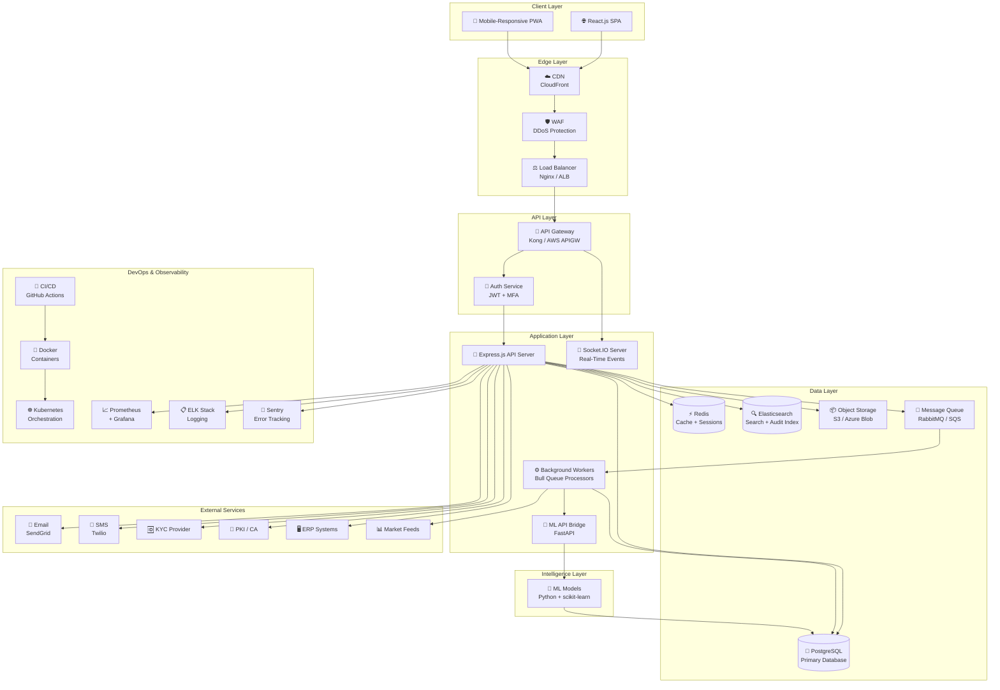
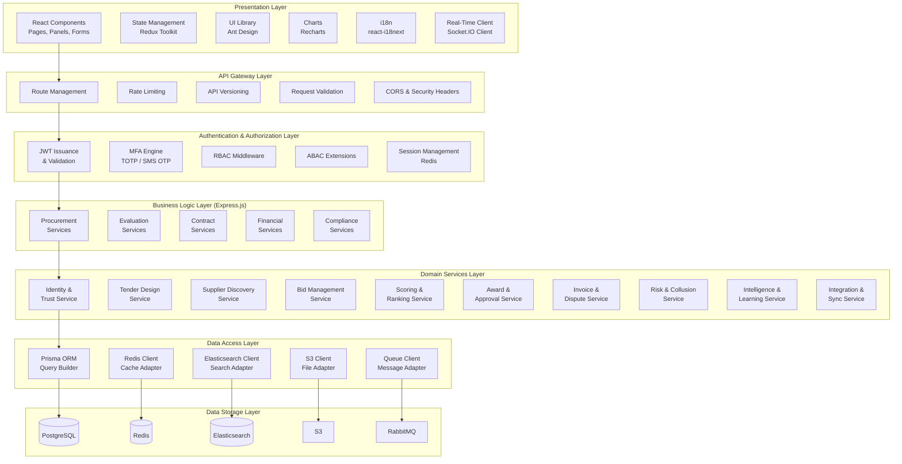
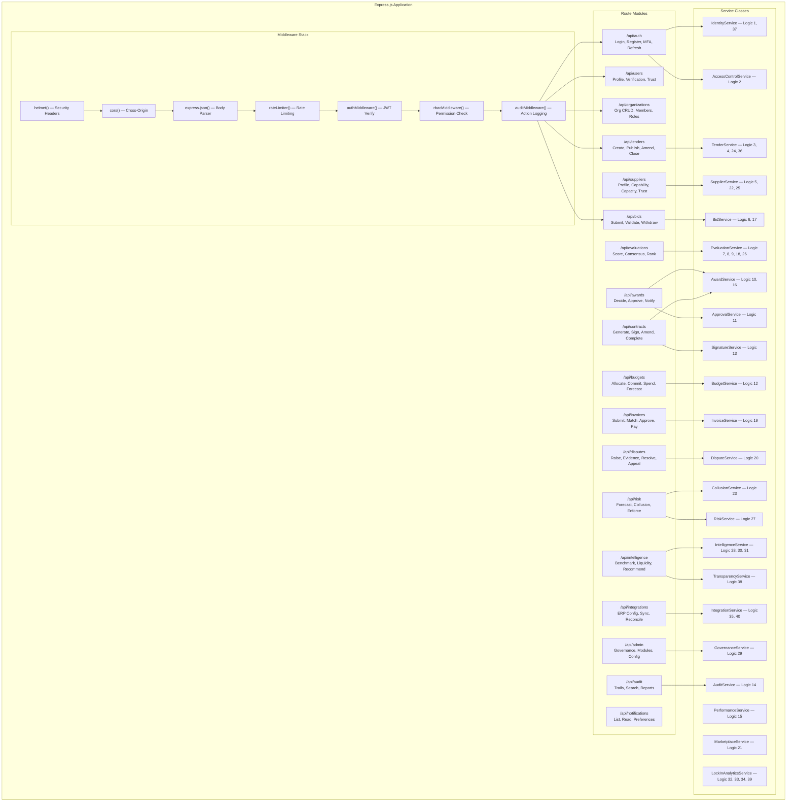
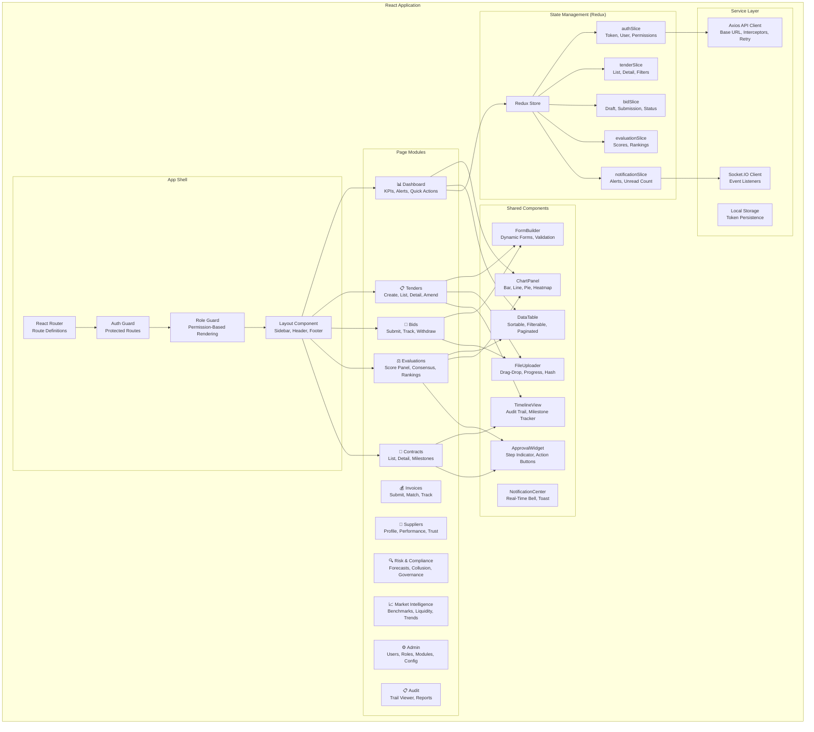
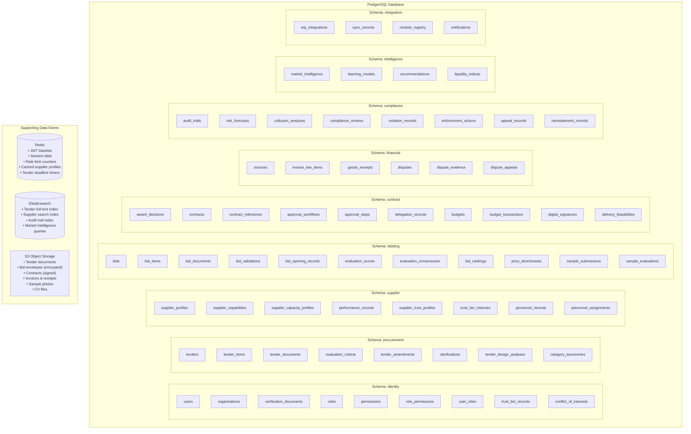
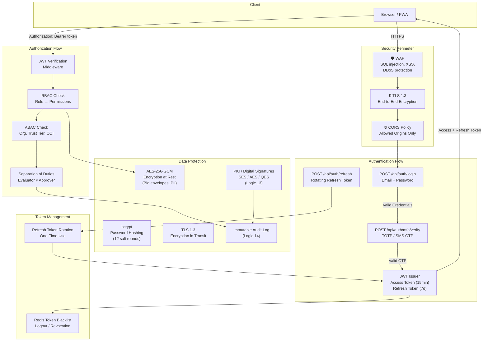
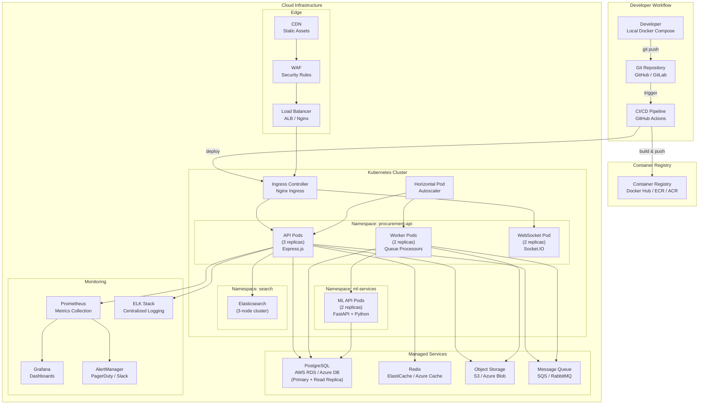
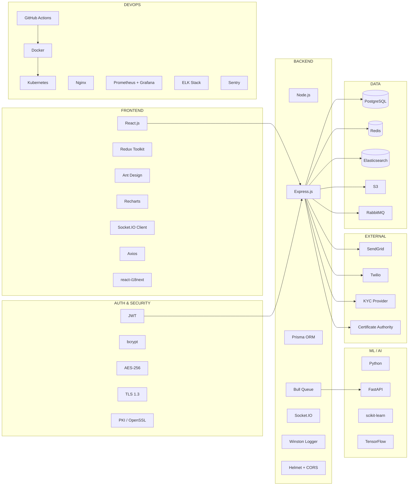

# ARCHITECTURE DESIGN
## Procurement Intelligence & Governance Platform

**Version:** 1.0  
**Date:** February 19, 2026

---

## 1. Complete Technology Stack

### User-Specified Technologies

| Layer | Technology | Role |
|---|---|---|
| Frontend | React.js, HTML5, CSS3, JavaScript | Single-page application, responsive UI |
| Backend | Node.js, Express.js | API server, business logic orchestration |
| Authentication | JWT (JSON Web Tokens) | Stateless authentication, session management |
| Database | PostgreSQL | Primary relational data store |
| APIs | RESTful JSON APIs | Client-server communication protocol |
| Version Control | Git | Source code management |
| Deployment | Cloud (AWS / Azure / GCP) | Production hosting and infrastructure |

### Supplemental Technologies (Added)

| Layer | Technology | Justification |
|---|---|---|
| **State Management** | Redux Toolkit | Complex procurement workflow state across React components |
| **UI Component Library** | Ant Design / Material UI | Enterprise-grade forms, tables, dashboards |
| **Charting** | Recharts / Chart.js | Evaluation dashboards, price benchmarking visuals, liquidity charts |
| **Real-Time** | Socket.IO | Live bid notifications, approval alerts, auction countdown timers |
| **API Gateway** | Kong / AWS API Gateway | Rate limiting, request routing, API versioning, throttling |
| **ORM** | Prisma / Sequelize | Type-safe PostgreSQL queries, migrations, schema management |
| **Caching** | Redis | Session cache, frequently queried supplier/tender data, rate limiting |
| **Message Queue** | RabbitMQ / AWS SQS | Async processing: bid encryption, notifications, ML training, report generation |
| **Job Scheduler** | Bull (Redis-based) | Scheduled tasks: deadline enforcement, trust recalculation, audit retention |
| **Search Engine** | Elasticsearch | Full-text tender search, supplier discovery, market intelligence queries |
| **File Storage** | AWS S3 / Azure Blob | Tender documents, bid envelopes, invoices, samples, contracts |
| **Digital Signature** | OpenSSL / PKI Libraries | SES/AES/QES signatures, certificate management (Logic 13) |
| **PDF Generation** | Puppeteer / PDFKit | Contract documents, opening reports, evaluation reports, audit exports |
| **Email Service** | Nodemailer + SendGrid / AWS SES | Tender notifications, approval alerts, award notices, OTP delivery |
| **SMS/Push** | Twilio / Firebase Cloud Messaging | Critical deadline alerts, MFA OTP, approval reminders |
| **ML/AI Engine** | Python (scikit-learn, TensorFlow) | Risk forecasting, collusion detection, recommendation engine (Logics 27, 23, 31) |
| **ML API Bridge** | Flask / FastAPI microservice | Python ML models exposed to Node.js backend via internal REST API |
| **Logging** | Winston + ELK Stack (Elasticsearch, Logstash, Kibana) | Structured logging, audit trail indexing, anomaly visualization |
| **Monitoring** | Prometheus + Grafana | Server health, API latency, queue depth, database performance |
| **Error Tracking** | Sentry | Frontend/backend error capture and alerting |
| **Containerization** | Docker | Consistent dev/staging/prod environments |
| **Orchestration** | Kubernetes (K8s) / AWS ECS | Auto-scaling, rolling deployments, service discovery |
| **CI/CD** | GitHub Actions / GitLab CI | Automated testing, build, deployment pipelines |
| **Reverse Proxy / LB** | Nginx / AWS ALB | Load balancing, SSL termination, static file serving |
| **CDN** | CloudFront / Cloudflare | Static asset delivery, global edge caching |
| **Security** | Helmet.js, CORS, bcrypt, crypto | HTTP security headers, password hashing, data encryption |
| **Encryption** | AES-256 (at rest), TLS 1.3 (in transit) | Bid envelope encryption, document protection |
| **WAF** | AWS WAF / Cloudflare WAF | SQL injection, XSS, DDoS protection |
| **Testing** | Jest, React Testing Library, Supertest, Cypress | Unit, integration, E2E, API tests |
| **API Documentation** | Swagger / OpenAPI 3.0 | Interactive API documentation and contract testing |
| **Feature Flags** | LaunchDarkly / Unleash | Gradual feature rollouts, module activation (Logic 40) |
| **Internationalization** | react-i18next | Multi-language support for cross-regional deployments |

---

## 2. High-Level Architecture



---

## 3. Layered Architecture Breakdown



---

## 4. Backend Module Architecture

> Maps each Express.js module to the 40 system logics.



---

## 5. Frontend Architecture



---

## 6. Database Architecture



---

## 7. Authentication & Security Architecture



### Security Controls Summary

| Concern | Solution | Logic Coverage |
|---|---|---|
| Authentication | JWT + MFA (TOTP/SMS) | Logic 1 |
| Authorization | RBAC + ABAC + SoD middleware | Logic 2 |
| Password Security | bcrypt (12 rounds) | Logic 1 |
| Bid Confidentiality | AES-256-GCM encryption, hash-locked envelopes | Logic 6, 7 |
| Document Integrity | SHA-256 file hashing | Logic 6, 14 |
| Digital Signatures | PKI-based SES/AES/QES with timestamp authority | Logic 13 |
| Audit Trail | Append-only PostgreSQL + Elasticsearch indexing | Logic 14 |
| Anti-Collusion | Statistical pattern detection + human review | Logic 23 |
| Data in Transit | TLS 1.3 everywhere | All |
| Data at Rest | AES-256 for sensitive fields + S3 SSE | All |
| Rate Limiting | Redis-based per-IP and per-user limits | Logic 29 |
| Input Validation | Joi / Zod schema validation on all endpoints | All |
| Injection Protection | Prisma parameterized queries + Helmet.js | All |

---

## 8. Deployment Architecture



### Environment Strategy

| Environment | Purpose | Infrastructure |
|---|---|---|
| **Development** | Local coding & debugging | Docker Compose (all services local) |
| **Staging** | Integration testing, UAT | Single-node K8s, shared managed DB |
| **Production** | Live system | Multi-node K8s, HA database, CDN, WAF |

---

## 9. API Architecture

### RESTful API Design

| Endpoint Group | Base Path | Key Operations |
|---|---|---|
| Authentication | `/api/v1/auth` | login, register, mfa/verify, refresh, logout |
| Users | `/api/v1/users` | CRUD, verify, trust-tier |
| Organizations | `/api/v1/organizations` | CRUD, members, roles |
| Tenders | `/api/v1/tenders` | CRUD, publish, amend, clarifications |
| Bids | `/api/v1/bids` | submit, validate, withdraw, open |
| Evaluations | `/api/v1/evaluations` | score, lock, consensus, rank |
| Awards | `/api/v1/awards` | recommend, approve, notify |
| Contracts | `/api/v1/contracts` | generate, sign, amend, milestones |
| Budgets | `/api/v1/budgets` | allocate, commit, spend, forecast |
| Invoices | `/api/v1/invoices` | submit, match, approve, pay |
| Disputes | `/api/v1/disputes` | raise, evidence, resolve, appeal |
| Suppliers | `/api/v1/suppliers` | profile, capability, capacity, trust |
| Risk | `/api/v1/risk` | forecast, collusion, enforce |
| Intelligence | `/api/v1/intelligence` | benchmarks, liquidity, recommendations |
| Integrations | `/api/v1/integrations` | erp/config, sync, reconcile |
| Audit | `/api/v1/audit` | trails, search, reports |
| Admin | `/api/v1/admin` | governance, modules, config |
| Notifications | `/api/v1/notifications` | list, read, preferences |

### API Response Format

```json
{
  "success": true,
  "data": { },
  "meta": {
    "page": 1,
    "pageSize": 20,
    "totalRecords": 245,
    "totalPages": 13
  },
  "errors": null,
  "timestamp": "2026-02-19T10:00:00Z",
  "requestId": "uuid-v4"
}
```

### WebSocket Events

| Event | Direction | Purpose |
|---|---|---|
| `tender:published` | Server → Client | New tender notification |
| `bid:received` | Server → Client | Bid count update for buyers |
| `deadline:approaching` | Server → Client | 24h / 1h deadline alerts |
| `approval:requested` | Server → Client | New approval pending |
| `award:decided` | Server → Client | Award result notification |
| `dispute:update` | Server → Client | Dispute status change |
| `risk:alert` | Server → Client | High-risk forecast alert |

---

## 10. Project Directory Structure

```
procurement-platform/
├── client/                          # React Frontend
│   ├── public/
│   ├── src/
│   │   ├── assets/                  # Images, fonts, icons
│   │   ├── components/              # Shared UI components
│   │   │   ├── DataTable/
│   │   │   ├── FormBuilder/
│   │   │   ├── ChartPanel/
│   │   │   ├── FileUploader/
│   │   │   ├── ApprovalWidget/
│   │   │   └── NotificationCenter/
│   │   ├── pages/                   # Page-level components
│   │   │   ├── Dashboard/
│   │   │   ├── Tenders/
│   │   │   ├── Bids/
│   │   │   ├── Evaluations/
│   │   │   ├── Contracts/
│   │   │   ├── Invoices/
│   │   │   ├── Suppliers/
│   │   │   ├── Risk/
│   │   │   ├── Intelligence/
│   │   │   ├── Admin/
│   │   │   └── Audit/
│   │   ├── store/                   # Redux slices
│   │   │   ├── authSlice.js
│   │   │   ├── tenderSlice.js
│   │   │   ├── bidSlice.js
│   │   │   ├── evaluationSlice.js
│   │   │   └── notificationSlice.js
│   │   ├── services/                # API client layer
│   │   │   ├── apiClient.js
│   │   │   ├── authService.js
│   │   │   ├── tenderService.js
│   │   │   └── ...
│   │   ├── hooks/                   # Custom React hooks
│   │   ├── utils/                   # Formatters, validators
│   │   ├── i18n/                    # Internationalization
│   │   ├── App.jsx
│   │   └── index.jsx
│   └── package.json
│
├── server/                          # Node.js Backend
│   ├── src/
│   │   ├── config/                  # Environment, DB, Redis config
│   │   │   ├── database.js
│   │   │   ├── redis.js
│   │   │   ├── elasticsearch.js
│   │   │   ├── s3.js
│   │   │   └── queue.js
│   │   ├── middleware/              # Express middleware
│   │   │   ├── auth.js
│   │   │   ├── rbac.js
│   │   │   ├── audit.js
│   │   │   ├── rateLimiter.js
│   │   │   ├── validator.js
│   │   │   └── errorHandler.js
│   │   ├── routes/                  # Route definitions
│   │   │   ├── auth.routes.js
│   │   │   ├── tender.routes.js
│   │   │   ├── bid.routes.js
│   │   │   ├── evaluation.routes.js
│   │   │   ├── award.routes.js
│   │   │   ├── contract.routes.js
│   │   │   ├── invoice.routes.js
│   │   │   ├── dispute.routes.js
│   │   │   ├── supplier.routes.js
│   │   │   ├── budget.routes.js
│   │   │   ├── risk.routes.js
│   │   │   ├── intelligence.routes.js
│   │   │   ├── integration.routes.js
│   │   │   ├── admin.routes.js
│   │   │   ├── audit.routes.js
│   │   │   └── notification.routes.js
│   │   ├── services/                # Business logic
│   │   │   ├── identity.service.js
│   │   │   ├── accessControl.service.js
│   │   │   ├── tender.service.js
│   │   │   ├── supplier.service.js
│   │   │   ├── bid.service.js
│   │   │   ├── evaluation.service.js
│   │   │   ├── award.service.js
│   │   │   ├── approval.service.js
│   │   │   ├── budget.service.js
│   │   │   ├── signature.service.js
│   │   │   ├── audit.service.js
│   │   │   ├── performance.service.js
│   │   │   ├── invoice.service.js
│   │   │   ├── dispute.service.js
│   │   │   ├── marketplace.service.js
│   │   │   ├── collusion.service.js
│   │   │   ├── risk.service.js
│   │   │   ├── intelligence.service.js
│   │   │   ├── governance.service.js
│   │   │   ├── integration.service.js
│   │   │   └── transparency.service.js
│   │   ├── models/                  # Prisma schema / models
│   │   │   └── schema.prisma
│   │   ├── workers/                 # Background job processors
│   │   │   ├── notification.worker.js
│   │   │   ├── bidEncryption.worker.js
│   │   │   ├── reportGeneration.worker.js
│   │   │   ├── trustRecalculation.worker.js
│   │   │   └── marketSync.worker.js
│   │   ├── websocket/               # Socket.IO handlers
│   │   │   └── events.js
│   │   ├── utils/                   # Helpers
│   │   │   ├── encryption.js
│   │   │   ├── hashing.js
│   │   │   ├── pagination.js
│   │   │   └── validation.js
│   │   └── app.js                   # Express app entry
│   ├── prisma/
│   │   ├── schema.prisma
│   │   └── migrations/
│   ├── tests/
│   │   ├── unit/
│   │   ├── integration/
│   │   └── e2e/
│   └── package.json
│
├── ml-service/                      # Python ML Microservice
│   ├── app/
│   │   ├── main.py                  # FastAPI entry
│   │   ├── models/                  # ML model definitions
│   │   │   ├── risk_forecast.py
│   │   │   ├── collusion_detector.py
│   │   │   └── recommendation.py
│   │   ├── routes/
│   │   └── utils/
│   ├── requirements.txt
│   └── Dockerfile
│
├── docker/
│   ├── docker-compose.yml           # Local dev setup
│   ├── docker-compose.prod.yml
│   ├── Dockerfile.api
│   ├── Dockerfile.worker
│   └── Dockerfile.ml
│
├── k8s/                             # Kubernetes manifests
│   ├── api-deployment.yaml
│   ├── worker-deployment.yaml
│   ├── ml-deployment.yaml
│   ├── ingress.yaml
│   └── hpa.yaml
│
├── .github/
│   └── workflows/
│       ├── ci.yml                   # Test & lint on PR
│       └── deploy.yml               # Deploy on merge to main
│
├── docs/
│   ├── api/                         # OpenAPI specs
│   └── architecture/                # Architecture docs
│
├── .env.example
├── .gitignore
└── README.md
```

---

## 11. Technology Stack Summary Diagram


